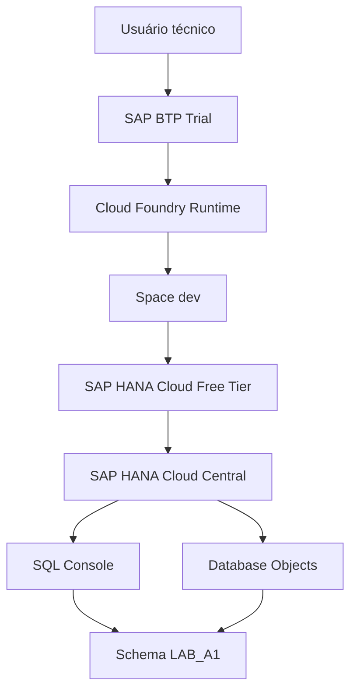
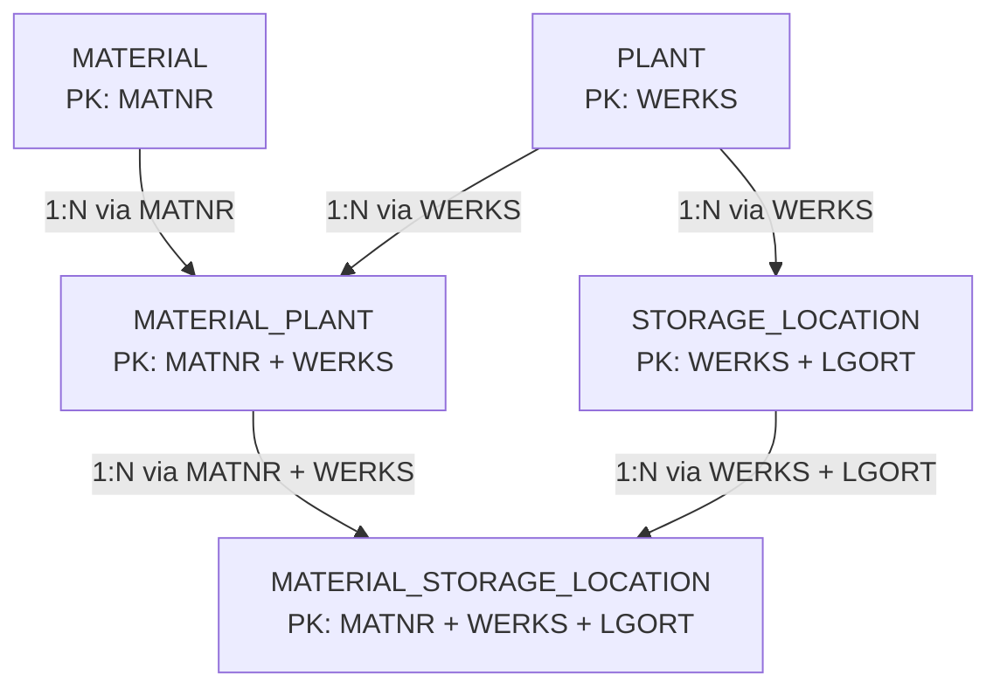

# A1: Fundação de Dados Relacionais no SAP HANA Cloud

**🌐 Idioma / Language:** 🇧🇷 **Português** | [🇺🇸 English](./01-a1-relational-data-foundation.en.md)

> **Status:** ✅ Concluído  
> **Bloco:** A, Data & SAP/MES Master Data Foundation  
> **Cenário:** A1, Relational Data Foundation  
> **Plataforma:** SAP BTP Trial, Cloud Foundry e SAP HANA Cloud Free Tier  
> **Schema:** `LAB_A1`  
> **Evidências:** `Evidences/LAB_A1/`

[⬆️ Voltar ao README principal](../README.md) | [➡️ Próximo documento: Dataset Design, Validation and Loading](./02-a1-dataset-design-validation-and-loading.md)

---

## 📑 Índice

- [Visão executiva](#-visão-executiva)
- [Storytelling do cenário](#-storytelling-do-cenário)
- [Objetivos de aprendizagem](#-objetivos-de-aprendizagem)
- [Escopo e limites](#-escopo-e-limites)
- [Arquitetura](#️-arquitetura)
- [Fundamentos técnicos](#-fundamentos-técnicos)
- [Modelo relacional implementado](#-modelo-relacional-implementado)
- [Configuração ativa](#️-configuração-ativa)
- [Implementação passo a passo](#-implementação-passo-a-passo)
- [Testes de integridade](#-testes-de-integridade)
- [Evidências](#-evidências)
- [Matriz de validação](#-matriz-de-validação)
- [Troubleshooting](#-troubleshooting)
- [Boas práticas e recomendações de produção](#-boas-práticas-e-recomendações-de-produção)
- [Próximos passos](#-próximos-passos)
- [Referências oficiais](#-referências-oficiais)
- [Autor](#-autor)

---

## 🎯 Visão executiva

O cenário A1 estabelece a primeira fundação relacional do projeto **SAP_HANA_Cloud_Data_Engineering_Learning**. O laboratório parte de conceitos industriais inspirados em SAP, mas utiliza exclusivamente estruturas educacionais e dados fictícios.

A implementação demonstra como uma entidade global de material pode ser relacionada a centros e depósitos específicos, preservando diferentes níveis organizacionais e garantindo integridade dos dados por meio de Primary Keys e Foreign Keys.

Foram criadas cinco tabelas `COLUMN` no schema `LAB_A1`:

1. `MATERIAL`
2. `PLANT`
3. `STORAGE_LOCATION`
4. `MATERIAL_PLANT`
5. `MATERIAL_STORAGE_LOCATION`

O laboratório também comprovou funcionalmente a integridade referencial. Um depósito associado ao centro fictício `1000` foi aceito, enquanto outro associado ao centro inexistente `9999` foi rejeitado pelo SAP HANA Cloud com erro de Foreign Key.

> [!IMPORTANT]
> Todos os nomes, códigos, descrições, registros e cenários deste laboratório são fictícios. O modelo utiliza terminologia inspirada no ecossistema SAP para fins educacionais, mas não reproduz integralmente tabelas físicas do SAP ERP ou SAP S/4HANA.

---

## 🏭 Storytelling do cenário

Uma organização industrial pode administrar o mesmo material em diferentes contextos organizacionais. O código global identifica o produto, mas parâmetros de planejamento e suprimento podem variar por centro. Dentro de cada centro, o material também pode ser disponibilizado em depósitos específicos.

O cenário representa a seguinte progressão:

```text
Material global
      ↓
Expansão para um ou mais centros
      ↓
Disponibilização em depósitos válidos do centro
```

Exemplo conceitual:

```text
MAT-100001
├── Plant 1000
│   ├── Storage Location 0001
│   └── Storage Location 0002
└── Plant 2000
    ├── Storage Location 0001
    └── Storage Location 0005
```

O mesmo código de depósito pode existir em centros diferentes. Por isso, `LGORT` isoladamente não identifica um depósito. A identificação depende da combinação `WERKS + LGORT`.

---

## 🧭 Objetivos de aprendizagem

Ao concluir o A1, foram praticados:

- database, schema, table, column e row;
- namespace de objetos por schema;
- `COLUMN TABLE` no SAP HANA Cloud;
- `NVARCHAR` e dados Unicode;
- `NOT NULL`;
- Primary Key simples;
- Primary Key composta;
- Foreign Key simples;
- Foreign Key composta;
- integridade referencial;
- cardinalidades `1:N` e `N:N`;
- entidade associativa;
- criação e alteração de objetos com DDL;
- inserção e consulta básica com DML;
- inspeção pelo Database Objects;
- validação pelo catálogo `SYS.REFERENTIAL_CONSTRAINTS`;
- teste positivo e teste negativo controlado.

---

## 📌 Escopo e limites

### Incluído

- fundação relacional do material;
- centro e depósito;
- expansão Material × Plant;
- expansão Material × Plant × Storage Location;
- constraints estruturais;
- dados manuais mínimos para validar a Foreign Key.

### Não incluído neste documento

- carga completa de dados;
- geração de CSVs;
- aproximadamente 20 Plants fictícios;
- estoque quantitativo;
- movimentos de material;
- lotes, valuation, MRP detalhado ou parâmetros completos do Material Master;
- HDI Container e database-as-code.

A geração, validação e carga dos datasets será tratada separadamente em [DOC 02: Dataset Design, Validation and Loading](./02-a1-dataset-design-validation-and-loading.md), com evidências próprias em `Evidences/LAB_02/` e numeração reiniciada em `01`.

---

## 🏗️ Arquitetura

### Arquitetura de plataforma



### Arquitetura relacional geral



### Visão funcional

```text
MATERIAL
   │
   ├── MATERIAL_PLANT ───────── PLANT
   │                                │
   │                                └── STORAGE_LOCATION
   │
   └── MATERIAL_STORAGE_LOCATION
```

---

## 🧠 Fundamentos técnicos

### Schema

Um schema funciona como uma pasta lógica ou namespace dentro da database. O nome completo de uma tabela combina schema e objeto:

```text
LAB_A1.MATERIAL
│       │
│       └── objeto de banco
└── schema
```

Analogamente, podem existir `LAB_A1.MATERIAL` e `LAB_A3.MATERIAL` sem colisão, assim como arquivos com o mesmo nome podem existir em diretórios diferentes.

O usuário e o schema são conceitos distintos. Durante o laboratório:

```text
CURRENT_USER   = DBADMIN
CURRENT_SCHEMA = DBADMIN
```

Mesmo assim, os objetos foram criados explicitamente em `LAB_A1` utilizando nomes qualificados como `LAB_A1.MATERIAL`.

### Primary Key

A Primary Key identifica cada linha de forma exclusiva.

```text
MATERIAL.MATNR
PLANT.WERKS
```

### Primary Key composta

Uma chave composta depende da combinação de duas ou mais colunas.

```text
STORAGE_LOCATION        = WERKS + LGORT
MATERIAL_PLANT           = MATNR + WERKS
MATERIAL_STORAGE_LOCATION = MATNR + WERKS + LGORT
```

### Foreign Key

Uma Foreign Key protege a coerência entre registros de tabelas diferentes. No A1, `STORAGE_LOCATION.WERKS` somente pode referenciar um `PLANT.WERKS` existente.

### Entidade associativa

`MATERIAL_PLANT` resolve o relacionamento conceitual `N:N` entre materiais e centros:

```text
MATERIAL 1:N MATERIAL_PLANT N:1 PLANT
```

### Column Store

As cinco tabelas foram criadas explicitamente como `COLUMN TABLE`, alinhadas ao foco futuro do projeto em processamento, modelagem analítica e Data Engineering.

---

## 🗂️ Modelo relacional implementado

### `MATERIAL`

| Coluna | Tipo | Obrigatório | Chave | Finalidade |
|---|---|---:|---|---|
| `MATNR` | `NVARCHAR(40)` | Sim | PK | Identificador fictício do material |
| `DESCRIPTION` | `NVARCHAR(100)` | Sim |  | Descrição do material |
| `MTART` | `NVARCHAR(4)` | Sim |  | Tipo de material |
| `MATKL` | `NVARCHAR(9)` | Sim |  | Grupo de mercadorias |
| `MEINS` | `NVARCHAR(3)` | Sim |  | Unidade base de medida |

### `PLANT`

| Coluna | Tipo | Obrigatório | Chave | Finalidade |
|---|---|---:|---|---|
| `WERKS` | `NVARCHAR(4)` | Sim | PK | Identificador fictício do centro |
| `PLANT_NAME` | `NVARCHAR(100)` | Sim |  | Nome do centro |
| `COUNTRY` | `NVARCHAR(3)` | Sim |  | Código de país educacional |

### `STORAGE_LOCATION`

| Coluna | Tipo | Obrigatório | Chave | Finalidade |
|---|---|---:|---|---|
| `WERKS` | `NVARCHAR(4)` | Sim | PK 1, FK | Centro ao qual o depósito pertence |
| `LGORT` | `NVARCHAR(4)` | Sim | PK 2 | Identificador do depósito dentro do centro |
| `STORAGE_LOCATION_NAME` | `NVARCHAR(100)` | Sim |  | Nome do depósito |

### `MATERIAL_PLANT`

| Coluna | Tipo | Obrigatório | Chave | Finalidade |
|---|---|---:|---|---|
| `MATNR` | `NVARCHAR(40)` | Sim | PK 1, FK | Material global |
| `WERKS` | `NVARCHAR(4)` | Sim | PK 2, FK | Centro de expansão |
| `PROCUREMENT_TYPE` | `NVARCHAR(1)` | Sim |  | Exemplo de característica dependente do centro |
| `MRP_TYPE` | `NVARCHAR(2)` | Sim |  | Exemplo de característica de planejamento |

### `MATERIAL_STORAGE_LOCATION`

| Coluna | Tipo | Obrigatório | Chave | Finalidade |
|---|---|---:|---|---|
| `MATNR` | `NVARCHAR(40)` | Sim | PK 1, FK composta | Material |
| `WERKS` | `NVARCHAR(4)` | Sim | PK 2, FK composta | Centro |
| `LGORT` | `NVARCHAR(4)` | Sim | PK 3, FK composta | Depósito |
| `STORAGE_STATUS` | `NVARCHAR(1)` | Sim |  | Status educacional da expansão |

---

## ⚙️ Configuração ativa

| Item | Valor |
|---|---|
| SAP HANA Cloud | Free Tier |
| Runtime | Cloud Foundry |
| Space | `dev` |
| Schema do laboratório | `LAB_A1` |
| Usuário técnico utilizado | `DBADMIN` |
| Schema corrente da sessão | `DBADMIN` |
| Tipo das tabelas | `COLUMN` |
| Quantidade de tabelas | 5 |
| Dados reais de empresa | Não utilizados |

> [!CAUTION]
> `DBADMIN` foi utilizado para a fundação educacional e administração inicial. Aplicações futuras não deverão usar `DBADMIN` como identidade de runtime.

---

## 🛠️ Implementação passo a passo

### 1. Reconhecimento da sessão

```sql
SELECT CURRENT_USER, CURRENT_SCHEMA FROM DUMMY;
```

### 2. Criação e validação do schema

```sql
CREATE SCHEMA LAB_A1;

SELECT SCHEMA_NAME
FROM SYS.SCHEMAS
WHERE SCHEMA_NAME = 'LAB_A1';
```

### 3. Criação de `MATERIAL`

```sql
CREATE COLUMN TABLE LAB_A1.MATERIAL (
    MATNR NVARCHAR(40) NOT NULL,
    DESCRIPTION NVARCHAR(100) NOT NULL,
    MTART NVARCHAR(4) NOT NULL,
    MATKL NVARCHAR(9) NOT NULL,
    MEINS NVARCHAR(3) NOT NULL,
    PRIMARY KEY (MATNR)
);
```

### 4. Criação de `PLANT`

```sql
CREATE COLUMN TABLE LAB_A1.PLANT (
    WERKS NVARCHAR(4) NOT NULL,
    PLANT_NAME NVARCHAR(100) NOT NULL,
    COUNTRY NVARCHAR(3) NOT NULL,
    PRIMARY KEY (WERKS)
);
```

### 5. Criação de `STORAGE_LOCATION`

```sql
CREATE COLUMN TABLE LAB_A1.STORAGE_LOCATION (
    WERKS NVARCHAR(4) NOT NULL,
    LGORT NVARCHAR(4) NOT NULL,
    STORAGE_LOCATION_NAME NVARCHAR(100) NOT NULL,
    PRIMARY KEY (WERKS, LGORT)
);
```

### 6. Adição da primeira Foreign Key

```sql
ALTER TABLE LAB_A1.STORAGE_LOCATION
ADD CONSTRAINT FK_STORAGE_LOCATION_PLANT
FOREIGN KEY (WERKS)
REFERENCES LAB_A1.PLANT (WERKS);
```

### 7. Validação da constraint no catálogo

```sql
SELECT
    SCHEMA_NAME,
    TABLE_NAME,
    COLUMN_NAME,
    POSITION,
    CONSTRAINT_NAME,
    REFERENCED_SCHEMA_NAME,
    REFERENCED_TABLE_NAME,
    REFERENCED_COLUMN_NAME,
    IS_ENFORCED,
    IS_VALIDATED
FROM SYS.REFERENTIAL_CONSTRAINTS
WHERE SCHEMA_NAME = 'LAB_A1'
  AND TABLE_NAME = 'STORAGE_LOCATION';
```

### 8. Criação de `MATERIAL_PLANT`

```sql
CREATE COLUMN TABLE LAB_A1.MATERIAL_PLANT (
    MATNR NVARCHAR(40) NOT NULL,
    WERKS NVARCHAR(4) NOT NULL,
    PROCUREMENT_TYPE NVARCHAR(1) NOT NULL,
    MRP_TYPE NVARCHAR(2) NOT NULL,
    PRIMARY KEY (MATNR, WERKS),
    CONSTRAINT FK_MATERIAL_PLANT_MATERIAL
        FOREIGN KEY (MATNR)
        REFERENCES LAB_A1.MATERIAL (MATNR),
    CONSTRAINT FK_MATERIAL_PLANT_PLANT
        FOREIGN KEY (WERKS)
        REFERENCES LAB_A1.PLANT (WERKS)
);
```

### 9. Criação de `MATERIAL_STORAGE_LOCATION`

```sql
CREATE COLUMN TABLE LAB_A1.MATERIAL_STORAGE_LOCATION (
    MATNR NVARCHAR(40) NOT NULL,
    WERKS NVARCHAR(4) NOT NULL,
    LGORT NVARCHAR(4) NOT NULL,
    STORAGE_STATUS NVARCHAR(1) NOT NULL,
    PRIMARY KEY (MATNR, WERKS, LGORT),
    CONSTRAINT FK_MAT_SLOC_MATERIAL_PLANT
        FOREIGN KEY (MATNR, WERKS)
        REFERENCES LAB_A1.MATERIAL_PLANT (MATNR, WERKS),
    CONSTRAINT FK_MAT_SLOC_STORAGE_LOCATION
        FOREIGN KEY (WERKS, LGORT)
        REFERENCES LAB_A1.STORAGE_LOCATION (WERKS, LGORT)
);
```

### 10. Validação geral das relações do A1

```sql
SELECT
    SCHEMA_NAME,
    TABLE_NAME,
    COLUMN_NAME,
    POSITION,
    CONSTRAINT_NAME,
    REFERENCED_SCHEMA_NAME,
    REFERENCED_TABLE_NAME,
    REFERENCED_COLUMN_NAME,
    IS_ENFORCED,
    IS_VALIDATED
FROM SYS.REFERENTIAL_CONSTRAINTS
WHERE SCHEMA_NAME = 'LAB_A1'
ORDER BY TABLE_NAME, CONSTRAINT_NAME, POSITION;
```

---

## 🧪 Testes de integridade

### Registro pai válido

```sql
INSERT INTO LAB_A1.PLANT (
    WERKS,
    PLANT_NAME,
    COUNTRY
)
VALUES (
    '1000',
    'Manufacturing Plant Alpha',
    'BRA'
);

SELECT *
FROM LAB_A1.PLANT
WHERE WERKS = '1000';
```

### Depósito válido

```sql
INSERT INTO LAB_A1.STORAGE_LOCATION (
    WERKS,
    LGORT,
    STORAGE_LOCATION_NAME
)
VALUES (
    '1000',
    '0001',
    'Raw Materials'
);

SELECT *
FROM LAB_A1.STORAGE_LOCATION
WHERE WERKS = '1000'
  AND LGORT = '0001';
```

### Depósito órfão rejeitado

```sql
INSERT INTO LAB_A1.STORAGE_LOCATION (
    WERKS,
    LGORT,
    STORAGE_LOCATION_NAME
)
VALUES (
    '9999',
    '0001',
    'Invalid Orphan Storage Location'
);
```

Resultado esperado e obtido:

```text
foreign key constraint violation
```

A rejeição demonstra que a constraint `FK_STORAGE_LOCATION_PLANT` impede que `STORAGE_LOCATION.WERKS` faça referência a um centro inexistente.

---

## 📸 Evidências

### 01. Schema do laboratório criado


**O que comprova:** o schema `LAB_A1` foi criado e localizado no catálogo `SYS.SCHEMAS`, mantendo os objetos do laboratório separados logicamente do schema corrente `DBADMIN`.

### 02. Tabela MATERIAL criada


**O que comprova:** execução bem-sucedida do DDL da primeira `COLUMN TABLE`, incluindo `NVARCHAR`, `NOT NULL` e `PRIMARY KEY` em `MATNR`.

### 03. Estrutura da MATERIAL no Database Objects


**O que comprova:** tabela `MATERIAL` no schema `LAB_A1`, tipo `COLUMN`, com cinco colunas e `MATNR` como `Key 1`.

### 04. Tabela PLANT criada


**O que comprova:** execução bem-sucedida da tabela organizacional `PLANT`, com `WERKS` como Primary Key.

### 05. Estrutura da PLANT no Database Objects


**O que comprova:** tipos, obrigatoriedade e chave da tabela `PLANT` inspecionados diretamente no catálogo.

### 06. Tabela STORAGE_LOCATION criada


**O que comprova:** criação da tabela de depósitos com `WERKS` e `LGORT` compondo sua identidade.

### 07. Primary Key composta de STORAGE_LOCATION


**O que comprova:** `WERKS` é `Key 1` e `LGORT` é `Key 2`, permitindo reutilizar um código de depósito em centros diferentes sem colisão.

### 08. Foreign Key entre depósito e centro criada


**O que comprova:** a constraint `FK_STORAGE_LOCATION_PLANT` foi adicionada à tabela existente com `ALTER TABLE` e resultado `Success`.

### 09. Foreign Key validada no catálogo com apoio do Joule


**O que comprova:** `SYS.REFERENTIAL_CONSTRAINTS` confirma `STORAGE_LOCATION.WERKS → PLANT.WERKS`. O Joule aparece como apoio integrado à exploração técnica, mas a comprovação é fornecida pelo catálogo do banco.

### 10. Registro pai PLANT inserido


**O que comprova:** o centro fictício `1000`, necessário como registro pai, foi inserido e consultado com sucesso.

### 11. Depósito válido aceito


**O que comprova:** o depósito `1000/0001` foi aceito porque o centro `1000` existe na tabela `PLANT`.

### 12. Depósito órfão rejeitado


**O que comprova:** o SAP HANA Cloud rejeitou `9999/0001` com erro 461, pois `PLANT.WERKS = 9999` não existe.

### 13. Tabela MATERIAL_PLANT criada


**O que comprova:** criação da entidade associativa com PK composta e duas Foreign Keys no mesmo DDL.

### 14. Primary Key composta de MATERIAL_PLANT


**O que comprova:** `MATNR + WERKS` identifica de forma exclusiva a expansão de um material para um centro.

### 15. Foreign Keys de MATERIAL_PLANT validadas


**O que comprova:** o catálogo registra as relações de `MATERIAL_PLANT` com `MATERIAL` e `PLANT`.

### 16. Tabela MATERIAL_STORAGE_LOCATION criada


**O que comprova:** criação da tabela final com PK de três colunas e duas FKs compostas.

### 17. Primary Key de três colunas


**O que comprova:** `MATNR`, `WERKS` e `LGORT` aparecem como `Key 1`, `Key 2` e `Key 3`, respectivamente, e as cinco tabelas do laboratório estão visíveis.

### 18. Foreign Keys compostas validadas


**O que comprova:** o catálogo apresenta as posições das colunas nas constraints compostas de `MATERIAL_STORAGE_LOCATION`, relacionando a expansão ao centro e ao depósito válidos.

---

## ✅ Matriz de validação

| Critério | Resultado |
|---|---|
| Schema `LAB_A1` criado | ✅ |
| Cinco tabelas `COLUMN` criadas | ✅ |
| Primary Keys simples validadas | ✅ |
| Primary Keys compostas validadas | ✅ |
| Foreign Key simples validada | ✅ |
| Foreign Keys compostas validadas | ✅ |
| Entidade associativa Material × Plant criada | ✅ |
| Expansão Material × Plant × Storage Location criada | ✅ |
| Inserção de registro pai válida | ✅ |
| Inserção de depósito válido | ✅ |
| Rejeição de depósito órfão | ✅ |
| Evidências físicas conferidas | ✅, arquivos 01 a 18 |
| Dados empresariais reais utilizados | ❌ Não |

---

## 🧯 Troubleshooting

### `object already exists`

**Causa:** execução repetida de `CREATE SCHEMA` ou `CREATE TABLE`.

**Ação:** consulte `SYS.SCHEMAS` ou o Database Objects antes de executar novamente. Não aplique `DROP` automaticamente, pois isso pode remover objetos ou dados dependentes.

### `foreign key constraint violation`

**Causa:** tentativa de inserir um registro filho sem o registro pai correspondente.

**Ação:** valide a cadeia de dependências e carregue as tabelas pai antes das tabelas filhas.

### Foreign Key não aparece em `Columns`

**Explicação:** a aba `Columns` mostra as colunas e as posições da Primary Key, mas a Foreign Key é uma constraint de relacionamento.

**Ação:** consulte `SYS.REFERENTIAL_CONSTRAINTS` para validar tabela, coluna, constraint e objeto referenciado.

### `Current Schema` continua `DBADMIN`

**Explicação:** criar `LAB_A1` não altera automaticamente o schema padrão da sessão.

**Ação:** continue usando nomes qualificados como `LAB_A1.MATERIAL`. O comando `SET SCHEMA LAB_A1` pode mudar o contexto da sessão, mas não foi necessário para este laboratório.

### Resultado amplo em `SYS.REFERENTIAL_CONSTRAINTS`

**Causa:** consulta sem filtro retorna constraints de schemas internos e outros objetos da instância.

**Ação:** filtre por `SCHEMA_NAME = 'LAB_A1'` e, quando necessário, por `TABLE_NAME`.

---

## 🛡️ Boas práticas e recomendações de produção

- não usar `DBADMIN` como usuário de aplicação;
- adotar usuários técnicos e roles com menor privilégio;
- nomear constraints explicitamente;
- separar schemas por contexto e ownership;
- manter DDL versionado;
- preferir HDI e artefatos design-time para aplicações e lifecycle profissional;
- não executar `DROP` ou `ALTER` destrutivo sem análise de dependências;
- validar chaves antes de cargas em massa;
- carregar tabelas pai antes das tabelas filhas;
- usar transações e estratégias de rollback em cargas controladas;
- separar dados válidos de massas negativas de teste;
- não expor credenciais ou informações internas em screenshots;
- tratar sugestões do Joule ou de qualquer IA como apoio, sempre revisando o SQL antes da execução.

### Ordem de carga recomendada

```text
1. PLANT
2. MATERIAL
3. STORAGE_LOCATION
4. MATERIAL_PLANT
5. MATERIAL_STORAGE_LOCATION
```

---

## 🚀 Próximos passos

A próxima etapa será tratada em documento separado:

### [DOC 02: Dataset Design, Validation and Loading](./02-a1-dataset-design-validation-and-loading.md)

O DOC 02 deverá cobrir:

- companhia industrial fictícia;
- aproximadamente 20 Plants multifuncionais com nichos distintos;
- múltiplos depósitos coerentes por centro;
- materiais fictícios;
- extensões Material × Plant;
- extensões Material × Storage Location;
- datasets válidos e inválidos;
- geração automatizada de CSVs;
- validação de duplicidades e órfãos;
- carga no SAP HANA Cloud;
- validação pós-carga;
- evidências em `Evidences/LAB_02/`, reiniciando em `01`.

---

## 📚 Referências oficiais

- [Create Schemas and Tables, and Insert Data Using SAP HANA Database Explorer](https://help.sap.com/docs/hana-cloud/sap-hana-cloud-getting-started-guide/create-schema-tables-and-insert-data-using-sap-hana-database-explorer)
- [CREATE TABLE Statement](https://help.sap.com/docs/hana-cloud-database/sap-hana-cloud-sap-hana-database-sql-reference-guide/create-table-statement-data-definition)
- [REFERENTIAL_CONSTRAINTS System View](https://help.sap.com/docs/hana-cloud-database/sap-hana-cloud-sap-hana-database-sql-reference-guide/referential-constraints-system-view)
- [Working with Schemas and Managing Permissions](https://learning.sap.com/courses/sap-hana-sql-script-basics-and-advanced-for-sap-hana/working-with-schemas-and-managing-permissions)
- [Using Gen AI in the SQL Console](https://help.sap.com/docs/hana-cloud/sap-hana-cloud-administration-guide/using-gen-ai-in-sql-console)
- [Customizing: Storage Location](https://learning.sap.com/courses/exploring-basic-data-for-manufacturing-and-product-management-in-sap-s-4hana/customizing-storage-location)
- [Defining and Assigning Plants](https://learning.sap.com/courses/cross-functional-customizing-in-sap-s-4hana-materials-management/defining-and-assigning-plants)

---

## 👤 Autor

### Orlando dos Santos Caetano

**SAP MM · PP · QM · WM | MES | SAP Integration | Data Engineering | Generative AI**

[](https://www.linkedin.com/in/orlando-caetano/)
[](https://github.com/OrlandoCaetano2026)


**Credenciais SAP:**

- SAP Certified - Integration Developer (C_CPI)
- SAP Certified - SAP Generative AI Developer (C_AIG)

---

[⬆️ Voltar ao README principal](../README.md) | [➡️ Próximo documento: Dataset Design, Validation and Loading](./02-a1-dataset-design-validation-and-loading.md)
