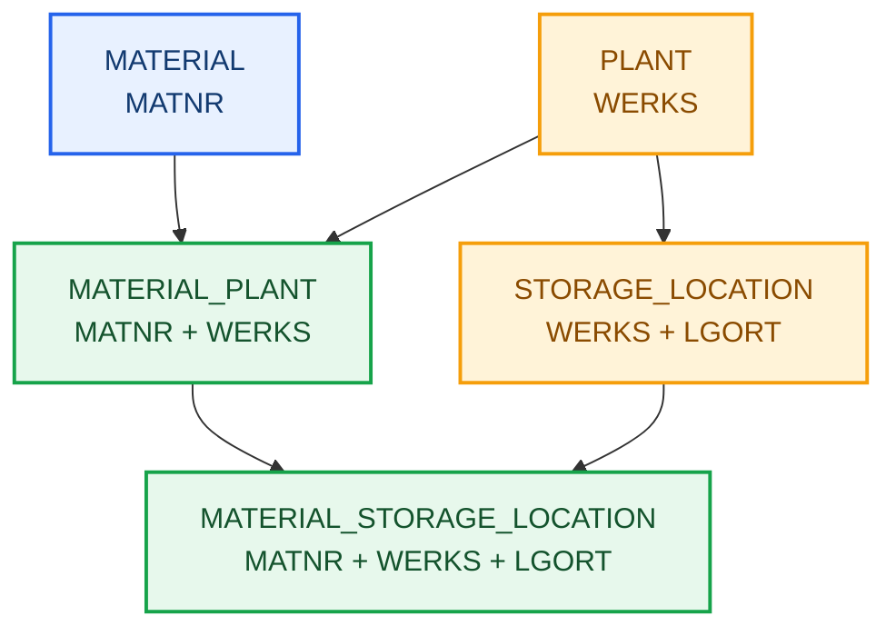

# A1: Fundação de Dados Relacionais no SAP HANA Cloud

---

**🌐 Idioma / Language:** 🇧🇷 **Português** | [🇺🇸 English](../EN/01-a1-relational-data-foundation.en.md)

---

[⬆️ Voltar ao README](../../../README.md) | [➡️ A2: Estrutura Organizacional SAP](./02-a2-estrutura-organizacional-sap.md)

---

## 🎯 Visão executiva

O A1 estabelece a primeira fundação técnica e funcional do projeto. A meta não foi criar tabelas desconectadas, mas representar a jornada de um material global que é estendido a diferentes Plants, recebe parâmetros de suprimento e MRP por centro e pode ser disponibilizado em múltiplos depósitos.

O cenário começou com modelagem relacional e evoluiu para um universo de dados sintéticos governado. Ao final, cinco tabelas `COLUMN` armazenam **3.715 registros**, com **zero órfãos**, **zero chaves duplicadas** e rastreabilidade entre Blueprint, geradores, arquivos, manifest, scripts SQL e resultados no SAP HANA Cloud.

---

> [!IMPORTANT]
> Todo o universo é fictício e educacional. Nenhum dado empresarial real foi utilizado.

---

## 🧭 Storytelling industrial

Uma companhia fictícia opera 20 Plants produtivos, logísticos e especializados. O catálogo de materiais é global, mas a estratégia muda em cada localidade. Um componente pode ser comprado em um centro, planejado por consumo em outro e estar disponível em depósitos de componentes, produção ou inspeção.

O modelo precisa responder: qual material existe, em quais Plants o material está estendido, quais parâmetros valem por Plant, quais depósitos pertencem ao Plant e em quais combinações o material está ativo.

Essa narrativa orienta as cinco entidades e impede que a massa seja apenas uma coleção de registros aleatórios.

---

## 🎓 Objetivos

- criar schemas e tabelas Column Store;
- modelar atributos globais e dependentes do Plant;
- aplicar PKs simples, compostas e de três colunas;
- aplicar FKs simples e compostas;
- validar constraints pelo catálogo e pelo comportamento;
- gerar dados determinísticos com seed;
- validar casos positivos e negativos;
- carregar dados na ordem das dependências;
- auditar volume, integridade, unicidade e distribuição.

---

## 🏗️ Arquitetura e pipeline

```mermaid
flowchart LR
 BP["Blueprint v1"]:::blue --> CFG["Config + Contract + Rules"]:::yellow --> GEN["Foundation Generator"]:::purple
 GEN --> V["Valid CSVs"]:::green
 GEN --> N["Negative Tests"]:::red
 V --> VE{"Validation Engine"}:::decision
 N --> VE
 VE -->|PASSED| MAN["Manifest + SHA-256"]:::green --> SQL["SQL Load Generator"]:::purple --> H[("SAP HANA Cloud LAB_A1")]:::hana
 H --> AUD["Post-load Audits"]:::green
 classDef blue fill:#E8F1FF,stroke:#2563EB,color:#123A70,stroke-width:2px;
 classDef yellow fill:#FFF3D8,stroke:#F59E0B,color:#8A4B00,stroke-width:2px;
 classDef purple fill:#F3E8FF,stroke:#9333EA,color:#581C87,stroke-width:2px;
 classDef green fill:#E7F8EC,stroke:#16A34A,color:#14532D,stroke-width:2px;
 classDef red fill:#FFF1F2,stroke:#E11D48,color:#881337,stroke-width:2px;
 classDef decision fill:#FCE7F3,stroke:#DB2777,color:#831843,stroke-width:2px;
 classDef hana fill:#E0F2FE,stroke:#0284C7,color:#0C4A6E,stroke-width:3px;
```





---

## 🧩 Modelo físico

| Entidade | Grão | Primary Key | Registros finais |
|---|---|---|---:|
| `PLANT` | centro | `WERKS` | 20 |
| `MATERIAL` | material global | `MATNR` | 300 |
| `STORAGE_LOCATION` | depósito do centro | `WERKS + LGORT` | 152 |
| `MATERIAL_PLANT` | material no centro | `MATNR + WERKS` | 1.080 |
| `MATERIAL_STORAGE_LOCATION` | material no depósito | `MATNR + WERKS + LGORT` | 2.163 |

---

## 1. Fundação estrutural e validação progressiva

---

### Schema e tabelas pai

---

#### 01. Schema LAB_A1 criado

O schema dedicado isola o laboratório de outros experimentos. Todos os objetos seguintes usam o nome qualificado `LAB_A1`, evitando dependência do schema corrente `DBADMIN`.

```sql
CREATE SCHEMA LAB_A1;
```


O resultado validado tornou possível avançar para a próxima dependência sem editar manualmente a massa já aprovada.

---

#### 02. Tabela MATERIAL criada

`MATERIAL` foi concebida como catálogo global. `MATNR` identifica o material, enquanto descrição, tipo, grupo e unidade base permanecem independentes do Plant.

```sql
CREATE COLUMN TABLE LAB_A1.MATERIAL (
 MATNR NVARCHAR(40) NOT NULL,
 DESCRIPTION NVARCHAR(100) NOT NULL,
 MTART NVARCHAR(4) NOT NULL,
 MATKL NVARCHAR(9) NOT NULL,
 MEINS NVARCHAR(3) NOT NULL,
 PRIMARY KEY (MATNR)
);
```


O resultado validado tornou possível avançar para a próxima dependência sem editar manualmente a massa já aprovada.

---

#### 03. Estrutura de MATERIAL confirmada

A inspeção em Database Objects confirmou tabela Column Store, cinco campos obrigatórios e `MATNR` como primeira chave. O catálogo físico correspondeu ao DDL.


O resultado validado tornou possível avançar para a próxima dependência sem editar manualmente a massa já aprovada.

---

#### 04. Tabela PLANT criada

`PLANT` introduziu o nível organizacional. Cada Plant é multifuncional; o nome indica perfil predominante, sem impedir recebimento, qualidade, produção, estoque e expedição.

```sql
CREATE COLUMN TABLE LAB_A1.PLANT (
 WERKS NVARCHAR(4) NOT NULL,
 PLANT_NAME NVARCHAR(100) NOT NULL,
 COUNTRY NVARCHAR(3) NOT NULL,
 PRIMARY KEY (WERKS)
);
```


O resultado validado tornou possível avançar para a próxima dependência sem editar manualmente a massa já aprovada.

---

#### 05. Estrutura de PLANT confirmada

O catálogo confirmou `WERKS` como chave única e os atributos descritivos necessários à massa sintética.


O resultado validado tornou possível avançar para a próxima dependência sem editar manualmente a massa já aprovada.

---

### Storage Location e integridade referencial

---

#### 06. STORAGE_LOCATION criada

`STORAGE_LOCATION` representa depósitos dependentes do Plant. `LGORT` isolado não é globalmente único.

```sql
CREATE COLUMN TABLE LAB_A1.STORAGE_LOCATION (
 WERKS NVARCHAR(4) NOT NULL,
 LGORT NVARCHAR(4) NOT NULL,
 STORAGE_LOCATION_NAME NVARCHAR(100) NOT NULL,
 PRIMARY KEY (WERKS, LGORT)
);
```


O resultado validado tornou possível avançar para a próxima dependência sem editar manualmente a massa já aprovada.

---

#### 07. PK composta de STORAGE_LOCATION

A inspeção confirmou `WERKS` como Key 1 e `LGORT` como Key 2. Assim, um mesmo `LGORT` pode existir em Plants diferentes, nunca duplicado no mesmo Plant.


O resultado validado tornou possível avançar para a próxima dependência sem editar manualmente a massa já aprovada.

---

#### 08. FK Storage Location para Plant

A Foreign Key transformou a relação conceitual em regra física: todo depósito precisa apontar para um Plant existente.

```sql
ALTER TABLE LAB_A1.STORAGE_LOCATION
ADD CONSTRAINT FK_STORAGE_LOCATION_PLANT
FOREIGN KEY (WERKS) REFERENCES LAB_A1.PLANT (WERKS);
```


O resultado validado tornou possível avançar para a próxima dependência sem editar manualmente a massa já aprovada.

---

#### 09. FK validada no catálogo

`SYS.REFERENTIAL_CONSTRAINTS` confirmou a constraint e o objeto referenciado. O Joule foi apoio de exploração, enquanto o catálogo foi a prova técnica.


O resultado validado tornou possível avançar para a próxima dependência sem editar manualmente a massa já aprovada.

---

#### 10. Registro pai inserido

O Plant fictício `1000` foi inserido como registro pai para testar a integridade referencial de forma comportamental.

```sql
INSERT INTO LAB_A1.PLANT (WERKS, PLANT_NAME, COUNTRY)
VALUES ('1000', 'Manufacturing Plant Alpha', 'BRA');
COMMIT;
```


O resultado validado tornou possível avançar para a próxima dependência sem editar manualmente a massa já aprovada.

---

#### 11. Registro filho válido

O depósito `1000/0001` foi aceito porque a Parent Key existia. A Foreign Key protege sem bloquear operações válidas.

```sql
INSERT INTO LAB_A1.STORAGE_LOCATION (WERKS, LGORT, STORAGE_LOCATION_NAME)
VALUES ('1000', '0001', 'Raw Materials');
COMMIT;
```


O resultado validado tornou possível avançar para a próxima dependência sem editar manualmente a massa já aprovada.

---

#### 12. Registro órfão rejeitado

A tentativa `9999/0001` foi rejeitada pelo SAP HANA. A proteção contra registros órfãos funcionou durante a escrita, não apenas no desenho.

```sql
INSERT INTO LAB_A1.STORAGE_LOCATION (WERKS, LGORT, STORAGE_LOCATION_NAME)
VALUES ('9999', '0001', 'Orphan Storage Location');
```


O resultado validado tornou possível avançar para a próxima dependência sem editar manualmente a massa já aprovada.

---

### Material por Plant

---

#### 13. MATERIAL_PLANT criada

`MATERIAL_PLANT` resolveu a relação N:N entre materiais e centros e passou a armazenar `PROCUREMENT_TYPE` e `MRP_TYPE` por Plant.

```sql
CREATE COLUMN TABLE LAB_A1.MATERIAL_PLANT (
 MATNR NVARCHAR(40) NOT NULL,
 WERKS NVARCHAR(4) NOT NULL,
 PROCUREMENT_TYPE NVARCHAR(1) NOT NULL,
 MRP_TYPE NVARCHAR(2) NOT NULL,
 PRIMARY KEY (MATNR, WERKS),
 CONSTRAINT FK_MATERIAL_PLANT_MATERIAL FOREIGN KEY (MATNR) REFERENCES LAB_A1.MATERIAL (MATNR),
 CONSTRAINT FK_MATERIAL_PLANT_PLANT FOREIGN KEY (WERKS) REFERENCES LAB_A1.PLANT (WERKS)
);
```


O resultado validado tornou possível avançar para a próxima dependência sem editar manualmente a massa já aprovada.

---

#### 14. PK de MATERIAL_PLANT

A chave `MATNR + WERKS` garante uma única extensão de material por centro.


O resultado validado tornou possível avançar para a próxima dependência sem editar manualmente a massa já aprovada.

---

#### 15. FKs de MATERIAL_PLANT

As duas FKs confirmaram que toda extensão depende simultaneamente de um material global e de um Plant válido.


O resultado validado tornou possível avançar para a próxima dependência sem editar manualmente a massa já aprovada.

---

### Material por depósito

---

#### 16. MATERIAL_STORAGE_LOCATION criada

`MATERIAL_STORAGE_LOCATION` completou o detalhamento até o depósito e adicionou `STORAGE_STATUS` para associações ativas e inativas.

```sql
CREATE COLUMN TABLE LAB_A1.MATERIAL_STORAGE_LOCATION (
 MATNR NVARCHAR(40) NOT NULL,
 WERKS NVARCHAR(4) NOT NULL,
 LGORT NVARCHAR(4) NOT NULL,
 STORAGE_STATUS NVARCHAR(1) NOT NULL,
 PRIMARY KEY (MATNR, WERKS, LGORT),
 CONSTRAINT FK_MAT_SLOC_MATERIAL_PLANT FOREIGN KEY (MATNR, WERKS) REFERENCES LAB_A1.MATERIAL_PLANT (MATNR, WERKS),
 CONSTRAINT FK_MAT_SLOC_STORAGE_LOCATION FOREIGN KEY (WERKS, LGORT) REFERENCES LAB_A1.STORAGE_LOCATION (WERKS, LGORT)
);
```


O resultado validado tornou possível avançar para a próxima dependência sem editar manualmente a massa já aprovada.

---

#### 17. PK de três colunas

A PK de três colunas `MATNR + WERKS + LGORT` representa exatamente o grão funcional da entidade.


O resultado validado tornou possível avançar para a próxima dependência sem editar manualmente a massa já aprovada.

---

#### 18. FKs compostas validadas

As FKs compostas garantem Material × Plant válido e Storage Location pertencente ao mesmo Plant. A fundação estrutural foi concluída.


O resultado validado tornou possível avançar para a próxima dependência sem editar manualmente a massa já aprovada.

---

### Industrial Data Universe e preparação da carga

---

#### 19. Tabelas limpas antes da carga

Os dois registros manuais usados no teste foram removidos na ordem filha para pai. As cinco tabelas ficaram vazias antes da carga integral.

```sql
DELETE FROM LAB_A1.STORAGE_LOCATION WHERE WERKS = '1000' AND LGORT = '0001';
DELETE FROM LAB_A1.PLANT WHERE WERKS = '1000';
```

O Blueprint foi mantido fora do LAB porque governa todo o projeto. Config, Contract e Rules foram promovidos para `APPROVED`; o Validation Engine retornou `PASSED`.


O resultado validado tornou possível avançar para a próxima dependência sem editar manualmente a massa já aprovada.

---

#### 20. Origem de importação avaliada

O Import and Export foi explorado, mas o ambiente ofereceu Data Lake Files como origem. O A1 adotou SQL gerado e reservou cloud storage para Data Engineering.

A decisão não abandona Data Lake Files. O método será praticado em cenário próprio de Data Engineering, com staging, credenciais, endpoint, monitoramento e carga em background.


O resultado validado tornou possível avançar para a próxima dependência sem editar manualmente a massa já aprovada.

---

### Carga controlada

---

#### 21. 20 Plants carregados

`PLANT` foi carregada primeiro por ser tabela pai. O `COMMIT` e o `COUNT(*)` confirmaram os 20 registros.


O resultado validado tornou possível avançar para a próxima dependência sem editar manualmente a massa já aprovada.

---

#### 22. 300 Materials carregados

`MATERIAL` recebeu 300 registros em seis famílias: matérias-primas, componentes, semiacabados, acabados e embalagens.


O resultado validado tornou possível avançar para a próxima dependência sem editar manualmente a massa já aprovada.

---

#### 23. 152 depósitos carregados

Os 152 depósitos localizaram seus respectivos Plants e materializaram os templates produtivos, logísticos, engenharia, reparo e qualidade.


O resultado validado tornou possível avançar para a próxima dependência sem editar manualmente a massa já aprovada.

---

#### 24. 1.080 extensões Material Plant

As 1.080 extensões respeitaram `MATERIAL` e `PLANT`. Suprimento e MRP passaram a variar por centro.


O resultado validado tornou possível avançar para a próxima dependência sem editar manualmente a massa já aprovada.

---

#### 25. 2.163 extensões Material Storage Location

A carga de 2.163 linhas satisfez duas relações compostas simultaneamente e completou a fundação Material × Plant × Storage Location.


O resultado validado tornou possível avançar para a próxima dependência sem editar manualmente a massa já aprovada.

---

### Auditoria pós-carga

---

#### 26. Contagens finais

As contagens do HANA coincidiram com CSVs, gerador e manifest. O total persistido foi 3.715 registros.


O resultado validado tornou possível avançar para a próxima dependência sem editar manualmente a massa já aprovada.

---

#### 27. Zero registros órfãos

Cinco consultas com LEFT JOIN retornaram `ERROR_COUNT = 0`, confirmando ausência de relações quebradas simples e compostas.


O resultado validado tornou possível avançar para a próxima dependência sem editar manualmente a massa já aprovada.

---

#### 28. Zero PKs duplicadas

Cinco auditorias com GROUP BY e HAVING retornaram zero duplicidades nas PKs simples, compostas e de três colunas.


O resultado validado tornou possível avançar para a próxima dependência sem editar manualmente a massa já aprovada.

---

#### 29. JOIN de ponta a ponta

O JOIN integrou material, tipo, grupo, unidade, Plant, suprimento, MRP, depósito e status em uma visão industrial única.


O resultado validado tornou possível avançar para a próxima dependência sem editar manualmente a massa já aprovada.

---

#### 30. Distribuição por Plant

A agregação retornou 20 Plants e reconciliou 1.080 extensões ao centro, 152 depósitos, 2.163 associações, 2.066 ativas e 97 inativas.


---

## 2. Industrial Data Universe em detalhe

A estrutura transversal separa responsabilidades:

| Área | Responsabilidade |
|---|---|
| `Blueprint/` | universo conceitual e roadmap |
| `Config/` | seed, volumes e ordem de carga |
| `Schemas/` | contrato e regras de validação |
| `Generators/` | geração, validação e SQL load |
| `Datasets/Valid/` | massa aprovada |
| `Datasets/Invalid/` | falhas controladas |
| `Datasets/Load/` | SQL derivado dos CSVs |
| `Datasets/Validation/` | manifest, relatório e auditorias |

A seed `20260903` torna a geração reproduzível. Os testes negativos validam duplicidades e órfãos sem contaminar a massa válida. O manifest registra SHA-256 e impede que um arquivo alterado seja tratado silenciosamente como a mesma versão.

---

## 3. Reconciliação final

| Controle | Resultado |
|---|---|
| Config, Contract e Rules | `APPROVED` |
| Validation Engine | `PASSED` |
| Registros persistidos | 3.715 |
| Órfãos | 0 |
| PKs duplicadas | 0 |
| Associações ativas | 2.066 |
| Associações inativas | 97 |
| Evidências | 30 PNGs |

---

## 4. Boas práticas e produção

### Aplicadas no laboratório

- schema dedicado e nomes qualificados;
- separação entre dado global e dependente do Plant;
- constraints aplicadas pelo banco;
- testes positivos e negativos;
- gerador e validador independentes;
- seed, manifest e hashes;
- carga na ordem das dependências;
- auditoria independente após a carga.

### Recomendações produtivas

- não usar `DBADMIN` por aplicações;
- adotar usuários de privilégio mínimo;
- usar HDI Containers para aplicações CAP;
- usar staging e bulk loading para grandes volumes;
- automatizar migrations e reconciliações;
- aplicar observabilidade, retry e idempotência;
- versionar contratos e controlar lineage;
- executar regressão quando o Blueprint mudar.

---

## 5. Troubleshooting

| Sintoma | Causa | Solução |
|---|---|---|
| Instância parada | Free Tier em `Stopped` | Iniciar e aguardar `Running` |
| FK não visível em Columns | Constraint no catálogo | Consultar `SYS.REFERENTIAL_CONSTRAINTS` |
| Registro órfão rejeitado | Parent Key ausente | Corrigir a ordem e carregar o pai |
| Wizard sem upload local | Origem exige Data Lake Files | SQL no A1; cloud storage no bloco adequado |
| Colisão de PK | Registros manuais existentes | Limpar filha antes da pai |
| Python interpretado pelo PowerShell | Código colado no shell | Salvar `.py` e executar com `python` |
| Cache Python | `py_compile` criou `.pyc` | Remover e manter `.gitignore` |

---

## 6. Referências oficiais

- [SAP HANA Cloud Administration Guide](https://help.sap.com/docs/hana-cloud/sap-hana-cloud-administration-guide)
- [SAP HANA Cloud SQL Reference](https://help.sap.com/docs/hana-cloud-database/sap-hana-cloud-sap-hana-database-sql-reference-guide)
- [Importing and Exporting Data](https://help.sap.com/docs/hana-cloud-database/sap-hana-cloud-sap-hana-database-administration-guide/importing-and-exporting-data)
- [Defining and Assigning Plants](https://learning.sap.com/courses/cross-functional-customizing-in-sap-s-4hana-materials-management/defining-and-assigning-plants)
- [Customizing Storage Locations](https://learning.sap.com/courses/exploring-basic-data-for-manufacturing-and-product-management-in-sap-s-4hana/customizing-storage-location)

---

## 🚀 Próximo cenário

[A2: Estrutura Organizacional SAP](./02-a2-estrutura-organizacional-sap.md) continuará a evolução do bloco e reiniciará as evidências em `Evidences/LAB_A2/`. Antes da execução, o README vivo deve ser relido para revalidar o cenário.

---

## 👤 Autor e contato

### Orlando dos Santos Caetano

[](https://www.linkedin.com/in/orlando-caetano/)
[](https://github.com/OrlandoCaetano2026)

        

---

[⬆️ Voltar ao README](../../../README.md) | [➡️ A2: Estrutura Organizacional SAP](./02-a2-estrutura-organizacional-sap.md)
