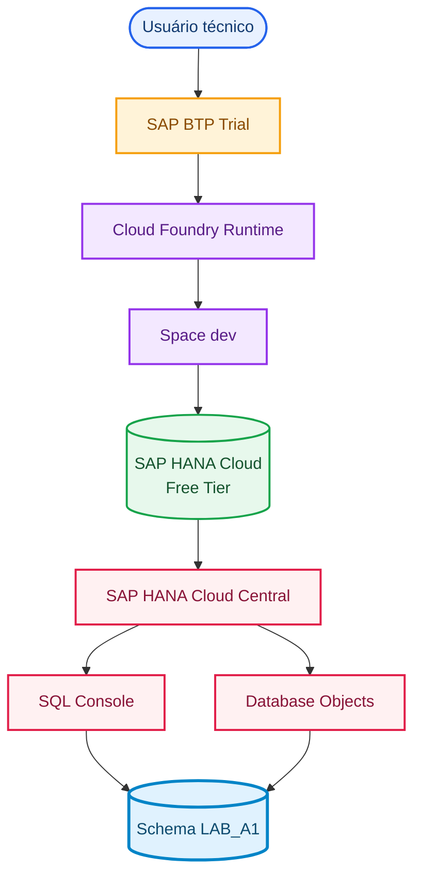
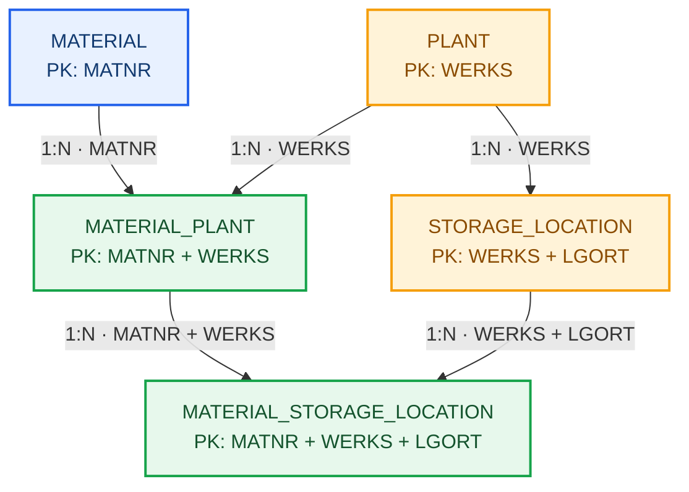
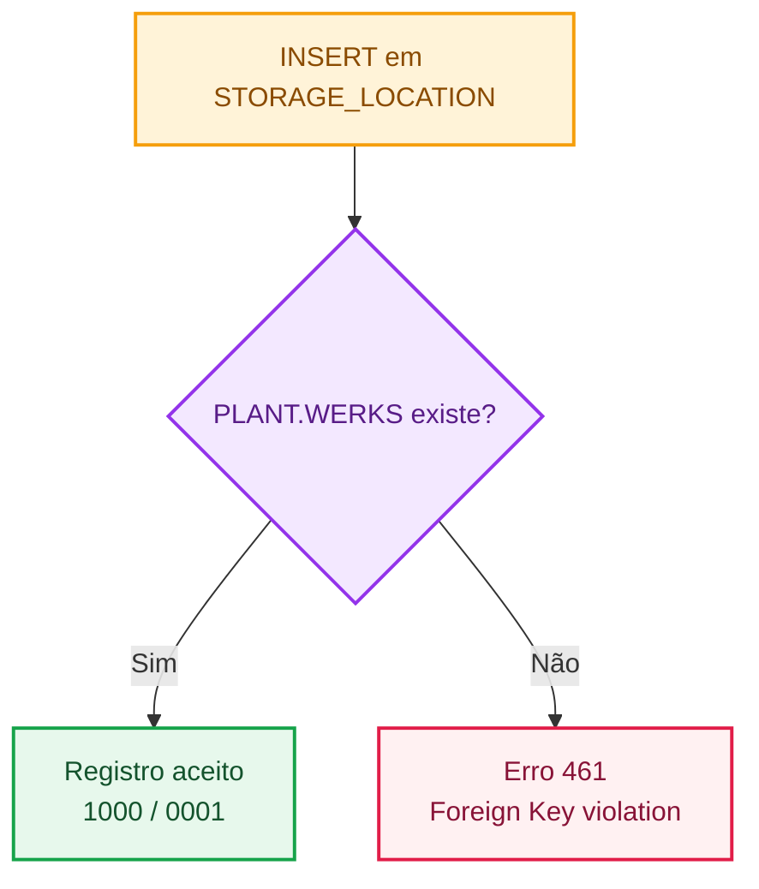

# A1: Fundação de Dados Relacionais no SAP HANA Cloud

**🌐 Idioma / Language:** 🇧🇷 **Português** | [🇺🇸 English](../EN/01-a1-relational-data-foundation.en.md)

> **Status:** ✅ Concluído  
> **Bloco:** A — Data & SAP-MES Master Data Foundation  
> **Schema:** `LAB_A1`  
> **Evidências:** `Evidences/LAB_A1/`

[⬆️ Voltar ao README](../../../README.md) | [➡️ Próximo documento: Projeto, validação e carga dos datasets](./02-a1-projeto-validacao-e-carga-dos-datasets.md)


---

## 🎯 Visão executiva

O A1 estabelece a primeira fundação relacional do projeto. Cinco tabelas `COLUMN` representam material global, centro, depósito e as expansões organizacionais Material × Plant e Material × Storage Location. O laboratório utiliza somente dados fictícios e não reproduz integralmente tabelas físicas do SAP ERP ou SAP S/4HANA.

## 🏭 Storytelling do cenário

Um material possui identidade global, mas determinadas características passam a depender do centro. Depois da expansão para o centro, o material pode ser disponibilizado em depósitos válidos daquele mesmo centro. O modelo separa essas responsabilidades para reduzir redundância e impedir combinações incoerentes.

```text
Material global
      ↓
Expansão para centro
      ↓
Disponibilização em depósito
```

## 🧭 Objetivos de aprendizagem

- compreender schema como namespace lógico;
- criar tabelas `COLUMN` com `NVARCHAR` e `NOT NULL`;
- aplicar Primary Keys simples, compostas e de três colunas;
- criar Foreign Keys simples e compostas;
- resolver uma relação `N:N` com entidade associativa;
- validar constraints no catálogo;
- comprovar integridade referencial com testes positivos e negativos.


---

## 🏗️ Arquitetura e fluxos

Os fluxos usam cores e formas para separar usuário, plataforma, ferramentas, banco, decisões e resultados. Dessa forma, o documento representa visualmente tanto a arquitetura quanto o comportamento das constraints.

### Fluxo da plataforma até o schema



### Fluxo relacional



### Fluxo da integridade referencial




---

## 🛠️ Implementação e evidências integradas

Cada evidência aparece no ponto exato da narrativa em que o resultado foi produzido. Assim, código, explicação e resultado visual permanecem conectados.

### 1. Schema `LAB_A1`

O schema funciona como uma pasta lógica dentro do banco. Mesmo com `CURRENT_SCHEMA = DBADMIN`, nomes qualificados como `LAB_A1.MATERIAL` direcionam o objeto ao namespace do laboratório.

```sql
SELECT CURRENT_USER, CURRENT_SCHEMA FROM DUMMY;
CREATE SCHEMA LAB_A1;
SELECT SCHEMA_NAME FROM SYS.SCHEMAS WHERE SCHEMA_NAME = 'LAB_A1';
```


Com o namespace disponível, a primeira entidade criada foi o material global.

### 2. Entidade global `MATERIAL`

`MATNR` identifica cada material. Os demais campos descrevem tipo, grupo e unidade base, mantendo o modelo pequeno e focado em fundamentos relacionais.

```sql
CREATE COLUMN TABLE LAB_A1.MATERIAL (
    MATNR NVARCHAR(40) NOT NULL,
    DESCRIPTION NVARCHAR(100) NOT NULL,
    MTART NVARCHAR(4) NOT NULL,
    MATKL NVARCHAR(9) NOT NULL,
    MEINS NVARCHAR(3) NOT NULL,
    PRIMARY KEY (MATNR)
);
```


A inspeção do catálogo permite confirmar Column Store, tipos, obrigatoriedade e posição da chave, sem depender apenas do retorno do DDL.


### 3. Entidade organizacional `PLANT`

O centro é multifuncional. Um mesmo Plant pode apoiar procurement, recebimento, qualidade, planejamento, produção, armazenagem e expedição. `WERKS` foi definido como Primary Key.

```sql
CREATE COLUMN TABLE LAB_A1.PLANT (
    WERKS NVARCHAR(4) NOT NULL,
    PLANT_NAME NVARCHAR(100) NOT NULL,
    COUNTRY NVARCHAR(3) NOT NULL,
    PRIMARY KEY (WERKS)
);
```


Com o registro organizacional definido, o modelo pôde representar depósitos dependentes do centro.

### 4. `STORAGE_LOCATION` e chave composta

Como `LGORT` pode se repetir em centros diferentes, a identidade completa do depósito é `WERKS + LGORT`.

```sql
CREATE COLUMN TABLE LAB_A1.STORAGE_LOCATION (
    WERKS NVARCHAR(4) NOT NULL,
    LGORT NVARCHAR(4) NOT NULL,
    STORAGE_LOCATION_NAME NVARCHAR(100) NOT NULL,
    PRIMARY KEY (WERKS, LGORT)
);
```


Na visualização estrutural, `WERKS` aparece como `Key 1` e `LGORT` como `Key 2`, tornando a composição da chave visível.


### 5. Relação `PLANT → STORAGE_LOCATION`

O `ALTER TABLE` transformou a correspondência funcional de `WERKS` em uma regra aplicada pelo banco. A constraint exige que todo centro utilizado em `STORAGE_LOCATION` exista em `PLANT`.

```sql
ALTER TABLE LAB_A1.STORAGE_LOCATION
ADD CONSTRAINT FK_STORAGE_LOCATION_PLANT
FOREIGN KEY (WERKS)
REFERENCES LAB_A1.PLANT (WERKS);
```


A relação foi consultada no catálogo. A presença do Joule registra o apoio da IA integrada, mas a validação técnica vem da system view.

```sql
SELECT SCHEMA_NAME, TABLE_NAME, COLUMN_NAME, POSITION,
       CONSTRAINT_NAME, REFERENCED_SCHEMA_NAME,
       REFERENCED_TABLE_NAME, REFERENCED_COLUMN_NAME,
       IS_ENFORCED, IS_VALIDATED
FROM SYS.REFERENTIAL_CONSTRAINTS
WHERE SCHEMA_NAME = 'LAB_A1'
ORDER BY TABLE_NAME, CONSTRAINT_NAME, POSITION;
```


### 6. Entidade associativa `MATERIAL_PLANT`

Um material pode existir em vários centros, e um centro pode conter vários materiais. `MATERIAL_PLANT` converte essa relação conceitual `N:N` em duas relações `1:N` e guarda exemplos de atributos dependentes do centro.

```sql
CREATE COLUMN TABLE LAB_A1.MATERIAL_PLANT (
    MATNR NVARCHAR(40) NOT NULL,
    WERKS NVARCHAR(4) NOT NULL,
    PROCUREMENT_TYPE NVARCHAR(1) NOT NULL,
    MRP_TYPE NVARCHAR(2) NOT NULL,
    PRIMARY KEY (MATNR, WERKS),
    CONSTRAINT FK_MATERIAL_PLANT_MATERIAL FOREIGN KEY (MATNR)
        REFERENCES LAB_A1.MATERIAL (MATNR),
    CONSTRAINT FK_MATERIAL_PLANT_PLANT FOREIGN KEY (WERKS)
        REFERENCES LAB_A1.PLANT (WERKS)
);
```


O catálogo apresenta as relações com `MATERIAL.MATNR` e `PLANT.WERKS`, concluindo a expansão do material ao centro.


### 7. Entidade `MATERIAL_STORAGE_LOCATION`

A entidade final exige duas condições válidas: o material deve estar expandido ao centro, e o depósito deve pertencer ao mesmo centro. A PK de três colunas identifica cada expansão específica.

```sql
CREATE COLUMN TABLE LAB_A1.MATERIAL_STORAGE_LOCATION (
    MATNR NVARCHAR(40) NOT NULL,
    WERKS NVARCHAR(4) NOT NULL,
    LGORT NVARCHAR(4) NOT NULL,
    STORAGE_STATUS NVARCHAR(1) NOT NULL,
    PRIMARY KEY (MATNR, WERKS, LGORT),
    CONSTRAINT FK_MAT_SLOC_MATERIAL_PLANT FOREIGN KEY (MATNR, WERKS)
        REFERENCES LAB_A1.MATERIAL_PLANT (MATNR, WERKS),
    CONSTRAINT FK_MAT_SLOC_STORAGE_LOCATION FOREIGN KEY (WERKS, LGORT)
        REFERENCES LAB_A1.STORAGE_LOCATION (WERKS, LGORT)
);
```


A inspeção mostra `MATNR`, `WERKS` e `LGORT` como `Key 1`, `Key 2` e `Key 3`.


A validação das posições das FKs compostas encerra a construção estrutural das cinco tabelas.


## 🧪 Validação comportamental

### Registro pai válido

O teste começou criando o centro fictício `1000`, necessário para qualquer depósito filho relacionado.

```sql
INSERT INTO LAB_A1.PLANT (WERKS, PLANT_NAME, COUNTRY)
VALUES ('1000', 'Manufacturing Plant Alpha', 'BRA');
SELECT * FROM LAB_A1.PLANT WHERE WERKS = '1000';
```


### Depósito válido aceito

Como `PLANT.WERKS = 1000` existe, a inclusão de `1000/0001` foi aceita.

```sql
INSERT INTO LAB_A1.STORAGE_LOCATION (WERKS, LGORT, STORAGE_LOCATION_NAME)
VALUES ('1000', '0001', 'Raw Materials');
SELECT * FROM LAB_A1.STORAGE_LOCATION
WHERE WERKS = '1000' AND LGORT = '0001';
```


### Depósito órfão rejeitado

A tentativa seguinte utilizou `WERKS = 9999`, que não existe na tabela pai.

```sql
INSERT INTO LAB_A1.STORAGE_LOCATION (WERKS, LGORT, STORAGE_LOCATION_NAME)
VALUES ('9999', '0001', 'Invalid Orphan Storage Location');
```


O erro 461 encerra a validação comportamental. A Foreign Key não apenas documenta o relacionamento: a Foreign Key impede fisicamente registros órfãos e protege futuras consultas, integrações e aplicações.


---

## ✅ Matriz de validação

| Critério | Resultado |
|---|---|
| Schema `LAB_A1` criado | ✅ |
| Cinco tabelas `COLUMN` criadas | ✅ |
| PKs simples e compostas validadas | ✅ |
| FKs simples e compostas validadas | ✅ |
| Registro pai válido e depósito válido inseridos | ✅ |
| Depósito órfão rejeitado | ✅ |
| Links físicos das evidências `01` a `18` | ✅ |
| Dados empresariais reais utilizados | ❌ Não |

## 🧯 Troubleshooting

- **`object already exists`:** confirme o catálogo antes de repetir um `CREATE`; não execute `DROP` automaticamente.
- **`foreign key constraint violation`:** carregue tabelas pai antes das tabelas filhas e revise a chave utilizada.
- **Foreign Key ausente na aba Columns:** consulte `SYS.REFERENTIAL_CONSTRAINTS`, pois a aba Columns prioriza colunas e PKs.
- **`Current Schema = DBADMIN`:** continue usando nomes qualificados `LAB_A1.OBJETO`; criar um schema não muda automaticamente o contexto da sessão.

## 🛡️ Boas práticas e produção

- não usar `DBADMIN` como identidade de aplicação;
- adotar roles e usuários técnicos com menor privilégio;
- nomear constraints explicitamente;
- versionar DDL e migrar posteriormente para HDI/database-as-code;
- analisar dependências antes de alterações destrutivas;
- revisar SQL sugerido pelo Joule ou por qualquer IA;
- carregar na ordem `PLANT → MATERIAL → STORAGE_LOCATION → MATERIAL_PLANT → MATERIAL_STORAGE_LOCATION`;
- nunca publicar credenciais ou dados empresariais reais.

## 🚀 Próximo documento

O próximo laboratório documental tratará separadamente a geração, validação e carga dos datasets:

### [DOC 02: Projeto, validação e carga dos datasets](./02-a1-projeto-validacao-e-carga-dos-datasets.md)

As novas evidências serão armazenadas em `Evidences/LAB_02/`, com numeração reiniciada em `01`.

## 📚 Referências oficiais

- [SAP HANA Cloud Getting Started Guide](https://help.sap.com/docs/hana-cloud/sap-hana-cloud-getting-started-guide/create-schema-tables-and-insert-data-using-sap-hana-database-explorer)
- [SAP HANA Cloud SQL Reference](https://help.sap.com/docs/hana-cloud-database/sap-hana-cloud-sap-hana-database-sql-reference-guide/create-table-statement-data-definition)
- [REFERENTIAL_CONSTRAINTS System View](https://help.sap.com/docs/hana-cloud-database/sap-hana-cloud-sap-hana-database-sql-reference-guide/referential-constraints-system-view)
- [Using Gen AI in the SQL Console](https://help.sap.com/docs/hana-cloud/sap-hana-cloud-administration-guide/using-gen-ai-in-sql-console)


---

## 👤 Autor

### Orlando dos Santos Caetano

**SAP MM · PP · QM · WM | MES | SAP Integration | Data Engineering | Generative AI**

[](https://www.linkedin.com/in/orlando-caetano/)
[](https://github.com/OrlandoCaetano2026)


**SAP Certified - Integration Developer (C_CPI)**  
**SAP Certified - SAP Generative AI Developer (C_AIG)**


---

[⬆️ Voltar ao README](../../../README.md) | [➡️ Próximo documento](./02-a1-projeto-validacao-e-carga-dos-datasets.md)
