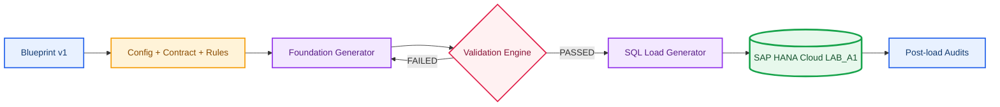
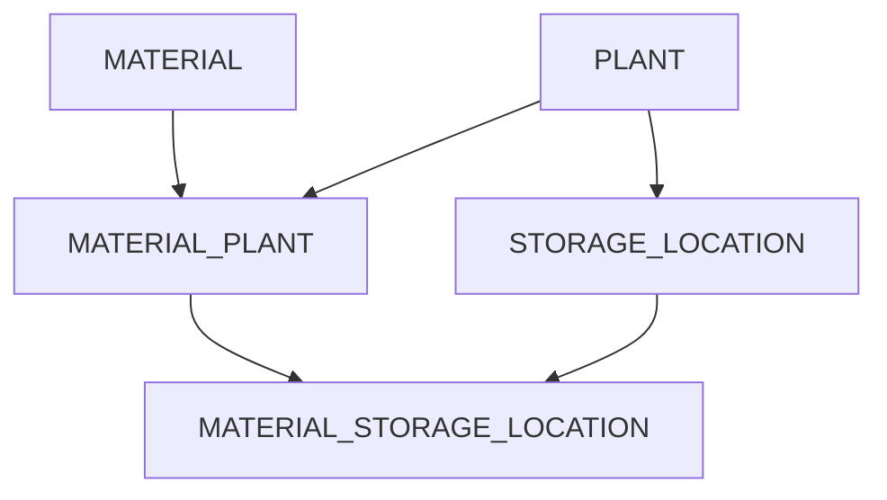

# A1: Fundação de Dados Relacionais no SAP HANA Cloud

---

**🌐 Idioma / Language:** 🇧🇷 **Português** | [🇺🇸 English](../EN/01-a1-relational-data-foundation.en.md)

---

[⬆️ README](../../../README.md) | [➡️ A2: Estrutura Organizacional SAP](./02-a2-estrutura-organizacional-sap.md)

---

## 🎯 Visão executiva

O A1 criou uma fundação relacional industrial governada no SAP HANA Cloud. Cinco tabelas `COLUMN`, um Industrial Data Universe determinístico e uma cadeia de geração, validação, carga e auditoria produziram **3.715 registros**, **zero órfãos** e **zero duplicidades**. Todos os dados são sintéticos.

---

## 🏗️ Arquitetura e fluxos

---

## 🗂️ Modelo final

| Table | Primary Key | Final rows |
|---|---|---:|
| `PLANT` | `WERKS` | 20 |
| `MATERIAL` | `MATNR` | 300 |
| `STORAGE_LOCATION` | `WERKS + LGORT` | 152 |
| `MATERIAL_PLANT` | `MATNR + WERKS` | 1,080 |
| `MATERIAL_STORAGE_LOCATION` | `MATNR + WERKS + LGORT` | 2,163 |

---

## 🧱 Implementação e evidências integradas

---

### 01. Schema LAB_A1 criado

O schema foi isolado do contexto corrente DBADMIN.

---

### 02. Tabela MATERIAL criada

MATERIAL recebeu chave global e atributos básicos.

---

### 03. Estrutura de MATERIAL

O catálogo confirmou Column Store, obrigatoriedade e chave.

---

### 04. Tabela PLANT criada

PLANT introduziu o nível organizacional multifuncional.

---

### 05. Estrutura de PLANT

WERKS foi confirmado como chave única.

---

### 06. Tabela STORAGE_LOCATION criada

A identidade do depósito passou a depender de WERKS e LGORT.

---

### 07. PK composta de STORAGE_LOCATION

Key 1 e Key 2 confirmaram a chave composta.

---

### 08. FK Storage Location para Plant

ALTER TABLE transformou a relação em regra aplicada pelo banco.

---

### 09. FK validada no catálogo

SYS.REFERENTIAL_CONSTRAINTS confirmou a ligação; Joule atuou somente como apoio.

---

### 10. Registro pai inserido

O centro 1000 foi preparado para o teste comportamental.

---

### 11. Depósito válido aceito

1000/0001 foi aceito por possuir registro pai.

---

### 12. Depósito órfão rejeitado

9999/0001 foi rejeitado com erro de Foreign Key.

---

### 13. MATERIAL_PLANT criada

A entidade associativa resolveu Material por Plant.

---

### 14. PK composta de MATERIAL_PLANT

MATNR e WERKS formaram a identidade da expansão.

---

### 15. FKs de MATERIAL_PLANT

As relações para MATERIAL e PLANT foram validadas.

---

### 16. MATERIAL_STORAGE_LOCATION criada

A entidade final conectou material, centro e depósito.

---

### 17. PK de três colunas

MATNR, WERKS e LGORT foram confirmados como Key 1, 2 e 3.

---

### 18. FKs compostas validadas

As duas FKs compostas fecharam a fundação estrutural.

---

### 19. Tabelas limpas antes da carga

Os dois registros manuais foram removidos na ordem filha para pai; todas as tabelas ficaram vazias.

---

### 20. Instância de importação selecionada

O Import and Export foi explorado. Como a origem disponível exigia Data Lake Files, o A1 adotou scripts SQL gerados; cloud storage permanece no roadmap.

---

### 21. 20 Plants carregados

PLANT foi carregada primeiro por não depender de outra tabela.

---

### 22. 300 Materials carregados

MATERIAL recebeu as seis famílias sintéticas aprovadas.

---

### 23. 152 depósitos carregados

Todos os depósitos localizaram seus respectivos Plants.

---

### 24. 1.080 extensões Material Plant

As extensões respeitaram simultaneamente MATERIAL e PLANT.

---

### 25. 2.163 extensões Material Storage Location

A carga final validou as FKs compostas de ponta a ponta.

---

### 26. Contagens finais

As cinco contagens reconciliaram exatamente 3.715 registros.

---

### 27. Integridade referencial pós-carga

Cinco verificações com LEFT JOIN retornaram zero órfãos.

---

### 28. Unicidade das PKs

Cinco verificações com GROUP BY e HAVING retornaram zero duplicidades.

---

### 29. JOIN ponta a ponta

A consulta integrou as cinco tabelas em uma visão funcional.

---

### 30. Distribuição por Plant

Os 20 Plants reconciliaram 1.080 extensões, 152 depósitos e 2.163 associações, sendo 2.066 ativas e 97 inativas.

---

## 🌐 Industrial Data Universe

O Blueprint transversal fica em `Industrial-Data-Universe/Blueprint/`. Config, contract e rules estão `APPROVED`; o Validation Engine está `PASSED`; a seed é `20260903`. Foram preservados geradores Python, cinco CSVs válidos, cinco pacotes negativos, manifest com SHA-256, relatório Markdown, scripts SQL de carga e seis auditorias SQL.

---

## ✅ Matriz de validação final

| Control | Result |
|---|---|
| Config, contract, rules | `APPROVED` |
| Validation Engine | `PASSED` |
| Total records | 3,715 |
| Orphans | 0 |
| Duplicate PKs | 0 |
| Active assignments | 2,066 |
| Inactive assignments | 97 |
| Physical evidence | 30 PNGs |

---

## 🧯 Troubleshooting e decisões

- Instância parada: iniciar no HANA Cloud Central e aguardar `Running`.
- Import local ausente: A1 usou SQL Load Generator; Data Lake Files será praticado no bloco de Data Engineering.
- FK invisível em Columns: consultar `SYS.REFERENTIAL_CONSTRAINTS`.
- Python deve ser salvo como `.py`, não colado no PowerShell.
- Remover `__pycache__` e manter `*.pyc` no `.gitignore`.
- Comandos para copiar devem estar sem acento grave isolado, asteriscos corrompidos ou linha vazia final.

---

## 📚 Referências oficiais

- [SAP HANA Cloud Administration Guide](https://help.sap.com/docs/hana-cloud/sap-hana-cloud-administration-guide)
- [SAP HANA Cloud SQL Reference](https://help.sap.com/docs/hana-cloud-database/sap-hana-cloud-sap-hana-database-sql-reference-guide)
- [REFERENTIAL_CONSTRAINTS System View](https://help.sap.com/docs/hana-cloud-database/sap-hana-cloud-sap-hana-database-sql-reference-guide/referential-constraints-system-view)
- [Defining and Assigning Plants](https://learning.sap.com/courses/cross-functional-customizing-in-sap-s-4hana-materials-management/defining-and-assigning-plants)
- [Customizing Storage Locations](https://learning.sap.com/courses/exploring-basic-data-for-manufacturing-and-product-management-in-sap-s-4hana/customizing-storage-location)

---

## 🚀 Próximo cenário

[A2: Estrutura Organizacional SAP](./02-a2-estrutura-organizacional-sap.md), com evidências em `Evidences/LAB_A2/`.

---

## 👤 Autor e contato

### Orlando dos Santos Caetano

        

---

[⬆️ README](../../../README.md) | [➡️ A2: Estrutura Organizacional SAP](./02-a2-estrutura-organizacional-sap.md)
