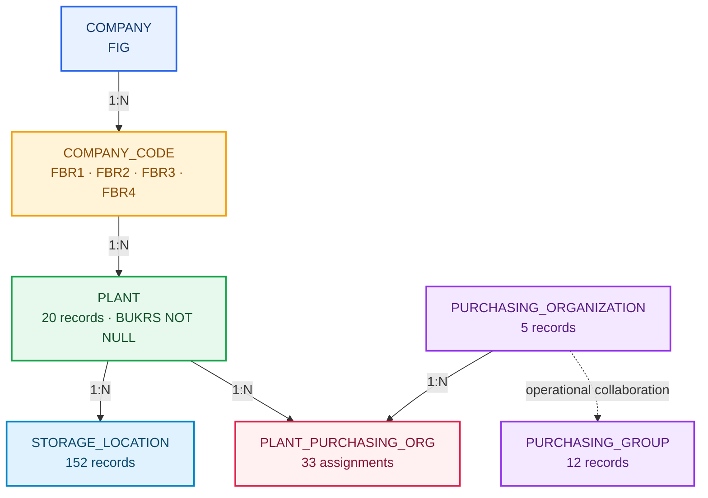

# A2: Estrutura Organizacional SAP no Industrial Data Universe

**🌐 Idioma / Language:** 🇧🇷 **Português** | [🇺🇸 English](../EN/02-a2-sap-enterprise-structure.en.md)

[⬆️ Voltar ao README](../../../README.md) | [⬅️ Cenário anterior: A1](./01-a1-fundacao-de-dados-relacionais.md)

> **Status:** ✅ Concluído e validado  
> **Schema físico:** `INDUSTRIAL_DATA`  
> **Documento:** `DOC 02`  
> **Evidências:** `Evidences/LAB_A2/`  
> **Classificação:** dados sintéticos exclusivamente educacionais

## 🎯 Visão executiva

O A2 transformou a fundação relacional do A1 em uma estrutura organizacional inspirada no SAP. O trabalho começou por uma correção arquitetural importante: o schema `LAB_A1`, adequado ao primeiro laboratório, foi renomeado para `INDUSTRIAL_DATA`, tornando-se uma fundação física compartilhada para os cenários seguintes.

Sobre essa base foram materializados Company, Company Code, Purchasing Organization, Purchasing Group e a associação Plant × Purchasing Organization. A tabela `PLANT`, já populada com 20 registros, foi evoluída de forma controlada para receber `BUKRS`, primeiro nullable e depois obrigatório e protegido por Foreign Key.

O encerramento reconciliou 10 tabelas, 10 Foreign Keys e 3.770 registros. O A2 adicionou 55 registros sem perder os 3.715 registros Foundation, e as 20 regras finais retornaram `PASSED`.

> [!IMPORTANT]
> Todos os dados são fictícios. Nenhum código, nome organizacional, moeda operacional ou relacionamento representa uma empresa real.

---

## 🧭 Storytelling funcional

Uma companhia industrial fictícia possui 20 Plants com funções produtivas, logísticas, engenharia, qualidade e serviços. O A1 sabia quais materiais existiam, em quais Plants estavam disponíveis e em quais depósitos poderiam ser armazenados. Ainda faltava responder quem controlava legalmente cada Plant e como as responsabilidades de compras eram organizadas.

O A2 introduziu uma companhia corporativa, quatro entidades legais brasileiras e cinco organizações de compras. Cada Plant recebeu um Company Code e uma organização de compras primária. Treze Plants estratégicos também passaram a receber suporte da organização corporativa `P100`.

Dois Plants tiveram papel adicional no roadmap: `1200`, dedicado a componentes eletrônicos, e `2800`, dedicado a operações de exportação. Ambos permanecem em Company Codes cuja moeda local é `BRL`, mas foram preparados para documentos futuros em `USD`, viabilizando um futuro `Multicurrency Procurement Monitor` em Fiori.

---

## 🏗️ Arquitetura final



| Entidade | Responsabilidade | Chave | Registros |
|---|---|---|---:|
| `COMPANY` | Grupo corporativo | `COMPANY_ID` | 1 |
| `COMPANY_CODE` | Entidade legal e moeda local | `BUKRS` | 4 |
| `PLANT` | Unidade operacional | `WERKS` | 20 |
| `PURCHASING_ORGANIZATION` | Autoridade de compras | `EKORG` | 5 |
| `PURCHASING_GROUP` | Responsabilidade do comprador | `EKGRP` | 12 |
| `PLANT_PURCHASING_ORG` | Associação Plant × Org. Compras | `WERKS + EKORG` | 33 |

---

## 1. Migration segura do schema

Antes da mudança, dez controles confirmaram que `LAB_A1` existia, `INDUSTRIAL_DATA` não existia, as cinco tabelas Foundation estavam presentes e os 3.715 registros permaneciam íntegros.


---

## 1.1 Renomeando a fundação física

O comando `RENAME SCHEMA LAB_A1 TO INDUSTRIAL_DATA;` generalizou o namespace sem copiar tabelas nem recriar dados.


---

## 1.2 Reconciliação pós-migration

Doze controles confirmaram a inexistência do schema antigo, existência do novo schema, preservação das cinco tabelas, cinco Foreign Keys aplicadas e validadas, e os 3.715 registros.


---

## 2. Company e Company Code

As tabelas `COMPANY` e `COMPANY_CODE` estabeleceram a hierarquia corporativa e legal. A Foreign Key protege `COMPANY_CODE.COMPANY_ID → COMPANY.COMPANY_ID`.


---

## 2.1 Carga das entidades legais

A Company `FIG` foi associada a quatro Company Codes brasileiros, todos com moeda local `BRL` e perfis distintos.


---

## 2.2 Teste negativo de integridade

Um Company Code apontando para a Company inexistente `XXX` foi rejeitado pelo HANA. A consulta posterior confirmou zero persistência do registro inválido e quatro Company Codes legítimos.


---

## 3. Evolução controlada de PLANT

A coluna `BUKRS NVARCHAR(4)` foi adicionada temporariamente como nullable. Os 20 Plants existentes permaneceram disponíveis, todos inicialmente aguardando atribuição.


---

## 3.1 Distribuição dos Plants

Os 20 Plants foram distribuídos entre `FBR1`, `FBR2`, `FBR3` e `FBR4` nas quantidades 9, 2, 6 e 3.


---

## 3.2 Tornando BUKRS definitivo

Após validar zero valores nulos ou desconhecidos, `BUKRS` tornou-se `NOT NULL` e passou a ser protegido por `FK_PLANT_COMPANY_CODE`, aplicada e validada.


---

## 3.3 Segundo teste negativo

A tentativa de atualizar o Plant `2800` para o Company Code inexistente `FBR9` foi rejeitada. O Plant permaneceu corretamente associado a `FBR3`.


---

## 4. Estrutura organizacional de compras

Três tabelas completaram o modelo: `PURCHASING_ORGANIZATION`, `PURCHASING_GROUP` e `PLANT_PURCHASING_ORG`. A consulta consolidada validou 1, 0 e 2 Foreign Keys respectivamente.


---

## 4.1 Purchasing Organizations

A organização `P100` foi criada com escopo cross-company e `PRIMARY_BUKRS = NULL`; `P110` a `P140` receberam seus Company Codes primários.


---

## 4.2 Purchasing Groups

Doze grupos foram distribuídos entre materiais diretos, materiais indiretos, serviços, CAPEX e strategic sourcing.


---

## 4.3 Associações Plant × Purchasing Organization

Foram criadas 20 associações `PRIMARY` e 13 `STRATEGIC_SUPPORT`. A distribuição por organização fechou em 33 registros.


---

## 4.4 Auditoria de integridade de compras

Dez regras confirmaram cobertura dos 20 Plants, uso das cinco organizações, exatamente uma associação primária por Plant, zero órfãos e zero duplicidades.


---

## 5. JOIN organizacional ponta a ponta

O JOIN entre Company, Company Code, Plant, associação e Purchasing Organization retornou 33 relações com `RELATIONSHIP_STATUS = PASSED`.


---

## 5.1 Preparação multicurrency

Os Plants `1200` e `2800` apresentaram moeda local `BRL`, moeda futura `USD`, organização primária e suporte estratégico `P100`, resultando em `READY_FOR_FUTURE_CURRENCY_SCENARIO`.


---

## 6. Reconciliação final

Vinte regras reconciliaram 10 tabelas, 10 Foreign Keys, 3.715 registros Foundation, 55 registros A2 e 3.770 registros totais.


---

## 📦 Artefatos reproduzíveis

```text
Industrial-Data-Universe/Datasets/Enterprise-Structure/
├── Load/
│   ├── 01-create-enterprise-structure-tables.sql
│   ├── 02-load-company-and-company-codes.sql
│   ├── 03-evolve-plant-company-code.sql
│   ├── 04-load-purchasing-organizations.sql
│   ├── 05-load-purchasing-groups.sql
│   └── 06-load-plant-purchasing-organizations.sql
├── Validation/
│   ├── 01-validate-schema-migration.sql
│   ├── 02-validate-enterprise-structure.sql
│   ├── 03-validate-purchasing-assignments.sql
│   ├── 04-enterprise-purchasing-end-to-end-join.sql
│   ├── 05-validate-multicurrency-readiness.sql
│   └── 06-enterprise-structure-final-reconciliation.sql
└── a2-enterprise-structure-sql-manifest.json
```

O manifest registra 6 scripts de carga, 6 scripts de validação e 12 caminhos físicos válidos, com zero arquivo ausente.

---

## ✅ Matriz de validação

| Controle | Resultado |
|---|---:|
| Schema migration | `PASSED` |
| Foundation preservada | 3.715 |
| Registros A2 | 55 |
| Total | 3.770 |
| Tabelas | 10 |
| Foreign Keys | 10 |
| Company Codes órfãos | 0 |
| Plants sem BUKRS | 0 |
| Plants com BUKRS desconhecido | 0 |
| Associações sem Plant | 0 |
| Associações sem Purchasing Organization | 0 |
| Duplicidades `WERKS + EKORG` | 0 |
| Regras finais | 20 `PASSED` |

---

## 🛠️ Troubleshooting

| Sintoma | Causa | Solução |
|---|---|---|
| Query de reconciliação incompleta | bloco copiado parcialmente | reenviar e executar o SQL completo e autocontido |
| Manifest mostrava `0` scripts | lista foi construída incorretamente no PowerShell | reconstruir listas a partir dos arquivos físicos |
| `*ForEach-Object` não reconhecido | asterisco inserido durante a cópia | executar o cmdlet sem caracteres extras |
| Mermaid não renderizou | sintaxe pontilhada inválida | usar `-.->|texto|` |
| `BUKRS NOT NULL` falharia | Plants ainda continham `NULL` | atualizar e validar todos os 20 Plants antes do ALTER |
| Company Code inválido aceito | FK ausente ou não aplicada | criar e validar a Foreign Key pelo catálogo |
| Reexecução de Load produz conflito | cenário já materializado | usar scripts Load apenas para reconstrução futura |

---

## 🏭 Recomendações para produção

- usar HDI Containers e migrations de design time para aplicações CAP;
- separar Company Code currency, document currency e converted amount;
- versionar mappings organizacionais e aplicar aprovação formal;
- utilizar usuários técnicos com privilégio mínimo;
- tornar cargas idempotentes ou protegidas por staging;
- registrar lineage, timestamps e responsável por mudança;
- automatizar consultas de reconciliação em CI/CD;
- criar regras formais para escopos cross-company;
- revalidar quotation method, fatores e precisão antes do cenário cambial;
- manter o valor original em USD ao derivar o valor local em BRL.

---

## 🔗 Referências oficiais

- [SAP HANA Cloud SQL Reference Guide](https://help.sap.com/docs/hana-cloud-database/sap-hana-cloud-sap-hana-database-sql-reference-guide)
- [ALTER TABLE Statement](https://help.sap.com/docs/hana-cloud-database/sap-hana-cloud-sap-hana-database-sql-reference-guide/alter-table-statement-data-definition)
- [REFERENTIAL_CONSTRAINTS System View](https://help.sap.com/docs/hana-cloud-database/sap-hana-cloud-sap-hana-database-sql-reference-guide/referential-constraints-system-view)
- [Defining and Assigning Plants](https://learning.sap.com/courses/cross-functional-customizing-in-sap-s-4hana-materials-management/defining-and-assigning-plants)

---

## 🚀 Continuidade

O A2 está concluído como estrutura organizacional e de compras. Antes de iniciar o próximo cenário, o README vivo deve ser relido para confirmar o roadmap real e o nome físico do próximo documento.

## 👤 Autor e contato

### Orlando dos Santos Caetano

[](https://www.linkedin.com/in/orlando-caetano/)
[](https://github.com/OrlandoCaetano2026)

        

[⬆️ Voltar ao README](../../../README.md) | [⬅️ Cenário anterior: A1](./01-a1-fundacao-de-dados-relacionais.md)
