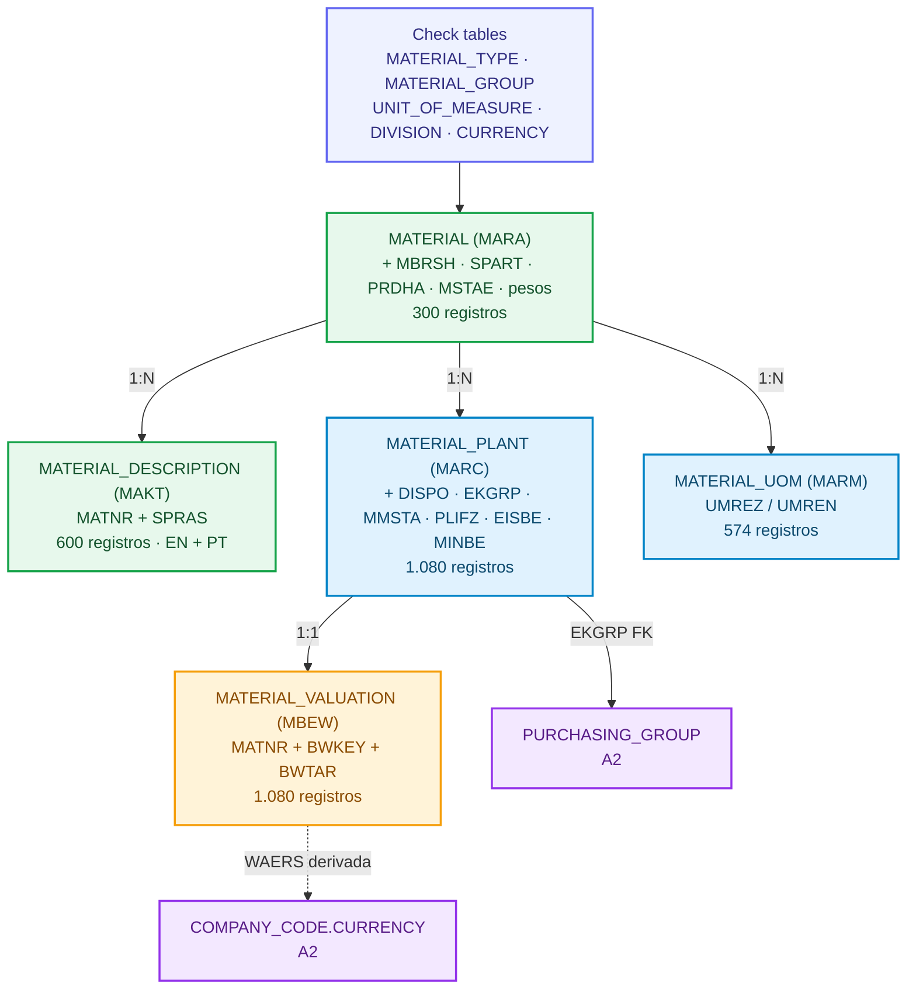

# A3: Dados Mestre de Material no Industrial Data Universe

**🌐 Idioma / Language:** 🇧🇷 **Português** | [🇺🇸 English](../EN/03-a3-material-master-data.en.md)

[⬆️ Voltar ao README](../../../README.md) | [⬅️ Cenário anterior: A2](./02-a2-estrutura-organizacional-sap.md)

> **Status:** ✅ Concluído e validado  
> **Schema físico:** `INDUSTRIAL_DATA`  
> **Documento:** `DOC 03`  
> **Evidências:** `Evidences/LAB_A3/`  
> **Classificação:** dados sintéticos exclusivamente educacionais

## 🎯 Visão executiva

O A3 transformou as três tabelas planas de material herdadas do A1 (`MATERIAL`, `MATERIAL_PLANT`, `MATERIAL_STORAGE_LOCATION`) em uma estrutura de **Material Master em camadas organizacionais** no estilo SAP: visão client (MARA), descrições multilíngues (MAKT), visão planta (MARC), avaliação contábil (MBEW) e unidades de medida alternativas (MARM).

A integridade de domínio deixou de depender de texto livre e passou a ser dirigida por **check tables** (`MATERIAL_TYPE`, `MATERIAL_GROUP`, `UNIT_OF_MEASURE`, `DIVISION`, `CURRENCY`). A visão planta foi amarrada à estrutura de compras do A2 pela Foreign Key `MATERIAL_PLANT.EKGRP → PURCHASING_GROUP`. A moeda da avaliação é **derivada** da cadeia `PLANT.BUKRS → COMPANY_CODE.CURRENCY`, nunca escrita literalmente.

O encerramento reconciliou **18 tabelas, 22 Foreign Keys lógicas e 6.066 registros**. O A3 adicionou 2.296 registros sem perder os 3.770 registros do A2, as 19 regras finais retornaram `PASSED` e 8 regras de integridade fecharam com zero violações.

> [!IMPORTANT]
> Todos os dados são fictícios. Nenhum código de material, preço, moeda operacional ou relacionamento representa uma empresa real. Os preços são sintéticos e determinísticos.

---

## 🧭 Storytelling funcional

Depois do A2, a companhia fictícia sabia quais entidades legais controlavam cada Plant e como as compras eram organizadas. O que existia sobre os 300 materiais, porém, era mínimo: número, uma descrição, um tipo, um grupo e uma unidade base — sem check tables, sem descrição por idioma, sem atributos de planejamento, sem avaliação contábil.

No SAP real, o Material Master não é uma tabela: é um conjunto de **visões por nível organizacional**. A visão básica (MARA) vale para todo o grupo. As descrições (MAKT) existem por idioma. A visão planta (MARC) carrega planejamento de necessidades, tipo de aquisição e grupo de compras. A avaliação (MBEW) carrega classe de avaliação, controle de preço e preço, numa moeda que pertence ao Company Code. As unidades alternativas (MARM) permitem comprar em caixa e estocar em unidade.

O A3 reproduziu essa estratificação. Cada camada recebeu seus atributos, suas Foreign Keys e suas regras de consistência. Dois Plants seguem reservados para o roadmap: `1200` (componentes eletrônicos) e `2800` (operações de exportação). Ambos permanecem em Company Codes com moeda local `BRL`, mas a coluna de moeda da avaliação já existe e é populada por derivação — pronta para o futuro cenário `BRL/USD` sem qualquer mudança de schema.

---

## 🏗️ Arquitetura final



| Camada SAP | Tabela | Chave | Registros |
|---|---|---|---:|
| Check table (T134) | `MATERIAL_TYPE` | `MTART` | 4 |
| Check table (T023) | `MATERIAL_GROUP` | `MATKL` | 24 |
| Check table (T006) | `UNIT_OF_MEASURE` | `MSEHI` | 6 |
| Check table (TSPA) | `DIVISION` | `SPART` | 5 |
| Check table (TCURC) | `CURRENCY` | `WAERS` | 3 |
| Client view (MARA) | `MATERIAL` (evoluída) | `MATNR` | 300 |
| Descrições (MAKT) | `MATERIAL_DESCRIPTION` | `MATNR + SPRAS` | 600 |
| Plant view (MARC) | `MATERIAL_PLANT` (evoluída) | `MATNR + WERKS` | 1.080 |
| Avaliação (MBEW) | `MATERIAL_VALUATION` | `MATNR + BWKEY + BWTAR` | 1.080 |
| Unidades alt. (MARM) | `MATERIAL_UOM` | `MATNR + MEINH` | 574 |

---

## 1. Baseline pré-A3

O ponto de partida foi medido antes de qualquer alteração: `MATERIAL` = 300, `MATERIAL_PLANT` = 1.080, `MATERIAL_STORAGE_LOCATION` = 2.163, com `MTART`, `MATKL` e `MEINS` ainda como texto livre (4, 24 e 4 valores distintos, sem check table). A distribuição por tipo era `ROH` 200 (prefixos RM/EC/MC), `FERT` 40, `HALB` 40 e `VERP` 20.


---

## 2. Check tables de configuração

Quatro check tables introduziram integridade de domínio no estilo SAP. `MATERIAL_TYPE` (T134/T134M) é a **chave de controle**: define tipo de aquisição default, controle de preço, classe de avaliação e se o tipo atualiza quantidade e valor. `MATERIAL_GROUP` (T023) normaliza os 24 grupos de texto livre do A1. `UNIT_OF_MEASURE` (T006) adiciona dimensão física e código ISO. `DIVISION` (TSPA) é o atributo classificador client-level. As tabelas nascem com 6 `CHECK` constraints protegendo domínios enumerados (`BESKZ ∈ {E,F,X}`, `VPRSV ∈ {S,V}`, dimensão da unidade etc.).


---

## 2.1 Carga da configuração

As quatro check tables foram carregadas com o universo exato do A1: 4 tipos, 24 grupos (15 `ROH`, 3 `HALB`, 3 `FERT`, 3 `VERP`), 4 unidades e 5 divisões. Os cinco segmentos de grupo de material (`MECHANICAL`, `ELECTRONIC`, `CHEMICAL`, `PACKAGING`, `GENERAL`) ficaram cobertos e os defaults de controle por tipo foram confirmados: `ROH F/V/3000`, `HALB X/S/7900`, `FERT E/S/7920`, `VERP F/V/3030`.

As faixas de numeração foram alinhadas ao dado real do A1. Como `ROH` usa três prefixos (`RM` 100001–100080, `EC` 200001–200060, `MC` 300001–300060), o tipo ocupa um intervalo largo (`100000–399999`); `HALB`, `FERT` e `VERP` recebem as bandas `400000–499999`, `500000–599999` e `600000–699999`. Todos os 300 materiais respeitam a faixa do seu tipo — regra auditada, não imposta por constraint, para preservar a identidade histórica dos `MATNR`.


---

## 3. Visão client (MARA)

A tabela `MATERIAL` recebeu sete atributos client-level: setor industrial (`MBRSH`), divisão (`SPART`), hierarquia de produto (`PRDHA`), status cross-plant (`MSTAE`, nullable — vazio significa não bloqueado), pesos bruto e líquido (`BRGEW`, `NTGEW`) e unidade de peso (`GEWEI`). O backfill foi determinístico: setor e divisão derivam do segmento do grupo de material; peso deriva do número de material via aritmética modular reproduzível.

A sequência seguiu o padrão do A2 com `PLANT.BUKRS`: adicionar colunas nullable → backfill → promover a `NOT NULL` → aplicar Foreign Keys. Cinco Foreign Keys passaram a proteger `MTART`, `MATKL`, `MEINS`, `GEWEI` e `SPART` contra as check tables. A distribuição fechou em 300 materiais por divisão (`10` 119, `20` 116, `30` 32, `40` 20, `00` 13) e por setor (`M` 152, `E` 116, `C` 32).


> **Nota de modelagem.** A partir do A3, `MATERIAL.DESCRIPTION` (herdada do A1) e `MATERIAL_DESCRIPTION` coexistem. No SAP real, MARA não guarda descrição — ela vive apenas em MAKT, por idioma. A coluna do A1 é mantida para preservar a linhagem do cenário anterior, mas o A3 estabelece MAKT como fonte autoritativa multilíngue.

---

## 4. Descrições multilíngues (MAKT)

`MATERIAL_DESCRIPTION` foi criada no grão `MATNR + SPRAS`, com `CHECK (SPRAS IN ('EN','PT'))` e Foreign Key para `MATERIAL`. A carga produziu 600 linhas: o texto inglês reaproveita a descrição original do A1 (linhagem preservada, sem inventar dado); o texto português é derivado do grupo de material, mantendo o par como tradução real do mesmo objeto de negócio. Todos os 300 materiais têm descrição nos dois idiomas.


---

## 5. Visão planta (MARC)

`MATERIAL_PLANT` recebeu sete atributos de planejamento e compras: MRP controller (`DISPO`, um por planta), grupo de compras (`EKGRP`), status por planta (`MMSTA`), prazo de entrega planejado (`PLIFZ`), tempo de recebimento (`WEBAZ`), estoque de segurança (`EISBE`) e ponto de reposição (`MINBE`).

A **relevância de campo** do SAP foi respeitada no backfill:

- `EKGRP` e `PLIFZ` só para materiais de aquisição externa (`PROCUREMENT_TYPE = 'F'`);
- `MINBE` só para planejamento por ponto de reposição (`MRP_TYPE = 'VB'`), sempre acima do estoque de segurança;
- `DISPO`, `WEBAZ` e `EISBE` são sempre relevantes e passaram a `NOT NULL`.

O `EKGRP` foi atribuído por commodity, alinhado aos grupos de compras do A2: `G01` metais/fixadores/eixos, `G02` químicos/polímeros, `G03` eletrônicos, `G04` mecânicos, `G05` automação, `G07` embalagem. Isso deixou **753** linhas com grupo de compras (ROH + VERP) e **327** sem (FERT + HALB, produção própria) — exatamente o comportamento SAP. A Foreign Key `FK_MATERIAL_PLANT_PURCHASING_GROUP` conecta a visão planta à estrutura de compras do A2.


A auditoria de consistência do MARC confirmou, sem nenhuma violação: tipo de aquisição compatível com o tipo de material, relevância de `EKGRP`, relevância de `PLIFZ`, relevância de `MINBE` e ponto de reposição acima do estoque de segurança. Essas cinco regras foram reexecutadas na reconciliação final (seção 9).

---

## 6. Avaliação contábil (MBEW)

`MATERIAL_VALUATION` foi materializada no grão `MATNR + BWKEY + BWTAR`, com **área de avaliação = Plant** (`BWKEY = WERKS`, padrão S/4). Cada linha carrega classe de avaliação (`BKLAS`, derivada do tipo), controle de preço (`VPRSV`: `S` padrão para produção própria, `V` média móvel para aquisição externa), preço padrão ou móvel, unidade de preço (`PEINH`) e moeda (`WAERS`).

A **moeda é derivada**, nunca escrita: o `INSERT` faz o join `PLANT.BUKRS → COMPANY_CODE.CURRENCY`. Hoje todas as 1.080 avaliações estão em `BRL`. A tabela `CURRENCY` (equivalente à TCURC) foi criada com `BRL`, `USD` e `EUR`, e `COMPANY_CODE.CURRENCY` passou a ser protegida pela Foreign Key `FK_COMPANY_CODE_CURRENCY` — integridade de domínio retro-encaixada na estrutura do A2.

Três `CHECK` constraints protegem a semântica da avaliação: `VPRSV ∈ {S,V}`, `PEINH ∈ {1,10,100,1000}` e a regra cruzada de que controle `S` só carrega preço padrão e controle `V` só carrega preço móvel.

O preço sintético é gerado misturando o número de material com um primo grande (`104729`) e a planta com um segundo primo (`7919`), o que espalha números de material consecutivos por todo o intervalo do seu tipo. As faixas resultantes: `ROH` ~5–200, `VERP` ~0,50–20, `HALB` ~200–2.000, `FERT` ~2.000–20.000 `BRL`.

> **Área de avaliação = Plant.** Como consequência direta dessa escolha, o mesmo material pode ter valor diferente em plantas diferentes — por exemplo `FG-500001` custa mais de 10.700 `BRL` numa planta e menos de 5.000 `BRL` em outra, ambas dentro da mesma empresa. Se a área de avaliação fosse o Company Code, esses valores seriam obrigatoriamente iguais.

---

## 7. Unidades de medida alternativas (MARM)

`MATERIAL_UOM` guarda os fatores de conversão `UMREZ / UMREN`. Todo material carrega uma linha base obrigatória 1:1 na sua unidade própria — exatamente como o SAP sempre armazena a unidade base em MARM. Materiais geridos em `EA` recebem `BOX` (1 caixa = 12 unidades); produtos acabados e embalagem em `EA` também recebem `PAL` (1 palete = 240 unidades). Total de 574 linhas: 300 base + 227 `BOX` + 47 `PAL`.

---

## 8. Testes negativos consolidados

Cinco ataques ao modelo, cobrindo os cinco mecanismos de integridade do A3, todos rejeitados pelo banco:

| # | Tentativa | Mecanismo | Erro retornado |
|---|---|---|---|
| 1 | Material com `MTART = 'ZZZZ'` | FK de domínio | `FK_MATERIAL_MATERIAL_TYPE` |
| 2 | Mover material para `EKGRP = 'G99'` | Wiring A3 ↔ A2 | `FK_MATERIAL_PLANT_PURCHASING_GROUP` — *"Only found 0 of 149 rows"* |
| 3 | Descrição com `SPRAS = 'XX'` | `CHECK` de domínio | `CHK_MATERIAL_DESCRIPTION_SPRAS` |
| 4 | Avaliação com `WAERS = 'XXX'` | FK de moeda | `FK_MATERIAL_VALUATION_CURRENCY` |
| 5 | Controle `S` carregando preço móvel | Regra semântica entre colunas | `CHK_MATERIAL_VALUATION_PRICE` |

O erro do teste 2 é o mais eloquente do cenário: o banco recusa mover materiais para um grupo de compras inexistente com a mensagem *"encontrei 0 de 149 linhas"* — o A3 e o A2 amarrados na prática. Depois das cinco rejeições, a reconciliação confirmou 300 / 600 / 1.080 registros e 149 linhas ainda em `G01`, o modelo intacto.


---

## 9. JOIN ponta a ponta

Uma única consulta percorre A1, A2 e A3: sai do material no nível client, passa pela descrição em português, desce para a planta, cruza para o Company Code, chega no grupo e na organização de compras do A2, e termina na avaliação com a moeda derivada. Duas linhas por tipo de material.

O contraste entre as linhas é a regra de relevância de campo do SAP aparecendo no dado real: `ROH` e `VERP` mostram grupo de compras preenchido e controle `V`; `HALB` e `FERT` mostram `in-house` e controle `S`. `FG-500001` aparece com valores diferentes nas plantas 1600 e 1300 — a consequência de avaliar por planta.


---

## 10. Reconciliação final

Vinte e uma verificações fecharam o A3: estrutura (18 tabelas, 22 Foreign Keys, 6.066 registros contados com `COUNT(*)`), os 8 volumes de tabela do A3, 8 regras de integridade com zero violações, e o status de prontidão multimoeda dos Plants 1200 (59 materiais avaliados) e 2800 (51 materiais avaliados). Resultado: 19 `PASSED` e 2 `INFO`, nenhum `FAILED`.


---

## 📦 Artefatos reproduzíveis

```text
Industrial-Data-Universe/Datasets/Material-Master/
├── Load/
│   ├── 01-create-material-master-config-tables.sql
│   ├── 02-load-material-master-config-data.sql
│   ├── 03-evolve-material-client-view.sql
│   ├── 04-create-and-load-material-descriptions.sql
│   ├── 05-evolve-material-plant-view.sql
│   ├── 06-create-and-load-material-valuation.sql
│   └── 07-load-material-alternative-uom.sql
├── Validation/
│   ├── 01-validate-config-integrity.sql
│   ├── 02-validate-material-client-view.sql
│   ├── 03-validate-material-descriptions.sql
│   ├── 04-validate-material-plant-view.sql
│   ├── 05-validate-material-valuation.sql
│   ├── 06-validate-multicurrency-readiness.sql
│   ├── 07-material-master-end-to-end-join.sql
│   └── 08-material-master-final-reconciliation.sql
└── a3-material-master-sql-manifest.json
```

Os scripts da pasta `Load/` reconstroem o A3 a partir do estado final do A2 e **não** devem ser reexecutados no ambiente atual, onde os objetos e dados já estão materializados. Os scripts da pasta `Validation/` são somente leitura e podem ser reexecutados a qualquer momento.

---

## ✅ Matriz de validação

| Controle | Resultado |
|---|---:|
| Tabelas no schema | 18 |
| Foreign Keys lógicas | 22 |
| Registros A2 preservados | 3.770 |
| Registros novos A3 | 2.296 |
| Total | 6.066 |
| `MATERIAL_TYPE` / `MATERIAL_GROUP` / `UNIT_OF_MEASURE` / `DIVISION` / `CURRENCY` | 4 / 24 / 6 / 5 / 3 |
| `MATERIAL_DESCRIPTION` | 600 |
| `MATERIAL_VALUATION` | 1.080 |
| `MATERIAL_UOM` | 574 |
| Tipo de aquisição × tipo de material | 0 violações |
| Relevância de `EKGRP` / `PLIFZ` / `MINBE` | 0 violações |
| Ponto de reposição acima do estoque de segurança | 0 violações |
| Moeda da avaliação × Company Code | 0 violações |
| Controle de preço × tipo de aquisição | 0 violações |
| Conformidade de faixa de numeração | 0 violações |
| Materiais sem descrição inglesa / sem unidade base | 0 / 0 |
| Testes negativos | 5 rejeitados |
| Regras finais | 19 `PASSED` |

---

## 🛠️ Troubleshooting

| Sintoma | Causa | Solução |
|---|---|---|
| Query de validação falha com `invalid table name` | validação executada antes do script de criação | executar o script de Load antes da respectiva validação |
| Preços de HALB e FERT quase iguais entre si | os `MATNR` desses tipos ocupam faixa numérica estreita e o `MOD` nunca completa um ciclo | misturar o número de material com um primo grande antes do `MOD` |
| Reconciliação acusa divergência no total de registros, mas cada tabela confere | total lido de `SYS.M_TABLES.RECORD_COUNT`, uma view de monitoramento que pode não incluir linhas no delta storage | contar o total com `COUNT(*)`; usar metadado de monitoramento apenas para observabilidade |
| Faixa de numeração configurada não corresponde ao dado | assumida antes de conferir os prefixos reais do A1 | inspecionar os `MATNR` da fonte e alinhar as bandas por tipo |
| `INSERT` com moeda arbitrária aceito | sem check table de moeda | criar `CURRENCY` e amarrar `MATERIAL_VALUATION.WAERS` e `COMPANY_CODE.CURRENCY` por Foreign Key |

---

## 🏭 Recomendações para produção

- usar HDI Containers e artefatos CDS de design time para as check tables e views;
- tratar `MATERIAL_TYPE` como configuração versionada e com aprovação formal;
- separar controle de preço, preço padrão, preço móvel e moeda de avaliação;
- manter descrição apenas em MAKT, por idioma, e não duplicar na visão básica;
- validar relevância de campo por tipo de material antes de qualquer carga em massa;
- derivar a moeda de avaliação da cadeia planta → Company Code, nunca por literal;
- automatizar as consultas de reconciliação e as regras de integridade em CI/CD;
- revalidar quotation method, fatores e precisão decimal antes de qualquer cenário cambial;
- preservar valor e moeda originais ao derivar valores em outra moeda.

---

## 🔗 Referências oficiais

- [SAP HANA Cloud SQL Reference Guide](https://help.sap.com/docs/hana-cloud-database/sap-hana-cloud-sap-hana-database-sql-reference-guide)
- [ALTER TABLE Statement](https://help.sap.com/docs/hana-cloud-database/sap-hana-cloud-sap-hana-database-sql-reference-guide/alter-table-statement-data-definition)
- [CREATE TABLE Statement](https://help.sap.com/docs/hana-cloud-database/sap-hana-cloud-sap-hana-database-sql-reference-guide/create-table-statement-data-definition)
- [Managing Material Master Data in SAP S/4HANA](https://learning.sap.com/courses/cross-functional-customizing-in-sap-s-4hana-materials-management)
- [Material Valuation in SAP S/4HANA](https://help.sap.com/docs/SAP_S4HANA_ON-PREMISE/f8a2986aa8734c5e88ff4497f9e4f9d2/2d5a0e5334e6b74e10000000a174cb4c.html)

---

## 🚀 Continuidade

O A3 está concluído como fundação de dados mestre de material. Antes de iniciar o próximo cenário, o README vivo deve ser relido para confirmar o roadmap real e o nome físico do próximo documento, da próxima pasta de evidências e dos artefatos a produzir.

## 👤 Autor e contato

### Orlando dos Santos Caetano

[](https://www.linkedin.com/in/orlando-caetano/)
[](https://github.com/OrlandoCaetano2026)

        

[⬆️ Voltar ao README](../../../README.md) | [⬅️ Cenário anterior: A2](./02-a2-estrutura-organizacional-sap.md)
