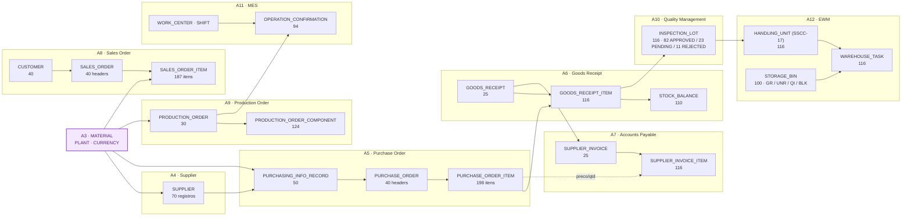

# A4 a A12: Fundação Transacional Completa do Industrial Data Universe

**🌐 Idioma / Language:** 🇧🇷 **Português** | [🇺🇸 English](../EN/04-a4-a12-transactional-data-foundation.en.md)

[⬆️ Voltar ao README](../../../README.md) | [⬅️ Cenário anterior: A3](./03-a3-dados-mestre-de-material.md)

> **Status:** ✅ Concluído e validado
> **Schema físico:** `INDUSTRIAL_DATA`
> **Documento:** `DOC 04` (consolidado — cobre A4 a A12 em um único documento, por decisão de escopo)
> **Classificação:** dados sintéticos exclusivamente educacionais

## 🎯 Visão executiva

A partir do A4, todos os cenários seguintes deixaram de ser documentados um a um. Depois de mapear A4 a A9, ficou claro que cada cenário era, na essência, a mesma operação — **criar tabelas + carregar dados determinísticos + amarrar por Foreign Key ao que já existia** — então a decisão foi consolidar A4 a A9 (e depois A10, A11 e A12, quando o escopo cresceu para QM, MES e EWM) num único documento, com o máximo de dados aplicados e o mínimo de burocracia de publicação.

Cada cenário foi entregue como um **mega-script SQL único** (`Datasets/<Domínio>/A<N>-COMPLETE-LOAD.sql`), gerado de forma determinística (Python com aritmética `MOD`, sem aleatoriedade) e executado diretamente no **SAP HANA Cloud Central → SQL Console**. Isso fechou, pela primeira vez no projeto, um ciclo de negócio ponta a ponta: **procure-to-pay** (compra → recebimento → fatura), **order-to-cash** (cliente → pedido de venda) e **manufatura** (ordem de produção → apontamento → qualidade → armazém).

| Cenário | Domínio SAP | O que foi construído |
|---|---|---|
| A4 | MM — Supplier | Fornecedor e tabelas de configuração de compras |
| A5 | MM — Purchasing | Purchasing Info Record + Pedido de Compra (header/item) |
| A6 | MM — Inventory | Recebimento de mercadoria + saldo de estoque |
| A7 | FI — Accounts Payable | Fatura do fornecedor (3-way match PO + GR + Invoice) |
| A8 | SD — Sales | Cliente + Pedido de Venda (produtos acabados) |
| A9 | PP — Production | Ordem de Produção + componentes (BOM consumido) |
| A10 | QM — Quality | Lote de inspeção + Decisão de Uso (UD) |
| A11 | PP/MES — Shop Floor | Centro de trabalho + apontamento de operação |
| A12 | EWM — Warehouse | Bin, Handling Unit (SSCC-17) e tarefa de armazém |

> [!IMPORTANT]
> Todos os dados são fictícios. Nenhum fornecedor, cliente, material, preço ou identificador representa uma empresa real. Todos os valores são sintéticos e gerados deterministicamente.

---

## 🧭 Storytelling funcional

O A3 deixou o Material Master pronto, mas isolado: sabíamos o que a fábrica *poderia* comprar e vender, não *de quem* comprava, *para quem* vendia, nem *o que acontecia* fisicamente com o material depois que ele chegava. A4 a A12 preenchem exatamente essa lacuna, seguindo o fluxo real de uma operação industrial:

1. **A4** dá nome e organização aos fornecedores (`SUPPLIER`), com tipo, status e condição de pagamento.
2. **A5** formaliza o que cada fornecedor pode entregar e a que preço (`PURCHASING_INFO_RECORD`, estilo EINA/EINE do SAP), e a partir disso emite pedidos de compra (`PURCHASE_ORDER`) com quantidade variável de itens (1, 3, 5, 8 ou 11 por pedido — de propósito, para simular a realidade de que nem todo pedido é igual).
3. **A6** recebe fisicamente a mercadoria (`GOODS_RECEIPT`), com recebimento parcial em alguns itens (55%–100% do pedido), e atualiza o saldo de estoque agregado (`STOCK_BALANCE`).
4. **A7** fatura o que foi recebido, fazendo o 3-way match clássico (Pedido + Recebimento + Fatura), com status de pagamento variando entre pago, em aberto, vencido e em disputa.
5. **A8**, em paralelo, abre o lado da venda: 40 clientes fictícios comprando produtos acabados (`FG-*`) do catálogo do A3.
6. **A9** fecha o ciclo de manufatura: ordens de produção consomem componentes (`RM`/`EC`/`MC`/`SA`) via BOM e produzem produto acabado (`FG`).
7. **A10** resolve uma pergunta que o A6 deixava em aberto: **todo material recebido pode ser usado imediatamente?** Não — cada item recebido vira um lote de inspeção, com Decisão de Uso (`UD_CODE`) aprovada, rejeitada ou pendente.
8. **A11** entra no chão de fábrica: cada ordem de produção do A9 ganha apontamentos reais por operação, centro de trabalho e turno, com quantidade boa e refugo.
9. **A12** dá endereço físico a tudo isso: cada lote de inspeção do A10 vira uma Handling Unit de 17 dígitos (padrão SSCC), que é fisicamente movida (`WAREHOUSE_TASK`) para uma posição de armazém — **livre (UNR)** se aprovada, **bloqueada para inspeção (QI)** se pendente, ou **bloqueada (BLK)** se rejeitada.

O ponto de atenção deliberado no A12: a maioria do estoque (≈71%) **não fica represada esperando decisão de qualidade** — já nasce em posição livre, com UD fechada. Só a minoria (≈20%) fica em quarentena (QI) e uma fração menor (≈9%) é rejeitada (BLK). Isso reflete uma operação real, onde a maior parte do recebimento é aprovada rapidamente e só uma fração exige atenção.

---

## 🏗️ Arquitetura consolidada



---

## 📊 Tabelas, tipos de dados e volumes por cenário

### A4 — Supplier / Business Partner Foundation

| Tabela | Chave | Colunas / Tipos principais | Registros |
|---|---|---|---:|
| `PAYMENT_TERMS` | `ZTERM` NVARCHAR(10) | `ZTERM_TEXT` NVARCHAR(200) | 11 |
| `SUPPLIER_TYPE` | `SUPPLIER_TYPE_CODE` NVARCHAR(10) | `SUPPLIER_TYPE_TEXT`, `_DESC` | 4 |
| `SUPPLIER_STATUS` | `STATUS_CODE` NVARCHAR(10) | `STATUS_TEXT` | 3 |
| `SUPPLIER_RATING_SCALE` | `RATING_CODE` INT | `RATING_TEXT`, `_DESCRIPTION` | 5 |
| `SUPPLIER` | `LIFNR` NVARCHAR(10) | `LIFNR_TEXT`, `LIFNR_TYPE` (FK), `LIFNR_STATUS` (FK), `COUNTRY`, `CURRENCY` (FK A3), `PAYMENT_TERMS` (FK), `INCOTERM`, `QUALITY_CERTIFIED` CHAR(1), `LEAD_TIME_DAYS` INT (1–120), `MIN_ORDER_QTY` DECIMAL(15,2) | 70 |
| `SUPPLIER_PLANT` / `SUPPLIER_CONTACT` / `SUPPLIER_PURCHASING_ORG` / `SUPPLIER_RATING` | — | Estrutura criada com FKs completas, reservada para carga futura (sem dados nesta rodada) | 0 |

### A5 — Purchase Order Foundation

| Tabela | Chave | Colunas / Tipos principais | Registros |
|---|---|---|---:|
| `DOC_TYPE` | `DOC_TYPE_CODE` NVARCHAR(2) | NB / FO / ZC | 3 |
| `PO_STATUS` | `STATUS_CODE` NVARCHAR(10) | OPEN / RELEASED / CLOSED / CANCELLED | 4 |
| `PURCHASING_INFO_RECORD` | `INFO_RECORD_ID` INT IDENTITY | `LIFNR` (FK), `MATNR` (FK), `EKORG` (FK), `NET_PRICE` DECIMAL(15,2), `PRICE_UNIT` INT, `INFO_LEAD_TIME_DAYS` | 50 |
| `PURCHASE_ORDER` | `EBELN` NVARCHAR(10) | `LIFNR`, `EKORG`, `DOC_TYPE_CODE`, `STATUS_CODE`, `CURRENCY`, `PO_DATE` DATE, `ITEM_COUNT` INT | 40 |
| `PURCHASE_ORDER_ITEM` | `PO_ITEM_ID` INT IDENTITY | `EBELN` (FK), `ITEM_NO`, `MATNR` (FK), `WERKS` (FK), `QUANTITY`, `NET_PRICE` DECIMAL(15,2), `DELIVERY_DATE` | 198 |

Distribuição de itens por pedido (variedade proposital): 5 pedidos × 1 item · 12 × 3 · 12 × 5 · 8 × 8 · 3 × 11.

### A6 — Goods Receipt & Inventory

| Tabela | Chave | Colunas / Tipos principais | Registros |
|---|---|---|---:|
| `MOVEMENT_TYPE` | `MOVEMENT_TYPE_CODE` NVARCHAR(3) | 101 / 102 / 261 / 262 | 4 |
| `GOODS_RECEIPT` | `GR_ID` NVARCHAR(10) | `EBELN` (FK), `WERKS` (FK), `MOVEMENT_TYPE_CODE` (FK), `GR_DATE` | 25 |
| `GOODS_RECEIPT_ITEM` | `GR_ITEM_ID` INT IDENTITY | `GR_ID` (FK), `PO_ITEM_NO`, `MATNR` (FK), `WERKS` (FK), `QUANTITY_ORDERED`, `QUANTITY_RECEIVED`, `RECEIPT_PCT` DECIMAL(5,2), `BATCH_NO` | 116 |
| `STOCK_BALANCE` | `STOCK_ID` INT IDENTITY | `MATNR` (FK), `WERKS` (FK), `QUANTITY_ON_HAND` DECIMAL(15,2), `LAST_UPDATED` | 110 |

Só pedidos com status `RELEASED`/`CLOSED` geram recebimento (25 de 40). Recebimento variável: 70% dos itens = 100%, e 30% parcial (85% / 70% / 55%).

### A7 — Supplier Invoice / Accounts Payable

| Tabela | Chave | Colunas / Tipos principais | Registros |
|---|---|---|---:|
| `PAYMENT_STATUS` | `STATUS_CODE` NVARCHAR(10) | OPEN / PAID / OVERDUE / DISPUTED | 4 |
| `SUPPLIER_INVOICE` | `INVOICE_ID` NVARCHAR(10) | `EBELN` (FK), `GR_ID` (FK), `LIFNR` (FK), `INVOICE_DATE`, `DUE_DATE`, `TOTAL_AMOUNT` DECIMAL(15,2), `STATUS_CODE` (FK) | 25 |
| `SUPPLIER_INVOICE_ITEM` | `INVOICE_ITEM_ID` INT IDENTITY | `INVOICE_ID` (FK), `ITEM_NO`, `MATNR` (FK), `QUANTITY_INVOICED`, `UNIT_PRICE`, `AMOUNT` | 116 |

3-way match: quantidade faturada = quantidade recebida no A6; preço = preço do item do A5.

### A8 — Sales Order Foundation

| Tabela | Chave | Colunas / Tipos principais | Registros |
|---|---|---|---:|
| `SALES_DOC_TYPE` | `SALES_DOC_TYPE_CODE` NVARCHAR(2) | OR / RE / CS | 3 |
| `CUSTOMER` | `KUNNR` NVARCHAR(10) | `KUNNR_TEXT`, `COUNTRY`, `CURRENCY` (FK), `CREDIT_LIMIT` DECIMAL(15,2) | 40 |
| `SALES_ORDER` | `VBELN` NVARCHAR(10) | `KUNNR` (FK), `WERKS` (FK), `SALES_DOC_TYPE_CODE` (FK), `ORDER_DATE`, `ITEM_COUNT` | 40 |
| `SALES_ORDER_ITEM` | `SO_ITEM_ID` INT IDENTITY | `VBELN` (FK), `ITEM_NO`, `MATNR` (FK, só `FG-*`), `QUANTITY`, `NET_PRICE`, `SHIP_DATE` | 187 |

### A9 — Production Order / MRP

| Tabela | Chave | Colunas / Tipos principais | Registros |
|---|---|---|---:|
| `PRODUCTION_ORDER_STATUS` | `STATUS_CODE` NVARCHAR(10) | CRTD / REL / CNF / TECO | 4 |
| `PRODUCTION_ORDER` | `AUFNR` NVARCHAR(10) | `MATNR` (FK, produto acabado), `WERKS` (FK), `STATUS_CODE` (FK), `QUANTITY_PLANNED`, `QUANTITY_CONFIRMED`, `START_DATE`, `FINISH_DATE` | 30 |
| `PRODUCTION_ORDER_COMPONENT` | `COMPONENT_ID` INT IDENTITY | `AUFNR` (FK), `COMPONENT_NO`, `COMPONENT_MATNR` (FK, `RM`/`EC`/`MC`/`SA`), `QUANTITY_REQUIRED`, `QUANTITY_CONSUMED` | 124 |

Variedade de BOM por ordem: 10 ordens × 3 componentes · 10 × 4 · 6 × 5 · 4 × 6.

### A10 — Quality Management

| Tabela | Chave | Colunas / Tipos principais | Registros |
|---|---|---|---:|
| `INSPECTION_TYPE` | `INSPECTION_TYPE_CODE` NVARCHAR(2) | 01 / 04 / 08 | 3 |
| `UD_CODE` | `UD_CODE` NVARCHAR(10) | APPROVED / REJECTED / PENDING | 3 |
| `INSPECTION_LOT` | `LOT_ID` NVARCHAR(12) | `GR_ID` (FK A6), `MATNR` (FK), `WERKS` (FK), `INSPECTION_TYPE_CODE` (FK), `LOT_QUANTITY`, `UD_CODE` (FK), `CREATED_DATE`, `UD_DATE` (nulo se pendente) | 116 |

Distribuição de UD: **82 APPROVED (71%) · 23 PENDING (20%) · 11 REJECTED (9%)** — 1 lote por item recebido no A6.

### A11 — MES (Manufacturing Execution)

| Tabela | Chave | Colunas / Tipos principais | Registros |
|---|---|---|---:|
| `SHIFT` | `SHIFT_CODE` NVARCHAR(2) | A (manhã) / B (tarde) / C (noite) | 3 |
| `WORK_CENTER` | `WORK_CENTER_ID` NVARCHAR(6) | `WORK_CENTER_TEXT`, `WERKS` (FK) | 10 |
| `OPERATION_CONFIRMATION` | `CONFIRMATION_ID` INT IDENTITY | `AUFNR` (FK A9), `OPERATION_NO`, `OPERATION_TEXT`, `WORK_CENTER_ID` (FK), `SHIFT_CODE` (FK), `QUANTITY_GOOD`, `QUANTITY_SCRAP`, `SETUP_TIME_MIN`, `RUN_TIME_MIN`, `CONFIRMATION_DATE` | 94 |

Número de operações por ordem varia com o status: `CRTD` = 0, `REL` = 2, `CNF`/`TECO` = 3 a 5.

### A12 — EWM (Extended Warehouse Management)

| Tabela | Chave | Colunas / Tipos principais | Registros |
|---|---|---|---:|
| `WAREHOUSE_NUMBER` | `WAREHOUSE_ID` NVARCHAR(4) | `WAREHOUSE_TEXT` | 1 |
| `STORAGE_TYPE` | `STORAGE_TYPE_CODE` NVARCHAR(4) | GR / UNR / QI / BLK | 4 |
| `STORAGE_BIN` | `BIN_ID` NVARCHAR(15) | `WAREHOUSE_ID` (FK), `WERKS` (FK), `STORAGE_TYPE_CODE` (FK), `AISLE`, `BIN_LEVEL` | 100 |
| `HANDLING_UNIT` | `HU_ID` NVARCHAR(17) — **SSCC-17** | `MATNR` (FK), `WERKS` (FK), `LOT_ID` (FK A10), `QUANTITY`, `CREATED_DATE` | 116 |
| `WAREHOUSE_TASK` | `TASK_ID` INT IDENTITY | `HU_ID` (FK), `SOURCE_BIN_ID` (FK), `DEST_BIN_ID` (FK), `TASK_STATUS` (OPEN/CONFIRMED), `TASK_DATE` | 116 |

Posicionamento amarrado à decisão de UD do A10: `APPROVED → UNR` (livre, `CONFIRMED`) · `PENDING → QI` (bloqueado p/ inspeção, `OPEN`) · `REJECTED → BLK` (bloqueado, `CONFIRMED`).

---

## 📐 Por que EWM e não WM clássico

O armazém (A12) foi modelado com conceitos de **EWM**, não do WM clássico do SAP ERP — decisão deliberada, documentada aqui porque impacta a nomenclatura usada no restante do repositório (badges, roadmap, domínios funcionais).

- **Handling Unit (HU) de 17 dígitos**: no EWM, toda movimentação de estoque é gerenciada por HU por padrão, identificada por um código no padrão **SSCC** (Serial Shipping Container Code) — é essa a origem do identificador de 17 dígitos usado em `HANDLING_UNIT.HU_ID`. No WM clássico, HU existia apenas como add-on (LE-HU), não como conceito nativo.
- **WM está em fim de vida** no roadmap SAP: no S/4HANA, a recomendação é migrar para EWM (operações complexas) ou Stock Room Management / Basic Warehouse (operações simples). Não há novo desenvolvimento recomendado sobre WM clássico.
- **Trade-off aceito**: EWM exige mais camadas de master data (Warehouse Number → Storage Type → Storage Bin) do que o WM clássico exigiria para o mesmo resultado. Optamos por essa complexidade adicional porque é o que reflete o mercado atual.

---

## 📈 Reconciliação final

| Cenário | Tabelas novas | Registros carregados |
|---|---:|---:|
| A4 | 9 (4 config + 5 estrutura Supplier) | 93 |
| A5 | 5 | 295 |
| A6 | 4 | 255 |
| A7 | 3 | 145 |
| A8 | 4 | 270 |
| A9 | 3 | 158 |
| A10 | 3 | 122 |
| A11 | 3 | 107 |
| A12 | 5 | 337 |
| **Total A4–A12** | **39 tabelas** | **≈ 1.782 registros** |

Somado ao baseline do A3 (6.066 registros), o `INDUSTRIAL_DATA` schema fecha esta fase com **≈ 7.848 registros** distribuídos por todo o ciclo procure-to-pay, order-to-cash, manufatura, qualidade e armazém.

---

## 🗂️ Onde estão os scripts

Cada cenário vive em um único arquivo SQL autocontido (DROP → CREATE → INSERT → validação), sem dependência de ferramentas externas — só copiar e colar no **Cloud Central → SQL Console**:

```text
Industrial-Data-Universe/Datasets/
├── Supplier/A4-COMPLETE-LOAD.sql
├── PurchaseOrder/A5-COMPLETE-LOAD.sql
├── Inventory/A6-COMPLETE-LOAD.sql
├── AccountsPayable/A7-COMPLETE-LOAD.sql
├── SalesOrder/A8-COMPLETE-LOAD.sql
├── Production/A9-COMPLETE-LOAD.sql
├── QualityManagement/A10-COMPLETE-LOAD.sql
├── MES/A11-COMPLETE-LOAD.sql
└── EWM/A12-COMPLETE-LOAD.sql
```

> Na primeira execução de cada script, os `DROP TABLE ... CASCADE` do início falham com "table not found" (esperado — nada existia antes). Usar **Skip All** no Cloud Central e seguir; `CREATE`/`INSERT`/validação executam normalmente.

---

[⬆️ Voltar ao README](../../../README.md) | [⬅️ Cenário anterior: A3](./03-a3-dados-mestre-de-material.md)
