# A1: Relational Data Foundation in SAP HANA Cloud

---

**🌐 Language / Idioma:** [🇧🇷 Português](../BR/01-a1-fundacao-de-dados-relacionais.md) | 🇺🇸 **English**

---

[⬆️ Back to README](../../../README.en.md) | [➡️ A2: SAP Enterprise Structure](./02-a2-sap-enterprise-structure.en.md)

---

## 🎯 Executive overview

A1 establishes the project's first technical and functional foundation. The goal was not to create disconnected tables, but to represent the journey of a global material extended to different Plants, assigned Plant-specific procurement and MRP parameters, and made available in multiple Storage Locations.

The scenario started with relational modeling and evolved into a governed synthetic-data universe. Five `COLUMN` tables now store **3,715 records**, with **zero orphans**, **zero duplicate keys**, and traceability across Blueprint, generators, files, manifest, SQL scripts, and SAP HANA Cloud results.

---

> [!IMPORTANT]
> The entire universe is fictional and educational. No real company data was used.

---

## 🧭 Industrial storytelling

A fictional company operates 20 manufacturing, logistics, and specialized Plants. Its material catalog is global, while operational strategy changes by location. A component may be externally procured in one Plant, consumption-based planned in another, and available in component, production, or inspection areas.

The model must answer which material exists, where it is extended, which parameters apply by Plant, which Storage Locations belong to the Plant, and in which combinations the material is active.

This story guides all five entities and prevents the dataset from becoming a random collection of records.

---

## 🎓 Objectives

- create schemas and Column Store tables;
- model global and Plant-dependent attributes;
- apply simple, composite, and three-column PKs;
- apply simple and composite FKs;
- validate constraints through catalog and behavior;
- generate deterministic seeded data;
- validate positive and negative cases;
- load data according to dependency order;
- audit volume, integrity, uniqueness, and distribution.

---

## 🏗️ Architecture and pipeline

```mermaid
flowchart LR
 BP["Blueprint v1"]:::blue --> CFG["Config + Contract + Rules"]:::yellow --> GEN["Foundation Generator"]:::purple
 GEN --> V["Valid CSVs"]:::green
 GEN --> N["Negative Tests"]:::red
 V --> VE{"Validation Engine"}:::decision
 N --> VE
 VE -->|PASSED| MAN["Manifest + SHA-256"]:::green --> SQL["SQL Load Generator"]:::purple --> H[("SAP HANA Cloud LAB_A1")]:::hana
 H --> AUD["Post-load Audits"]:::green
 classDef blue fill:#E8F1FF,stroke:#2563EB,color:#123A70,stroke-width:2px;
 classDef yellow fill:#FFF3D8,stroke:#F59E0B,color:#8A4B00,stroke-width:2px;
 classDef purple fill:#F3E8FF,stroke:#9333EA,color:#581C87,stroke-width:2px;
 classDef green fill:#E7F8EC,stroke:#16A34A,color:#14532D,stroke-width:2px;
 classDef red fill:#FFF1F2,stroke:#E11D48,color:#881337,stroke-width:2px;
 classDef decision fill:#FCE7F3,stroke:#DB2777,color:#831843,stroke-width:2px;
 classDef hana fill:#E0F2FE,stroke:#0284C7,color:#0C4A6E,stroke-width:3px;
```

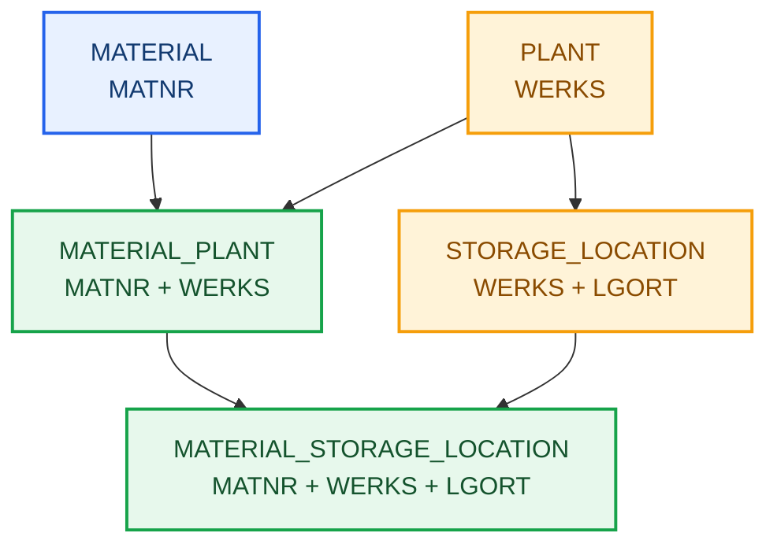

---

## 🧩 Physical model

| Entity | Grain | Primary Key | Final records |
|---|---|---|---:|
| `PLANT` | plant | `WERKS` | 20 |
| `MATERIAL` | global material | `MATNR` | 300 |
| `STORAGE_LOCATION` | Plant storage location | `WERKS + LGORT` | 152 |
| `MATERIAL_PLANT` | material at Plant | `MATNR + WERKS` | 1,080 |
| `MATERIAL_STORAGE_LOCATION` | material at storage location | `MATNR + WERKS + LGORT` | 2,163 |

---

## 1. Structural foundation and progressive validation

---

### Schema and parent tables

---

#### 01. LAB_A1 schema created

The dedicated schema isolates this laboratory from other experiments. Every following object uses the qualified `LAB_A1` name, avoiding dependency on current schema `DBADMIN`.

```sql
CREATE SCHEMA LAB_A1;
```


The validated result made it possible to proceed to the next dependency without manually editing the approved dataset.

---

#### 02. MATERIAL table created

`MATERIAL` was designed as a global catalog. `MATNR` identifies the material, while description, type, group, and base unit remain Plant-independent.

```sql
CREATE COLUMN TABLE LAB_A1.MATERIAL (
 MATNR NVARCHAR(40) NOT NULL,
 DESCRIPTION NVARCHAR(100) NOT NULL,
 MTART NVARCHAR(4) NOT NULL,
 MATKL NVARCHAR(9) NOT NULL,
 MEINS NVARCHAR(3) NOT NULL,
 PRIMARY KEY (MATNR)
);
```


The validated result made it possible to proceed to the next dependency without manually editing the approved dataset.

---

#### 03. MATERIAL structure confirmed

Database Objects confirmed Column Store, five required fields, and `MATNR` as the first key. The physical catalog matched the DDL.


The validated result made it possible to proceed to the next dependency without manually editing the approved dataset.

---

#### 04. PLANT table created

`PLANT` introduced the organizational level. Every Plant is multifunctional; its name indicates a dominant profile without excluding receiving, quality, production, inventory, or shipping.

```sql
CREATE COLUMN TABLE LAB_A1.PLANT (
 WERKS NVARCHAR(4) NOT NULL,
 PLANT_NAME NVARCHAR(100) NOT NULL,
 COUNTRY NVARCHAR(3) NOT NULL,
 PRIMARY KEY (WERKS)
);
```


The validated result made it possible to proceed to the next dependency without manually editing the approved dataset.

---

#### 05. PLANT structure confirmed

The catalog confirmed `WERKS` as the unique key and the descriptive attributes required by the synthetic dataset.


The validated result made it possible to proceed to the next dependency without manually editing the approved dataset.

---

### Storage Location and referential integrity

---

#### 06. STORAGE_LOCATION created

`STORAGE_LOCATION` represents Plant-dependent storage locations. `LGORT` alone is not globally unique.

```sql
CREATE COLUMN TABLE LAB_A1.STORAGE_LOCATION (
 WERKS NVARCHAR(4) NOT NULL,
 LGORT NVARCHAR(4) NOT NULL,
 STORAGE_LOCATION_NAME NVARCHAR(100) NOT NULL,
 PRIMARY KEY (WERKS, LGORT)
);
```


The validated result made it possible to proceed to the next dependency without manually editing the approved dataset.

---

#### 07. STORAGE_LOCATION composite PK

Inspection confirmed `WERKS` as Key 1 and `LGORT` as Key 2. One `LGORT` may therefore exist across different Plants, but never twice within the same Plant.


The validated result made it possible to proceed to the next dependency without manually editing the approved dataset.

---

#### 08. Storage Location to Plant FK

The Foreign Key turned the conceptual relationship into a physical rule: every storage location must reference an existing Plant.

```sql
ALTER TABLE LAB_A1.STORAGE_LOCATION
ADD CONSTRAINT FK_STORAGE_LOCATION_PLANT
FOREIGN KEY (WERKS) REFERENCES LAB_A1.PLANT (WERKS);
```


The validated result made it possible to proceed to the next dependency without manually editing the approved dataset.

---

#### 09. FK validated in catalog

`SYS.REFERENTIAL_CONSTRAINTS` confirmed the constraint and referenced object. Joule supported exploration, while the catalog remained the technical proof.


The validated result made it possible to proceed to the next dependency without manually editing the approved dataset.

---

#### 10. Parent record inserted

Fictional Plant `1000` was inserted as a parent record to test referential integrity behavior.

```sql
INSERT INTO LAB_A1.PLANT (WERKS, PLANT_NAME, COUNTRY)
VALUES ('1000', 'Manufacturing Plant Alpha', 'BRA');
COMMIT;
```


The validated result made it possible to proceed to the next dependency without manually editing the approved dataset.

---

#### 11. Valid child record

Storage location `1000/0001` was accepted because its Parent Key existed. The Foreign Key protects data without blocking valid operations.

```sql
INSERT INTO LAB_A1.STORAGE_LOCATION (WERKS, LGORT, STORAGE_LOCATION_NAME)
VALUES ('1000', '0001', 'Raw Materials');
COMMIT;
```


The validated result made it possible to proceed to the next dependency without manually editing the approved dataset.

---

#### 12. Orphan record rejected

The `9999/0001` attempt was rejected by SAP HANA. Orphan protection worked during writes, not only in the conceptual design.

```sql
INSERT INTO LAB_A1.STORAGE_LOCATION (WERKS, LGORT, STORAGE_LOCATION_NAME)
VALUES ('9999', '0001', 'Orphan Storage Location');
```


The validated result made it possible to proceed to the next dependency without manually editing the approved dataset.

---

### Material by Plant

---

#### 13. MATERIAL_PLANT created

`MATERIAL_PLANT` resolved the N:N relationship and stored Plant-dependent `PROCUREMENT_TYPE` and `MRP_TYPE`.

```sql
CREATE COLUMN TABLE LAB_A1.MATERIAL_PLANT (
 MATNR NVARCHAR(40) NOT NULL,
 WERKS NVARCHAR(4) NOT NULL,
 PROCUREMENT_TYPE NVARCHAR(1) NOT NULL,
 MRP_TYPE NVARCHAR(2) NOT NULL,
 PRIMARY KEY (MATNR, WERKS),
 CONSTRAINT FK_MATERIAL_PLANT_MATERIAL FOREIGN KEY (MATNR) REFERENCES LAB_A1.MATERIAL (MATNR),
 CONSTRAINT FK_MATERIAL_PLANT_PLANT FOREIGN KEY (WERKS) REFERENCES LAB_A1.PLANT (WERKS)
);
```


The validated result made it possible to proceed to the next dependency without manually editing the approved dataset.

---

#### 14. MATERIAL_PLANT PK

The `MATNR + WERKS` key guarantees one material extension per Plant.


The validated result made it possible to proceed to the next dependency without manually editing the approved dataset.

---

#### 15. MATERIAL_PLANT FKs

Both FKs confirmed that every extension depends on a global material and a valid Plant.


The validated result made it possible to proceed to the next dependency without manually editing the approved dataset.

---

### Material by storage location

---

#### 16. MATERIAL_STORAGE_LOCATION created

`MATERIAL_STORAGE_LOCATION` completed storage-level detail and added `STORAGE_STATUS` for active and inactive assignments.

```sql
CREATE COLUMN TABLE LAB_A1.MATERIAL_STORAGE_LOCATION (
 MATNR NVARCHAR(40) NOT NULL,
 WERKS NVARCHAR(4) NOT NULL,
 LGORT NVARCHAR(4) NOT NULL,
 STORAGE_STATUS NVARCHAR(1) NOT NULL,
 PRIMARY KEY (MATNR, WERKS, LGORT),
 CONSTRAINT FK_MAT_SLOC_MATERIAL_PLANT FOREIGN KEY (MATNR, WERKS) REFERENCES LAB_A1.MATERIAL_PLANT (MATNR, WERKS),
 CONSTRAINT FK_MAT_SLOC_STORAGE_LOCATION FOREIGN KEY (WERKS, LGORT) REFERENCES LAB_A1.STORAGE_LOCATION (WERKS, LGORT)
);
```


The validated result made it possible to proceed to the next dependency without manually editing the approved dataset.

---

#### 17. Three-column PK

The three-column `MATNR + WERKS + LGORT` PK exactly represents the entity grain.


The validated result made it possible to proceed to the next dependency without manually editing the approved dataset.

---

#### 18. Composite FKs validated

Composite FKs guarantee a valid Material × Plant and a Storage Location belonging to the same Plant. The structural foundation was complete.


The validated result made it possible to proceed to the next dependency without manually editing the approved dataset.

---

### Industrial Data Universe and load preparation

---

#### 19. Tables cleared before load

Both manual test records were removed in child-to-parent order. All five tables were empty before the full load.

```sql
DELETE FROM LAB_A1.STORAGE_LOCATION WHERE WERKS = '1000' AND LGORT = '0001';
DELETE FROM LAB_A1.PLANT WHERE WERKS = '1000';
```

The Blueprint remains outside the LAB because it governs the entire project. Config, Contract, and Rules were promoted to `APPROVED`; the Validation Engine returned `PASSED`.

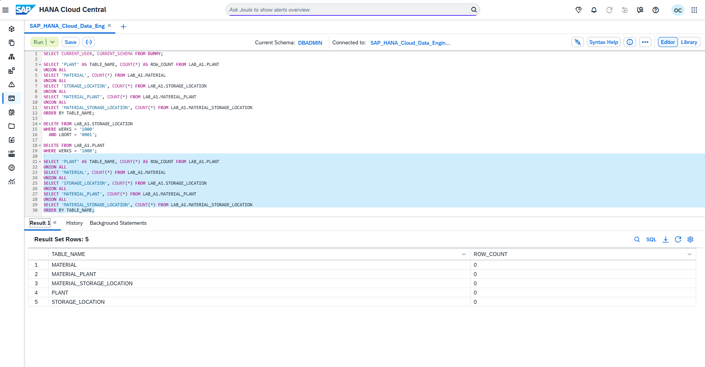

The validated result made it possible to proceed to the next dependency without manually editing the approved dataset.

---

#### 20. Import source evaluated

Import and Export was explored, but the environment exposed Data Lake Files as source. A1 adopted generated SQL and reserved cloud storage for Data Engineering.

The decision does not abandon Data Lake Files. The method will be practiced in a dedicated Data Engineering scenario covering staging, credentials, endpoint, monitoring, and background loading.

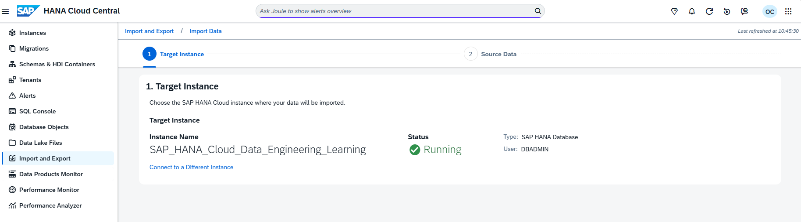

The validated result made it possible to proceed to the next dependency without manually editing the approved dataset.

---

### Controlled loading

---

#### 21. 20 Plants loaded

`PLANT` loaded first because it is a parent table. `COMMIT` and `COUNT(*)` confirmed 20 records.

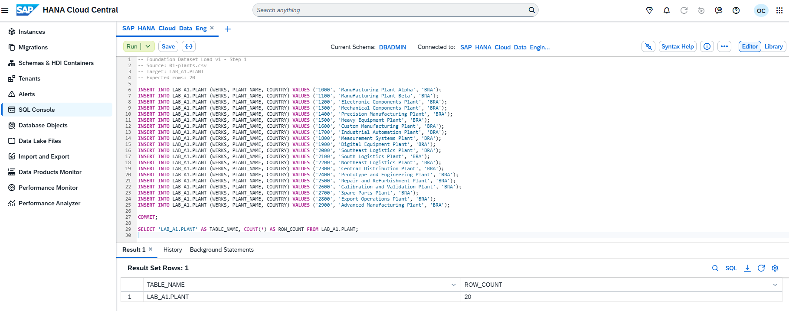

The validated result made it possible to proceed to the next dependency without manually editing the approved dataset.

---

#### 22. 300 Materials loaded

`MATERIAL` received 300 records across six families: raw materials, components, semifinished assemblies, finished goods, and packaging.

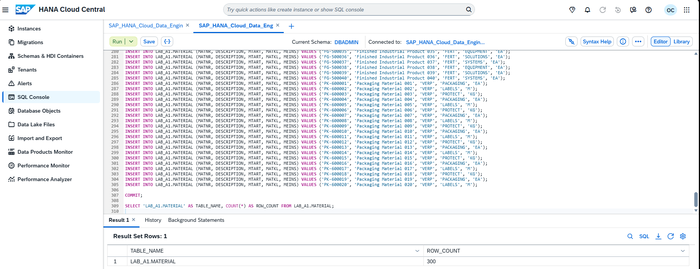

The validated result made it possible to proceed to the next dependency without manually editing the approved dataset.

---

#### 23. 152 storage locations loaded

All 152 storage locations found their Plants and materialized manufacturing, logistics, engineering, repair, and quality templates.

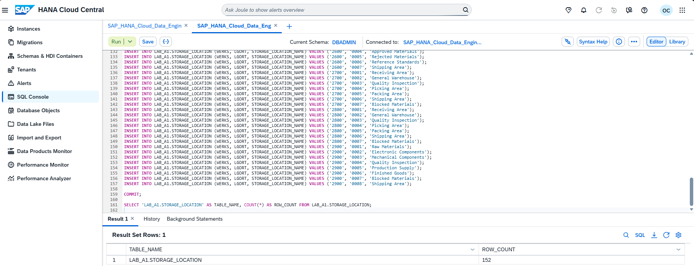

The validated result made it possible to proceed to the next dependency without manually editing the approved dataset.

---

#### 24. 1,080 Material Plant extensions

All 1,080 extensions respected `MATERIAL` and `PLANT`. Procurement and MRP now vary by Plant.

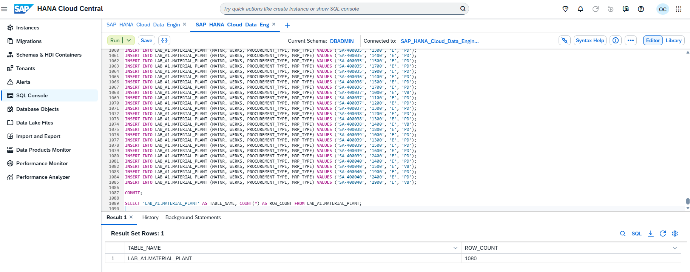

The validated result made it possible to proceed to the next dependency without manually editing the approved dataset.

---

#### 25. 2,163 Material Storage Location extensions

The 2,163-row load satisfied two composite relationships simultaneously and completed Material × Plant × Storage Location.

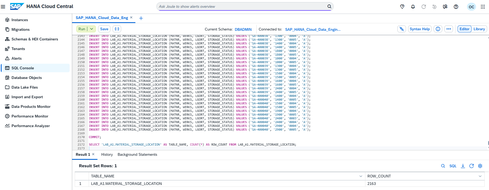

The validated result made it possible to proceed to the next dependency without manually editing the approved dataset.

---

### Post-load audit

---

#### 26. Final counts

HANA counts matched CSV files, generator output, and manifest. The persisted total was 3,715 records.

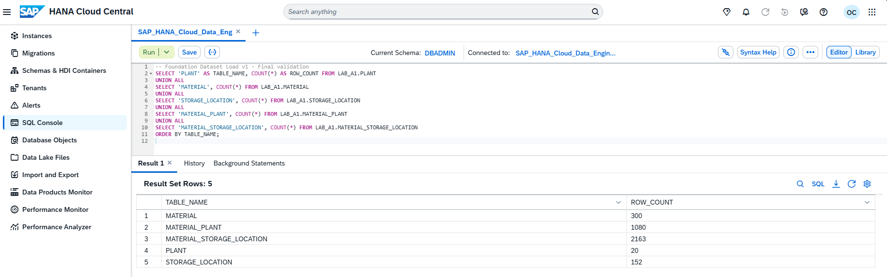

The validated result made it possible to proceed to the next dependency without manually editing the approved dataset.

---

#### 27. Zero orphan records

Five LEFT JOIN checks returned `ERROR_COUNT = 0`, proving no broken simple or composite relationship.

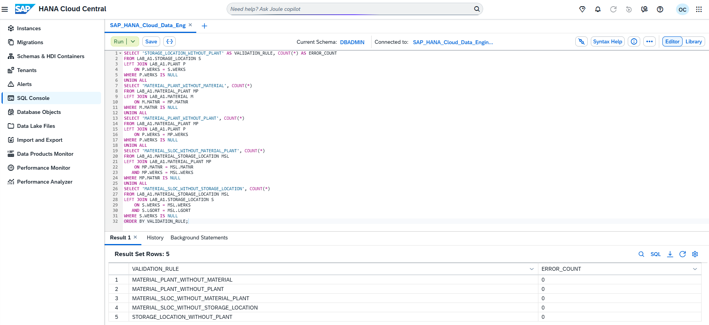

The validated result made it possible to proceed to the next dependency without manually editing the approved dataset.

---

#### 28. Zero duplicate PKs

Five GROUP BY and HAVING audits returned zero duplicates across simple, composite, and three-column PKs.

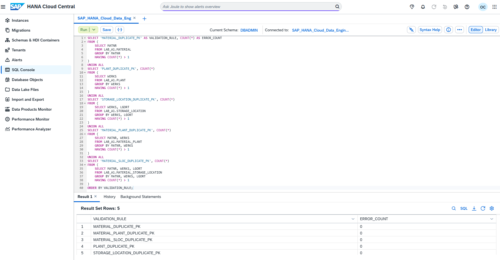

The validated result made it possible to proceed to the next dependency without manually editing the approved dataset.

---

#### 29. End-to-end JOIN

The JOIN integrated material, type, group, unit, Plant, procurement, MRP, storage location, and status in one industrial view.

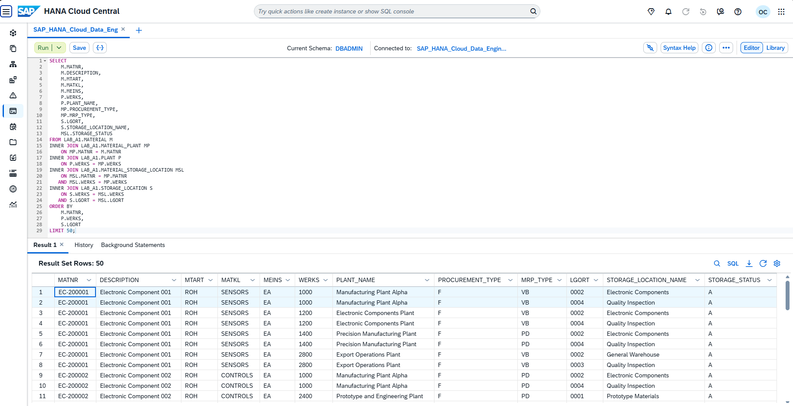

The validated result made it possible to proceed to the next dependency without manually editing the approved dataset.

---

#### 30. Distribution by Plant

Aggregation returned 20 Plants and reconciled 1,080 Plant extensions, 152 storage locations, 2,163 assignments, 2,066 active, and 97 inactive.

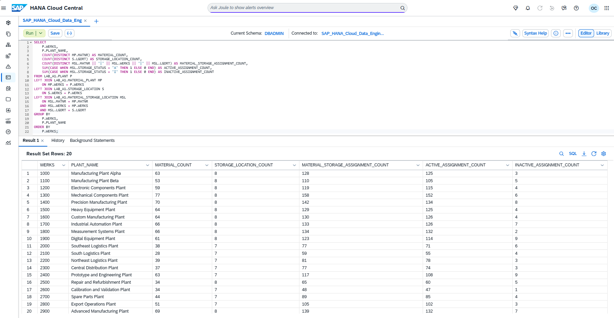

---

## 2. Industrial Data Universe in detail

The cross-scenario structure separates responsibilities:

| Area | Responsibility |
|---|---|
| `Blueprint/` | conceptual universe and roadmap |
| `Config/` | seed, volumes, and load order |
| `Schemas/` | contract and validation rules |
| `Generators/` | generation, validation, and SQL load |
| `Datasets/Valid/` | approved data |
| `Datasets/Invalid/` | controlled failures |
| `Datasets/Load/` | SQL derived from CSV files |
| `Datasets/Validation/` | manifest, report, and audits |

Seed `20260903` makes generation reproducible. Negative tests validate duplicates and orphans without contaminating valid data. The manifest records SHA-256 and prevents a changed file from silently being treated as the same version.

---

## 3. Final reconciliation

| Control | Result |
|---|---|
| Config, Contract, and Rules | `APPROVED` |
| Validation Engine | `PASSED` |
| Persisted records | 3,715 |
| Orphans | 0 |
| Duplicate PKs | 0 |
| Active assignments | 2,066 |
| Inactive assignments | 97 |
| Evidence | 30 PNG files |

---

## 4. Best practices and production

### Applied in the laboratory

- dedicated schema and qualified names;
- separation of global and Plant-dependent data;
- database-enforced constraints;
- positive and negative tests;
- independent generator and validator;
- seed, manifest, and hashes;
- dependency-ordered loading;
- independent post-load audit.

### Production recommendations

- do not use `DBADMIN` for applications;
- adopt least-privilege users;
- use HDI Containers for CAP applications;
- use staging and bulk loading for large volumes;
- automate migrations and reconciliation;
- apply observability, retry, and idempotency;
- version contracts and control lineage;
- run regression whenever the Blueprint changes.

---

## 5. Troubleshooting

| Symptom | Cause | Solution |
|---|---|---|
| Stopped instance | Free Tier in `Stopped` | Start and wait for `Running` |
| FK not visible under Columns | Constraint is stored in catalog | Query `SYS.REFERENTIAL_CONSTRAINTS` |
| Orphan record rejected | Missing Parent Key | Correct order and load parent |
| Wizard has no local upload | Source requires Data Lake Files | SQL in A1; cloud storage in proper block |
| PK collision | Existing manual records | Clear child before parent |
| Python interpreted by PowerShell | Code pasted into shell | Save `.py` and execute with `python` |
| Python cache | `py_compile` created `.pyc` | Remove and keep `.gitignore` |

---

## 6. Official references

- [SAP HANA Cloud Administration Guide](https://help.sap.com/docs/hana-cloud/sap-hana-cloud-administration-guide)
- [SAP HANA Cloud SQL Reference](https://help.sap.com/docs/hana-cloud-database/sap-hana-cloud-sap-hana-database-sql-reference-guide)
- [Importing and Exporting Data](https://help.sap.com/docs/hana-cloud-database/sap-hana-cloud-sap-hana-database-administration-guide/importing-and-exporting-data)
- [Defining and Assigning Plants](https://learning.sap.com/courses/cross-functional-customizing-in-sap-s-4hana-materials-management/defining-and-assigning-plants)
- [Customizing Storage Locations](https://learning.sap.com/courses/exploring-basic-data-for-manufacturing-and-product-management-in-sap-s-4hana/customizing-storage-location)

---

## 🚀 Next scenario

[A2: SAP Enterprise Structure](./02-a2-sap-enterprise-structure.en.md) continues the block and restarts evidence numbering under `Evidences/LAB_A2/`. Before execution, the live README must be read to revalidate the scenario.

---

## 👤 Author and contact

### Orlando dos Santos Caetano

[](https://www.linkedin.com/in/orlando-caetano/)
[](https://github.com/OrlandoCaetano2026)

        

---

[⬆️ Back to README](../../../README.en.md) | [➡️ A2: SAP Enterprise Structure](./02-a2-sap-enterprise-structure.en.md)
