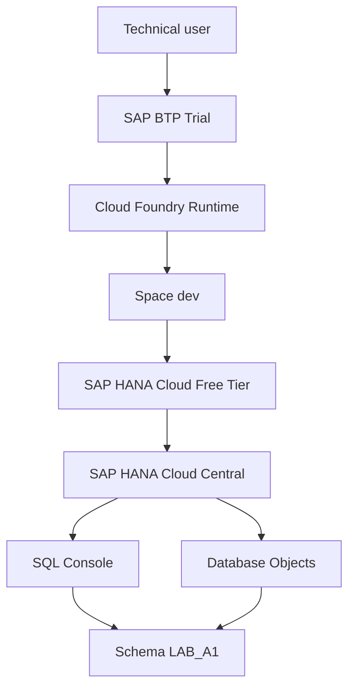
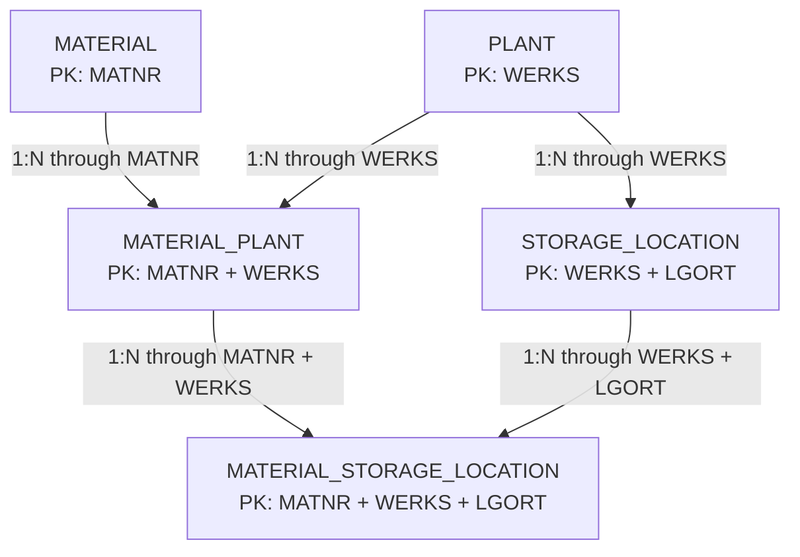

# A1: Relational Data Foundation in SAP HANA Cloud

**🌐 Language / Idioma:** [🇧🇷 Português](./01-a1-relational-data-foundation.md) | 🇺🇸 **English**

> **Status:** ✅ Completed  
> **Block:** A, Data & SAP/MES Master Data Foundation  
> **Scenario:** A1, Relational Data Foundation  
> **Platform:** SAP BTP Trial, Cloud Foundry, and SAP HANA Cloud Free Tier  
> **Schema:** `LAB_A1`  
> **Evidence:** `Evidences/LAB_A1/`

[⬆️ Back to the English README](../README.en.md) | [➡️ Next document: Dataset Design, Validation and Loading](./02-a1-dataset-design-validation-and-loading.en.md)

---

## 📑 Contents

- [Executive overview](#-executive-overview)
- [Scenario storytelling](#-scenario-storytelling)
- [Learning objectives](#-learning-objectives)
- [Scope and boundaries](#-scope-and-boundaries)
- [Architecture](#️-architecture)
- [Technical foundations](#-technical-foundations)
- [Implemented relational model](#-implemented-relational-model)
- [Active configuration](#️-active-configuration)
- [Step-by-step implementation](#-step-by-step-implementation)
- [Integrity tests](#-integrity-tests)
- [Evidence](#-evidence)
- [Validation matrix](#-validation-matrix)
- [Troubleshooting](#-troubleshooting)
- [Best practices and production recommendations](#-best-practices-and-production-recommendations)
- [Next steps](#-next-steps)
- [Official references](#-official-references)
- [Author](#-author)

---

## 🎯 Executive overview

Scenario A1 establishes the first relational foundation of the **SAP_HANA_Cloud_Data_Engineering_Learning** project. The laboratory uses industrial concepts inspired by SAP while relying exclusively on educational structures and fictional data.

The implementation demonstrates how a global material entity can be related to specific plants and storage locations while preserving organizational levels and enforcing data integrity through Primary Keys and Foreign Keys.

Five `COLUMN` tables were created in the `LAB_A1` schema:

1. `MATERIAL`
2. `PLANT`
3. `STORAGE_LOCATION`
4. `MATERIAL_PLANT`
5. `MATERIAL_STORAGE_LOCATION`

The laboratory also functionally verified referential integrity. A storage location assigned to fictional plant `1000` was accepted, while another assigned to nonexistent plant `9999` was rejected by SAP HANA Cloud with a Foreign Key error.

> [!IMPORTANT]
> All names, codes, descriptions, records, and scenarios in this laboratory are fictional. The model uses terminology inspired by the SAP ecosystem for educational purposes and does not fully reproduce physical SAP ERP or SAP S/4HANA tables.

---

## 🏭 Scenario storytelling

An industrial organization may manage the same material in different organizational contexts. A global code identifies the product, while planning and procurement parameters may vary by plant. Within each plant, the material may also be made available in specific storage locations.

The scenario represents this progression:

```text
Global material
      ↓
Extension to one or more plants
      ↓
Availability in valid storage locations of the plant
```

Conceptual example:

```text
MAT-100001
├── Plant 1000
│   ├── Storage Location 0001
│   └── Storage Location 0002
└── Plant 2000
    ├── Storage Location 0001
    └── Storage Location 0005
```

The same storage location code may exist in different plants. Therefore, `LGORT` alone does not identify a storage location. Identification depends on the `WERKS + LGORT` combination.

---

## 🧭 Learning objectives

A1 provided hands-on practice with:

- database, schema, table, column, and row;
- object namespaces through schemas;
- `COLUMN TABLE` in SAP HANA Cloud;
- `NVARCHAR` and Unicode data;
- `NOT NULL`;
- simple Primary Keys;
- composite Primary Keys;
- simple Foreign Keys;
- composite Foreign Keys;
- referential integrity;
- `1:N` and `N:N` cardinalities;
- associative entities;
- object creation and modification with DDL;
- basic insertion and querying with DML;
- inspection using Database Objects;
- catalog validation through `SYS.REFERENTIAL_CONSTRAINTS`;
- positive and controlled negative testing.

---

## 📌 Scope and boundaries

### Included

- material relational foundation;
- plant and storage location;
- Material × Plant extension;
- Material × Plant × Storage Location extension;
- structural constraints;
- minimum manual data required to verify the Foreign Key.

### Excluded from this document

- complete data loading;
- CSV generation;
- approximately 20 fictional plants;
- stock quantities;
- material movements;
- batches, valuation, detailed MRP, or complete Material Master parameters;
- HDI Container and database-as-code.

Dataset generation, validation, and loading will be covered separately in [DOC 02: Dataset Design, Validation and Loading](./02-a1-dataset-design-validation-and-loading.en.md), with dedicated evidence under `Evidences/LAB_02/` and numbering restarted at `01`.

---

## 🏗️ Architecture

### Platform architecture



### Overall relational architecture



### Functional view

```text
MATERIAL
   │
   ├── MATERIAL_PLANT ───────── PLANT
   │                                │
   │                                └── STORAGE_LOCATION
   │
   └── MATERIAL_STORAGE_LOCATION
```

---

## 🧠 Technical foundations

### Schema

A schema works as a logical folder or namespace inside the database. A full table name combines schema and object:

```text
LAB_A1.MATERIAL
│       │
│       └── database object
└── schema
```

For example, `LAB_A1.MATERIAL` and `LAB_A3.MATERIAL` can coexist without collision, just as files with the same name can exist in separate folders.

User and schema are different concepts. During the laboratory:

```text
CURRENT_USER   = DBADMIN
CURRENT_SCHEMA = DBADMIN
```

Even so, objects were explicitly created in `LAB_A1` using qualified names such as `LAB_A1.MATERIAL`.

### Primary Key

A Primary Key uniquely identifies each row.

```text
MATERIAL.MATNR
PLANT.WERKS
```

### Composite Primary Key

A composite key relies on a combination of two or more columns.

```text
STORAGE_LOCATION          = WERKS + LGORT
MATERIAL_PLANT             = MATNR + WERKS
MATERIAL_STORAGE_LOCATION  = MATNR + WERKS + LGORT
```

### Foreign Key

A Foreign Key protects consistency across records in different tables. In A1, `STORAGE_LOCATION.WERKS` may only reference an existing `PLANT.WERKS`.

### Associative entity

`MATERIAL_PLANT` resolves the conceptual `N:N` relationship between materials and plants:

```text
MATERIAL 1:N MATERIAL_PLANT N:1 PLANT
```

### Column Store

All five tables were explicitly created as `COLUMN TABLE`, aligned with the project's future focus on processing, analytical modeling, and Data Engineering.

---

## 🗂️ Implemented relational model

### `MATERIAL`

| Column | Type | Required | Key | Purpose |
|---|---|---:|---|---|
| `MATNR` | `NVARCHAR(40)` | Yes | PK | Fictional material identifier |
| `DESCRIPTION` | `NVARCHAR(100)` | Yes |  | Material description |
| `MTART` | `NVARCHAR(4)` | Yes |  | Material type |
| `MATKL` | `NVARCHAR(9)` | Yes |  | Material group |
| `MEINS` | `NVARCHAR(3)` | Yes |  | Base unit of measure |

### `PLANT`

| Column | Type | Required | Key | Purpose |
|---|---|---:|---|---|
| `WERKS` | `NVARCHAR(4)` | Yes | PK | Fictional plant identifier |
| `PLANT_NAME` | `NVARCHAR(100)` | Yes |  | Plant name |
| `COUNTRY` | `NVARCHAR(3)` | Yes |  | Educational country code |

### `STORAGE_LOCATION`

| Column | Type | Required | Key | Purpose |
|---|---|---:|---|---|
| `WERKS` | `NVARCHAR(4)` | Yes | PK 1, FK | Plant owning the storage location |
| `LGORT` | `NVARCHAR(4)` | Yes | PK 2 | Storage location identifier within the plant |
| `STORAGE_LOCATION_NAME` | `NVARCHAR(100)` | Yes |  | Storage location name |

### `MATERIAL_PLANT`

| Column | Type | Required | Key | Purpose |
|---|---|---:|---|---|
| `MATNR` | `NVARCHAR(40)` | Yes | PK 1, FK | Global material |
| `WERKS` | `NVARCHAR(4)` | Yes | PK 2, FK | Extension plant |
| `PROCUREMENT_TYPE` | `NVARCHAR(1)` | Yes |  | Example of a plant-dependent characteristic |
| `MRP_TYPE` | `NVARCHAR(2)` | Yes |  | Example planning characteristic |

### `MATERIAL_STORAGE_LOCATION`

| Column | Type | Required | Key | Purpose |
|---|---|---:|---|---|
| `MATNR` | `NVARCHAR(40)` | Yes | PK 1, composite FK | Material |
| `WERKS` | `NVARCHAR(4)` | Yes | PK 2, composite FK | Plant |
| `LGORT` | `NVARCHAR(4)` | Yes | PK 3, composite FK | Storage location |
| `STORAGE_STATUS` | `NVARCHAR(1)` | Yes |  | Educational extension status |

---

## ⚙️ Active configuration

| Item | Value |
|---|---|
| SAP HANA Cloud | Free Tier |
| Runtime | Cloud Foundry |
| Space | `dev` |
| Laboratory schema | `LAB_A1` |
| Technical user used | `DBADMIN` |
| Current session schema | `DBADMIN` |
| Table type | `COLUMN` |
| Number of tables | 5 |
| Real company data | Not used |

> [!CAUTION]
> `DBADMIN` was used for the educational foundation and initial administration. Future applications must not use `DBADMIN` as a runtime identity.

---

## 🛠️ Step-by-step implementation

### 1. Session recognition

```sql
SELECT CURRENT_USER, CURRENT_SCHEMA FROM DUMMY;
```

### 2. Schema creation and validation

```sql
CREATE SCHEMA LAB_A1;

SELECT SCHEMA_NAME
FROM SYS.SCHEMAS
WHERE SCHEMA_NAME = 'LAB_A1';
```

### 3. Create `MATERIAL`

```sql
CREATE COLUMN TABLE LAB_A1.MATERIAL (
    MATNR NVARCHAR(40) NOT NULL,
    DESCRIPTION NVARCHAR(100) NOT NULL,
    MTART NVARCHAR(4) NOT NULL,
    MATKL NVARCHAR(9) NOT NULL,
    MEINS NVARCHAR(3) NOT NULL,
    PRIMARY KEY (MATNR)
);
```

### 4. Create `PLANT`

```sql
CREATE COLUMN TABLE LAB_A1.PLANT (
    WERKS NVARCHAR(4) NOT NULL,
    PLANT_NAME NVARCHAR(100) NOT NULL,
    COUNTRY NVARCHAR(3) NOT NULL,
    PRIMARY KEY (WERKS)
);
```

### 5. Create `STORAGE_LOCATION`

```sql
CREATE COLUMN TABLE LAB_A1.STORAGE_LOCATION (
    WERKS NVARCHAR(4) NOT NULL,
    LGORT NVARCHAR(4) NOT NULL,
    STORAGE_LOCATION_NAME NVARCHAR(100) NOT NULL,
    PRIMARY KEY (WERKS, LGORT)
);
```

### 6. Add the first Foreign Key

```sql
ALTER TABLE LAB_A1.STORAGE_LOCATION
ADD CONSTRAINT FK_STORAGE_LOCATION_PLANT
FOREIGN KEY (WERKS)
REFERENCES LAB_A1.PLANT (WERKS);
```

### 7. Validate the constraint in the catalog

```sql
SELECT
    SCHEMA_NAME,
    TABLE_NAME,
    COLUMN_NAME,
    POSITION,
    CONSTRAINT_NAME,
    REFERENCED_SCHEMA_NAME,
    REFERENCED_TABLE_NAME,
    REFERENCED_COLUMN_NAME,
    IS_ENFORCED,
    IS_VALIDATED
FROM SYS.REFERENTIAL_CONSTRAINTS
WHERE SCHEMA_NAME = 'LAB_A1'
  AND TABLE_NAME = 'STORAGE_LOCATION';
```

### 8. Create `MATERIAL_PLANT`

```sql
CREATE COLUMN TABLE LAB_A1.MATERIAL_PLANT (
    MATNR NVARCHAR(40) NOT NULL,
    WERKS NVARCHAR(4) NOT NULL,
    PROCUREMENT_TYPE NVARCHAR(1) NOT NULL,
    MRP_TYPE NVARCHAR(2) NOT NULL,
    PRIMARY KEY (MATNR, WERKS),
    CONSTRAINT FK_MATERIAL_PLANT_MATERIAL
        FOREIGN KEY (MATNR)
        REFERENCES LAB_A1.MATERIAL (MATNR),
    CONSTRAINT FK_MATERIAL_PLANT_PLANT
        FOREIGN KEY (WERKS)
        REFERENCES LAB_A1.PLANT (WERKS)
);
```

### 9. Create `MATERIAL_STORAGE_LOCATION`

```sql
CREATE COLUMN TABLE LAB_A1.MATERIAL_STORAGE_LOCATION (
    MATNR NVARCHAR(40) NOT NULL,
    WERKS NVARCHAR(4) NOT NULL,
    LGORT NVARCHAR(4) NOT NULL,
    STORAGE_STATUS NVARCHAR(1) NOT NULL,
    PRIMARY KEY (MATNR, WERKS, LGORT),
    CONSTRAINT FK_MAT_SLOC_MATERIAL_PLANT
        FOREIGN KEY (MATNR, WERKS)
        REFERENCES LAB_A1.MATERIAL_PLANT (MATNR, WERKS),
    CONSTRAINT FK_MAT_SLOC_STORAGE_LOCATION
        FOREIGN KEY (WERKS, LGORT)
        REFERENCES LAB_A1.STORAGE_LOCATION (WERKS, LGORT)
);
```

### 10. Validate all A1 relationships

```sql
SELECT
    SCHEMA_NAME,
    TABLE_NAME,
    COLUMN_NAME,
    POSITION,
    CONSTRAINT_NAME,
    REFERENCED_SCHEMA_NAME,
    REFERENCED_TABLE_NAME,
    REFERENCED_COLUMN_NAME,
    IS_ENFORCED,
    IS_VALIDATED
FROM SYS.REFERENTIAL_CONSTRAINTS
WHERE SCHEMA_NAME = 'LAB_A1'
ORDER BY TABLE_NAME, CONSTRAINT_NAME, POSITION;
```

---

## 🧪 Integrity tests

### Valid parent record

```sql
INSERT INTO LAB_A1.PLANT (
    WERKS,
    PLANT_NAME,
    COUNTRY
)
VALUES (
    '1000',
    'Manufacturing Plant Alpha',
    'BRA'
);

SELECT *
FROM LAB_A1.PLANT
WHERE WERKS = '1000';
```

### Valid storage location

```sql
INSERT INTO LAB_A1.STORAGE_LOCATION (
    WERKS,
    LGORT,
    STORAGE_LOCATION_NAME
)
VALUES (
    '1000',
    '0001',
    'Raw Materials'
);

SELECT *
FROM LAB_A1.STORAGE_LOCATION
WHERE WERKS = '1000'
  AND LGORT = '0001';
```

### Rejected orphan storage location

```sql
INSERT INTO LAB_A1.STORAGE_LOCATION (
    WERKS,
    LGORT,
    STORAGE_LOCATION_NAME
)
VALUES (
    '9999',
    '0001',
    'Invalid Orphan Storage Location'
);
```

Expected and obtained result:

```text
foreign key constraint violation
```

The rejection demonstrates that `FK_STORAGE_LOCATION_PLANT` prevents `STORAGE_LOCATION.WERKS` from referencing a nonexistent plant.

---

## 📸 Evidence

### 01. Laboratory schema created


**What this proves:** `LAB_A1` was created and found in `SYS.SCHEMAS`, logically separating laboratory objects from the current `DBADMIN` schema.

### 02. MATERIAL table created


**What this proves:** successful execution of the first `COLUMN TABLE` DDL, including `NVARCHAR`, `NOT NULL`, and the Primary Key on `MATNR`.

### 03. MATERIAL structure in Database Objects


**What this proves:** the `MATERIAL` table exists in `LAB_A1` as a `COLUMN` table with five columns and `MATNR` as `Key 1`.

### 04. PLANT table created


**What this proves:** successful creation of the organizational `PLANT` table with `WERKS` as its Primary Key.

### 05. PLANT structure in Database Objects


**What this proves:** column types, required fields, and key definition inspected directly in the database catalog.

### 06. STORAGE_LOCATION table created


**What this proves:** creation of the storage location table with `WERKS` and `LGORT` composing its identity.

### 07. Composite Primary Key of STORAGE_LOCATION


**What this proves:** `WERKS` is `Key 1` and `LGORT` is `Key 2`, allowing a storage location code to be reused across different plants.

### 08. Foreign Key between storage location and plant created


**What this proves:** `FK_STORAGE_LOCATION_PLANT` was added to an existing table with `ALTER TABLE` and returned `Success`.

### 09. Foreign Key validated in the catalog with Joule assistance


**What this proves:** `SYS.REFERENTIAL_CONSTRAINTS` confirms `STORAGE_LOCATION.WERKS → PLANT.WERKS`. Joule appears as integrated exploration assistance, while technical proof comes from the database catalog.

### 10. Parent PLANT record inserted


**What this proves:** fictional plant `1000`, required as the parent record, was inserted and queried successfully.

### 11. Valid storage location accepted


**What this proves:** storage location `1000/0001` was accepted because plant `1000` exists.

### 12. Orphan storage location rejected


**What this proves:** SAP HANA Cloud rejected `9999/0001` with error 461 because `PLANT.WERKS = 9999` does not exist.

### 13. MATERIAL_PLANT table created


**What this proves:** creation of the associative entity with a composite Primary Key and two Foreign Keys in the same DDL statement.

### 14. Composite Primary Key of MATERIAL_PLANT


**What this proves:** `MATNR + WERKS` uniquely identifies a material extension to a plant.

### 15. MATERIAL_PLANT Foreign Keys validated


**What this proves:** the catalog records the relationships from `MATERIAL_PLANT` to `MATERIAL` and `PLANT`.

### 16. MATERIAL_STORAGE_LOCATION table created


**What this proves:** creation of the final table with a three-column Primary Key and two composite Foreign Keys.

### 17. Three-column Primary Key


**What this proves:** `MATNR`, `WERKS`, and `LGORT` are displayed as `Key 1`, `Key 2`, and `Key 3`, respectively, while all five laboratory tables are visible.

### 18. Composite Foreign Keys validated


**What this proves:** the catalog displays each column position in the composite constraints of `MATERIAL_STORAGE_LOCATION`, linking the extension to valid material/plant and plant/storage-location combinations.

---

## ✅ Validation matrix

| Criterion | Result |
|---|---|
| `LAB_A1` schema created | ✅ |
| Five `COLUMN` tables created | ✅ |
| Simple Primary Keys validated | ✅ |
| Composite Primary Keys validated | ✅ |
| Simple Foreign Key validated | ✅ |
| Composite Foreign Keys validated | ✅ |
| Material × Plant associative entity created | ✅ |
| Material × Plant × Storage Location extension created | ✅ |
| Valid parent insertion | ✅ |
| Valid storage location insertion | ✅ |
| Orphan storage location rejected | ✅ |
| Physical evidence checked | ✅, files 01 through 18 |
| Real company data used | ❌ No |

---

## 🧯 Troubleshooting

### `object already exists`

**Cause:** repeated execution of `CREATE SCHEMA` or `CREATE TABLE`.

**Action:** query `SYS.SCHEMAS` or Database Objects before executing again. Do not automatically apply `DROP`, because dependent objects or data may be removed.

### `foreign key constraint violation`

**Cause:** attempt to insert a child record without its corresponding parent record.

**Action:** validate the dependency chain and load parent tables before child tables.

### Foreign Key is not visible under `Columns`

**Explanation:** `Columns` displays columns and Primary Key positions, while a Foreign Key is a relationship constraint.

**Action:** query `SYS.REFERENTIAL_CONSTRAINTS` to verify table, column, constraint, and referenced object.

### `Current Schema` remains `DBADMIN`

**Explanation:** creating `LAB_A1` does not automatically change the session's default schema.

**Action:** continue using qualified names such as `LAB_A1.MATERIAL`. `SET SCHEMA LAB_A1` can change the session context, but it was not required in this laboratory.

### Broad result from `SYS.REFERENTIAL_CONSTRAINTS`

**Cause:** an unfiltered query returns constraints from internal schemas and other instance objects.

**Action:** filter by `SCHEMA_NAME = 'LAB_A1'` and, when needed, by `TABLE_NAME`.

---

## 🛡️ Best practices and production recommendations

- do not use `DBADMIN` as an application user;
- adopt technical users and least-privilege roles;
- name constraints explicitly;
- separate schemas by context and ownership;
- keep DDL under version control;
- prefer HDI and design-time artifacts for professional application lifecycle management;
- do not execute destructive `DROP` or `ALTER` statements without dependency analysis;
- validate keys before bulk loads;
- load parent tables before child tables;
- use transactions and rollback strategies in controlled loads;
- separate valid datasets from negative test datasets;
- never expose credentials or internal information in screenshots;
- treat Joule or any AI-generated suggestion as assistance and always review SQL before execution.

### Recommended load order

```text
1. PLANT
2. MATERIAL
3. STORAGE_LOCATION
4. MATERIAL_PLANT
5. MATERIAL_STORAGE_LOCATION
```

---

## 🚀 Next steps

The next phase is covered in a separate document:

### [DOC 02: Dataset Design, Validation and Loading](./02-a1-dataset-design-validation-and-loading.en.md)

DOC 02 is expected to cover:

- a fictional industrial company;
- approximately 20 multifunctional plants with distinct manufacturing niches;
- multiple coherent storage locations per plant;
- fictional materials;
- Material × Plant extensions;
- Material × Storage Location extensions;
- valid and invalid datasets;
- automated CSV generation;
- duplicate and orphan validation;
- SAP HANA Cloud loading;
- post-load validation;
- evidence under `Evidences/LAB_02/`, restarting from `01`.

---

## 📚 Official references

- [Create Schemas and Tables, and Insert Data Using SAP HANA Database Explorer](https://help.sap.com/docs/hana-cloud/sap-hana-cloud-getting-started-guide/create-schema-tables-and-insert-data-using-sap-hana-database-explorer)
- [CREATE TABLE Statement](https://help.sap.com/docs/hana-cloud-database/sap-hana-cloud-sap-hana-database-sql-reference-guide/create-table-statement-data-definition)
- [REFERENTIAL_CONSTRAINTS System View](https://help.sap.com/docs/hana-cloud-database/sap-hana-cloud-sap-hana-database-sql-reference-guide/referential-constraints-system-view)
- [Working with Schemas and Managing Permissions](https://learning.sap.com/courses/sap-hana-sql-script-basics-and-advanced-for-sap-hana/working-with-schemas-and-managing-permissions)
- [Using Gen AI in the SQL Console](https://help.sap.com/docs/hana-cloud/sap-hana-cloud-administration-guide/using-gen-ai-in-sql-console)
- [Customizing: Storage Location](https://learning.sap.com/courses/exploring-basic-data-for-manufacturing-and-product-management-in-sap-s-4hana/customizing-storage-location)
- [Defining and Assigning Plants](https://learning.sap.com/courses/cross-functional-customizing-in-sap-s-4hana-materials-management/defining-and-assigning-plants)

---

## 👤 Author

### Orlando dos Santos Caetano

**SAP MM · PP · QM · WM | MES | SAP Integration | Data Engineering | Generative AI**

[](https://www.linkedin.com/in/orlando-caetano/)
[](https://github.com/OrlandoCaetano2026)


**SAP credentials:**

- SAP Certified - Integration Developer (C_CPI)
- SAP Certified - SAP Generative AI Developer (C_AIG)

---

[⬆️ Back to the English README](../README.en.md) | [➡️ Next document: Dataset Design, Validation and Loading](./02-a1-dataset-design-validation-and-loading.en.md)
