# A1: Relational Data Foundation in SAP HANA Cloud

**🌐 Language / Idioma:** [🇧🇷 Português](../BR/01-a1-fundacao-de-dados-relacionais.md) | 🇺🇸 **English**

> **Status:** ✅ Completed  
> **Block:** A — Data & SAP-MES Master Data Foundation  
> **Schema:** `LAB_A1`  
> **Evidence:** `Evidences/LAB_A1/`

[⬆️ Back to the README](../../../README.en.md) | [➡️ Next document: Dataset design, validation, and loading](./02-a1-dataset-design-validation-and-loading.en.md)


---

## 🎯 Executive overview

A1 establishes the project's first relational foundation. Five `COLUMN` tables represent global material data, plants, storage locations, and the Material × Plant and Material × Storage Location organizational extensions. The laboratory uses fictional data only and does not fully reproduce physical SAP ERP or SAP S/4HANA tables.

## 🏭 Scenario storytelling

A material has a global identity, while selected characteristics depend on the plant. After plant extension, the material can be made available in valid storage locations of that plant. The model separates responsibilities to reduce redundancy and prevent inconsistent combinations.

```text
Global material
      ↓
Plant extension
      ↓
Storage-location availability
```

## 🧭 Learning objectives

- understand schemas as logical namespaces;
- create `COLUMN` tables with `NVARCHAR` and `NOT NULL`;
- apply simple, composite, and three-column Primary Keys;
- create simple and composite Foreign Keys;
- resolve an `N:N` relationship with an associative entity;
- validate constraints in the catalog;
- verify referential integrity through positive and negative tests.


---

## 🏗️ Architecture and flows

The flows use colors and shapes to distinguish the user, platform, tools, database, decisions, and results. This visually represents both the architecture and constraint behavior.

### Platform-to-schema flow

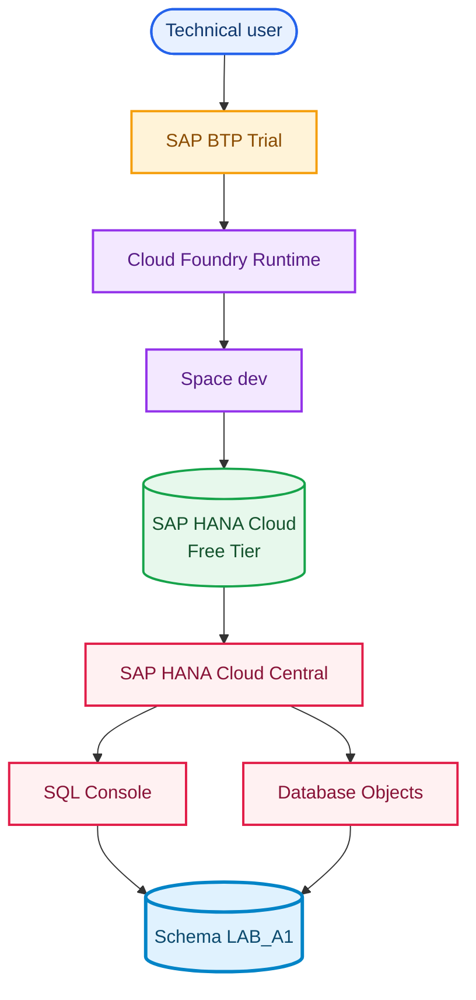

### Relational flow

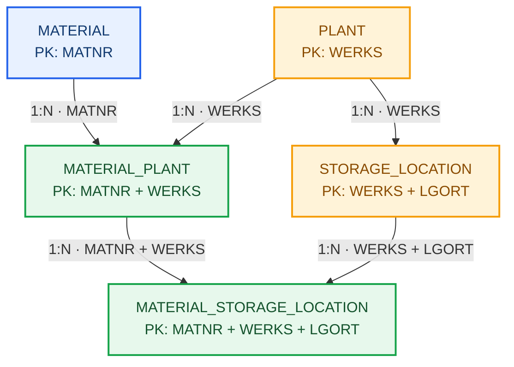

### Referential-integrity flow

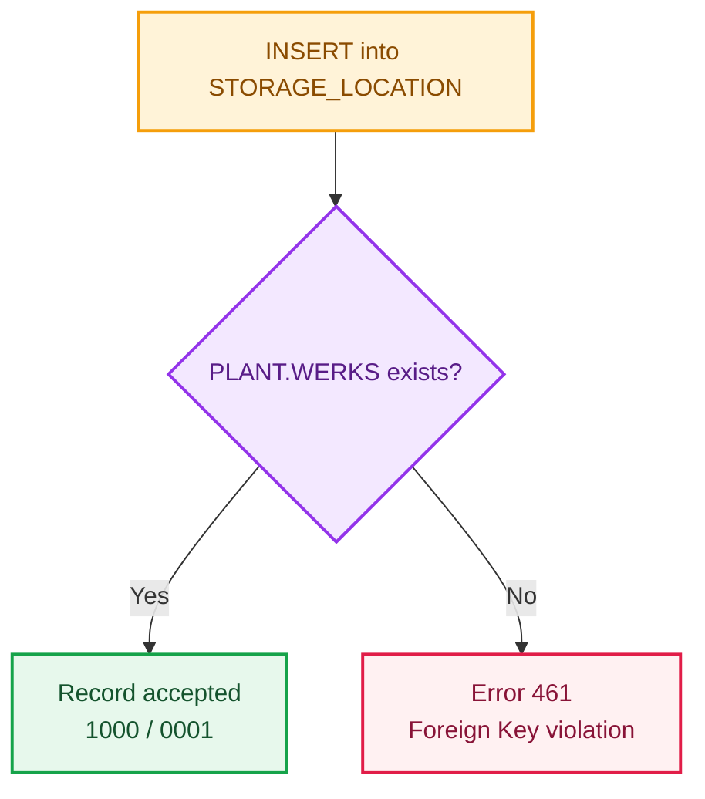


---

## 🛠️ Integrated implementation and evidence

Each evidence image appears at the exact point in the narrative where the result was produced. Code, explanation, and visual outcome therefore remain connected.

### 1. `LAB_A1` schema

The schema acts as a logical folder inside the database. Even with `CURRENT_SCHEMA = DBADMIN`, qualified names such as `LAB_A1.MATERIAL` direct objects to the laboratory namespace.

```sql
SELECT CURRENT_USER, CURRENT_SCHEMA FROM DUMMY;
CREATE SCHEMA LAB_A1;
SELECT SCHEMA_NAME FROM SYS.SCHEMAS WHERE SCHEMA_NAME = 'LAB_A1';
```

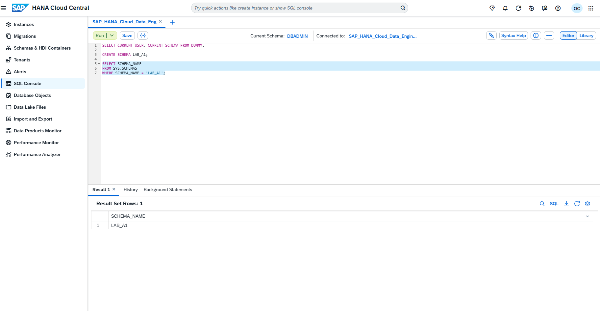

With the namespace available, the first entity created was the global material.

### 2. Global `MATERIAL` entity

`MATNR` identifies each material. The remaining fields describe type, group, and base unit while keeping the model small and focused on relational foundations.

```sql
CREATE COLUMN TABLE LAB_A1.MATERIAL (
    MATNR NVARCHAR(40) NOT NULL,
    DESCRIPTION NVARCHAR(100) NOT NULL,
    MTART NVARCHAR(4) NOT NULL,
    MATKL NVARCHAR(9) NOT NULL,
    MEINS NVARCHAR(3) NOT NULL,
    PRIMARY KEY (MATNR)
);
```

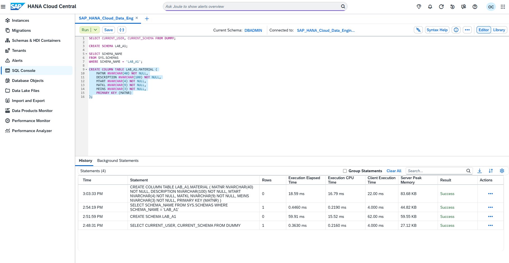

Catalog inspection confirms Column Store, data types, required fields, and key position without relying only on the DDL result.

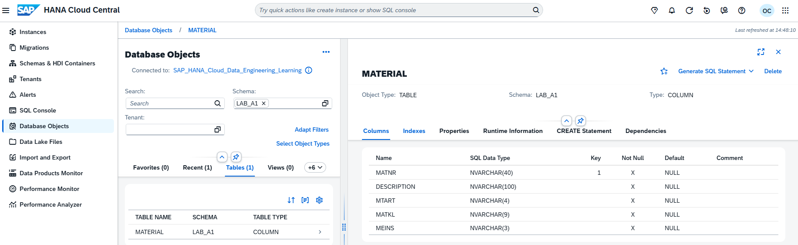

### 3. Organizational `PLANT` entity

A plant is multifunctional and may support procurement, receiving, quality, planning, production, storage, and shipping. `WERKS` was defined as the Primary Key.

```sql
CREATE COLUMN TABLE LAB_A1.PLANT (
    WERKS NVARCHAR(4) NOT NULL,
    PLANT_NAME NVARCHAR(100) NOT NULL,
    COUNTRY NVARCHAR(3) NOT NULL,
    PRIMARY KEY (WERKS)
);
```

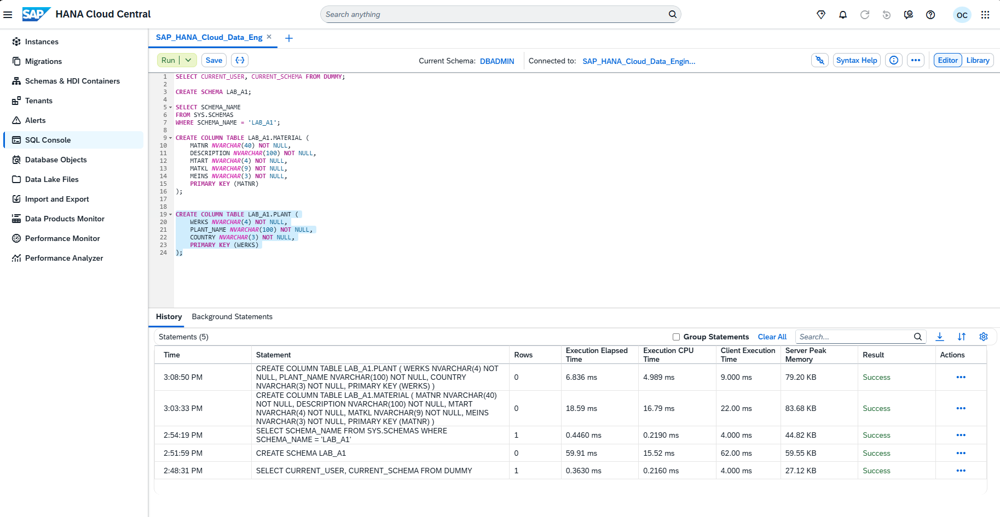

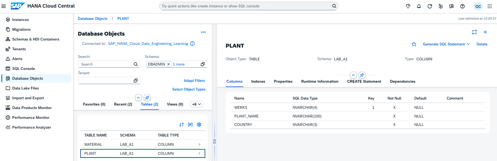

With the organizational record defined, the model could represent plant-dependent storage locations.

### 4. `STORAGE_LOCATION` and composite key

Because `LGORT` may be reused across different plants, the complete storage-location identity is `WERKS + LGORT`.

```sql
CREATE COLUMN TABLE LAB_A1.STORAGE_LOCATION (
    WERKS NVARCHAR(4) NOT NULL,
    LGORT NVARCHAR(4) NOT NULL,
    STORAGE_LOCATION_NAME NVARCHAR(100) NOT NULL,
    PRIMARY KEY (WERKS, LGORT)
);
```

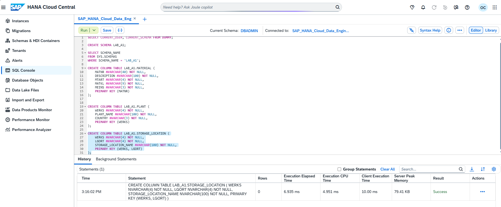

In the structural view, `WERKS` appears as `Key 1` and `LGORT` as `Key 2`, making the composite identity explicit.

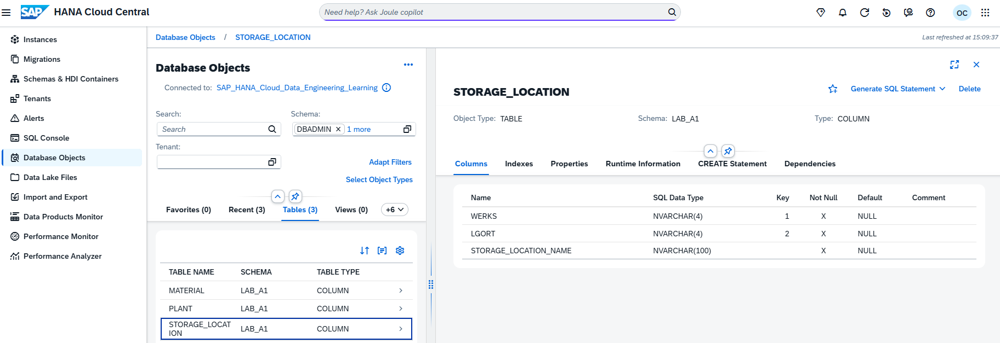

### 5. `PLANT → STORAGE_LOCATION` relationship

`ALTER TABLE` converted the functional correspondence of `WERKS` into a database-enforced rule. Every plant used by `STORAGE_LOCATION` must exist in `PLANT`.

```sql
ALTER TABLE LAB_A1.STORAGE_LOCATION
ADD CONSTRAINT FK_STORAGE_LOCATION_PLANT
FOREIGN KEY (WERKS)
REFERENCES LAB_A1.PLANT (WERKS);
```

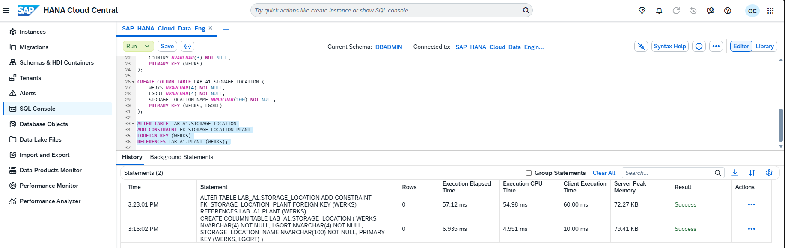

The relationship was queried in the catalog. Joule records integrated AI assistance, while technical validation comes from the system view.

```sql
SELECT SCHEMA_NAME, TABLE_NAME, COLUMN_NAME, POSITION,
       CONSTRAINT_NAME, REFERENCED_SCHEMA_NAME,
       REFERENCED_TABLE_NAME, REFERENCED_COLUMN_NAME,
       IS_ENFORCED, IS_VALIDATED
FROM SYS.REFERENTIAL_CONSTRAINTS
WHERE SCHEMA_NAME = 'LAB_A1'
ORDER BY TABLE_NAME, CONSTRAINT_NAME, POSITION;
```

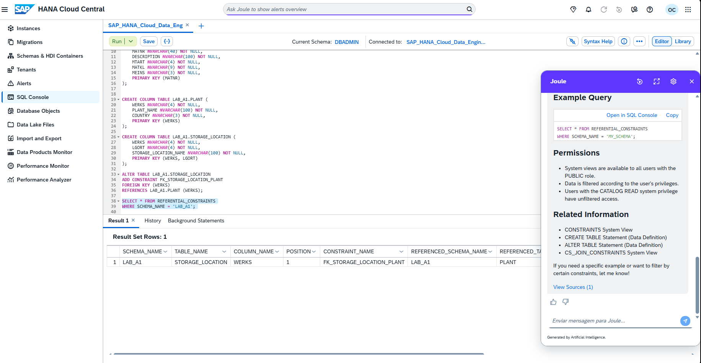

### 6. `MATERIAL_PLANT` associative entity

A material can exist in several plants, and a plant can contain several materials. `MATERIAL_PLANT` converts this conceptual `N:N` relationship into two `1:N` relationships and stores examples of plant-dependent attributes.

```sql
CREATE COLUMN TABLE LAB_A1.MATERIAL_PLANT (
    MATNR NVARCHAR(40) NOT NULL,
    WERKS NVARCHAR(4) NOT NULL,
    PROCUREMENT_TYPE NVARCHAR(1) NOT NULL,
    MRP_TYPE NVARCHAR(2) NOT NULL,
    PRIMARY KEY (MATNR, WERKS),
    CONSTRAINT FK_MATERIAL_PLANT_MATERIAL FOREIGN KEY (MATNR)
        REFERENCES LAB_A1.MATERIAL (MATNR),
    CONSTRAINT FK_MATERIAL_PLANT_PLANT FOREIGN KEY (WERKS)
        REFERENCES LAB_A1.PLANT (WERKS)
);
```

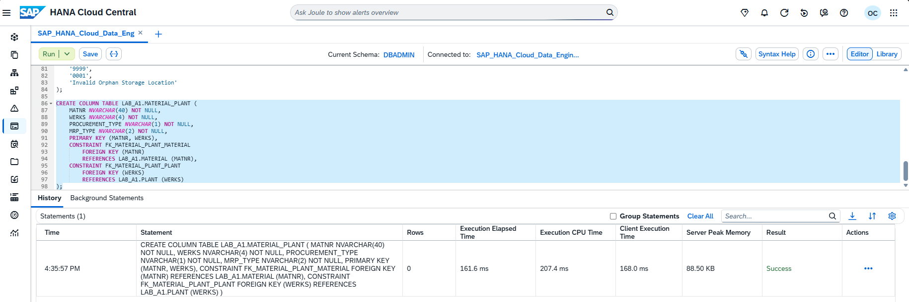

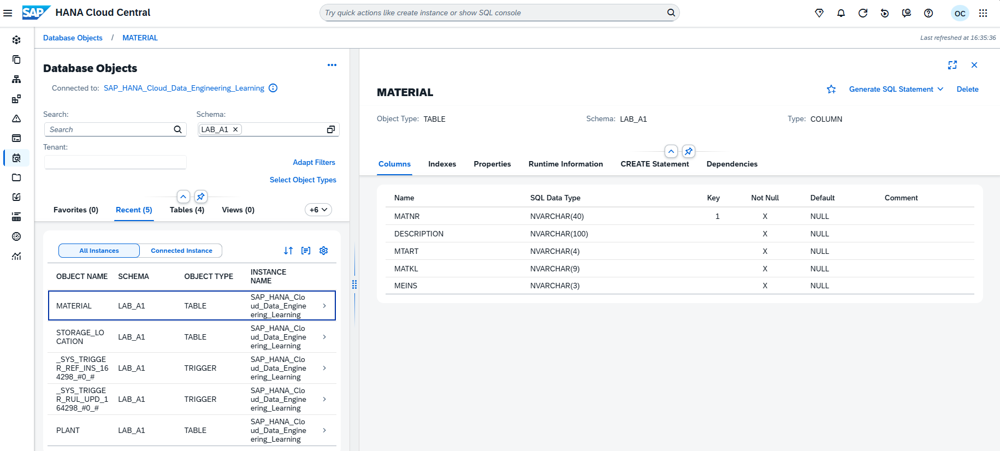

The catalog displays relationships to `MATERIAL.MATNR` and `PLANT.WERKS`, completing material extension to the plant.

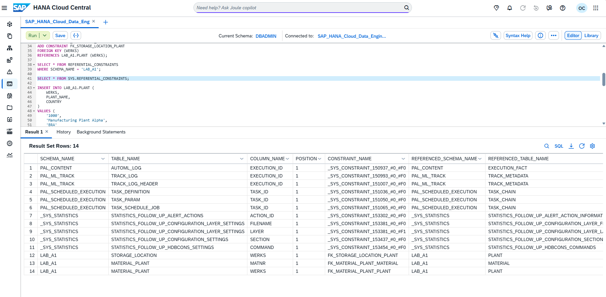

### 7. `MATERIAL_STORAGE_LOCATION` entity

The final entity requires two valid conditions: the material must be extended to the plant, and the storage location must belong to the same plant. The three-column PK identifies each specific extension.

```sql
CREATE COLUMN TABLE LAB_A1.MATERIAL_STORAGE_LOCATION (
    MATNR NVARCHAR(40) NOT NULL,
    WERKS NVARCHAR(4) NOT NULL,
    LGORT NVARCHAR(4) NOT NULL,
    STORAGE_STATUS NVARCHAR(1) NOT NULL,
    PRIMARY KEY (MATNR, WERKS, LGORT),
    CONSTRAINT FK_MAT_SLOC_MATERIAL_PLANT FOREIGN KEY (MATNR, WERKS)
        REFERENCES LAB_A1.MATERIAL_PLANT (MATNR, WERKS),
    CONSTRAINT FK_MAT_SLOC_STORAGE_LOCATION FOREIGN KEY (WERKS, LGORT)
        REFERENCES LAB_A1.STORAGE_LOCATION (WERKS, LGORT)
);
```

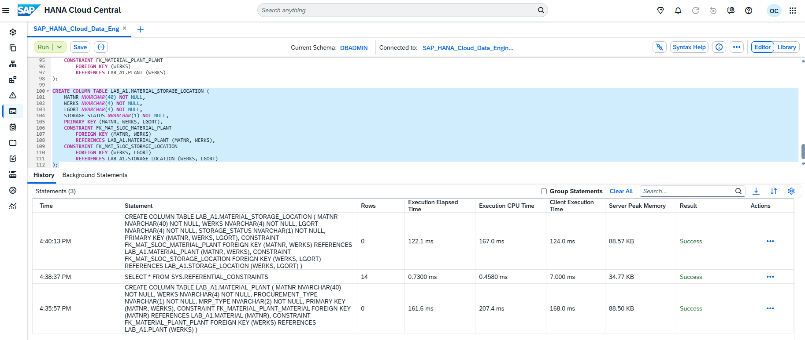

Inspection displays `MATNR`, `WERKS`, and `LGORT` as `Key 1`, `Key 2`, and `Key 3`.

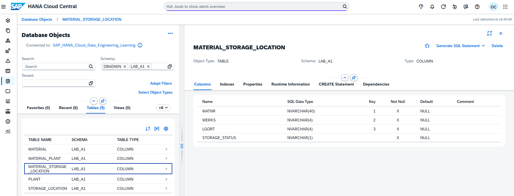

Validation of each composite-FK column position completes the structural construction of the five tables.

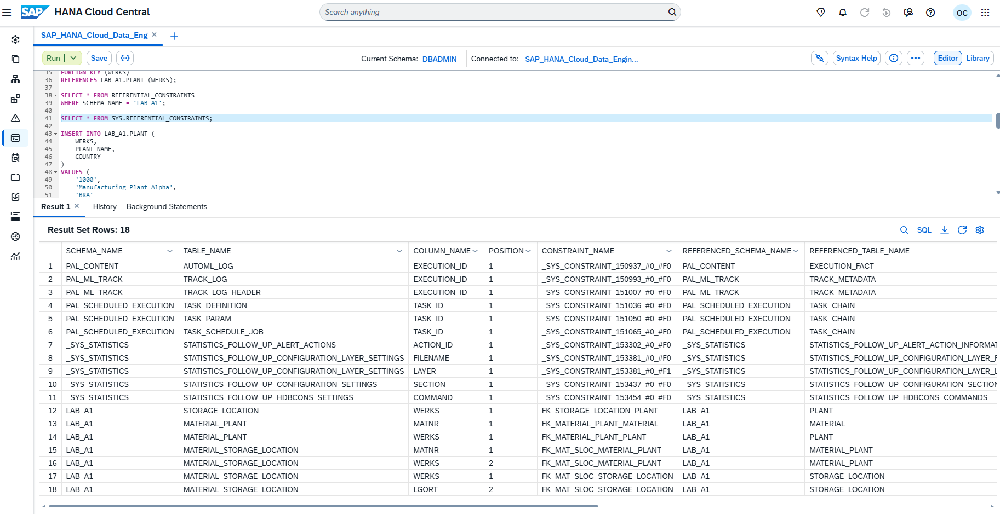

## 🧪 Behavioral validation

### Valid parent record

Testing began by creating fictional plant `1000`, required by any related child storage location.

```sql
INSERT INTO LAB_A1.PLANT (WERKS, PLANT_NAME, COUNTRY)
VALUES ('1000', 'Manufacturing Plant Alpha', 'BRA');
SELECT * FROM LAB_A1.PLANT WHERE WERKS = '1000';
```

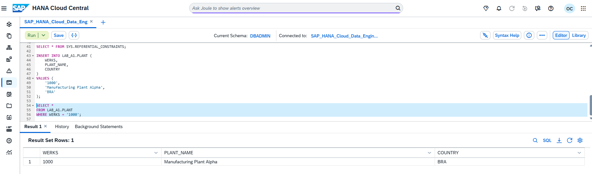

### Valid storage location accepted

Because `PLANT.WERKS = 1000` exists, `1000/0001` was accepted.

```sql
INSERT INTO LAB_A1.STORAGE_LOCATION (WERKS, LGORT, STORAGE_LOCATION_NAME)
VALUES ('1000', '0001', 'Raw Materials');
SELECT * FROM LAB_A1.STORAGE_LOCATION
WHERE WERKS = '1000' AND LGORT = '0001';
```

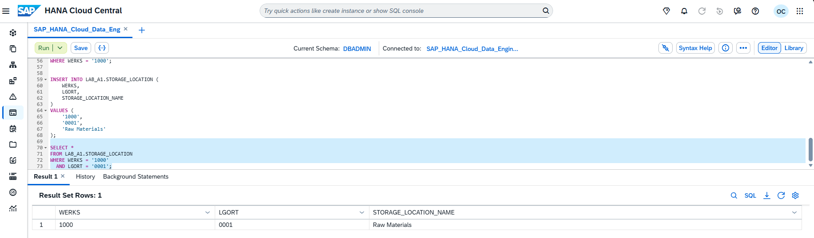

### Orphan storage location rejected

The next attempt used `WERKS = 9999`, which does not exist in the parent table.

```sql
INSERT INTO LAB_A1.STORAGE_LOCATION (WERKS, LGORT, STORAGE_LOCATION_NAME)
VALUES ('9999', '0001', 'Invalid Orphan Storage Location');
```

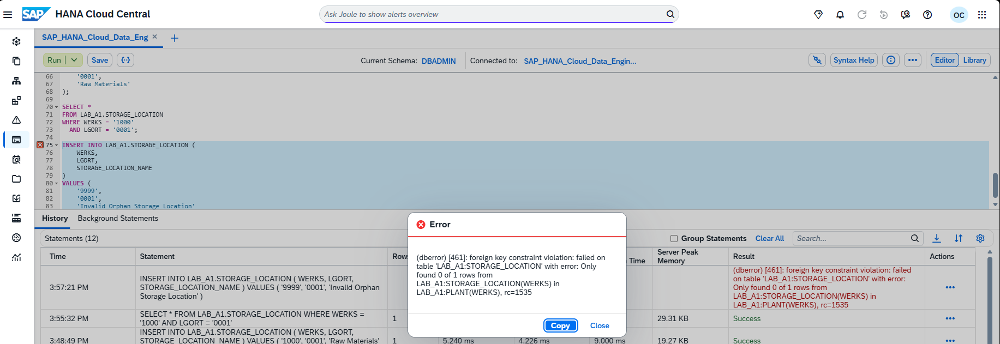

Error 461 completes behavioral validation. The Foreign Key does not merely document the relationship: it physically prevents orphan records and protects future queries, integrations, and applications.


---

## ✅ Validation matrix

| Criterion | Result |
|---|---|
| `LAB_A1` schema created | ✅ |
| Five `COLUMN` tables created | ✅ |
| Simple and composite PKs validated | ✅ |
| Simple and composite FKs validated | ✅ |
| Valid parent and storage-location records inserted | ✅ |
| Orphan storage location rejected | ✅ |
| Physical evidence links `01` through `18` | ✅ |
| Real company data used | ❌ No |

## 🧯 Troubleshooting

- **`object already exists`:** inspect the catalog before repeating a `CREATE`; do not automatically execute `DROP`.
- **`foreign key constraint violation`:** load parent tables before child tables and review the supplied key.
- **Foreign Key absent from Columns:** query `SYS.REFERENTIAL_CONSTRAINTS`, because Columns focuses on columns and PKs.
- **`Current Schema = DBADMIN`:** continue using qualified names such as `LAB_A1.OBJECT`; creating a schema does not automatically change the session context.

## 🛡️ Best practices and production recommendations

- do not use `DBADMIN` as an application identity;
- adopt least-privilege technical users and roles;
- name constraints explicitly;
- version DDL and later migrate to HDI/database-as-code;
- analyze dependencies before destructive changes;
- review SQL suggested by Joule or any AI;
- load in the order `PLANT → MATERIAL → STORAGE_LOCATION → MATERIAL_PLANT → MATERIAL_STORAGE_LOCATION`;
- never publish credentials or real company data.

## 🚀 Next document

The next document separately covers dataset generation, validation, and loading:

### [DOC 02: Dataset design, validation, and loading](./02-a1-dataset-design-validation-and-loading.en.md)

New evidence will be stored under `Evidences/LAB_02/`, restarting from `01`.

## 📚 Official references

- [SAP HANA Cloud Getting Started Guide](https://help.sap.com/docs/hana-cloud/sap-hana-cloud-getting-started-guide/create-schema-tables-and-insert-data-using-sap-hana-database-explorer)
- [SAP HANA Cloud SQL Reference](https://help.sap.com/docs/hana-cloud-database/sap-hana-cloud-sap-hana-database-sql-reference-guide/create-table-statement-data-definition)
- [REFERENTIAL_CONSTRAINTS System View](https://help.sap.com/docs/hana-cloud-database/sap-hana-cloud-sap-hana-database-sql-reference-guide/referential-constraints-system-view)
- [Using Gen AI in the SQL Console](https://help.sap.com/docs/hana-cloud/sap-hana-cloud-administration-guide/using-gen-ai-in-sql-console)


---

## 👤 Autor

### Orlando dos Santos Caetano

**SAP MM · PP · QM · WM | MES | SAP Integration | Data Engineering | Generative AI**

[](https://www.linkedin.com/in/orlando-caetano/)
[](https://github.com/OrlandoCaetano2026)


**SAP Certified - Integration Developer (C_CPI)**  
**SAP Certified - SAP Generative AI Developer (C_AIG)**


---

[⬆️ Back to the README](../../../README.en.md) | [➡️ Next document](./02-a1-dataset-design-validation-and-loading.en.md)
