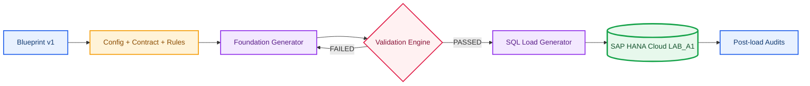
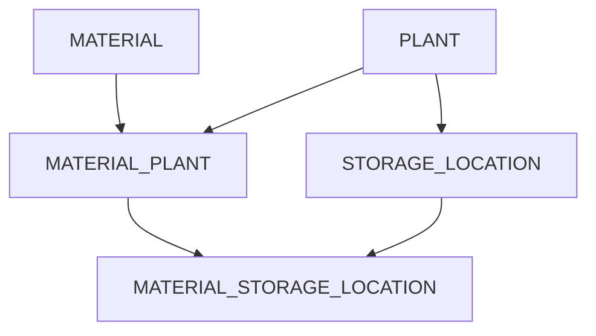

# A1: Relational Data Foundation in SAP HANA Cloud

---

**🌐 Language / Idioma:** [🇧🇷 Português](../BR/01-a1-fundacao-de-dados-relacionais.md) | 🇺🇸 **English**

---

[⬆️ README](../../../README.en.md) | [➡️ A2: SAP Enterprise Structure](./02-a2-sap-enterprise-structure.en.md)

---

## 🎯 Executive overview

A1 created a governed industrial relational foundation in SAP HANA Cloud. Five `COLUMN` tables, a deterministic Industrial Data Universe, and a generation, validation, loading, and auditing chain produced **3,715 records**, **zero orphans**, and **zero duplicates**. All data is synthetic.

---

## 🏗️ Architecture and flows

---

## 🗂️ Final model

| Table | Primary Key | Final rows |
|---|---|---:|
| `PLANT` | `WERKS` | 20 |
| `MATERIAL` | `MATNR` | 300 |
| `STORAGE_LOCATION` | `WERKS + LGORT` | 152 |
| `MATERIAL_PLANT` | `MATNR + WERKS` | 1,080 |
| `MATERIAL_STORAGE_LOCATION` | `MATNR + WERKS + LGORT` | 2,163 |

---

## 🧱 Integrated implementation and evidence

---

### 01. LAB_A1 schema created

The schema was isolated from the current DBADMIN context.

---

### 02. MATERIAL table created

MATERIAL received a global key and basic attributes.

---

### 03. MATERIAL structure

The catalog confirmed Column Store, required fields, and key.

---

### 04. PLANT table created

PLANT introduced the multifunctional organizational level.

---

### 05. PLANT structure

WERKS was confirmed as the unique key.

---

### 06. STORAGE_LOCATION table created

Storage-location identity became dependent on WERKS and LGORT.

---

### 07. STORAGE_LOCATION composite PK

Key 1 and Key 2 confirmed the composite key.

---

### 08. Storage Location to Plant FK

ALTER TABLE turned the relationship into a database-enforced rule.

---

### 09. FK validated in catalog

SYS.REFERENTIAL_CONSTRAINTS confirmed the relationship; Joule served only as assistance.

---

### 10. Parent record inserted

Plant 1000 prepared the behavioral test.

---

### 11. Valid storage location accepted

1000/0001 was accepted because its parent existed.

---

### 12. Orphan storage location rejected

9999/0001 was rejected with a Foreign Key error.

---

### 13. MATERIAL_PLANT created

The associative entity resolved Material by Plant.

---

### 14. MATERIAL_PLANT composite PK

MATNR and WERKS formed the extension identity.

---

### 15. MATERIAL_PLANT FKs

Relationships to MATERIAL and PLANT were validated.

---

### 16. MATERIAL_STORAGE_LOCATION created

The final entity connected material, plant, and storage location.

---

### 17. Three-column PK

MATNR, WERKS, and LGORT were confirmed as Key 1, 2, and 3.

---

### 18. Composite FKs validated

Both composite FKs completed the structural foundation.

---

### 19. Tables cleared before load

Both manual records were removed in child-to-parent order; all tables became empty.

---

### 20. Import target instance selected

Import and Export was explored. Because the available source required Data Lake Files, A1 used generated SQL scripts; cloud storage remains on the roadmap.

---

### 21. 20 Plants loaded

PLANT was loaded first because it had no parent dependency.

---

### 22. 300 Materials loaded

MATERIAL received the six approved synthetic families.

---

### 23. 152 storage locations loaded

Every storage location found its parent Plant.

---

### 24. 1,080 Material Plant extensions

Extensions respected both MATERIAL and PLANT.

---

### 25. 2,163 Material Storage Location extensions

The final load validated both composite FKs end to end.

---

### 26. Final counts

All five counts reconciled exactly 3,715 records.

---

### 27. Post-load referential integrity

Five LEFT JOIN checks returned zero orphans.

---

### 28. PK uniqueness

Five GROUP BY and HAVING checks returned zero duplicates.

---

### 29. End-to-end JOIN

The query integrated all five tables into a functional view.

---

### 30. Distribution by Plant

The 20 Plants reconciled 1,080 extensions, 152 storage locations, and 2,163 assignments, including 2,066 active and 97 inactive.

---

## 🌐 Industrial Data Universe

The cross-scenario Blueprint lives under `Industrial-Data-Universe/Blueprint/`. Config, contract, and rules are `APPROVED`; the Validation Engine is `PASSED`; the seed is `20260903`. Python generators, five valid CSVs, five negative packages, a SHA-256 manifest, Markdown report, SQL load scripts, and six SQL audits were preserved.

---

## ✅ Final validation matrix

| Control | Result |
|---|---|
| Config, contract, rules | `APPROVED` |
| Validation Engine | `PASSED` |
| Total records | 3,715 |
| Orphans | 0 |
| Duplicate PKs | 0 |
| Active assignments | 2,066 |
| Inactive assignments | 97 |
| Physical evidence | 30 PNGs |

---

## 🧯 Troubleshooting and decisions

- Stopped instance: start it in HANA Cloud Central and wait for `Running`.
- No local import: A1 used SQL Load Generator; Data Lake Files will be practiced in Data Engineering.
- FK not visible under Columns: query `SYS.REFERENTIAL_CONSTRAINTS`.
- Python must be saved as `.py`, not pasted into PowerShell.
- Remove `__pycache__` and keep `*.pyc` in `.gitignore`.
- Copy-ready commands must not contain isolated backticks, corrupted asterisks, or trailing blank lines.

---

## 📚 Official references

- [SAP HANA Cloud Administration Guide](https://help.sap.com/docs/hana-cloud/sap-hana-cloud-administration-guide)
- [SAP HANA Cloud SQL Reference](https://help.sap.com/docs/hana-cloud-database/sap-hana-cloud-sap-hana-database-sql-reference-guide)
- [REFERENTIAL_CONSTRAINTS System View](https://help.sap.com/docs/hana-cloud-database/sap-hana-cloud-sap-hana-database-sql-reference-guide/referential-constraints-system-view)
- [Defining and Assigning Plants](https://learning.sap.com/courses/cross-functional-customizing-in-sap-s-4hana-materials-management/defining-and-assigning-plants)
- [Customizing Storage Locations](https://learning.sap.com/courses/exploring-basic-data-for-manufacturing-and-product-management-in-sap-s-4hana/customizing-storage-location)

---

## 🚀 Next scenario

[A2: SAP Enterprise Structure](./02-a2-sap-enterprise-structure.en.md), with evidence under `Evidences/LAB_A2/`.

---

## 👤 Author and contact

### Orlando dos Santos Caetano

        

---

[⬆️ README](../../../README.en.md) | [➡️ A2: SAP Enterprise Structure](./02-a2-sap-enterprise-structure.en.md)
