# A2: SAP Enterprise Structure in the Industrial Data Universe

**🌐 Language / Idioma:** [🇧🇷 Português](../BR/02-a2-estrutura-organizacional-sap.md) | 🇺🇸 **English**

[⬆️ Back to README](../../../README.en.md) | [⬅️ Previous scenario: A1](./01-a1-relational-data-foundation.en.md)

> **Status:** ✅ Completed and validated  
> **Physical schema:** `INDUSTRIAL_DATA`  
> **Document:** `DOC 02`  
> **Evidence:** `Evidences/LAB_A2/`  
> **Classification:** synthetic educational data only

## 🎯 Executive overview

A2 transformed the A1 relational foundation into a SAP-inspired enterprise structure. Work began with an important architectural correction: schema `LAB_A1`, suitable for the first laboratory, was renamed to `INDUSTRIAL_DATA`, becoming the shared physical foundation for subsequent scenarios.

Company, Company Code, Purchasing Organization, Purchasing Group, and the Plant × Purchasing Organization assignment were materialized on this foundation. The `PLANT` table, already populated with 20 records, was evolved in a controlled manner to receive `BUKRS`, first nullable and then required and protected by a Foreign Key.

Final reconciliation covered 10 tables, 10 Foreign Keys, and 3,770 records. A2 added 55 records without losing the 3,715 Foundation records, and all 20 final rules returned `PASSED`.

> [!IMPORTANT]
> All data is fictional. No code, organizational name, operational currency, or relationship represents a real company.

---

## 🧭 Functional storytelling

A fictional industrial company has 20 Plants serving manufacturing, logistics, engineering, quality, and service functions. A1 knew which materials existed, in which Plants they were available, and where they could be stored. Legal control and purchasing responsibilities were still missing.

A2 introduced one corporate company, four Brazilian legal entities, and five purchasing organizations. Each Plant received one Company Code and one primary purchasing organization. Thirteen strategic Plants also received support from corporate organization `P100`.

Two Plants received an additional roadmap role: `1200` for electronic components and `2800` for export operations. Both remain under Company Codes whose local currency is `BRL`, but were prepared for future `USD` documents and a future Fiori `Multicurrency Procurement Monitor`.

---

## 🏗️ Final architecture

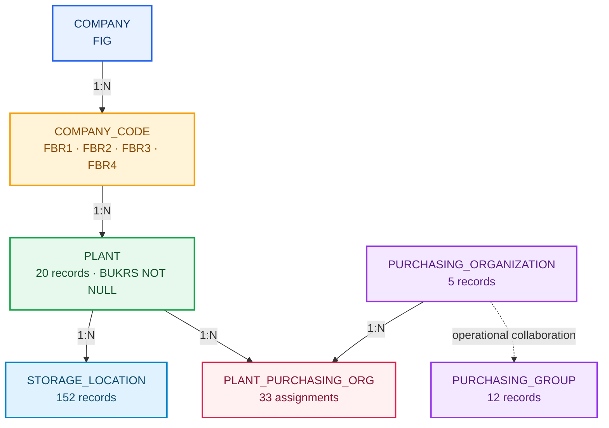

| Entidade | Responsibility | Chave | Records |
|---|---|---|---:|
| `COMPANY` | Corporate group | `COMPANY_ID` | 1 |
| `COMPANY_CODE` | Legal entity and local currency | `BUKRS` | 4 |
| `PLANT` | Operational unit | `WERKS` | 20 |
| `PURCHASING_ORGANIZATION` | Purchasing authority | `EKORG` | 5 |
| `PURCHASING_GROUP` | Responsibility do comprador | `EKGRP` | 12 |
| `PLANT_PURCHASING_ORG` | Plant × Purchasing Organization assignment | `WERKS + EKORG` | 33 |

---

## 1. Migration segura do schema

Before the change, ten controls confirmed that `LAB_A1` existed, `INDUSTRIAL_DATA` did not exist, all five Foundation tables were present, and all 3,715 records remained intact.

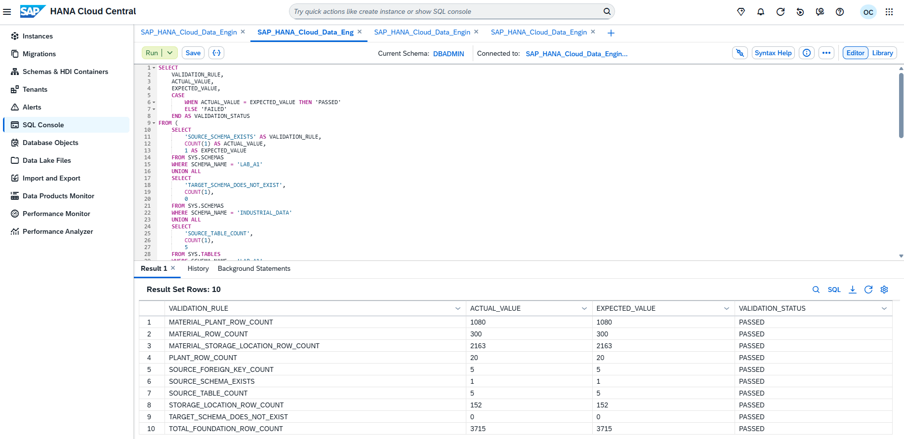

---

## 1.1 Renomeando a fundação física

The command `RENAME SCHEMA LAB_A1 TO INDUSTRIAL_DATA;` generalized the namespace without copying tables or recreating data.

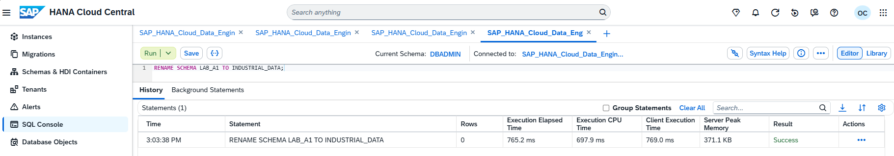

---

## 1.2 Reconciliação pós-migration

Twelve controls confirmed that the previous schema no longer existed, the new schema existed, all five tables were preserved, five Foreign Keys remained enforced and validated, and all 3,715 records remained available.

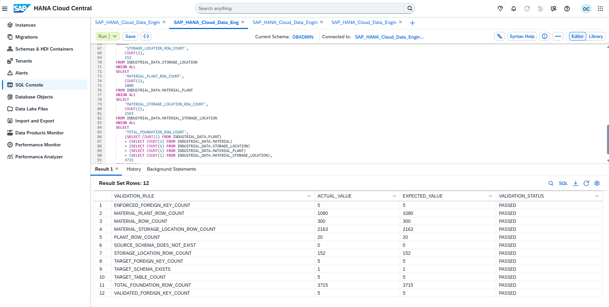

---

## 2. Company e Company Code

Tables `COMPANY` e `COMPANY_CODE` established the corporate and legal hierarchy. A Foreign Key protege `COMPANY_CODE.COMPANY_ID → COMPANY.COMPANY_ID`.

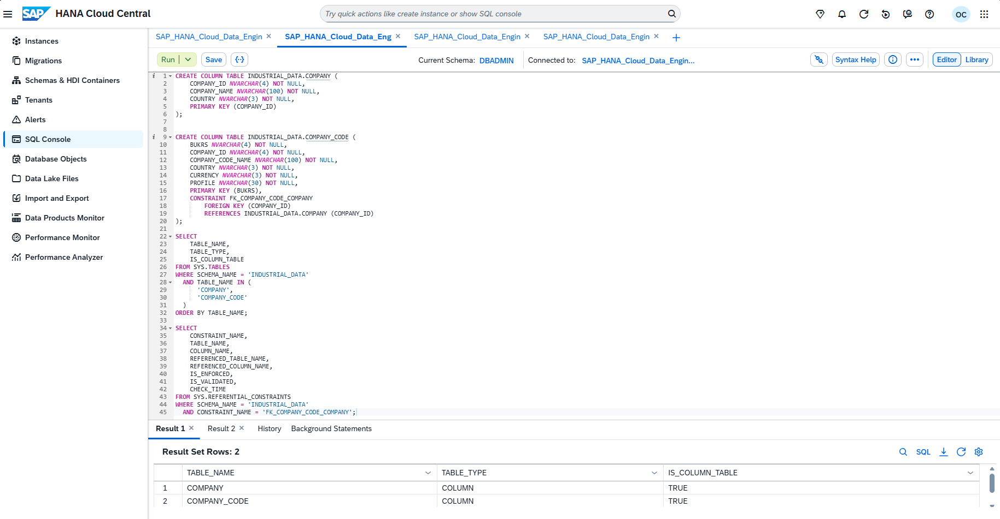

---

## 2.1 Carga das entidades legais

Company `FIG` was associated with four Brazilian Company Codes, all using `BRL` as local currency and distinct operating profiles.

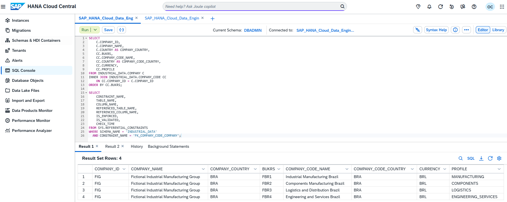

---

## 2.2 Teste negativo de integridade

A Company Code referencing nonexistent Company `XXX` was rejected by HANA. A subsequent query confirmed that the invalid record was not persisted and that the four legitimate Company Codes remained intact.

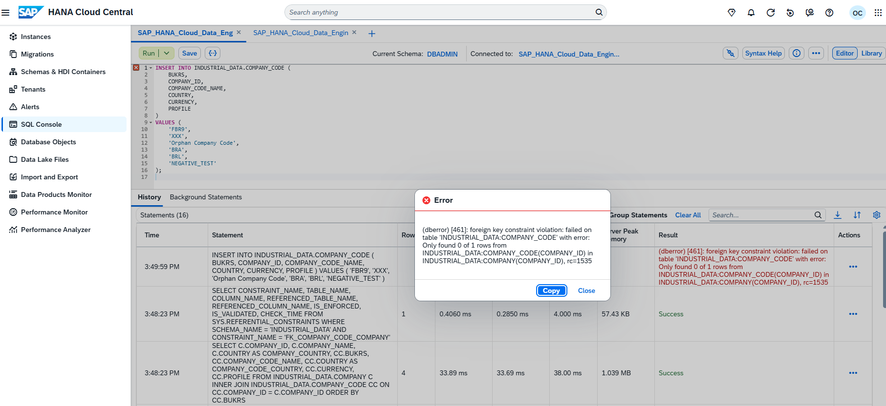

---

## 3. Evolução controlada de PLANT

Column `BUKRS NVARCHAR(4)` was added as temporarily nullable. Os 20 Plants existentes permaneceram disponíveis, todos inicialmente aguardando atribuição.

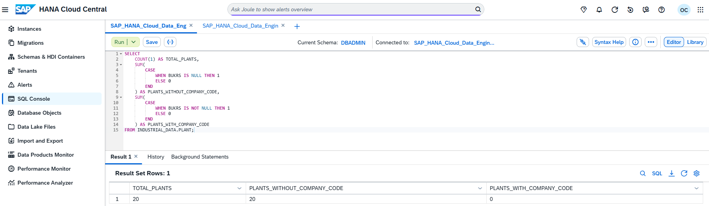

---

## 3.1 Distribuição dos Plants

All 20 Plants were distributed entre `FBR1`, `FBR2`, `FBR3` e `FBR4` nas quantidades 9, 2, 6 e 3.

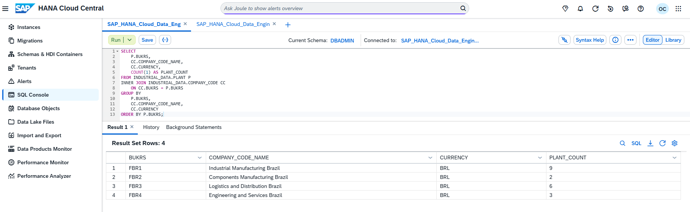

---

## 3.2 Tornando BUKRS definitivo

After validating zero null or unknown values, `BUKRS` became `NOT NULL` and was protected by enforced and validated constraint `FK_PLANT_COMPANY_CODE`.

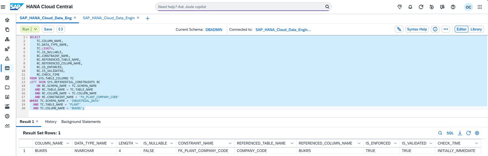

---

## 3.3 Segundo teste negativo

The attempt to update Plant `2800` with nonexistent Company Code `FBR9` was rejected. The Plant remained correctly assigned to `FBR3`.

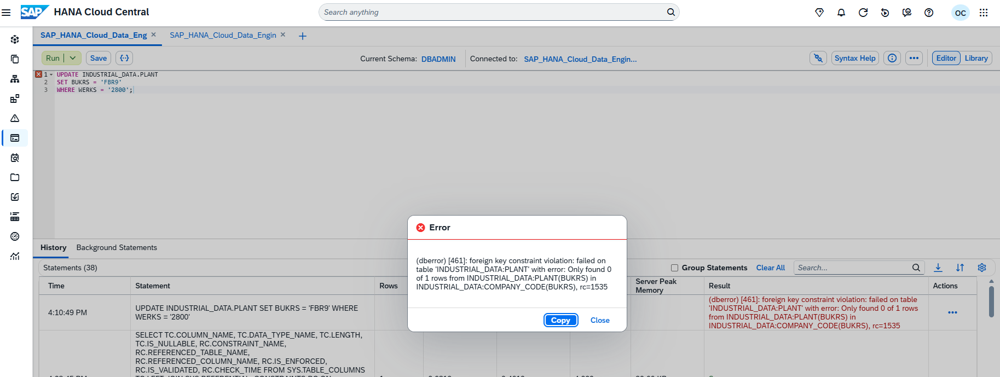

---

## 4. Purchasing organizational structure

Three tables completed the model: `PURCHASING_ORGANIZATION`, `PURCHASING_GROUP`, and `PLANT_PURCHASING_ORG`. The consolidated query validated 1, 0, and 2 Foreign Keys respectively.

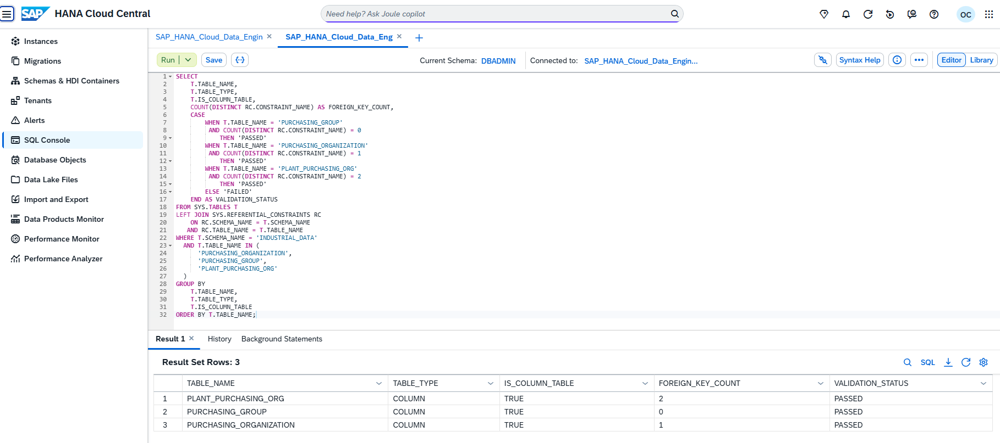

---

## 4.1 Purchasing Organizations

Organization `P100` was created with cross-company scope and `PRIMARY_BUKRS = NULL`; `P110` through `P140` received their primary Company Codes.

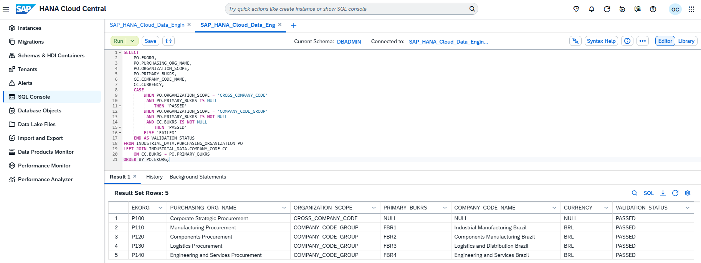

---

## 4.2 Purchasing Groups

Doze grupos foram distribuídos entre materiais diretos, materiais indiretos, serviços, CAPEX e strategic sourcing.

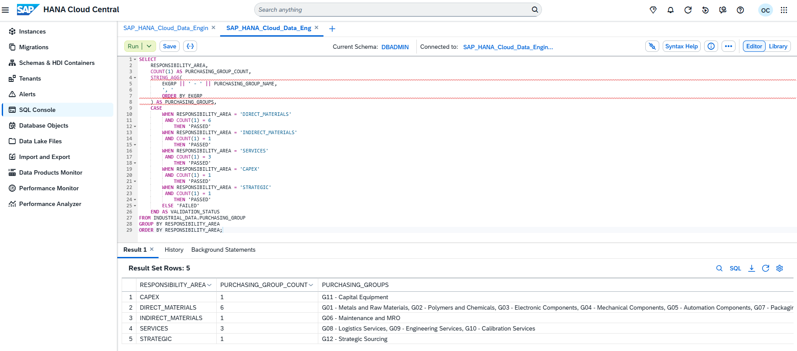

---

## 4.3 Associações Plant × Purchasing Organization

Twenty `PRIMARY` assignments and 13 `STRATEGIC_SUPPORT` assignments were created. The organization-level distribution totaled 33 records.

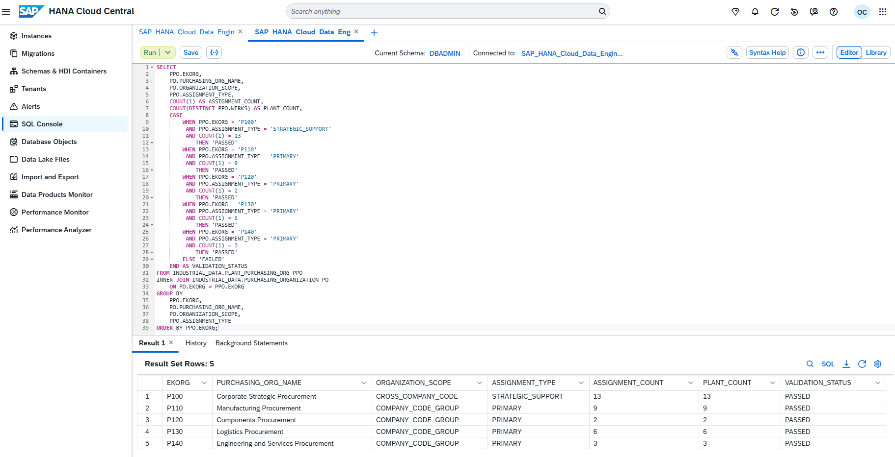

---

## 4.4 Auditoria de integridade de compras

Ten rules confirmed coverage of all 20 Plants, usage of all five organizations, exactly one primary assignment per Plant, zero orphans, and zero duplicates.

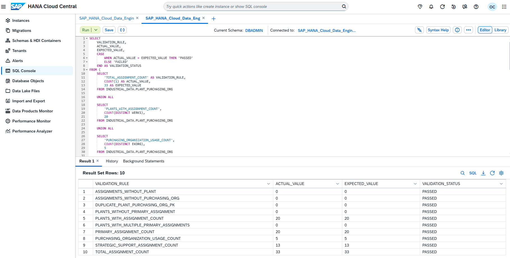

---

## 5. End-to-end organizational JOIN

The JOIN across Company, Company Code, Plant, assignment, and Purchasing Organization returned 33 relationships with `RELATIONSHIP_STATUS = PASSED`.

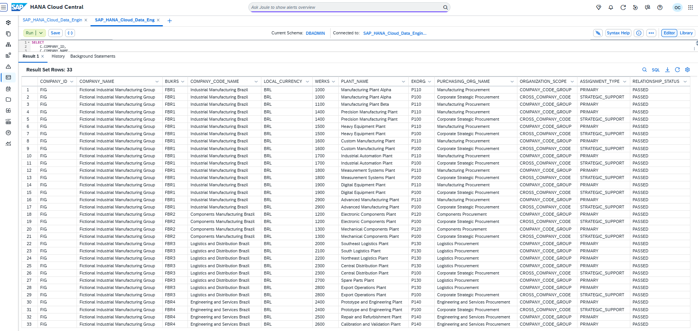

---

## 5.1 Preparação multicurrency

Plants `1200` and `2800` showed local currency `BRL`, future document currency `USD`, one primary organization, and strategic support from `P100`, resulting in `READY_FOR_FUTURE_CURRENCY_SCENARIO`.

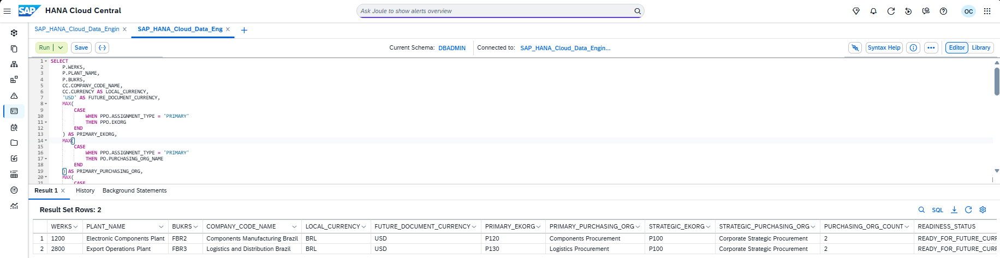

---

## 6. Reconciliação final

Twenty rules reconciled 10 tables, 10 Foreign Keys, 3,715 Foundation records, 55 A2 records, and 3,770 total records.

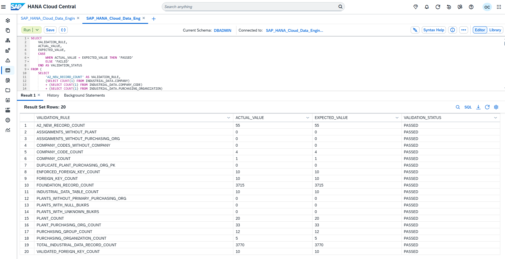

---

## 📦 Reproducible artifacts

```text
Industrial-Data-Universe/Datasets/Enterprise-Structure/
├── Load/
│   ├── 01-create-enterprise-structure-tables.sql
│   ├── 02-load-company-and-company-codes.sql
│   ├── 03-evolve-plant-company-code.sql
│   ├── 04-load-purchasing-organizations.sql
│   ├── 05-load-purchasing-groups.sql
│   └── 06-load-plant-purchasing-organizations.sql
├── Validation/
│   ├── 01-validate-schema-migration.sql
│   ├── 02-validate-enterprise-structure.sql
│   ├── 03-validate-purchasing-assignments.sql
│   ├── 04-enterprise-purchasing-end-to-end-join.sql
│   ├── 05-validate-multicurrency-readiness.sql
│   └── 06-enterprise-structure-final-reconciliation.sql
└── a2-enterprise-structure-sql-manifest.json
```

The manifest records 6 load scripts, 6 validation scripts, and 12 valid physical paths, with zero missing files.

---

## ✅ Validation matrix

| Control | Result |
|---|---:|
| Schema migration | `PASSED` |
| Preserved Foundation | 3.715 |
| Records A2 | 55 |
| Total | 3.770 |
| Tables | 10 |
| Foreign Keys | 10 |
| Orphan Company Codes | 0 |
| Plants without BUKRS | 0 |
| Plants with unknown BUKRS | 0 |
| Assignments without Plant | 0 |
| Assignments without Purchasing Organization | 0 |
| Duplicate `WERKS + EKORG` | 0 |
| Final rules | 20 `PASSED` |

---

## 🛠️ Troubleshooting

| Symptom | Cause | Solution |
|---|---|---|
| Incomplete reconciliation query | block copied partially | resend and execute the complete, self-contained SQL |
| Manifest showed `0` scripts | list was built incorrectly in PowerShell | rebuild lists from physical files |
| `*ForEach-Object` not recognized | an asterisk was inserted while copying | run the cmdlet without extra characters |
| Mermaid did not render | invalid dotted-edge syntax | use `-.->|text|` |
| `BUKRS NOT NULL` would fail | Plants still contained `NULL` | update and validate all 20 Plants before ALTER |
| Invalid Company Code accepted | FK missing or not enforced | create and validate the Foreign Key through catalog metadata |
| Re-running Load causes conflicts | scenario is already materialized | use Load scripts only for future reconstruction |

---

## 🏭 Production recommendations

- use HDI Containers and design-time migrations for CAP applications;
- separate Company Code currency, document currency, and converted amount;
- version organizational mappings and apply formal approval;
- use technical users with least privilege;
- make loads idempotent or protect them through staging;
- record lineage, timestamps, and change ownership;
- automate reconciliation queries in CI/CD;
- establish formal rules for cross-company scopes;
- revalidate quotation method, factors, and precision before implementing currency conversion;
- preserve the original USD amount when deriving the local BRL amount.

---

## 🔗 Official references

- [SAP HANA Cloud SQL Reference Guide](https://help.sap.com/docs/hana-cloud-database/sap-hana-cloud-sap-hana-database-sql-reference-guide)
- [ALTER TABLE Statement](https://help.sap.com/docs/hana-cloud-database/sap-hana-cloud-sap-hana-database-sql-reference-guide/alter-table-statement-data-definition)
- [REFERENTIAL_CONSTRAINTS System View](https://help.sap.com/docs/hana-cloud-database/sap-hana-cloud-sap-hana-database-sql-reference-guide/referential-constraints-system-view)
- [Defining and Assigning Plants](https://learning.sap.com/courses/cross-functional-customizing-in-sap-s-4hana-materials-management/defining-and-assigning-plants)

---

## 🚀 Continuity

A2 is complete as an enterprise and purchasing structure. Before starting the next scenario, the live README must be read again to confirm the actual roadmap and the next document physical name.

## 👤 Author and contact

### Orlando dos Santos Caetano

[](https://www.linkedin.com/in/orlando-caetano/)
[](https://github.com/OrlandoCaetano2026)

        

[⬆️ Back to README](../../../README.en.md) | [⬅️ Previous scenario: A1](./01-a1-relational-data-foundation.en.md)
