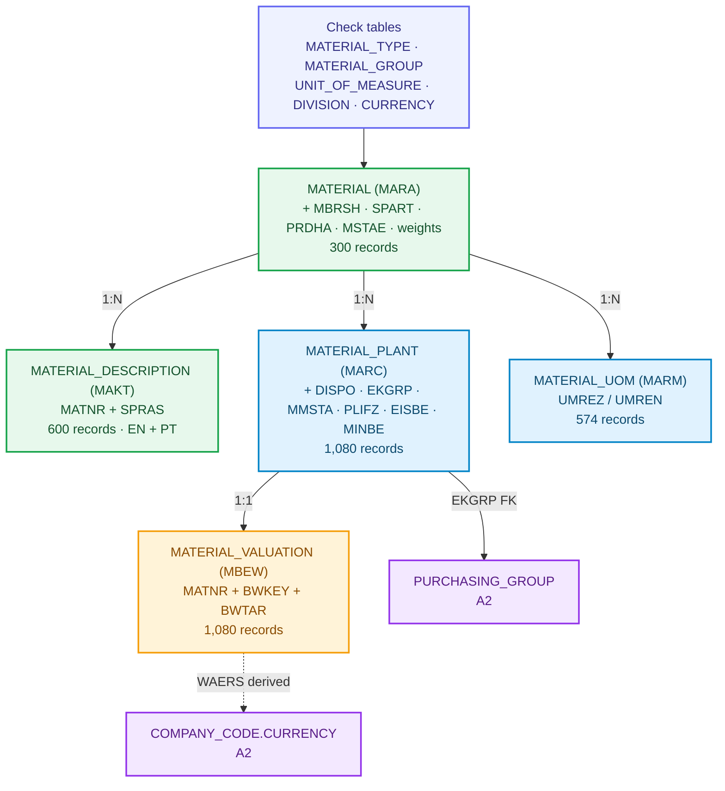
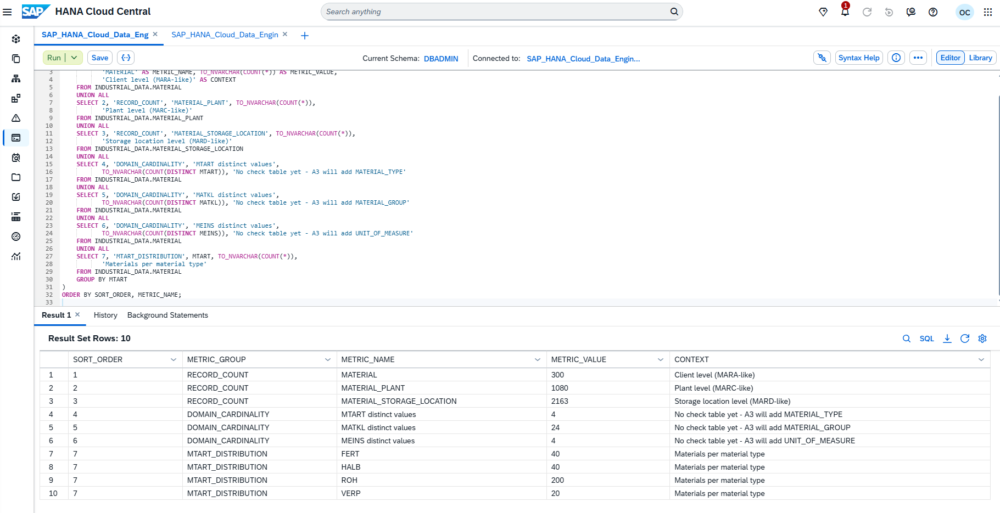
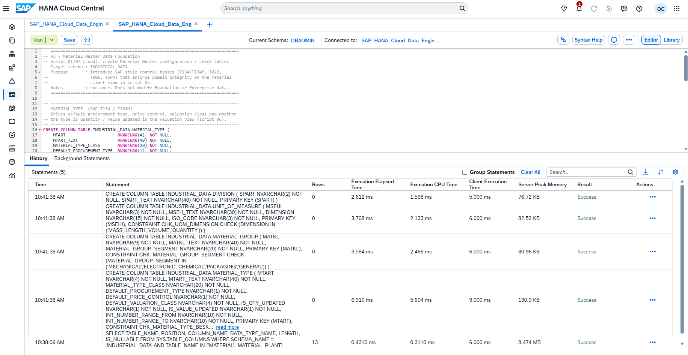
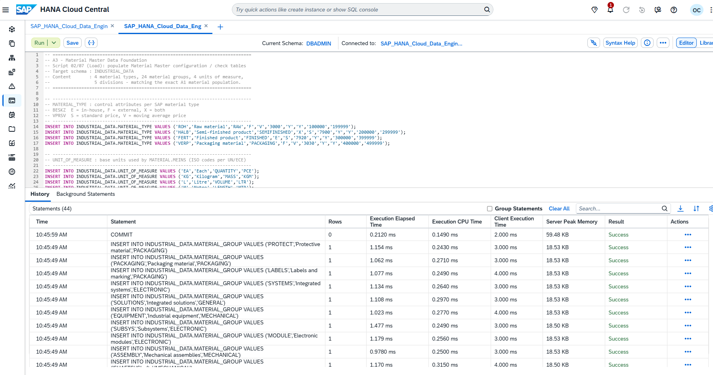
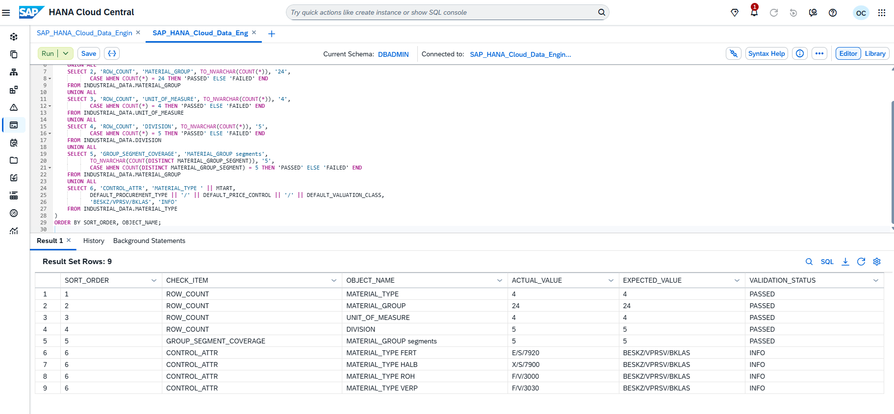
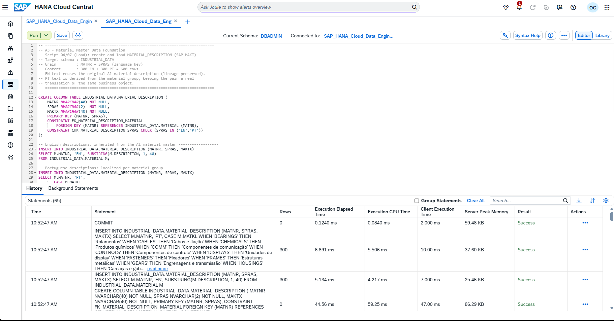
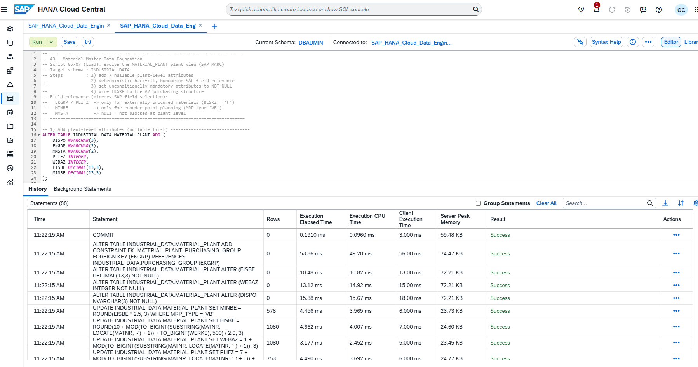
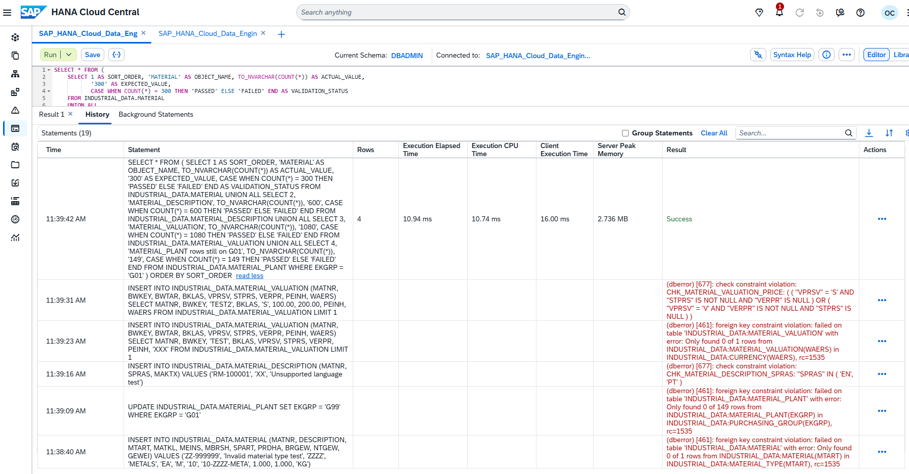
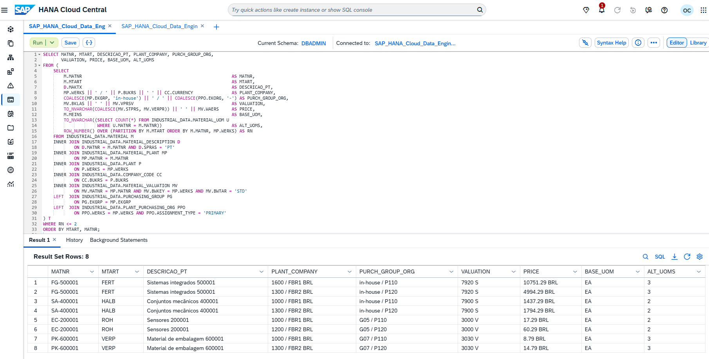
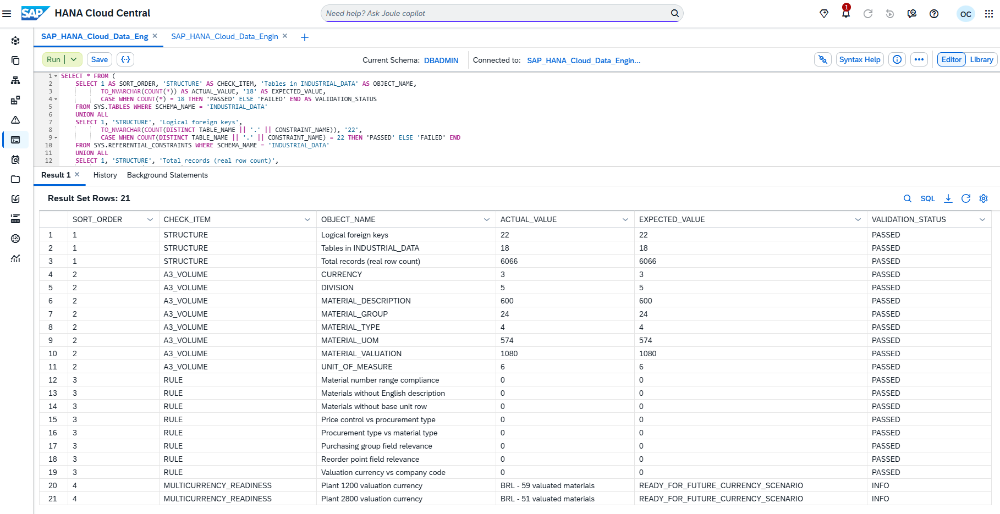

# A3: Material Master Data in the Industrial Data Universe

**🌐 Language / Idioma:** [🇧🇷 Português](../BR/03-a3-dados-mestre-de-material.md) | 🇺🇸 **English**

[⬆️ Back to README](../../../README.en.md) | [⬅️ Previous scenario: A2](./02-a2-sap-enterprise-structure.en.md)

> **Status:** ✅ Completed and validated  
> **Physical schema:** `INDUSTRIAL_DATA`  
> **Document:** `DOC 03`  
> **Evidence:** `Evidences/LAB_A3/`  
> **Classification:** synthetic educational data only

## 🎯 Executive overview

A3 turned the three flat material tables inherited from A1 (`MATERIAL`, `MATERIAL_PLANT`, `MATERIAL_STORAGE_LOCATION`) into a SAP-style **layered Material Master**: client view (MARA), multilingual descriptions (MAKT), plant view (MARC), accounting valuation (MBEW) and alternative units of measure (MARM).

Domain integrity no longer relies on free text. It is now driven by **check tables** (`MATERIAL_TYPE`, `MATERIAL_GROUP`, `UNIT_OF_MEASURE`, `DIVISION`, `CURRENCY`). The plant view is wired to the A2 purchasing structure through the foreign key `MATERIAL_PLANT.EKGRP → PURCHASING_GROUP`. The valuation currency is **derived** from the chain `PLANT.BUKRS → COMPANY_CODE.CURRENCY`, never written as a literal.

Final reconciliation covered **18 tables, 22 logical Foreign Keys and 6,066 records**. A3 added 2,296 records without losing the 3,770 A2 records, the 19 final rules returned `PASSED`, and 8 integrity rules closed with zero violations.

> [!IMPORTANT]
> All data is fictional. No material number, price, operational currency or relationship represents a real company. Prices are synthetic and deterministic.

---

## 🧭 Functional storytelling

After A2, the fictional company knew which legal entities controlled each Plant and how purchasing was organized. What existed about the 300 materials, however, was minimal: a number, one description, a type, a group and a base unit — no check tables, no per-language description, no planning attributes, no accounting valuation.

In real SAP, the Material Master is not a table: it is a set of **organizational-level views**. The basic view (MARA) applies to the whole group. Descriptions (MAKT) exist per language. The plant view (MARC) carries MRP planning, procurement type and purchasing group. Valuation (MBEW) carries valuation class, price control and price, in a currency that belongs to the Company Code. Alternative units (MARM) allow buying in boxes and stocking in each.

A3 reproduced this layering. Each layer received its attributes, its foreign keys and its consistency rules. Two Plants remain reserved for the roadmap: `1200` (electronic components) and `2800` (export operations). Both stay under Company Codes with local currency `BRL`, but the valuation currency column already exists and is populated by derivation — ready for the future `BRL/USD` scenario with no schema change.

---

## 🏗️ Final architecture



| SAP layer | Table | Key | Records |
|---|---|---|---:|
| Check table (T134) | `MATERIAL_TYPE` | `MTART` | 4 |
| Check table (T023) | `MATERIAL_GROUP` | `MATKL` | 24 |
| Check table (T006) | `UNIT_OF_MEASURE` | `MSEHI` | 6 |
| Check table (TSPA) | `DIVISION` | `SPART` | 5 |
| Check table (TCURC) | `CURRENCY` | `WAERS` | 3 |
| Client view (MARA) | `MATERIAL` (evolved) | `MATNR` | 300 |
| Descriptions (MAKT) | `MATERIAL_DESCRIPTION` | `MATNR + SPRAS` | 600 |
| Plant view (MARC) | `MATERIAL_PLANT` (evolved) | `MATNR + WERKS` | 1,080 |
| Valuation (MBEW) | `MATERIAL_VALUATION` | `MATNR + BWKEY + BWTAR` | 1,080 |
| Alt. units (MARM) | `MATERIAL_UOM` | `MATNR + MEINH` | 574 |

---

## 1. A3 baseline

The starting point was measured before any change: `MATERIAL` = 300, `MATERIAL_PLANT` = 1,080, `MATERIAL_STORAGE_LOCATION` = 2,163, with `MTART`, `MATKL` and `MEINS` still free text (4, 24 and 4 distinct values, no check table). The distribution by type was `ROH` 200 (prefixes RM/EC/MC), `FERT` 40, `HALB` 40 and `VERP` 20.



---

## 2. Configuration check tables

Four check tables introduced SAP-style domain integrity. `MATERIAL_TYPE` (T134/T134M) is the **control key**: it drives default procurement type, price control, valuation class, and whether the type is quantity and value updated. `MATERIAL_GROUP` (T023) normalizes the 24 free-text groups from A1. `UNIT_OF_MEASURE` (T006) adds a physical dimension and ISO code. `DIVISION` (TSPA) is the client-level classifying attribute. The tables are born with 6 `CHECK` constraints guarding enumerated domains (`BESKZ ∈ {E,F,X}`, `VPRSV ∈ {S,V}`, unit dimension, and so on).



---

## 2.1 Configuration load

The four check tables were loaded with the exact A1 universe: 4 material types, 24 groups (15 `ROH`, 3 `HALB`, 3 `FERT`, 3 `VERP`), 4 units and 5 divisions. All five material group segments (`MECHANICAL`, `ELECTRONIC`, `CHEMICAL`, `PACKAGING`, `GENERAL`) are covered.

Control attributes per material type, with number ranges aligned to the real A1 numbering:

| `MTART` | Procurement | Price control | Valuation class | `MATNR` range | A1 prefixes |
|---|---|---|---|---|---|
| `ROH` | F (external) | V (moving avg) | 3000 | 100000-399999 | RM · EC · MC |
| `HALB` | X (both) | S (standard) | 7900 | 400000-499999 | SA |
| `FERT` | E (in-house) | S (standard) | 7920 | 500000-599999 | FG |
| `VERP` | F (external) | V (moving avg) | 3030 | 600000-699999 | PK |

Because `ROH` uses three prefixes, the type occupies a wide interval. All 300 materials sit inside their type interval — an audited rule, not a constraint, to preserve the historical identity of the `MATNR`.



---

## 3. Client view (MARA)

The `MATERIAL` table received seven client-level attributes, with a deterministic backfill — sector and division derive from the material group segment; weight derives from the material number via reproducible modular arithmetic.

| Attribute | Column | Value source | Mandatory |
|---|---|---|---|
| Industry sector | `MBRSH` | material group segment | yes |
| Division | `SPART` | material group segment (FK → `DIVISION`) | yes |
| Product hierarchy | `PRDHA` | `SPART` + `MTART` + group | yes |
| Cross-plant status | `MSTAE` | not assigned (blank = not blocked) | no |
| Gross weight | `BRGEW` | derived from `MATNR` | yes |
| Net weight | `NTGEW` | derived from `MATNR` | yes |
| Weight unit | `GEWEI` | `KG` (FK → `UNIT_OF_MEASURE`) | yes |

The evolution followed the same A2 pattern used for `PLANT.BUKRS`:

| Step | Action |
|---|---|
| 1 | Add the 7 columns as nullable |
| 2 | Deterministic backfill |
| 3 | Promote the 6 mandatory attributes to `NOT NULL` |
| 4 | Apply the 5 foreign keys to the check tables |

### Foreign keys applied on the client view

| Constraint | Column | Reference |
|---|---|---|
| `FK_MATERIAL_MATERIAL_TYPE` | `MTART` | `MATERIAL_TYPE` |
| `FK_MATERIAL_MATERIAL_GROUP` | `MATKL` | `MATERIAL_GROUP` |
| `FK_MATERIAL_BASE_UOM` | `MEINS` | `UNIT_OF_MEASURE` |
| `FK_MATERIAL_WEIGHT_UOM` | `GEWEI` | `UNIT_OF_MEASURE` |
| `FK_MATERIAL_DIVISION` | `SPART` | `DIVISION` |

### Distribution of the 300 materials after the backfill

| Division | Materials |
|---|---:|
| `10` Mechanical | 119 |
| `20` Electronic | 116 |
| `30` Chemical | 32 |
| `40` Packaging | 20 |
| `00` Cross-division | 13 |
| **Total** | **300** |

| Industry sector | Materials |
|---|---:|
| `M` Mechanical | 152 |
| `E` Electronic | 116 |
| `C` Chemical | 32 |
| **Total** | **300** |



> **Modeling note.** From A3 on, `MATERIAL.DESCRIPTION` (inherited from A1) and `MATERIAL_DESCRIPTION` coexist. In real SAP, MARA does not hold a description — it lives only in MAKT, per language. The A1 column is kept to preserve the previous scenario's lineage, but A3 establishes MAKT as the authoritative multilingual source.

---

## 4. Multilingual descriptions (MAKT)

`MATERIAL_DESCRIPTION` was created at grain `MATNR + SPRAS`, with `CHECK (SPRAS IN ('EN','PT'))` and a foreign key to `MATERIAL`. The load produced 600 rows: the English text reuses the original A1 description (lineage preserved, no invented data); the Portuguese text is derived from the material group, keeping the pair a real translation of the same business object. All 300 materials have a description in both languages.



---

## 5. Plant view (MARC)

`MATERIAL_PLANT` received seven planning and purchasing attributes: MRP controller (`DISPO`, one per plant), purchasing group (`EKGRP`), plant-specific status (`MMSTA`), planned delivery time (`PLIFZ`), goods receipt processing time (`WEBAZ`), safety stock (`EISBE`) and reorder point (`MINBE`).

SAP **field relevance** was honoured in the backfill:

- `EKGRP` and `PLIFZ` only for externally procured materials (`PROCUREMENT_TYPE = 'F'`);
- `MINBE` only for reorder point planning (`MRP_TYPE = 'VB'`), always above safety stock;
- `DISPO`, `WEBAZ` and `EISBE` are always relevant and were promoted to `NOT NULL`.

`EKGRP` was assigned by commodity, aligned to the A2 purchasing groups:

| Purchasing group (A2) | Material groups |
|---|---|
| `G01` Metals and Raw Materials | `METALS` · `FASTENERS` · `SHAFTS` |
| `G02` Polymers and Chemicals | `CHEMICALS` · `POLYMERS` |
| `G03` Electronic Components | `CABLES` · `COMM` · `DISPLAYS` · `POWER` |
| `G04` Mechanical Components | `BEARINGS` · `FRAMES` · `GEARS` · `HOUSINGS` |
| `G05` Automation Components | `CONTROLS` · `SENSORS` |
| `G07` Packaging Materials | `LABELS` · `PACKAGING` · `PROTECT` |

The backfill left `EKGRP` distributed as follows:

| Case | `MATERIAL_PLANT` rows |
|---|---:|
| With a purchasing group (ROH + VERP, external procurement) | 753 |
| Without a purchasing group (FERT + HALB, in-house production) | 327 |
| **Total** | **1,080** |

This is exactly the SAP behaviour. The foreign key `FK_MATERIAL_PLANT_PURCHASING_GROUP` connects the plant view to the A2 purchasing structure.



The MARC consistency audit confirmed, with zero violations: procurement type compatible with material type, `EKGRP` relevance, `PLIFZ` relevance, `MINBE` relevance, and reorder point above safety stock. Those five rules were re-run in the final reconciliation (section 10).

---

## 6. Accounting valuation (MBEW)

`MATERIAL_VALUATION` was materialized at grain `MATNR + BWKEY + BWTAR`, with **valuation area = Plant** (`BWKEY = WERKS`, the S/4 default). Each row carries a valuation class (`BKLAS`, derived from the type), price control (`VPRSV`: `S` standard for in-house production, `V` moving average for external procurement), a standard or moving price, price unit (`PEINH`) and currency (`WAERS`).

The **currency is derived**, never written: the `INSERT` joins `PLANT.BUKRS → COMPANY_CODE.CURRENCY`. Today all 1,080 valuations are `BRL`. The `CURRENCY` table (equivalent to TCURC) was created with `BRL`, `USD` and `EUR`, and `COMPANY_CODE.CURRENCY` is now protected by the foreign key `FK_COMPANY_CODE_CURRENCY` — domain integrity retro-fitted onto the A2 structure.

Three `CHECK` constraints guard the valuation semantics: `VPRSV ∈ {S,V}`, `PEINH ∈ {1,10,100,1000}`, and the cross-column rule that price control `S` carries only a standard price and control `V` carries only a moving price.

The synthetic price mixes the material number with a large prime (`104729`) and the plant with a second prime (`7919`), which spreads consecutive material numbers across the whole interval of their type. Resulting ranges: `ROH` ~5-200, `VERP` ~0.50-20, `HALB` ~200-2,000, `FERT` ~2,000-20,000 `BRL`.

> **Valuation area = Plant.** As a direct consequence of this choice, the same material can carry a different value in different plants — for example `FG-500001` costs over 10,700 `BRL` in one plant and under 5,000 `BRL` in another, both inside the same company. Had the valuation area been the Company Code, those values would be forced equal.

---

## 7. Alternative units of measure (MARM)

`MATERIAL_UOM` stores the `UMREZ / UMREN` conversion factors. Every material carries a mandatory 1:1 base unit row in its own unit — exactly as SAP always stores the base unit of measure in MARM. Materials managed in `EA` receive `BOX` (1 box = 12 each); finished products and packaging in `EA` also receive `PAL` (1 pallet = 240 each). A total of 574 rows: 300 base + 227 `BOX` + 47 `PAL`.

---

## 8. Consolidated negative tests

Five attacks on the model, covering the five integrity mechanisms of A3, all rejected by the database:

| # | Attempt | Mechanism | Error returned |
|---|---|---|---|
| 1 | Material with `MTART = 'ZZZZ'` | domain FK | `FK_MATERIAL_MATERIAL_TYPE` |
| 2 | Move material to `EKGRP = 'G99'` | A3 ↔ A2 wiring | `FK_MATERIAL_PLANT_PURCHASING_GROUP` — *"Only found 0 of 149 rows"* |
| 3 | Description with `SPRAS = 'XX'` | domain `CHECK` | `CHK_MATERIAL_DESCRIPTION_SPRAS` |
| 4 | Valuation with `WAERS = 'XXX'` | currency FK | `FK_MATERIAL_VALUATION_CURRENCY` |
| 5 | Price control `S` carrying a moving price | cross-column semantic rule | `CHK_MATERIAL_VALUATION_PRICE` |

The error from test 2 is the most eloquent of the scenario: the database refuses to move materials into a non-existent purchasing group with the message *"found 0 of 149 rows"* — A3 and A2 wired together in practice. After the five rejections, reconciliation confirmed 300 / 600 / 1,080 records and 149 rows still on `G01`, the model intact.



---

## 9. End-to-end join

A single query walks A1, A2 and A3: from the client-level material, through the Portuguese description, down to the plant, across to the Company Code, into the A2 purchasing group and purchasing organization, and finally into the derived-currency valuation. Two rows per material type.

The contrast between rows is SAP field relevance showing up in the real data: `ROH` and `VERP` show a purchasing group and price control `V`; `HALB` and `FERT` show `in-house` and price control `S`. `FG-500001` appears with different values in plants 1600 and 1300 — the consequence of valuing per plant.



---

## 10. Final reconciliation

Twenty-one checks closed A3: structure (18 tables, 22 Foreign Keys, 6,066 records counted with `COUNT(*)`), the 8 A3 table volumes, 8 integrity rules with zero violations, and the multicurrency readiness of plants 1200 (59 valuated materials) and 2800 (51 valuated materials). Result: 19 `PASSED` and 2 `INFO`, no `FAILED`.



---

## 📦 Reproducible artifacts

```text
Industrial-Data-Universe/Datasets/Material-Master/
├── Load/
│   ├── 01-create-material-master-config-tables.sql
│   ├── 02-load-material-master-config-data.sql
│   ├── 03-evolve-material-client-view.sql
│   ├── 04-create-and-load-material-descriptions.sql
│   ├── 05-evolve-material-plant-view.sql
│   ├── 06-create-and-load-material-valuation.sql
│   └── 07-load-material-alternative-uom.sql
├── Validation/
│   ├── 01-validate-config-integrity.sql
│   ├── 02-validate-material-client-view.sql
│   ├── 03-validate-material-descriptions.sql
│   ├── 04-validate-material-plant-view.sql
│   ├── 05-validate-material-valuation.sql
│   ├── 06-validate-multicurrency-readiness.sql
│   ├── 07-material-master-end-to-end-join.sql
│   └── 08-material-master-final-reconciliation.sql
└── a3-material-master-sql-manifest.json
```

The `Load/` scripts rebuild A3 from the final A2 state and **must not** be re-run in the current environment, where objects and data are already materialized. The `Validation/` scripts are read-only and may be re-run at any time.

---

## ✅ Validation matrix

| Control | Result |
|---|---:|
| Schema tables | 18 |
| Logical Foreign Keys | 22 |
| A2 records preserved | 3,770 |
| A3 new records | 2,296 |
| Total | 6,066 |
| `MATERIAL_TYPE` / `MATERIAL_GROUP` / `UNIT_OF_MEASURE` / `DIVISION` / `CURRENCY` | 4 / 24 / 6 / 5 / 3 |
| `MATERIAL_DESCRIPTION` | 600 |
| `MATERIAL_VALUATION` | 1,080 |
| `MATERIAL_UOM` | 574 |
| Procurement type × material type | 0 violations |
| `EKGRP` / `PLIFZ` / `MINBE` field relevance | 0 violations |
| Reorder point above safety stock | 0 violations |
| Valuation currency × Company Code | 0 violations |
| Price control × procurement type | 0 violations |
| Number range compliance | 0 violations |
| Materials without English description / without base unit | 0 / 0 |
| Negative tests | 5 rejected |
| Final rules | 19 `PASSED` |

---

## 🛠️ Troubleshooting

| Symptom | Cause | Solution |
|---|---|---|
| Validation query fails with `invalid table name` | validation run before the create script | run the Load script before its matching validation |
| HALB and FERT prices nearly identical to each other | those types' `MATNR` occupy a narrow numeric span and the `MOD` never completes a cycle | mix the material number with a large prime before the `MOD` |
| Reconciliation reports a record-total mismatch while every table checks out | the total was read from `SYS.M_TABLES.RECORD_COUNT`, a monitoring view that may not include delta-storage rows | count the total with `COUNT(*)`; use monitoring metadata for observability only |
| Configured number range does not match the data | assumed before inspecting the real A1 prefixes | inspect the source `MATNR` and align the per-type bands |
| `INSERT` with an arbitrary currency accepted | no currency check table | create `CURRENCY` and bind `MATERIAL_VALUATION.WAERS` and `COMPANY_CODE.CURRENCY` with foreign keys |

---

## 🏭 Production recommendations

- use HDI Containers and design-time CDS artifacts for the check tables and views;
- treat `MATERIAL_TYPE` as versioned configuration with formal approval;
- separate price control, standard price, moving price and valuation currency;
- keep descriptions only in MAKT, per language, and never duplicate them on the basic view;
- validate field relevance per material type before any mass load;
- derive the valuation currency from the plant → Company Code chain, never from a literal;
- automate the reconciliation queries and integrity rules in CI/CD;
- revalidate quotation method, factors and decimal precision before any currency scenario;
- preserve the original amount and currency when deriving amounts in another currency.

---

## 🔗 Official references

- [SAP HANA Cloud SQL Reference Guide](https://help.sap.com/docs/hana-cloud-database/sap-hana-cloud-sap-hana-database-sql-reference-guide)
- [ALTER TABLE Statement](https://help.sap.com/docs/hana-cloud-database/sap-hana-cloud-sap-hana-database-sql-reference-guide/alter-table-statement-data-definition)
- [CREATE TABLE Statement](https://help.sap.com/docs/hana-cloud-database/sap-hana-cloud-sap-hana-database-sql-reference-guide/create-table-statement-data-definition)
- [Managing Material Master Data in SAP S/4HANA](https://learning.sap.com/courses/cross-functional-customizing-in-sap-s-4hana-materials-management)
- [Material Valuation in SAP S/4HANA](https://help.sap.com/docs/SAP_S4HANA_ON-PREMISE/f8a2986aa8734c5e88ff4497f9e4f9d2/2d5a0e5334e6b74e10000000a174cb4c.html)

---

## 🚀 Continuity

A3 is complete as the material master data foundation. Before starting the next scenario, the live README must be re-read to confirm the real roadmap and the physical name of the next document, evidence folder and artifacts to produce.

## 👤 Author and contact

### Orlando dos Santos Caetano

[](https://www.linkedin.com/in/orlando-caetano/)
[](https://github.com/OrlandoCaetano2026)

        

[⬆️ Back to README](../../../README.en.md) | [⬅️ Previous scenario: A2](./02-a2-sap-enterprise-structure.en.md)
