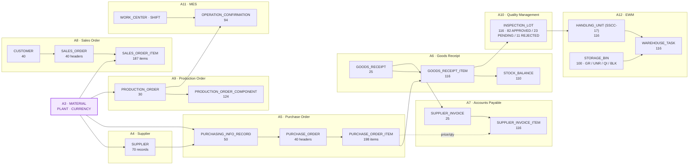

# A4 to A12: Complete Transactional Foundation of the Industrial Data Universe

**🌐 Idioma / Language:** [🇧🇷 Português](../BR/04-a4-a12-fundacao-transacional-completa.md) | 🇺🇸 **English**

[⬆️ Back to README](../../../README.en.md) | [⬅️ Previous scenario: A3](./03-a3-material-master-data.en.md)

> **Status:** ✅ Completed and validated
> **Physical schema:** `INDUSTRIAL_DATA`
> **Document:** `DOC 04` (consolidated — covers A4 through A12 in a single document, a deliberate scope decision)
> **Classification:** synthetic data, for educational purposes only

## 🎯 Executive overview

Starting at A4, every following scenario stopped being documented one by one. After mapping A4 through A9, it became clear each scenario was, in essence, the same operation — **create tables + load deterministic data + wire everything together via Foreign Keys to what already existed** — so the decision was to consolidate A4 through A9 (and later A10, A11, and A12, once scope grew to cover QM, MES, and EWM) into a single document, maximizing applied data while minimizing publishing overhead.

Each scenario was delivered as a **single SQL mega-script** (`Datasets/<Domain>/A<N>-COMPLETE-LOAD.sql`), generated deterministically (Python with `MOD` arithmetic, no randomness) and executed directly in **SAP HANA Cloud Central → SQL Console**. This closed, for the first time in the project, a full end-to-end business cycle: **procure-to-pay** (purchase → receipt → invoice), **order-to-cash** (customer → sales order), and **manufacturing** (production order → confirmation → quality → warehouse).

| Scenario | SAP Domain | What was built |
|---|---|---|
| A4 | MM — Supplier | Supplier master + purchasing config tables |
| A5 | MM — Purchasing | Purchasing Info Record + Purchase Order (header/item) |
| A6 | MM — Inventory | Goods receipt + aggregated stock balance |
| A7 | FI — Accounts Payable | Supplier invoice (3-way match PO + GR + Invoice) |
| A8 | SD — Sales | Customer master + Sales Order (finished goods) |
| A9 | PP — Production | Production Order + components (BOM consumption) |
| A10 | QM — Quality | Inspection lot + Usage Decision (UD) |
| A11 | PP/MES — Shop Floor | Work center + operation confirmation |
| A12 | EWM — Warehouse | Storage bin, Handling Unit (SSCC-17), warehouse task |

> [!IMPORTANT]
> All data is fictional. No supplier, customer, material, price, or identifier represents a real company. All values are synthetic and deterministically generated.

---

## 🧭 Functional storytelling

A3 left the Material Master ready but isolated: we knew what the factory *could* buy and sell, not *from whom* it bought, *to whom* it sold, or *what physically happened* to material once it arrived. A4 through A12 fill exactly that gap, following the real flow of an industrial operation:

1. **A4** gives suppliers a name and organizational structure (`SUPPLIER`), with type, status, and payment terms.
2. **A5** formalizes what each supplier can deliver and at what price (`PURCHASING_INFO_RECORD`, SAP EINA/EINE-style), and from there issues purchase orders (`PURCHASE_ORDER`) with a varying item count (1, 3, 5, 8, or 11 per order — deliberately, to simulate the reality that not every order looks alike).
3. **A6** physically receives the goods (`GOODS_RECEIPT`), with partial receipt on some items (55%–100% of the order), and updates the aggregated stock balance (`STOCK_BALANCE`).
4. **A7** invoices what was received, performing the classic 3-way match (Order + Receipt + Invoice), with payment status varying across paid, open, overdue, and disputed.
5. **A8**, in parallel, opens the sales side: 40 fictional customers buying finished goods (`FG-*`) from the A3 catalog.
6. **A9** closes the manufacturing loop: production orders consume components (`RM`/`EC`/`MC`/`SA`) via BOM and produce finished goods (`FG`).
7. **A10** answers a question A6 left open: **can every received material be used immediately?** No — each received item becomes an inspection lot, with a Usage Decision (`UD_CODE`) of approved, rejected, or pending.
8. **A11** steps onto the shop floor: every production order from A9 gets real operation confirmations by work center and shift, with good and scrap quantities.
9. **A12** gives everything a physical address: each inspection lot from A10 becomes a 17-digit Handling Unit (SSCC standard), physically moved (`WAREHOUSE_TASK`) into a warehouse bin — **free (UNR)** if approved, **quality-blocked (QI)** if pending, or **blocked (BLK)** if rejected.

The deliberate design point in A12: most of the stock (≈71%) **does not sit blocked waiting on a quality decision** — it is born in a free position, with UD already closed. Only a minority (≈20%) sits in quarantine (QI), and a smaller fraction (≈9%) is rejected (BLK). This mirrors a real operation, where most receipts clear quickly and only a fraction needs attention.

---

## 🏗️ Consolidated architecture



---

## 📊 Tables, data types, and volumes per scenario

### A4 — Supplier / Business Partner Foundation

| Table | Key | Main columns / types | Records |
|---|---|---|---:|
| `PAYMENT_TERMS` | `ZTERM` NVARCHAR(10) | `ZTERM_TEXT` NVARCHAR(200) | 11 |
| `SUPPLIER_TYPE` | `SUPPLIER_TYPE_CODE` NVARCHAR(10) | `SUPPLIER_TYPE_TEXT`, `_DESC` | 4 |
| `SUPPLIER_STATUS` | `STATUS_CODE` NVARCHAR(10) | `STATUS_TEXT` | 3 |
| `SUPPLIER_RATING_SCALE` | `RATING_CODE` INT | `RATING_TEXT`, `_DESCRIPTION` | 5 |
| `SUPPLIER` | `LIFNR` NVARCHAR(10) | `LIFNR_TEXT`, `LIFNR_TYPE` (FK), `LIFNR_STATUS` (FK), `COUNTRY`, `CURRENCY` (FK A3), `PAYMENT_TERMS` (FK), `INCOTERM`, `QUALITY_CERTIFIED` CHAR(1), `LEAD_TIME_DAYS` INT (1–120), `MIN_ORDER_QTY` DECIMAL(15,2) | 70 |
| `SUPPLIER_PLANT` / `SUPPLIER_CONTACT` / `SUPPLIER_PURCHASING_ORG` / `SUPPLIER_RATING` | — | Structure created with full FKs, reserved for a future load pass (no data this round) | 0 |

### A5 — Purchase Order Foundation

| Table | Key | Main columns / types | Records |
|---|---|---|---:|
| `DOC_TYPE` | `DOC_TYPE_CODE` NVARCHAR(2) | NB / FO / ZC | 3 |
| `PO_STATUS` | `STATUS_CODE` NVARCHAR(10) | OPEN / RELEASED / CLOSED / CANCELLED | 4 |
| `PURCHASING_INFO_RECORD` | `INFO_RECORD_ID` INT IDENTITY | `LIFNR` (FK), `MATNR` (FK), `EKORG` (FK), `NET_PRICE` DECIMAL(15,2), `PRICE_UNIT` INT, `INFO_LEAD_TIME_DAYS` | 50 |
| `PURCHASE_ORDER` | `EBELN` NVARCHAR(10) | `LIFNR`, `EKORG`, `DOC_TYPE_CODE`, `STATUS_CODE`, `CURRENCY`, `PO_DATE` DATE, `ITEM_COUNT` INT | 40 |
| `PURCHASE_ORDER_ITEM` | `PO_ITEM_ID` INT IDENTITY | `EBELN` (FK), `ITEM_NO`, `MATNR` (FK), `WERKS` (FK), `QUANTITY`, `NET_PRICE` DECIMAL(15,2), `DELIVERY_DATE` | 198 |

Item-count distribution per order (deliberate variety): 5 orders × 1 item · 12 × 3 · 12 × 5 · 8 × 8 · 3 × 11.

### A6 — Goods Receipt & Inventory

| Table | Key | Main columns / types | Records |
|---|---|---|---:|
| `MOVEMENT_TYPE` | `MOVEMENT_TYPE_CODE` NVARCHAR(3) | 101 / 102 / 261 / 262 | 4 |
| `GOODS_RECEIPT` | `GR_ID` NVARCHAR(10) | `EBELN` (FK), `WERKS` (FK), `MOVEMENT_TYPE_CODE` (FK), `GR_DATE` | 25 |
| `GOODS_RECEIPT_ITEM` | `GR_ITEM_ID` INT IDENTITY | `GR_ID` (FK), `PO_ITEM_NO`, `MATNR` (FK), `WERKS` (FK), `QUANTITY_ORDERED`, `QUANTITY_RECEIVED`, `RECEIPT_PCT` DECIMAL(5,2), `BATCH_NO` | 116 |
| `STOCK_BALANCE` | `STOCK_ID` INT IDENTITY | `MATNR` (FK), `WERKS` (FK), `QUANTITY_ON_HAND` DECIMAL(15,2), `LAST_UPDATED` | 110 |

Only orders with status `RELEASED`/`CLOSED` generate a receipt (25 of 40). Variable receipt: 70% of items at 100%, 30% partial (85% / 70% / 55%).

### A7 — Supplier Invoice / Accounts Payable

| Table | Key | Main columns / types | Records |
|---|---|---|---:|
| `PAYMENT_STATUS` | `STATUS_CODE` NVARCHAR(10) | OPEN / PAID / OVERDUE / DISPUTED | 4 |
| `SUPPLIER_INVOICE` | `INVOICE_ID` NVARCHAR(10) | `EBELN` (FK), `GR_ID` (FK), `LIFNR` (FK), `INVOICE_DATE`, `DUE_DATE`, `TOTAL_AMOUNT` DECIMAL(15,2), `STATUS_CODE` (FK) | 25 |
| `SUPPLIER_INVOICE_ITEM` | `INVOICE_ITEM_ID` INT IDENTITY | `INVOICE_ID` (FK), `ITEM_NO`, `MATNR` (FK), `QUANTITY_INVOICED`, `UNIT_PRICE`, `AMOUNT` | 116 |

3-way match: invoiced quantity = quantity received in A6; price = A5 item price.

### A8 — Sales Order Foundation

| Table | Key | Main columns / types | Records |
|---|---|---|---:|
| `SALES_DOC_TYPE` | `SALES_DOC_TYPE_CODE` NVARCHAR(2) | OR / RE / CS | 3 |
| `CUSTOMER` | `KUNNR` NVARCHAR(10) | `KUNNR_TEXT`, `COUNTRY`, `CURRENCY` (FK), `CREDIT_LIMIT` DECIMAL(15,2) | 40 |
| `SALES_ORDER` | `VBELN` NVARCHAR(10) | `KUNNR` (FK), `WERKS` (FK), `SALES_DOC_TYPE_CODE` (FK), `ORDER_DATE`, `ITEM_COUNT` | 40 |
| `SALES_ORDER_ITEM` | `SO_ITEM_ID` INT IDENTITY | `VBELN` (FK), `ITEM_NO`, `MATNR` (FK, `FG-*` only), `QUANTITY`, `NET_PRICE`, `SHIP_DATE` | 187 |

### A9 — Production Order / MRP

| Table | Key | Main columns / types | Records |
|---|---|---|---:|
| `PRODUCTION_ORDER_STATUS` | `STATUS_CODE` NVARCHAR(10) | CRTD / REL / CNF / TECO | 4 |
| `PRODUCTION_ORDER` | `AUFNR` NVARCHAR(10) | `MATNR` (FK, finished good), `WERKS` (FK), `STATUS_CODE` (FK), `QUANTITY_PLANNED`, `QUANTITY_CONFIRMED`, `START_DATE`, `FINISH_DATE` | 30 |
| `PRODUCTION_ORDER_COMPONENT` | `COMPONENT_ID` INT IDENTITY | `AUFNR` (FK), `COMPONENT_NO`, `COMPONENT_MATNR` (FK, `RM`/`EC`/`MC`/`SA`), `QUANTITY_REQUIRED`, `QUANTITY_CONSUMED` | 124 |

BOM variety per order: 10 orders × 3 components · 10 × 4 · 6 × 5 · 4 × 6.

### A10 — Quality Management

| Table | Key | Main columns / types | Records |
|---|---|---|---:|
| `INSPECTION_TYPE` | `INSPECTION_TYPE_CODE` NVARCHAR(2) | 01 / 04 / 08 | 3 |
| `UD_CODE` | `UD_CODE` NVARCHAR(10) | APPROVED / REJECTED / PENDING | 3 |
| `INSPECTION_LOT` | `LOT_ID` NVARCHAR(12) | `GR_ID` (FK A6), `MATNR` (FK), `WERKS` (FK), `INSPECTION_TYPE_CODE` (FK), `LOT_QUANTITY`, `UD_CODE` (FK), `CREATED_DATE`, `UD_DATE` (null if pending) | 116 |

UD distribution: **82 APPROVED (71%) · 23 PENDING (20%) · 11 REJECTED (9%)** — 1 lot per item received in A6.

### A11 — MES (Manufacturing Execution)

| Table | Key | Main columns / types | Records |
|---|---|---|---:|
| `SHIFT` | `SHIFT_CODE` NVARCHAR(2) | A (morning) / B (afternoon) / C (night) | 3 |
| `WORK_CENTER` | `WORK_CENTER_ID` NVARCHAR(6) | `WORK_CENTER_TEXT`, `WERKS` (FK) | 10 |
| `OPERATION_CONFIRMATION` | `CONFIRMATION_ID` INT IDENTITY | `AUFNR` (FK A9), `OPERATION_NO`, `OPERATION_TEXT`, `WORK_CENTER_ID` (FK), `SHIFT_CODE` (FK), `QUANTITY_GOOD`, `QUANTITY_SCRAP`, `SETUP_TIME_MIN`, `RUN_TIME_MIN`, `CONFIRMATION_DATE` | 94 |

Operation count per order varies with status: `CRTD` = 0, `REL` = 2, `CNF`/`TECO` = 3 to 5.

### A12 — EWM (Extended Warehouse Management)

| Table | Key | Main columns / types | Records |
|---|---|---|---:|
| `WAREHOUSE_NUMBER` | `WAREHOUSE_ID` NVARCHAR(4) | `WAREHOUSE_TEXT` | 1 |
| `STORAGE_TYPE` | `STORAGE_TYPE_CODE` NVARCHAR(4) | GR / UNR / QI / BLK | 4 |
| `STORAGE_BIN` | `BIN_ID` NVARCHAR(15) | `WAREHOUSE_ID` (FK), `WERKS` (FK), `STORAGE_TYPE_CODE` (FK), `AISLE`, `BIN_LEVEL` | 100 |
| `HANDLING_UNIT` | `HU_ID` NVARCHAR(17) — **SSCC-17** | `MATNR` (FK), `WERKS` (FK), `LOT_ID` (FK A10), `QUANTITY`, `CREATED_DATE` | 116 |
| `WAREHOUSE_TASK` | `TASK_ID` INT IDENTITY | `HU_ID` (FK), `SOURCE_BIN_ID` (FK), `DEST_BIN_ID` (FK), `TASK_STATUS` (OPEN/CONFIRMED), `TASK_DATE` | 116 |

Placement is wired to the A10 UD decision: `APPROVED → UNR` (free, `CONFIRMED`) · `PENDING → QI` (quality-blocked, `OPEN`) · `REJECTED → BLK` (blocked, `CONFIRMED`).

---

## 📐 Why EWM, not classic WM

The warehouse (A12) was modeled with **EWM** concepts, not classic SAP ERP WM — a deliberate decision, documented here because it affects naming used across the rest of the repository (badges, roadmap, functional domains).

- **17-digit Handling Unit (HU)**: in EWM, every stock movement is HU-managed by default, identified by an **SSCC** (Serial Shipping Container Code) pattern — that's the origin of the 17-digit identifier used in `HANDLING_UNIT.HU_ID`. In classic WM, HU only existed as an add-on (LE-HU), not a native concept.
- **Classic WM is at end of life** on the SAP roadmap: in S/4HANA, the recommendation is to migrate to EWM (complex operations) or Stock Room Management / Basic Warehouse (simple operations). No new development is recommended on classic WM.
- **Trade-off accepted**: EWM requires more master-data layers (Warehouse Number → Storage Type → Storage Bin) than classic WM would for the same result. That added complexity was accepted because it reflects the current market.

---

## 📈 Final reconciliation

| Scenario | New tables | Records loaded |
|---|---:|---:|
| A4 | 9 (4 config + 5 Supplier structure) | 93 |
| A5 | 5 | 295 |
| A6 | 4 | 255 |
| A7 | 3 | 145 |
| A8 | 4 | 270 |
| A9 | 3 | 158 |
| A10 | 3 | 122 |
| A11 | 3 | 107 |
| A12 | 5 | 337 |
| **Total A4–A12** | **39 tables** | **≈ 1,782 records** |

Combined with the A3 baseline (6,066 records), the `INDUSTRIAL_DATA` schema closes this phase with **≈ 7,848 records** spanning the full procure-to-pay, order-to-cash, manufacturing, quality, and warehouse cycle.

---

## 🗂️ Where the scripts live

Each scenario lives in a single self-contained SQL file (DROP → CREATE → INSERT → validation), with no external tooling dependency — just copy/paste into **Cloud Central → SQL Console**:

```text
Industrial-Data-Universe/Datasets/
├── Supplier/A4-COMPLETE-LOAD.sql
├── PurchaseOrder/A5-COMPLETE-LOAD.sql
├── Inventory/A6-COMPLETE-LOAD.sql
├── AccountsPayable/A7-COMPLETE-LOAD.sql
├── SalesOrder/A8-COMPLETE-LOAD.sql
├── Production/A9-COMPLETE-LOAD.sql
├── QualityManagement/A10-COMPLETE-LOAD.sql
├── MES/A11-COMPLETE-LOAD.sql
└── EWM/A12-COMPLETE-LOAD.sql
```

> On the first run of each script, the leading `DROP TABLE ... CASCADE` statements fail with "table not found" (expected — nothing existed before). Use **Skip All** in Cloud Central and continue; `CREATE`/`INSERT`/validation run normally afterward.

---

[⬆️ Back to README](../../../README.en.md) | [⬅️ Previous scenario: A3](./03-a3-material-master-data.en.md)
