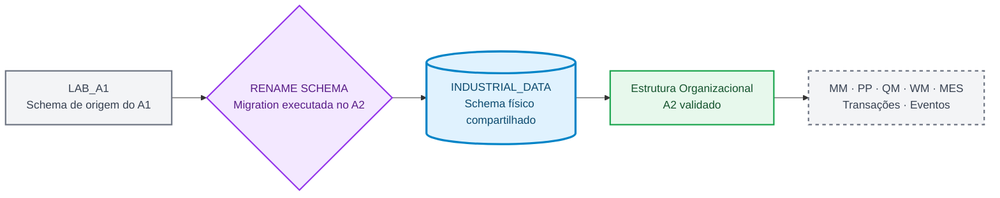
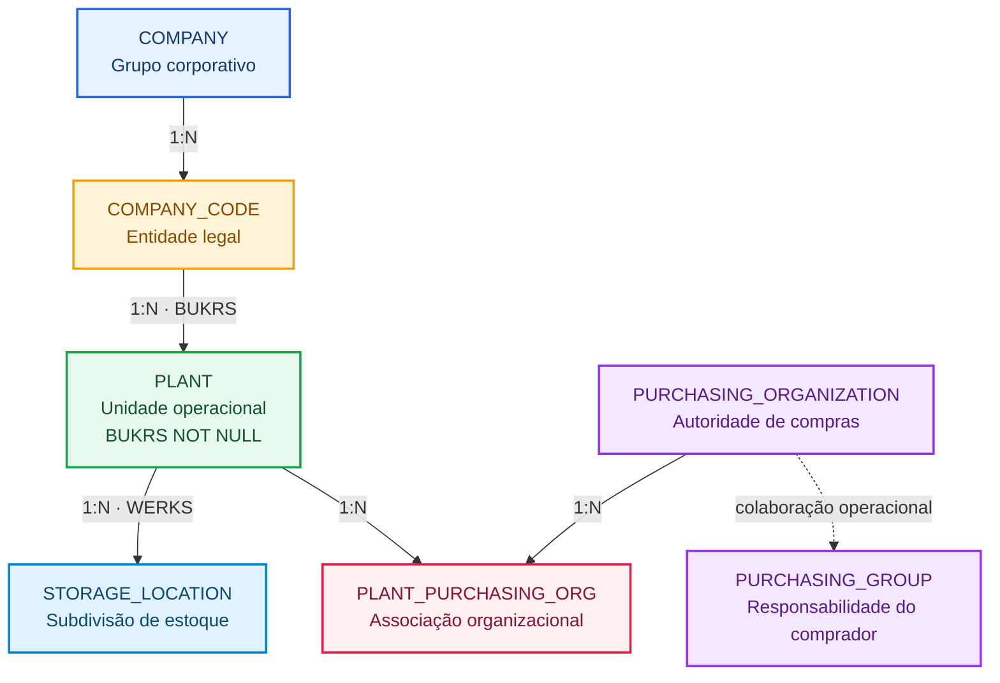

# Blueprint do Universo de Dados Industriais

**🌐 Idioma / Language:** 🇧🇷 **Português** | [🇺🇸 English](../EN/industrial-data-universe-blueprint.en.md)

> **Versão interna:** `1.2.0`  
> **Status:** ✅ Aprovado para implementação incremental  
> **Última atualização:** `2026-09-08`  
> **Seed determinística:** `20260903`  
> **Companhia:** `Fictional Industrial Manufacturing Group`  
> **Classificação:** dados sintéticos exclusivamente educacionais

## Propósito

O Blueprint governa o universo de dados industriais compartilhado entre os diferentes cenários do projeto. A identidade documental permanece associada a cada DOC e LAB, enquanto os dados físicos evoluem no schema compartilhado `INDUSTRIAL_DATA` do SAP HANA Cloud.

A existência de versões separadas em português e inglês facilita a leitura por públicos diferentes sem duplicar a fonte técnica processável. O arquivo JSON localizado na raiz de `Blueprint/` permanece como fonte canônica para automações, geradores, validadores e futuras aplicações.

## Estado atual do schema

A migration executada no cenário A2 generalizou o nome físico do schema sem alterar a identidade histórica do laboratório A1:

```text
Schema físico anterior:       LAB_A1
Schema físico atual:          INDUSTRIAL_DATA
Status da migration:          APPLIED
Status da validação:          PASSED
```



## Identidade documental e física

Os nomes dos laboratórios registram a história de implementação. O nome do schema representa a localização física atual dos dados:

```text
DOC 01 ↔ A1 ↔ Evidences/LAB_A1
DOC 02 ↔ A2 ↔ Evidences/LAB_A2
Schema físico compartilhado ↔ INDUSTRIAL_DATA
```

Portanto, referências históricas a `LAB_A1` não devem ser substituídas globalmente por `INDUSTRIAL_DATA`. O primeiro identifica o laboratório e suas evidências; o segundo identifica o schema físico ativo.

## Fundação A1 preservada

A migration preservou integralmente os dados e relacionamentos construídos no cenário A1:

| Entidade | Registros |
|---|---:|
| `PLANT` | 20 |
| `MATERIAL` | 300 |
| `STORAGE_LOCATION` | 152 |
| `MATERIAL_PLANT` | 1.080 |
| `MATERIAL_STORAGE_LOCATION` | 2.163 |
| **Total do A1** | **3.715** |

Os resultados permaneceram coerentes após a mudança de schema:

- Primary Keys duplicadas: `0`;
- Foreign Keys órfãs: `0`;
- cinco tabelas Foundation preservadas;
- cinco Foreign Keys Foundation aplicadas e validadas;
- 3.715 registros preservados.

## A2 · Estrutura Organizacional materializada e validada

O cenário A2 adicionou a hierarquia legal e a estrutura de compras necessárias para conectar a fundação de dados aos futuros processos transacionais.



Os identificadores físicos das entidades permanecem em inglês e em letras maiúsculas porque correspondem aos nomes reais das tabelas no SAP HANA Cloud. As descrições funcionais do diagrama foram traduzidas para facilitar a compreensão do público brasileiro.

### Resultado consolidado

| Controle | Resultado |
|---|---:|
| Company | 1 |
| Company Codes | 4 |
| Plants atualizados | 20 |
| Purchasing Organizations | 5 |
| Purchasing Groups | 12 |
| Associações Plant × Purchasing Organization | 33 |
| Novos registros do A2 | 55 |
| Registros Foundation preservados | 3.715 |
| Total de registros no schema | 3.770 |
| Tabelas | 10 |
| Foreign Keys lógicas | 10 |
| Foreign Keys aplicadas | 10 |
| Foreign Keys validadas | 10 |
| Regras finais com status `PASSED` | 20 |
| Evidências físicas | 18 |

### Company Codes

Os quatro Company Codes representam entidades legais brasileiras fictícias. Todos utilizam `BRL` como moeda local:

| BUKRS | Nome | País | Moeda | Perfil | Plants |
|---|---|---|---|---|---:|
| `FBR1` | Industrial Manufacturing Brazil | `BRA` | `BRL` | Manufatura | 9 |
| `FBR2` | Components Manufacturing Brazil | `BRA` | `BRL` | Componentes | 2 |
| `FBR3` | Logistics and Distribution Brazil | `BRA` | `BRL` | Logística | 6 |
| `FBR4` | Engineering and Services Brazil | `BRA` | `BRL` | Engenharia e serviços | 3 |

Os nomes mestres continuam em inglês porque representam valores efetivamente carregados nas tabelas e poderão ser consumidos por aplicações, APIs e relatórios bilíngues.

### Evolução controlada de `PLANT`

A tabela `PLANT`, previamente criada e carregada no A1, foi evoluída sem recriação ou perda de registros:

1. a coluna `BUKRS NVARCHAR(4)` foi adicionada temporariamente como nullable;
2. os 20 Plants foram associados aos quatro Company Codes;
3. a ausência de valores nulos e desconhecidos foi validada;
4. a coluna `BUKRS` foi alterada para `NOT NULL`;
5. a constraint `FK_PLANT_COMPANY_CODE` foi criada;
6. a Foreign Key foi confirmada como aplicada e validada;
7. testes negativos demonstraram a rejeição de Company Codes inexistentes.

### Estrutura de compras

As Purchasing Organizations materializam a autoridade de compras, enquanto os Purchasing Groups representam responsabilidades por categorias de materiais, serviços ou investimentos.

- `P100`: Corporate Strategic Procurement, com escopo `CROSS_COMPANY_CODE`;
- `P110`: Manufacturing Procurement, associada primariamente ao `FBR1`;
- `P120`: Components Procurement, associada primariamente ao `FBR2`;
- `P130`: Logistics Procurement, associada primariamente ao `FBR3`;
- `P140`: Engineering and Services Procurement, associada primariamente ao `FBR4`;
- 20 associações do tipo `PRIMARY`;
- 13 associações do tipo `STRATEGIC_SUPPORT`;
- 33 associações válidas, sem registros órfãos ou duplicados.

A organização `P100` possui `PRIMARY_BUKRS = NULL` intencionalmente, pois representa uma autoridade corporativa transversal e não uma organização limitada a um único Company Code.

O A2 também preserva `PURCHASING_GROUP` sem uma Foreign Key obrigatória para uma única Purchasing Organization. Essa decisão evita impor uma cardinalidade artificial antes dos futuros cenários completos de procurement.

### Artefatos reproduzíveis

O cenário A2 foi preservado como um pacote reproduzível de scripts e validações:

```text
Industrial-Data-Universe/Datasets/Enterprise-Structure/
├── Load/          6 scripts SQL de carga e construção
├── Validation/    6 scripts SQL de validação
└── a2-enterprise-structure-sql-manifest.json
```

O manifest foi validado com:

```text
Scripts de carga:                 6
Scripts de validação:             6
Referências físicas no manifest: 12
Arquivos ausentes:                0
```

Os scripts da pasta `Load/` representam a reconstrução do cenário a partir do estado final do A1. Eles não devem ser reexecutados no ambiente atual porque os objetos e dados do A2 já estão materializados. Os scripts da pasta `Validation/` podem ser utilizados para auditoria e reconciliação.

## Cenário futuro de conversão BRL ↔ USD

Os Plants `1200` e `2800` foram validados como organizacionalmente preparados para futuros documentos em `USD`, mantendo `BRL` como moeda local do Company Code.

```text
Plant principal:             2800 · Export Operations Plant
Plant complementar:          1200 · Electronic Components Plant
Moeda local:                 BRL
Moeda futura do documento:   USD
Tipo de taxa planejado:      M
Fonte futura das taxas:      dados sintéticos e versionados
Aplicação Fiori futura:      Multicurrency Procurement Monitor
```

A validação do A2 indica apenas prontidão organizacional. As tabelas de moeda, taxas, validade temporal, fatores de conversão, valores documentais e valores convertidos ainda não foram implementadas.

A futura solução deverá preservar o valor e a moeda originais em `USD` e derivar o valor local em `BRL`. Antes da implementação, deverão ser revalidados o quotation method, os fatores, a precisão decimal e a regra de seleção da taxa por data.

## Materialização incremental

| Domínio | Momento | Situação |
|---|---|---|
| Foundation | A1 / DOC 01 | ✅ Materializado e validado |
| Estrutura Organizacional | A2 / DOC 02 | ✅ Materializado e validado |
| Fornecedores MM | A4–A6 | 🔄 Blueprint até validação |
| Dados mestres PP | A7 | 🔄 Blueprint até validação |
| Dados mestres QM | A6/A7 | 🔄 Blueprint até validação |
| Dados mestres WM | A8 | 🔄 Blueprint até validação |
| Dados mestres MES | A9 | 🔄 Blueprint até validação |
| Transações | Bloco E | 🔄 Aguardar dados mestres validados |
| Moedas e taxas de câmbio | Futuro procurement/analytics | 🔄 Blueprint até validação |
| Eventos | Bloco I | 🔄 Aguardar modelo transacional validado |

Os nomes dos objetos e módulos SAP permanecem em inglês quando representam termos técnicos, identificadores físicos ou domínios consolidados do projeto. Os textos explicativos e os estados foram traduzidos para português.

## Gates de qualidade

1. nenhuma Primary Key duplicada;
2. nenhuma Foreign Key órfã;
3. nenhum campo obrigatório vazio;
4. comprimentos compatíveis com o target SAP HANA Cloud;
5. migrations preservam objetos, constraints e registros;
6. todos os 20 Plants possuem um Company Code válido;
7. cada Plant possui exatamente uma associação de compras primária;
8. associações de compras não possuem Plants ou organizações órfãs;
9. manifest e caminhos físicos permanecem reconciliados;
10. a seed fixa reproduz a massa sintética;
11. testes negativos falham somente pelo motivo planejado;
12. cenários cambiais preservam a moeda e o valor originais.

## Próxima ação

O cenário A2 está concluído e documentado. Antes de abrir o próximo cenário do Bloco A, o README vivo do repositório deve ser relido para identificar as opções reais ainda pendentes e confirmar o nome físico do próximo DOC, da próxima pasta de evidências e dos artefatos a serem produzidos.
