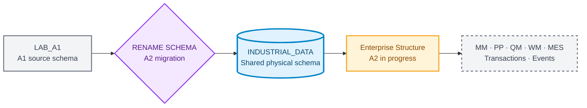
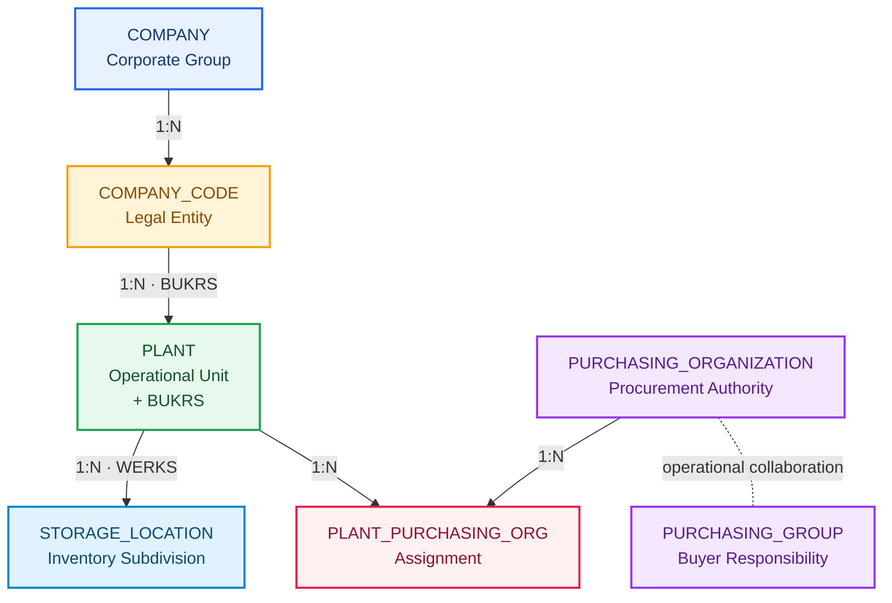

# Industrial Data Universe Blueprint

**🌐 Idioma / Language:** 🇧🇷 **Português** | [🇺🇸 English](../EN/industrial-data-universe-blueprint.en.md)

> **Versão interna:** `1.1.0`  
> **Status:** ✅ Aprovado para implementação incremental  
> **Seed determinística:** `20260903`  
> **Companhia:** `Fictional Industrial Manufacturing Group`  
> **Classificação:** dados sintéticos exclusivamente educacionais

## Propósito

O Blueprint governa o universo industrial transversal do projeto. A identidade documental continua associada a cada DOC e LAB, enquanto os dados físicos evoluem em um schema compartilhado no SAP HANA Cloud.

## Estado atual do schema

A migration do A2 foi executada e reconciliada:

```text
Previous physical schema: LAB_A1
Current physical schema:  INDUSTRIAL_DATA
Migration status:         APPLIED
Validation status:        PASSED
```



A identidade histórica permanece:

```text
DOC 01 ↔ A1 ↔ Evidences/LAB_A1
DOC 02 ↔ A2 ↔ Evidences/LAB_A2
Schema físico compartilhado ↔ INDUSTRIAL_DATA
```

## Fundação validada do A1

| Entidade | Registros |
|---|---:|
| `PLANT` | 20 |
| `MATERIAL` | 300 |
| `STORAGE_LOCATION` | 152 |
| `MATERIAL_PLANT` | 1.080 |
| `MATERIAL_STORAGE_LOCATION` | 2.163 |
| **Total** | **3.715** |

- Validation Engine: `PASSED`;
- Primary Keys duplicadas: `0`;
- Foreign Keys órfãs: `0`;
- associações ativas: `2.066`;
- associações inativas: `97`;
- evidências físicas do A1: `30`.

## Migration SCHEMA_GENERALIZATION

A migration `LAB_A1 → INDUSTRIAL_DATA` foi aplicada em `2026-09-03` e validada pela Evidência 03 do A2.

| Controle | Resultado |
|---|---:|
| Schema antigo existente | 0 |
| Schema atual existente | 1 |
| Tabelas preservadas | 5 |
| Foreign Keys preservadas | 5 |
| Foreign Keys aplicadas | 5 |
| Foreign Keys validadas | 5 |
| Registros preservados | 3.715 |
| Status | `PASSED` |

## A2 · Enterprise Structure Package

O A2 introduz a estrutura organizacional inspirada no SAP e evolui a tabela `PLANT` existente.



### Entidades e volumes planejados

| Entidade | Primary Key | Volume |
|---|---|---:|
| `COMPANY` | `COMPANY_ID` | 1 |
| `COMPANY_CODE` | `BUKRS` | 4 |
| `PURCHASING_ORGANIZATION` | `EKORG` | 5 |
| `PURCHASING_GROUP` | `EKGRP` | 12 |
| `PLANT_PURCHASING_ORG` | `WERKS + EKORG` | 33 |
| `PLANT` a atualizar | `WERKS` | 20 |

### Company Codes

| BUKRS | Nome | País | Moeda | Perfil |
|---|---|---|---|---|
| `FBR1` | Industrial Manufacturing Brazil | `BRA` | `BRL` | Manufacturing |
| `FBR2` | Components Manufacturing Brazil | `BRA` | `BRL` | Components |
| `FBR3` | Logistics and Distribution Brazil | `BRA` | `BRL` | Logistics |
| `FBR4` | Engineering and Services Brazil | `BRA` | `BRL` | Engineering/Services |

### Evolução controlada de PLANT

A tabela existente será preservada e receberá `BUKRS NVARCHAR(4)`:

1. criar `COMPANY` e `COMPANY_CODE`;
2. carregar uma Company e quatro Company Codes;
3. adicionar `PLANT.BUKRS` aceitando `NULL` temporariamente;
4. atualizar os 20 Plants conforme o mapping aprovado;
5. validar ausência de `NULL` ou BUKRS desconhecido;
6. alterar `BUKRS` para `NOT NULL`;
7. criar `FK_PLANT_COMPANY_CODE`;
8. validar catálogo, contagens e JOIN organizacional.

### Purchasing Organizations

- `P100`: Corporate Strategic Procurement;
- `P110`: Manufacturing Procurement;
- `P120`: Components Procurement;
- `P130`: Logistics Procurement;
- `P140`: Engineering and Services Procurement.

Cada Plant possui uma organização primária. Treze Plants também recebem suporte estratégico da `P100`, totalizando **33 associações**.

### Purchasing Groups

Doze grupos representam responsabilidades por categoria. O A2 não restringe `PURCHASING_GROUP` a uma única Purchasing Organization, evitando congelar uma cardinalidade artificial antes dos cenários completos de procurement.

## Cenário futuro de conversão BRL ↔ USD

A moeda local permanece no Company Code, e não diretamente no Plant. Documentos futuros podem usar `USD`, exigindo conversão para `BRL` por taxa válida na data do negócio.

```text
Primary Plant:          2800 · Export Operations Plant
Secondary Plant:        1200 · Electronic Components Plant
Company Code currency:  BRL
Document currency:      USD
Planned rate type:      M
Rate source:            Synthetic and versioned
```

A futura aplicação Fiori **Multicurrency Procurement Monitor** deverá exibir valor original em USD, valor local em BRL, taxa aplicada, tipo de taxa, validade e status. Taxas ausentes, ambíguas ou fora da validade gerarão erro explícito.

Nenhuma cotação real será congelada no Blueprint. Quotation method, fatores, precisão decimal e regra temporal serão revalidados antes da implementação.

## Materialização incremental

| Domínio | Momento | Situação |
|---|---|---|
| Foundation | A1 / DOC 01 | ✅ Materializado e validado |
| Enterprise Structure | A2 / DOC 02 | 🔄 Em implementação |
| MM Supplier | A4-A6 | Blueprint até validação |
| PP Master Data | A7 | Blueprint até validação |
| QM Master Data | A6/A7 | Blueprint até validação |
| WM Master Data | A8 | Blueprint até validação |
| MES Master Data | A9 | Blueprint até validação |
| Transações | Bloco E | Aguardar mestres validados |
| Currency and Exchange Rates | Futuro procurement/analytics | Blueprint até validação |
| Eventos | Bloco I | Aguardar modelo transacional validado |

## Gates de qualidade

1. nenhuma Primary Key duplicada;
2. nenhuma Foreign Key órfã;
3. nenhum campo obrigatório vazio;
4. comprimentos compatíveis com o target HANA;
5. migrations sem perda de objeto, constraint ou linha;
6. todos os 20 Plants associados a um Company Code válido;
7. arquivos negativos falham somente pelo motivo planejado;
8. contagens e checksums registrados no manifest;
9. seed fixa reproduz integralmente a massa;
10. cenários cambiais preservam moeda e valor originais.

## Próxima ação

Criar `COMPANY` e `COMPANY_CODE` no schema `INDUSTRIAL_DATA`, carregar uma Company e quatro Company Codes, validar PK/FK e somente depois iniciar a evolução de `PLANT.BUKRS`.
