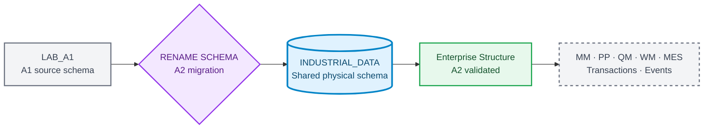
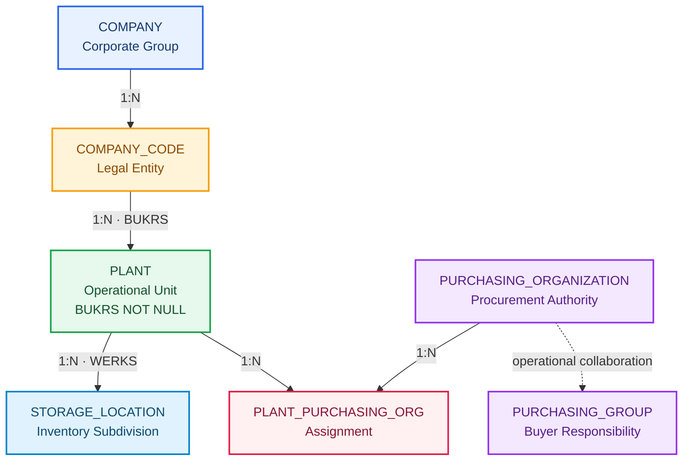

# Industrial Data Universe Blueprint

**🌐 Idioma / Language:** 🇧🇷 **Português** | [🇺🇸 English](../EN/industrial-data-universe-blueprint.en.md)

> **Versão interna:** `1.2.0`  
> **Status:** ✅ Aprovado para implementação incremental  
> **Última atualização:** `2026-09-08`  
> **Seed determinística:** `20260903`  
> **Companhia:** `Fictional Industrial Manufacturing Group`  
> **Classificação:** dados sintéticos exclusivamente educacionais

## Propósito

O Blueprint governa o universo industrial transversal do projeto. A identidade documental permanece associada a cada DOC e LAB, enquanto os dados físicos evoluem no schema compartilhado `INDUSTRIAL_DATA` do SAP HANA Cloud.

## Estado atual do schema

```text
Previous physical schema: LAB_A1
Current physical schema:  INDUSTRIAL_DATA
Migration status:         APPLIED
Validation status:        PASSED
```



## Identidade documental e física

```text
DOC 01 ↔ A1 ↔ Evidences/LAB_A1
DOC 02 ↔ A2 ↔ Evidences/LAB_A2
Shared physical schema ↔ INDUSTRIAL_DATA
```

## Fundação A1 preservada

| Entidade | Registros |
|---|---:|
| `PLANT` | 20 |
| `MATERIAL` | 300 |
| `STORAGE_LOCATION` | 152 |
| `MATERIAL_PLANT` | 1.080 |
| `MATERIAL_STORAGE_LOCATION` | 2.163 |
| **Total A1** | **3.715** |

## A2 · Enterprise Structure materializado e validado



### Resultado consolidado

| Controle | Resultado |
|---|---:|
| Company | 1 |
| Company Codes | 4 |
| Plants atualizados | 20 |
| Purchasing Organizations | 5 |
| Purchasing Groups | 12 |
| Plant × Purchasing Organization | 33 |
| Novos registros A2 | 55 |
| Registros Foundation preservados | 3.715 |
| Total no schema | 3.770 |
| Tabelas | 10 |
| Foreign Keys lógicas | 10 |
| Foreign Keys aplicadas | 10 |
| Foreign Keys validadas | 10 |
| Regras finais `PASSED` | 20 |
| Evidências físicas | 18 |

### Company Codes

| BUKRS | Nome | País | Moeda | Plants |
|---|---|---|---|---:|
| `FBR1` | Industrial Manufacturing Brazil | `BRA` | `BRL` | 9 |
| `FBR2` | Components Manufacturing Brazil | `BRA` | `BRL` | 2 |
| `FBR3` | Logistics and Distribution Brazil | `BRA` | `BRL` | 6 |
| `FBR4` | Engineering and Services Brazil | `BRA` | `BRL` | 3 |

### Estrutura de compras

- `P100`: Corporate Strategic Procurement, escopo `CROSS_COMPANY_CODE`;
- `P110`: Manufacturing Procurement, referência `FBR1`;
- `P120`: Components Procurement, referência `FBR2`;
- `P130`: Logistics Procurement, referência `FBR3`;
- `P140`: Engineering and Services Procurement, referência `FBR4`;
- 20 associações `PRIMARY`;
- 13 associações `STRATEGIC_SUPPORT`;
- 33 associações válidas, sem órfãos ou duplicidades.

### Artefatos reproduzíveis

```text
Industrial-Data-Universe/Datasets/Enterprise-Structure/
├── Load/          6 SQL scripts
├── Validation/    6 SQL scripts
└── a2-enterprise-structure-sql-manifest.json
```

O manifest foi validado com 12 referências físicas e zero arquivos ausentes.

## Cenário futuro BRL ↔ USD

Os Plants `1200` e `2800` foram validados como organizacionalmente preparados para documentos futuros em `USD`, mantendo `BRL` como moeda local do Company Code. A conversão cambial ainda não foi materializada.

```text
Primary Plant:          2800 · Export Operations Plant
Secondary Plant:        1200 · Electronic Components Plant
Local currency:         BRL
Future document currency: USD
Planned rate type:      M
Future Fiori app:       Multicurrency Procurement Monitor
```

## Materialização incremental

| Domínio | Momento | Situação |
|---|---|---|
| Foundation | A1 / DOC 01 | ✅ Materializado e validado |
| Enterprise Structure | A2 / DOC 02 | ✅ Materializado e validado |
| MM Supplier | A4-A6 | Blueprint até validação |
| PP Master Data | A7 | Blueprint até validação |
| QM Master Data | A6/A7 | Blueprint até validação |
| WM Master Data | A8 | Blueprint até validação |
| MES Master Data | A9 | Blueprint até validação |
| Transações | Bloco E | Aguardar mestres validados |
| Currency and Exchange Rates | Futuro procurement/analytics | Blueprint até validação |
| Eventos | Bloco I | Aguardar modelo transacional validado |

## Gates de qualidade

1. nenhuma Primary Key duplicada;
2. nenhuma Foreign Key órfã;
3. nenhum campo obrigatório vazio;
4. comprimentos compatíveis com o target HANA;
5. migrations preservam objetos, constraints e registros;
6. todos os 20 Plants possuem Company Code válido;
7. cada Plant possui exatamente uma associação de compras primária;
8. manifest e caminhos físicos permanecem reconciliados;
9. seed fixa reproduz a massa;
10. cenários cambiais preservam moeda e valor originais.

## Próxima ação

Ler novamente o roadmap vivo do repositório antes de abrir o próximo cenário do Bloco A. O DOC 02 registra a conclusão completa do A2.
