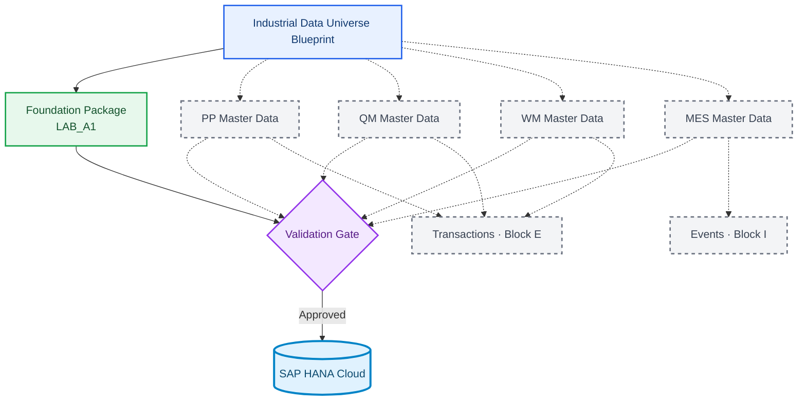

# Industrial Data Universe Blueprint v1

**🌐 Idioma / Language:** 🇧🇷 **Português** | [🇺🇸 English](./industrial-data-universe-blueprint-v1.en.md)

> **Status:** ✅ Aprovado para implementação incremental  
> **Seed determinística:** `20260903`  
> **Companhia:** `Fictional Industrial Manufacturing Group`  
> **Classificação:** dados sintéticos exclusivamente educacionais

## Propósito

Este blueprint define desde o início o universo industrial completo do projeto, sem antecipar de forma imprudente a criação física de todas as tabelas. A fundação será materializada agora; PP, QM, WM, MES, transações e eventos serão adicionados somente após a validação funcional e técnica de cada cenário.

## Estratégia



## Pacote que será materializado no LAB_A1

| Entidade | Volume |
|---|---:|
| Plants | 20 |
| Storage Locations | 150 a 180 |
| Materials | 300 |
| Material × Plant | 900 a 1.200 |
| Material × Storage Location | 2.000 a 3.000 |

## Famílias de materiais

| Prefixo | Categoria | Quantidade | Tipo inspirado em SAP |
|---|---|---:|---|
| `RM` | Matérias-primas | 80 | `ROH` |
| `EC` | Componentes eletrônicos | 60 | `ROH` |
| `MC` | Componentes mecânicos | 60 | `ROH` |
| `SA` | Conjuntos semiacabados | 40 | `HALB` |
| `FG` | Produtos acabados | 40 | `FERT` |
| `PK` | Materiais de embalagem | 20 | `VERP` |

## Regra para os 20 Plants

Todo Plant é multifuncional. O nome indica apenas o perfil predominante. Procurement, receiving, quality, planning, storage, inventory e shipping podem coexistir no mesmo Plant. Plants produtivos também incluem production e maintenance.

A definição está alinhada ao conceito SAP de Plant como unidade logística usada por produção, procurement, manutenção e planejamento, com dados de material mantidos em diferentes visões no nível do centro. A Storage Location diferencia estoques dentro de um Plant e forma uma chave composta com o Plant. citeturn90search13turn90search15

## Materialização incremental por domínio

| Domínio | Momento | Situação |
|---|---|---|
| Foundation | DOC 02 / LAB_A1 | Materializar agora |
| Supplier / Procurement | A4-A6 | Blueprint até validação |
| PP Master Data | A7 | Blueprint até validação |
| QM Master Data | A6/A7 | Blueprint até validação |
| WM Master Data | A8 | Blueprint até validação |
| MES Master Data | A9 | Blueprint até validação |
| Transações | Bloco E | Aguardar mestres validados |
| Eventos | Bloco I | Aguardar modelo transacional validado |

Uma Production Order depende de materiais, BOM, routing, work centers e production version. A production version determina a combinação de BOM e routing utilizada pela ordem. Por esse motivo, ordens não serão geradas antes da validação dos mestres de PP. citeturn90search19turn90search21

Inspeções produtivas também exigem definição prévia do cenário. Origem 03 atende inspeções em processo e origem 04 atende inspeções de goods receipt, com diferenças de stock relevance e momento de criação do inspection lot. O blueprint reserva essas entidades, mas não congela sua cardinalidade antes do laboratório QM. citeturn90search25turn90search26turn90search27

## Cenário futuro de conversão BRL → USD e USD → BRL

Os quatro Company Codes do A2 permanecem com moeda local `BRL`. A conversão não será atribuída diretamente ao Plant, pois a moeda local pertence ao contexto do Company Code. O cenário será provocado por documentos de compra ou análises em moeda estrangeira.

O caso principal utilizará o Plant `2800` (`Export Operations Plant`) e um documento em `USD`. Como caso complementar, o Plant `1200` (`Electronic Components Plant`) poderá simular aquisição internacional de componentes.

```text
Company Code currency: BRL
Document currency:     USD
Exchange-rate type:    M
Conversion date:       posting date or business date
```

A futura aplicação Fiori **Multicurrency Procurement Monitor** exibirá valor original em USD, valor local em BRL, taxa aplicada, tipo de taxa, validade e status da conversão. Taxa ausente, ambígua ou fora da validade deverá gerar erro explícito.

A massa de taxas será sintética e versionada. Nenhuma cotação real será congelada no Blueprint. Quotation method, fatores, precisão decimal e regra temporal serão revalidados antes da implementação.

## Gates de qualidade

1. nenhuma Primary Key duplicada;
2. nenhuma Foreign Key órfã nos pacotes válidos;
3. nenhum campo obrigatório vazio;
4. comprimentos compatíveis com as tabelas HANA;
5. arquivos inválidos falham somente pelo motivo planejado;
6. contagens e checksums registrados no manifest;
7. seed fixa permite reprodução integral da massa.

## Artefatos

- `industrial-data-universe-blueprint-v1.json`, fonte canônica processável;
- este documento PT-BR;
- versão em inglês;
- futuramente `industrial-universe-config.json`;
- futuramente `dataset-manifest.json`;
- futuramente `dataset-validation-report.md`.

## Próxima ação

Implementar o **Foundation Generator v1** usando este blueprint, gerar os cinco CSVs válidos do LAB_A1, criar os pacotes negativos e executar a validação local antes de qualquer importação no SAP HANA Cloud.
