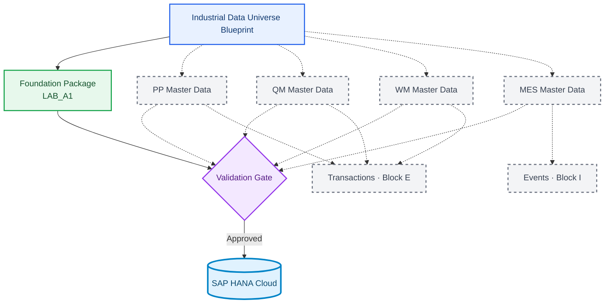

# Industrial Data Universe Blueprint v1

**🌐 Language / Idioma:** [🇧🇷 Português](./industrial-data-universe-blueprint-v1.md) | 🇺🇸 **English**

> **Status:** ✅ Approved for incremental implementation  
> **Deterministic seed:** `20260903`  
> **Company:** `Fictional Industrial Manufacturing Group`  
> **Classification:** synthetic educational data only

## Purpose

This blueprint defines the project's complete industrial universe early without prematurely creating every physical table. The foundation is materialized now; PP, QM, WM, MES, transactions, and events are added only after functional and technical validation of each scenario.

## Strategy

## LAB_A1 package to be materialized

| Entity | Volume |
|---|---:|
| Plants | 20 |
| Storage Locations | 150 to 180 |
| Materials | 300 |
| Material × Plant | 900 to 1,200 |
| Material × Storage Location | 2,000 to 3,000 |

## Material families

| Prefix | Category | Count | SAP-inspired type |
|---|---|---:|---|
| `RM` | Raw Materials | 80 | `ROH` |
| `EC` | Electronic Components | 60 | `ROH` |
| `MC` | Mechanical Components | 60 | `ROH` |
| `SA` | Semifinished Assemblies | 40 | `HALB` |
| `FG` | Finished Goods | 40 | `FERT` |
| `PK` | Packaging Materials | 20 | `VERP` |

## Rule for the 20 plants

Every Plant is multifunctional. Its name indicates only the dominant profile. Procurement, receiving, quality, planning, storage, inventory, and shipping can coexist in the same Plant. Manufacturing Plants also include production and maintenance.

This aligns with SAP's Plant concept as a logistics unit used by production, procurement, maintenance, and planning, with several material views maintained at Plant level. A Storage Location differentiates stock within a Plant and forms a compound key with that Plant. citeturn90search13turn90search15

## Incremental domain materialization

| Domain | Stage | Status |
|---|---|---|
| Foundation | DOC 02 / LAB_A1 | Materialize now |
| Supplier / Procurement | A4-A6 | Blueprint until validation |
| PP Master Data | A7 | Blueprint until validation |
| QM Master Data | A6/A7 | Blueprint until validation |
| WM Master Data | A8 | Blueprint until validation |
| MES Master Data | A9 | Blueprint until validation |
| Transactions | Block E | Wait for validated masters |
| Events | Block I | Wait for validated transaction model |

A Production Order depends on materials, BOM, routing, work centers, and a production version. The production version determines the BOM and routing combination used by the order. Therefore, orders are not generated before PP master data is validated. citeturn90search19turn90search21

Production inspections also require a validated scenario. Origin 03 supports in-process inspections, while origin 04 supports goods-receipt inspections, with differences in stock relevance and inspection-lot creation timing. The blueprint reserves these entities but does not freeze cardinality before the QM laboratory. citeturn90search25turn90search26turn90search27

## Quality gates

1. no duplicate Primary Keys;
2. no orphan Foreign Keys in valid packages;
3. no blank required fields;
4. lengths compatible with HANA targets;
5. invalid files fail only for the intended reason;
6. counts and checksums written to the manifest;
7. a fixed seed reproduces the complete dataset.

## Artifacts

- `industrial-data-universe-blueprint-v1.json`, canonical machine-readable source;
- this English document;
- the PT-BR version;
- future `industrial-universe-config.json`;
- future `dataset-manifest.json`;
- future `dataset-validation-report.md`.

## Next action

Implement **Foundation Generator v1** from this blueprint, generate the five valid LAB_A1 CSV files, create negative-test packages, and run local validation before any SAP HANA Cloud import.
