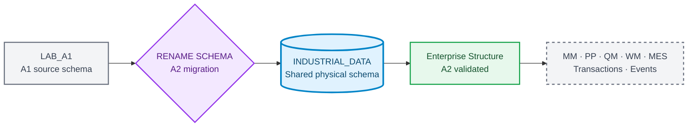
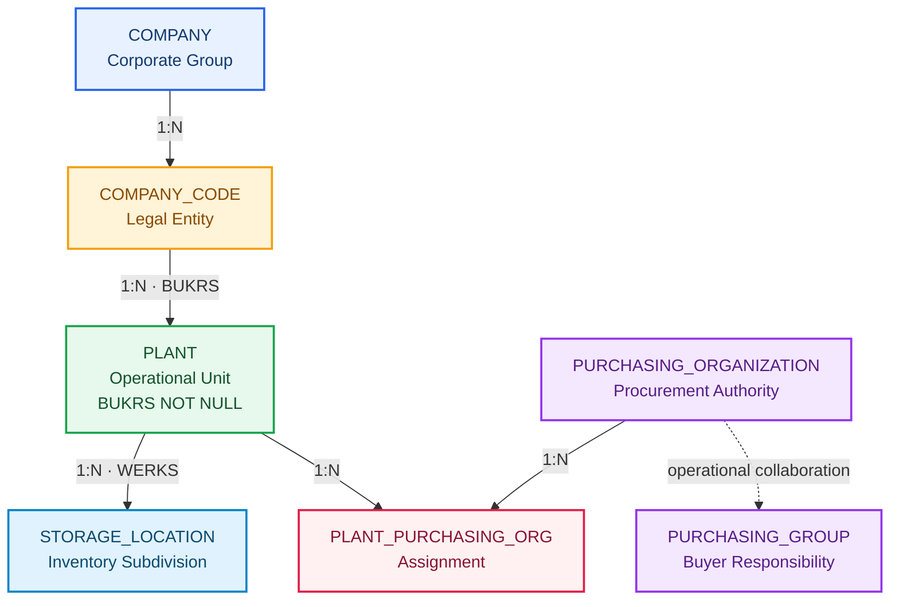

# Industrial Data Universe Blueprint

**🌐 Language / Idioma:** [🇧🇷 Português](../BR/industrial-data-universe-blueprint.md) | 🇺🇸 **English**

> **Internal version:** `1.2.0`  
> **Status:** ✅ Approved for incremental implementation  
> **Last updated:** `2026-09-08`  
> **Deterministic seed:** `20260903`  
> **Company:** `Fictional Industrial Manufacturing Group`  
> **Classification:** synthetic educational data only

## Purpose

The Blueprint governs the project cross-scenario industrial universe. Documentation identity remains associated with each DOC and LAB, while physical data evolves in the shared SAP HANA Cloud schema `INDUSTRIAL_DATA`.

## Current schema state

```text
Previous physical schema: LAB_A1
Current physical schema:  INDUSTRIAL_DATA
Migration status:         APPLIED
Validation status:        PASSED
```



## Documentation and physical identity

```text
DOC 01 ↔ A1 ↔ Evidences/LAB_A1
DOC 02 ↔ A2 ↔ Evidences/LAB_A2
Shared physical schema ↔ INDUSTRIAL_DATA
```

## Preserved A1 foundation

| Entity | Records |
|---|---:|
| `PLANT` | 20 |
| `MATERIAL` | 300 |
| `STORAGE_LOCATION` | 152 |
| `MATERIAL_PLANT` | 1.080 |
| `MATERIAL_STORAGE_LOCATION` | 2.163 |
| **A1 total** | **3.715** |

## A2 · Enterprise Structure materialized and validated



### Consolidated result

| Control | Result |
|---|---:|
| Company | 1 |
| Company Codes | 4 |
| Plants updated | 20 |
| Purchasing Organizations | 5 |
| Purchasing Groups | 12 |
| Plant × Purchasing Organization | 33 |
| A2 new records | 55 |
| Preserved Foundation records | 3.715 |
| Schema total | 3.770 |
| Tables | 10 |
| Logical Foreign Keys | 10 |
| Enforced Foreign Keys | 10 |
| Validated Foreign Keys | 10 |
| Final `PASSED` rules | 20 |
| Physical evidence | 18 |

### Company Codes

| BUKRS | Name | Country | Currency | Plants |
|---|---|---|---|---:|
| `FBR1` | Industrial Manufacturing Brazil | `BRA` | `BRL` | 9 |
| `FBR2` | Components Manufacturing Brazil | `BRA` | `BRL` | 2 |
| `FBR3` | Logistics and Distribution Brazil | `BRA` | `BRL` | 6 |
| `FBR4` | Engineering and Services Brazil | `BRA` | `BRL` | 3 |

### Purchasing structure

- `P100`: Corporate Strategic Procurement, scope `CROSS_COMPANY_CODE`;
- `P110`: Manufacturing Procurement, reference `FBR1`;
- `P120`: Components Procurement, reference `FBR2`;
- `P130`: Logistics Procurement, reference `FBR3`;
- `P140`: Engineering and Services Procurement, reference `FBR4`;
- 20 assignments `PRIMARY`;
- 13 assignments `STRATEGIC_SUPPORT`;
- 33 assignments valid, without orphans or duplicates.

### Reproducible artifacts

```text
Industrial-Data-Universe/Datasets/Enterprise-Structure/
├── Load/          6 SQL scripts
├── Validation/    6 SQL scripts
└── a2-enterprise-structure-sql-manifest.json
```

O manifest foi validado com 12 references físicas e zero arquivos ausentes.

## Future BRL ↔ USD scenario

Plants `1200` and `2800` were validated as organizationally ready for future `USD` documents while retaining `BRL` as Company Code local currency. Currency conversion is not yet materialized.

```text
Primary Plant:          2800 · Export Operations Plant
Secondary Plant:        1200 · Electronic Components Plant
Local currency:         BRL
Future document currency: USD
Planned rate type:      M
Future Fiori app:       Multicurrency Procurement Monitor
```

## Incremental materialization

| Domain | Stage | Status |
|---|---|---|
| Foundation | A1 / DOC 01 | ✅ Materialized and validated |
| Enterprise Structure | A2 / DOC 02 | ✅ Materialized and validated |
| MM Supplier | A4-A6 | Blueprint until validation |
| PP Master Data | A7 | Blueprint until validation |
| QM Master Data | A6/A7 | Blueprint until validation |
| WM Master Data | A8 | Blueprint until validation |
| MES Master Data | A9 | Blueprint until validation |
| Transações | Bloco E | Wait for validated master data |
| Currency and Exchange Rates | Future procurement/analytics | Blueprint until validation |
| Eventos | Bloco I | Wait for validated transaction model |

## Quality gates

1. no duplicate Primary Key;
2. no orphan Foreign Key;
3. no required field is blank;
4. lengths compatible with the HANA target;
5. migrations preserve objects, constraints, and records;
6. all 20 Plants have a valid Company Code;
7. each Plant has exactly one primary purchasing assignment;
8. manifest and physical paths remain reconciled;
9. the fixed seed reproduces the dataset;
10. currency scenarios preserve original currency and amount.

## Next action

Read the live repository roadmap again before opening the next Block A scenario. DOC 02 records the complete A2 closure.
