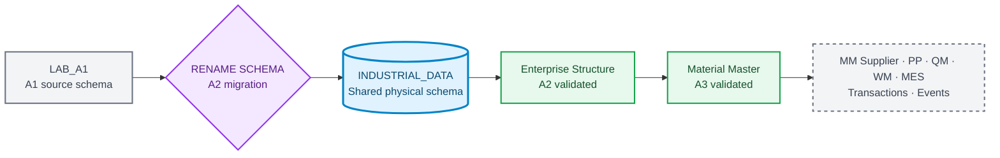
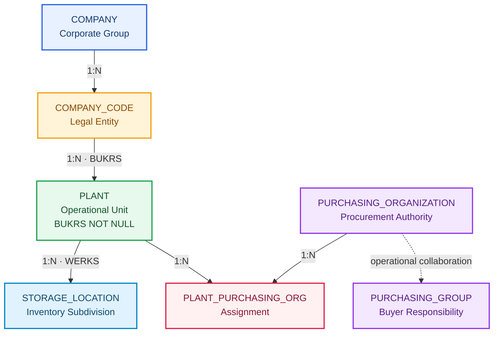
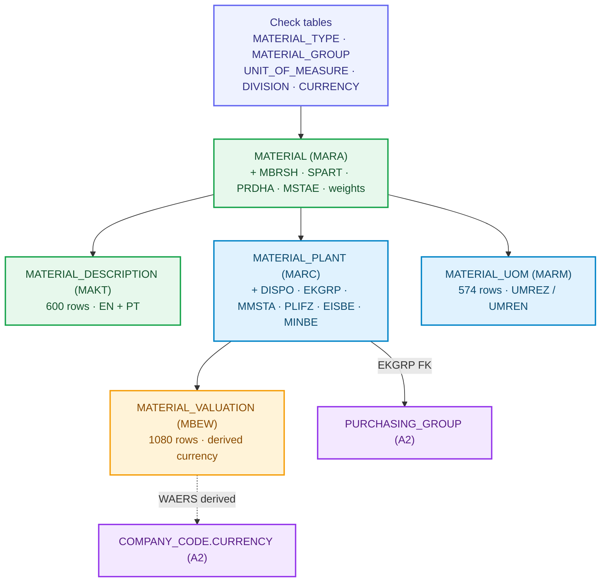

# Industrial Data Universe Blueprint

**🌐 Language / Idioma:** [🇧🇷 Português](../BR/industrial-data-universe-blueprint.md) | 🇺🇸 **English**

> **Internal version:** `1.3.0`  
> **Status:** ✅ Approved for incremental implementation  
> **Last updated:** `2026-09-08`  
> **Deterministic seed:** `20260903`  
> **Company:** `Fictional Industrial Manufacturing Group`  
> **Classification:** synthetic educational data only

## Purpose

The Blueprint governs the project cross-scenario industrial universe. Documentation identity remains associated with each DOC and LAB, while physical data evolves in the shared SAP HANA Cloud schema `INDUSTRIAL_DATA`.

## Current schema state

```text
Previous physical schema: LAB_A1
Current physical schema:  INDUSTRIAL_DATA
Migration status:         APPLIED
Validation status:        PASSED
```



## Documentation and physical identity

```text
DOC 01 ↔ A1 ↔ Evidences/LAB_A1
DOC 02 ↔ A2 ↔ Evidences/LAB_A2
DOC 03 ↔ A3 ↔ Evidences/LAB_A3
Shared physical schema ↔ INDUSTRIAL_DATA
```

## Preserved A1 foundation

| Entity | Records |
|---|---:|
| `PLANT` | 20 |
| `MATERIAL` | 300 |
| `STORAGE_LOCATION` | 152 |
| `MATERIAL_PLANT` | 1.080 |
| `MATERIAL_STORAGE_LOCATION` | 2.163 |
| **A1 total** | **3.715** |

## A2 · Enterprise Structure materialized and validated



### Consolidated result

| Control | Result |
|---|---:|
| Company | 1 |
| Company Codes | 4 |
| Plants updated | 20 |
| Purchasing Organizations | 5 |
| Purchasing Groups | 12 |
| Plant × Purchasing Organization | 33 |
| A2 new records | 55 |
| Preserved Foundation records | 3.715 |
| Schema total | 3.770 |
| Tables | 10 |
| Logical Foreign Keys | 10 |
| Enforced Foreign Keys | 10 |
| Validated Foreign Keys | 10 |
| Final `PASSED` rules | 20 |
| Physical evidence | 18 |

### Company Codes

| BUKRS | Name | Country | Currency | Plants |
|---|---|---|---|---:|
| `FBR1` | Industrial Manufacturing Brazil | `BRA` | `BRL` | 9 |
| `FBR2` | Components Manufacturing Brazil | `BRA` | `BRL` | 2 |
| `FBR3` | Logistics and Distribution Brazil | `BRA` | `BRL` | 6 |
| `FBR4` | Engineering and Services Brazil | `BRA` | `BRL` | 3 |

### Purchasing structure

- `P100`: Corporate Strategic Procurement, scope `CROSS_COMPANY_CODE`;
- `P110`: Manufacturing Procurement, reference `FBR1`;
- `P120`: Components Procurement, reference `FBR2`;
- `P130`: Logistics Procurement, reference `FBR3`;
- `P140`: Engineering and Services Procurement, reference `FBR4`;
- 20 assignments `PRIMARY`;
- 13 assignments `STRATEGIC_SUPPORT`;
- 33 assignments valid, without orphans or duplicates.

### Reproducible artifacts

```text
Industrial-Data-Universe/Datasets/Enterprise-Structure/
├── Load/          6 SQL scripts
├── Validation/    6 SQL scripts
└── a2-enterprise-structure-sql-manifest.json
```

The manifest was validated with 12 physical references and zero missing files.

## A3 · Material Master Data materialized and validated

A3 layered the three flat A1 material tables into SAP-style organizational views: client view (MARA), descriptions (MAKT), plant view (MARC), valuation (MBEW) and alternative units (MARM). Domain integrity is now driven by check tables and the plant view is wired to the A2 purchasing structure.



### Consolidated result

| Control | Result |
|---|---:|
| Schema tables | 18 |
| Logical Foreign Keys | 22 |
| A2 total records | 3.770 |
| A3 new records | 2.296 |
| Schema total | 6.066 |
| Final reconciliation rules | 19 `PASSED` |
| Integrity rules with zero violations | 8 |
| Consolidated negative tests | 5 |
| Physical evidence | 9 |

### New entities

| Entity | SAP reference | Key | Records |
|---|---|---|---:|
| `MATERIAL_TYPE` | T134 / T134M | `MTART` | 4 |
| `MATERIAL_GROUP` | T023 / T023T | `MATKL` | 24 |
| `UNIT_OF_MEASURE` | T006 / T006A | `MSEHI` | 6 |
| `DIVISION` | TSPA / TSPAT | `SPART` | 5 |
| `CURRENCY` | TCURC | `WAERS` | 3 |
| `MATERIAL_DESCRIPTION` | MAKT | `MATNR + SPRAS` | 600 |
| `MATERIAL_VALUATION` | MBEW | `MATNR + BWKEY + BWTAR` | 1.080 |
| `MATERIAL_UOM` | MARM | `MATNR + MEINH` | 574 |

### Evolved entities

- `MATERIAL` (MARA): seven client-level attributes and five foreign keys to the check tables.
- `MATERIAL_PLANT` (MARC): seven planning and purchasing attributes, with `EKGRP` wired to the A2 `PURCHASING_GROUP`.
- `COMPANY_CODE`: `CURRENCY` is now protected by a foreign key to the `CURRENCY` table.

### Modeling decisions

- **Valuation area = Plant** (S/4 default): the same material can carry a different value in different plants.
- **`MATERIAL_TYPE` is the control key**: it drives procurement type, price control, valuation class and quantity/value updating.
- **Currency is never hard-coded**: `MATERIAL_VALUATION.WAERS` is derived from `PLANT.BUKRS → COMPANY_CODE.CURRENCY`.
- **Purchasing group only for external procurement**: `EKGRP` is mandatory only for materials with `PROCUREMENT_TYPE = 'F'`.
- **Number ranges audited, not enforced**: A1 material numbers are preserved; range compliance per type is a validation rule.

### Multicurrency readiness

Every valuation is `BRL` today. Plants `1200` (59 valuated materials) and `2800` (51 valuated materials) remain organizationally ready for the future `BRL/USD` scenario with no schema change — the currency column already exists and is populated by derivation.

### Reproducible artifacts

```text
Industrial-Data-Universe/Datasets/Material-Master/
├── Load/          7 SQL scripts
├── Validation/    8 SQL scripts
└── a3-material-master-sql-manifest.json
```

### Known note

`SYS.M_TABLES.RECORD_COUNT` is a monitoring view and may lag the delta storage. The final reconciliation counts rows with `COUNT(*)`, never a monitoring metadata value.

## Future BRL ↔ USD scenario

Plants `1200` and `2800` were validated as organizationally ready for future `USD` documents while retaining `BRL` as Company Code local currency. A3 materialized the `CURRENCY` table and the derived valuation currency; exchange rate conversion is not yet materialized.

```text
Primary Plant:          2800 · Export Operations Plant
Secondary Plant:        1200 · Electronic Components Plant
Local currency:         BRL
Future document currency: USD
Planned rate type:      M
Future Fiori app:       Multicurrency Procurement Monitor
```

## Incremental materialization

| Domain | Stage | Status |
|---|---|---|
| Foundation | A1 / DOC 01 | ✅ Materialized and validated |
| Enterprise Structure | A2 / DOC 02 | ✅ Materialized and validated |
| Material Master | A3 / DOC 03 | ✅ Materialized and validated |
| MM Supplier | A4-A6 | Blueprint until validation |
| PP Master Data | A7 | Blueprint until validation |
| QM Master Data | A6/A7 | Blueprint until validation |
| WM Master Data | A8 | Blueprint until validation |
| MES Master Data | A9 | Blueprint until validation |
| Transactions | Block E | Wait for validated master data |
| Currency and Exchange Rates | `CURRENCY` in A3; rates in future procurement/analytics | 🔄 Partially materialized |
| Events | Block I | Wait for validated transaction model |

## Quality gates

1. no duplicate Primary Key;
2. no orphan Foreign Key;
3. no required field is blank;
4. lengths compatible with the HANA target;
5. migrations preserve objects, constraints, and records;
6. all 20 Plants have a valid Company Code;
7. each Plant has exactly one primary purchasing assignment;
8. manifest and physical paths remain reconciled;
9. the fixed seed reproduces the dataset;
10. currency scenarios preserve original currency and amount.

## Next action

Read the live repository roadmap again before opening the next Block A scenario. DOC 03 records the complete A3 closure.
