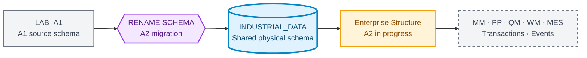
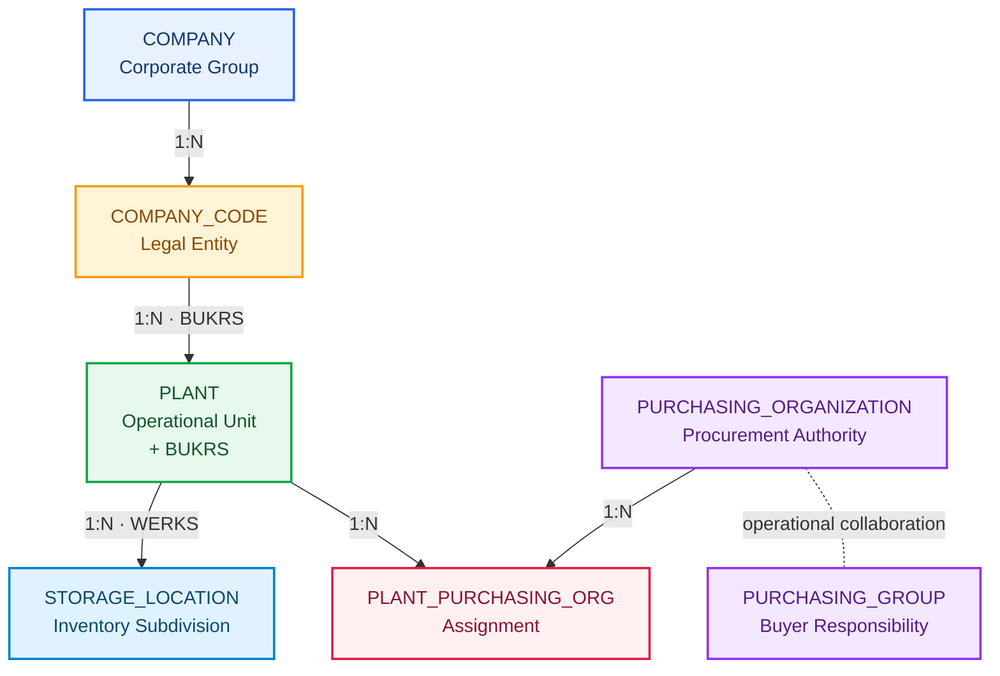

# Industrial Data Universe Blueprint

**🌐 Language / Idioma:** [🇧🇷 Português](../BR/industrial-data-universe-blueprint.md) | 🇺🇸 **English**

> **Internal version:** `1.1.0`  
> **Status:** ✅ Approved for incremental implementation  
> **Deterministic seed:** `20260903`  
> **Company:** `Fictional Industrial Manufacturing Group`  
> **Classification:** synthetic educational data only

## Purpose

The Blueprint governs the project's cross-scenario industrial universe. Documentation identity remains associated with each DOC and LAB, while physical data evolves in a shared SAP HANA Cloud schema.

## Current schema state

A2 migration was executed and reconciled:

```text
Previous physical schema: LAB_A1
Current physical schema:  INDUSTRIAL_DATA
Migration status:         APPLIED
Validation status:        PASSED
```



Historical identity remains unchanged:

```text
DOC 01 ↔ A1 ↔ Evidences/LAB_A1
DOC 02 ↔ A2 ↔ Evidences/LAB_A2
Shared physical schema ↔ INDUSTRIAL_DATA
```

## Validated A1 foundation

| Entity | Records |
|---|---:|
| `PLANT` | 20 |
| `MATERIAL` | 300 |
| `STORAGE_LOCATION` | 152 |
| `MATERIAL_PLANT` | 1,080 |
| `MATERIAL_STORAGE_LOCATION` | 2,163 |
| **Total** | **3,715** |

- Validation Engine: `PASSED`;
- duplicate Primary Keys: `0`;
- orphan Foreign Keys: `0`;
- active assignments: `2,066`;
- inactive assignments: `97`;
- A1 physical evidence: `30`.

## SCHEMA_GENERALIZATION migration

The `LAB_A1 → INDUSTRIAL_DATA` migration was applied on `2026-09-03` and validated by A2 Evidence 03.

| Control | Result |
|---|---:|
| Previous schema exists | 0 |
| Current schema exists | 1 |
| Preserved tables | 5 |
| Preserved Foreign Keys | 5 |
| Enforced Foreign Keys | 5 |
| Validated Foreign Keys | 5 |
| Preserved records | 3,715 |
| Status | `PASSED` |

## A2 · Enterprise Structure Package

A2 introduces the SAP-inspired enterprise structure and evolves the existing `PLANT` table.



### Planned entities and volumes

| Entity | Primary Key | Volume |
|---|---|---:|
| `COMPANY` | `COMPANY_ID` | 1 |
| `COMPANY_CODE` | `BUKRS` | 4 |
| `PURCHASING_ORGANIZATION` | `EKORG` | 5 |
| `PURCHASING_GROUP` | `EKGRP` | 12 |
| `PLANT_PURCHASING_ORG` | `WERKS + EKORG` | 33 |
| `PLANT` records to update | `WERKS` | 20 |

### Company Codes

| BUKRS | Name | Country | Currency | Profile |
|---|---|---|---|---|
| `FBR1` | Industrial Manufacturing Brazil | `BRA` | `BRL` | Manufacturing |
| `FBR2` | Components Manufacturing Brazil | `BRA` | `BRL` | Components |
| `FBR3` | Logistics and Distribution Brazil | `BRA` | `BRL` | Logistics |
| `FBR4` | Engineering and Services Brazil | `BRA` | `BRL` | Engineering/Services |

### Controlled PLANT evolution

The existing table is preserved and receives `BUKRS NVARCHAR(4)`:

1. create `COMPANY` and `COMPANY_CODE`;
2. load one Company and four Company Codes;
3. add `PLANT.BUKRS` as temporarily nullable;
4. update all 20 Plants from the approved mapping;
5. validate that no `NULL` or unknown BUKRS exists;
6. change `BUKRS` to `NOT NULL`;
7. create `FK_PLANT_COMPANY_CODE`;
8. validate catalog metadata, counts, and the organizational JOIN.

### Purchasing Organizations

- `P100`: Corporate Strategic Procurement;
- `P110`: Manufacturing Procurement;
- `P120`: Components Procurement;
- `P130`: Logistics Procurement;
- `P140`: Engineering and Services Procurement.

Each Plant receives one primary organization. Thirteen Plants also receive strategic support from `P100`, producing **33 assignments**.

### Purchasing Groups

Twelve groups represent category-based buyer responsibilities. A2 does not constrain `PURCHASING_GROUP` to one Purchasing Organization, avoiding artificial cardinality before full procurement scenarios.

## Future BRL ↔ USD conversion scenario

Local currency belongs to Company Code rather than directly to Plant. Future documents may use `USD`, requiring date-effective conversion into `BRL`.

```text
Primary Plant:          2800 · Export Operations Plant
Secondary Plant:        1200 · Electronic Components Plant
Company Code currency:  BRL
Document currency:      USD
Planned rate type:      M
Rate source:            Synthetic and versioned
```

The future Fiori application **Multicurrency Procurement Monitor** displays original USD amount, local BRL amount, applied exchange rate, rate type, validity date, and conversion status. Missing, ambiguous, or expired rates create an explicit error.

No live market rate is frozen in the Blueprint. Quotation method, factors, decimal precision, and temporal selection rules must be revalidated before implementation.

## Incremental materialization

| Domain | Stage | Status |
|---|---|---|
| Foundation | A1 / DOC 01 | ✅ Materialized and validated |
| Enterprise Structure | A2 / DOC 02 | 🔄 In implementation |
| MM Supplier | A4-A6 | Blueprint until validation |
| PP Master Data | A7 | Blueprint until validation |
| QM Master Data | A6/A7 | Blueprint until validation |
| WM Master Data | A8 | Blueprint until validation |
| MES Master Data | A9 | Blueprint until validation |
| Transactions | Block E | Wait for validated master data |
| Currency and Exchange Rates | Future procurement/analytics | Blueprint until validation |
| Events | Block I | Wait for validated transaction model |

## Quality gates

1. no duplicate Primary Key;
2. no orphan Foreign Key;
3. no required field is blank;
4. lengths remain compatible with the HANA target;
5. migrations preserve every object, constraint, and row;
6. all 20 Plants reference a valid Company Code;
7. negative files fail only for the intended reason;
8. counts and checksums are recorded in the manifest;
9. the fixed seed reproduces the complete dataset;
10. currency scenarios preserve original value and currency.

## Next action

Create `COMPANY` and `COMPANY_CODE` in `INDUSTRIAL_DATA`, load one Company and four Company Codes, validate PK/FK, and only then begin the `PLANT.BUKRS` evolution.
