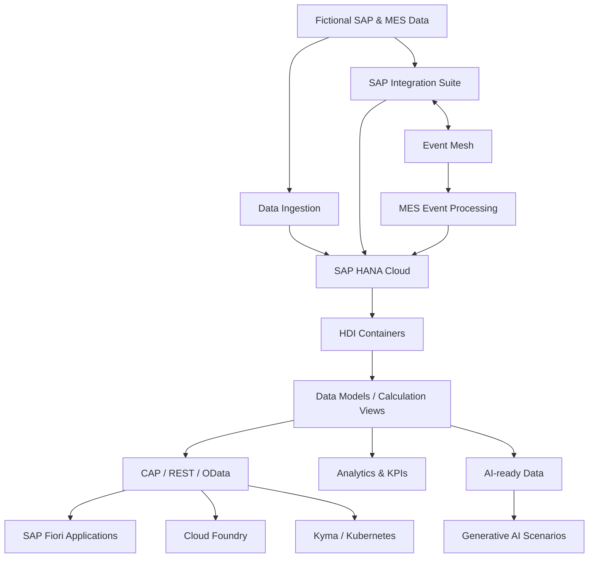

# 🧠 SAP HANA Cloud Data Engineering Learning

**🌐 Language / Idioma:** [🇧🇷 Português](./README.md) | 🇺🇸 **English**

> **Status:** 🟢 In development  
> **Current phase:** Phase 0 — Environment Foundation completed; Block A under validation  
> **Approach:** Hands-on, incremental, documented, and driven by simulated SAP/MES scenarios

Hands-on repository for learning **SAP HANA Cloud, Data Engineering, Data Modeling, SQL, HDI, CAP/OData, SAP Fiori, Analytics, integration, event-driven architectures, cloud-native development, and AI-ready data**, using simulated industrial scenarios inspired by **SAP MM, PP, QM, WM, and MES** processes.

The goal is not to learn isolated tools. The repository follows the complete data journey, from functional and industrial origins to persistence, transformation, modeling, exposure, analytics, and trusted consumption by applications and artificial intelligence.

> [!IMPORTANT]
> **All datasets, identifiers, master records, transactions, events, payloads, and operational scenarios published in this repository are fictional and created exclusively for educational and technical experimentation purposes.** Although the models are inspired by concepts found in SAP and MES processes, no real company data, productive information, credentials, or confidential configuration is used or represented.

---

## 📑 Contents

- [🎯 Project objective](#-project-objective)
- [💡 Why Data Engineering?](#-why-data-engineering)
- [🏭 Functional and industrial domains](#-functional-and-industrial-domains)
- [🧭 Technical journey](#-technical-journey)
- [🏗️ Evolutionary architecture](#️-evolutionary-architecture)
- [☁️ Current environment](#️-current-environment)
- [🧰 Planned technologies](#-planned-technologies)
- [📁 Repository structure](#-repository-structure)
- [🗺️ Technical roadmap](#️-technical-roadmap)
- [🧪 Laboratory methodology](#-laboratory-methodology)
- [📸 Evidence](#-evidence)
- [🔐 Security and governance](#-security-and-governance)
- [📚 Official SAP references](#-official-sap-references)
- [🏅 SAP credentials](#-sap-credentials)
- [👤 Author](#-author)

---

## 🎯 Project objective

This project develops practical data engineering knowledge within the SAP ecosystem while connecting technical foundations to industrial and logistics processes.

The learning journey is designed to cover:

- relational modeling and data structures;
- SQL and SQLScript fundamentals;
- SAP HANA Cloud as a data platform;
- SAP HANA Deployment Infrastructure (HDI);
- analytical models and Calculation Views;
- ingestion, transformation, data quality, replication, and virtualization;
- REST/OData APIs with SAP Cloud Application Programming Model (CAP);
- SAP Fiori applications consuming services built in this project;
- analytics and business KPIs;
- SAP HANA Cloud integration with SAP Integration Suite and events;
- containers, Kubernetes, and SAP BTP Kyma Runtime;
- trusted and semantically contextualized data for Generative AI solutions.

The roadmap is **evolutionary**. Each scenario will be technically reviewed before implementation according to SAP BTP Trial availability, SAP product evolution, and findings from previous laboratories.

---

## 💡 Why Data Engineering?

Analytics and artificial intelligence are only as reliable as the data they consume. Unstructured, duplicated, poorly governed, or semantically unclear data limits every solution built on top of it.

This project studies the entire chain:

```text
Business Process
      ↓
Master / Transactional Data
      ↓
Ingestion
      ↓
Quality & Transformation
      ↓
Persistence
      ↓
Modeling
      ↓
Semantics
      ↓
APIs / Applications / Analytics
      ↓
AI-ready Data
      ↓
Generative AI
```

The project's differentiator is combining **SAP functional and manufacturing knowledge** with data engineering, integration, applications, and AI.

---

## 🏭 Functional and industrial domains

Datasets are fictional, while scenarios are inspired by concepts commonly found in industrial landscapes.

| Domain | Planned contexts |
|---|---|
| **SAP MM** | Material Master, Supplier, Purchasing Info Record, Purchase Orders, Goods Receipt, Material Movements, Inventory |
| **SAP PP** | BOM, Routing, Work Center, Production Version, Production Orders, Confirmations |
| **SAP QM** | Quality Info Record, Inspection Lots, Results, Quality Status |
| **SAP WM** | Warehouse, Storage Type, Storage Bin, Stock and Warehouse Movements |
| **MES** | Resources, Machines, Operations, Work Orders, Production Events, Confirmations, Scrap and Downtime |

> Educational models may use field names inspired by SAP terminology, such as `MATNR`, `WERKS`, `LGORT`, `MTART`, `MATKL`, `MEINS`, `LIFNR`, `EKORG`, and `BWART`. This does not mean that the repository reproduces the complete physical internal structures of SAP ERP/S/4HANA.

---

## 🧭 Technical journey

```text
SAP MM / PP / QM / WM / MES
              │
              ▼
      Data Foundation
              │
              ▼
       SQL & Modeling
              │
              ▼
       SAP HANA Cloud
              │
              ▼
      HDI / Data Models
              │
              ▼
       Data Engineering
              │
      ┌───────┴────────┐
      ▼                ▼
 CAP / OData      Integration / Events
      │                │
      ▼                ▼
    Fiori           Event Mesh
      │                │
      └───────┬────────┘
              ▼
       Analytics / KPIs
              │
              ▼
 Cloud Foundry / Kyma
              │
              ▼
       AI-ready Data
              │
              ▼
      Generative AI
```

---

## 🏗️ Evolutionary architecture



The architecture will be built progressively. A component shown in the diagram is not necessarily already implemented.

---

## ☁️ Current environment

### Phase 0 — Environment Foundation

| Component | Status |
|---|---|
| SAP BTP Trial | ✅ Available |
| Cloud Foundry Runtime | ✅ Created |
| Space `dev` | ✅ Created |
| SAP HANA Cloud Free Tier | ✅ Running |
| SAP HANA Cloud Administration Tools | ✅ Subscribed |
| SAP HANA Cloud Central | ✅ Validated |
| SAP HANA Database Explorer / SQL Console | ✅ Validated |
| SAP Business Application Studio | ✅ Subscribed |
| GitHub Repository | ✅ Created |
| HDI Container | ⏳ Future lab |
| CAP / OData | ⏳ Roadmap |
| SAP Fiori | ⏳ Roadmap |
| Kyma / Kubernetes | ⏳ Roadmap |

First SQL validation:

```sql
SELECT CURRENT_USER, CURRENT_SCHEMA FROM DUMMY;
```

The query confirmed a functional connection to the SAP HANA Cloud instance.

---

## 🧰 Planned technologies

- SAP Business Technology Platform (BTP)
- SAP HANA Cloud
- SAP HANA Cloud Central
- SAP HANA Database Explorer
- SAP Business Application Studio
- SQL / SQLScript
- SAP HANA Deployment Infrastructure (HDI)
- Calculation Views
- Core Data Services (CDS)
- SAP Cloud Application Programming Model (CAP)
- REST / OData
- SAP Fiori / Fiori Elements
- SAP Integration Suite
- Event Mesh / event-driven integration
- Cloud Foundry
- Containers
- Kubernetes
- SAP BTP Kyma Runtime
- Git / GitHub
- Analytics & Business KPIs
- AI-ready data, embeddings, vector concepts, and Generative AI

---

## 📁 Repository structure

| Directory | Purpose |
|---|---|
| `AI-Artificial-Intelligence/` | AI-ready data and Generative AI labs |
| `Analytics-KPIs/` | Analytical models, metrics, and KPIs |
| `CAP-Cloud-Application-Programming/` | CAP projects, REST/OData APIs, and services |
| `Datasets/` | Fictional datasets used by the laboratories |
| `Diagrams/` | Technical and architecture diagrams |
| `Docs/` | Detailed laboratory documentation |
| `Evidences/` | Technical execution and validation evidence |
| `Fiori-Applications/` | SAP Fiori / Fiori Elements applications |
| `HANA-Data-Models/` | SAP HANA modeling artifacts and projects |
| `Integration-Suite/` | Data ingestion and SAP Integration Suite scenarios |
| `MES-Manufacturing-Execution/` | Simulated Manufacturing Execution Systems scenarios |
| `SQL-Scripts/` | Educational SQL/SQLScript scripts and utilities |

New directories will be introduced only when implementation creates a real need.

---

# 🗺️ Technical roadmap

> **Roadmap v1:** represents the planned learning direction. Each laboratory will be reviewed before implementation and may evolve according to platform availability, SAP product changes, or findings from previous laboratories.

## 🟦 Phase 0 — Environment Foundation

| # | Scenario | Status |
|---|---|---|
| F0.1 | SAP BTP & Cloud Foundry Foundation | ✅ |
| F0.2 | SAP HANA Cloud Provisioning | ✅ |
| F0.3 | Administration Tools & Authorization | ✅ |
| F0.4 | First Database Connection & SQL | ✅ |
| F0.5 | GitHub Project Foundation | ✅ |

## 🅰️ Block A — Data & SAP/MES Master Data Foundation

| # | Scenario | Objective | Status |
|---|---|---|---|
| A1 | Relational Data Foundation | Database, schema, tables, keys, constraints, cardinality, and normalization | 🔄 Next |
| A2 | SAP Enterprise Structure | Company Code, Plant, Storage Location, Purchasing Organization, and Purchasing Group | ⏳ |
| A3 | Material Master Data Foundation | Model material, organizational levels, and relevant views | ⏳ |
| A4 | Supplier / Business Partner Foundation | Model suppliers and organizational context | ⏳ |
| A5 | Purchasing Info Record | Relate Material, Supplier, Purchasing Organization, and Plant | ⏳ |
| A6 | Quality Info Record | Connect MM and QM foundations | ⏳ |
| A7 | Manufacturing Master Data | BOM, Routing, Work Center, and Production Version | ⏳ |
| A8 | Warehouse Master Data | Warehouse, Storage Type, Storage Bin, and stock | ⏳ |
| A9 | MES Master Data Foundation | Resources, Machines, Operations, and SAP ↔ MES mappings | ⏳ |

## 🅱️ Block B — SQL for SAP Data

| # | Scenario | Objective | Status |
|---|---|---|---|
| B1 | DDL Fundamentals | Create and manage database structures using Data Definition Language | ⏳ |
| B2 | DML Fundamentals | Insert, update, and delete data using Data Manipulation Language | ⏳ |
| B3 | Filtering & Sorting | Query data using filters, sorting, and conditions | ⏳ |
| B4 | Joins | Relate SAP/MES entities using different JOIN strategies | ⏳ |
| B5 | Aggregations | Consolidate data using aggregation functions and grouping | ⏳ |
| B6 | Subqueries & CTEs | Build complex queries using subqueries and Common Table Expressions | ⏳ |
| B7 | Window Functions | Apply analytical calculations, rankings, and aggregations over data windows | ⏳ |
| B8 | Views | Create reusable query and data abstraction layers | ⏳ |
| B9 | SQLScript | Introduce procedural logic and advanced processing in SAP HANA | ⏳ |
| B10 | Performance Fundamentals | Understand query performance and optimization fundamentals | ⏳ |

## 🅲 Block C — Professional SAP HANA Development

| # | Scenario | Objective | Status |
|---|---|---|---|
| C1 | Business Application Studio | Prepare a professional SAP HANA development environment | ⏳ |
| C2 | HANA Database Project | Create and structure an SAP HANA database project | ⏳ |
| C3 | HDI Container | Understand isolation, deployment, and lifecycle management with HDI | ⏳ |
| C4 | Design-Time Artifacts | Develop version-controlled artifacts that generate runtime database objects | ⏳ |
| C5 | CDS Database Artifacts | Model entities and relationships using Core Data Services | ⏳ |
| C6 | Deployment | Deploy database artifacts to SAP HANA Cloud | ⏳ |
| C7 | Runtime Objects | Analyze database objects generated through deployment | ⏳ |
| C8 | Synonyms & Cross-Schema Access | Access objects outside the container in a controlled manner | ⏳ |
| C9 | Calculation Views | Build analytical models using Calculation Views | ⏳ |
| C10 | Security & Privileges | Apply users, roles, grants, and least-privilege concepts | ⏳ |

## 🅳 Block D — Data Engineering

| # | Scenario | Objective | Status |
|---|---|---|---|
| D1 | Data Ingestion | Ingest fictional data from different sources into SAP HANA Cloud | ⏳ |
| D2 | Data Cleansing | Identify and handle inconsistencies, NULL values, and invalid formats | ⏳ |
| D3 | Transformation Pipelines | Transform RAW data into curated and business-ready structures | ⏳ |
| D4 | Data Quality | Define and validate technical and functional data quality rules | ⏳ |
| D5 | Incremental Loading | Process only new or modified records | ⏳ |
| D6 | Delta Processing | Implement strategies for identifying and processing data deltas | ⏳ |
| D7 | Deduplication | Detect and handle duplicate records | ⏳ |
| D8 | Data Lineage | Document data origin, processing, transformations, and destination | ⏳ |
| D9 | Remote Sources | Explore access to remote data sources | ⏳ |
| D10 | Virtual Tables | Consume remote data without mandatory physical replication | ⏳ |
| D11 | Replication | Explore data replication and persistence strategies | ⏳ |
| D12 | Performance & Optimization | Evaluate and optimize data pipelines and models | ⏳ |

## 🅴 Block E — Transactional SAP Data

| # | Scenario | Objective | Status |
|---|---|---|---|
| E1 | Purchase Orders | Model fictional purchase order transactional data | ⏳ |
| E2 | Goods Receipt | Relate goods receipts to purchasing documents | ⏳ |
| E3 | Material Movements | Model inventory movements and movement types | ⏳ |
| E4 | Inventory Snapshot | Build a consolidated view of inventory positions | ⏳ |
| E5 | Production Orders | Model production orders and their main relationships | ⏳ |
| E6 | Production Confirmations | Record and analyze production confirmations | ⏳ |
| E7 | Inspection Lots | Model inspection lots within the SAP QM context | ⏳ |
| E8 | Quality Results | Structure quality results and indicators | ⏳ |
| E9 | Warehouse Movements | Model movements and structures related to

---

## 🧪 Laboratory methodology

Each laboratory will follow, when applicable:

```text
Study
  ↓
Propose scenario
  ↓
Revalidate objective & architecture
  ↓
Build
  ↓
Test
  ↓
Trigger controlled failures
  ↓
Diagnose
  ↓
Correct
  ↓
Collect evidence
  ↓
Document
  ↓
Version
  ↓
Share
```

Before starting each laboratory, the following are reviewed:

1. learning objective;
2. SAP/MES functional context;
3. proposed architecture;
4. available platform services;
5. risks and dependencies;
6. success criteria;
7. required evidence.

---

## 📸 Evidence

Evidence will be stored under `Evidences/`, organized by laboratory.

Planned naming convention:

```text
NN-technical-description-in-kebab-case
```

Rules:

- numbering restarts at `01` for every laboratory;
- names must explain the technical purpose of the evidence;
- screenshots must not expose credentials, tokens, or sensitive data;
- each evidence referenced by a DOC must have context before the image and an explanation after it;
- Markdown links must be validated against physical file names before publication.

---

## 🔐 Security and governance

This is a public repository. Therefore:

- passwords and secrets are never versioned;
- tokens, service keys, private certificate keys, and credentials are excluded;
- `.env` and other sensitive files are ignored by Git;
- all datasets are fictional;
- internal company information is not used;
- screenshots are reviewed before publication;
- access follows least-privilege principles whenever possible;
- `DBADMIN` is used only when technically necessary during foundation/administration and is not treated as an application identity.

---

## 📚 Official SAP references

- [SAP HANA and SAP HANA Cloud — SAP Learning](https://learning.sap.com/products/hana)
- [Becoming a Certified Data Engineer — SAP HANA Cloud](https://learning.sap.com/learning-journeys/becoming-a-certified-data-engineer-sap-hana-cloud)
- [Developing Data Models with SAP HANA Cloud](https://learning.sap.com/courses/developing-data-models-with-sap-hana-cloud)
- [SAP HANA Cloud — SAP Help Portal](https://help.sap.com/docs/hana-cloud)
- [SAP Cloud Application Programming Model](https://cap.cloud.sap/)
- [SAP BTP, Cloud Foundry and Kyma Runtimes with CAP](https://help.sap.com/docs/btp/btp-developers-guide/sap-btp-cloud-foundry-and-sap-btp-kyma-runtimes-with-cap)

> Official SAP resources guide the technical learning, while this project deliberately adds complementary manufacturing, MES, integration, application, and AI scenarios.

---

## 🏅 SAP credentials

This project is developed after the author achieved:

- ✅ **SAP Certified - Integration Developer (C_CPI)**
- ✅ **SAP Certified - SAP Generative AI Developer (C_AIG)**

The current goal is **hands-on Data Engineering learning**, without an immediate commitment to another certification.

---

## 👤 Author

### Orlando dos Santos Caetano

**SAP MM · PP · QM · WM | MES | SAP Integration | Data Engineering | Generative AI**

[](https://www.linkedin.com/in/orlando-caetano/)
[](https://github.com/OrlandoCaetano2026)

### Functional areas


### Technologies and learning


---

> **Learning principle:** understand the business process, structure the data, engineer the pipeline, expose trusted information, and only then apply analytics and AI.
