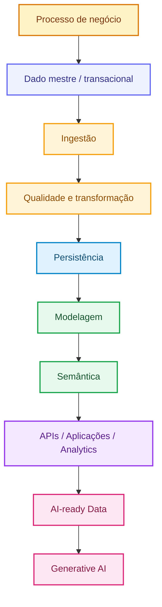
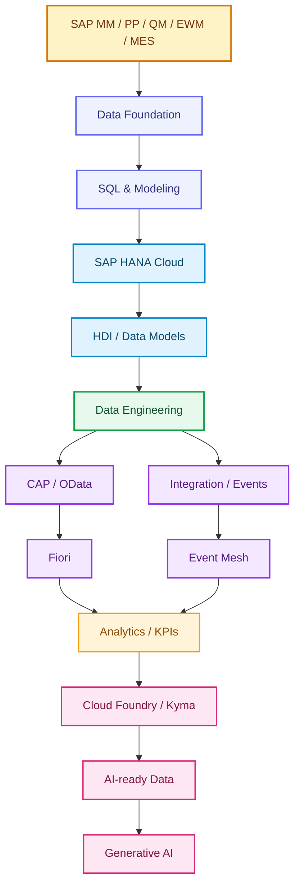
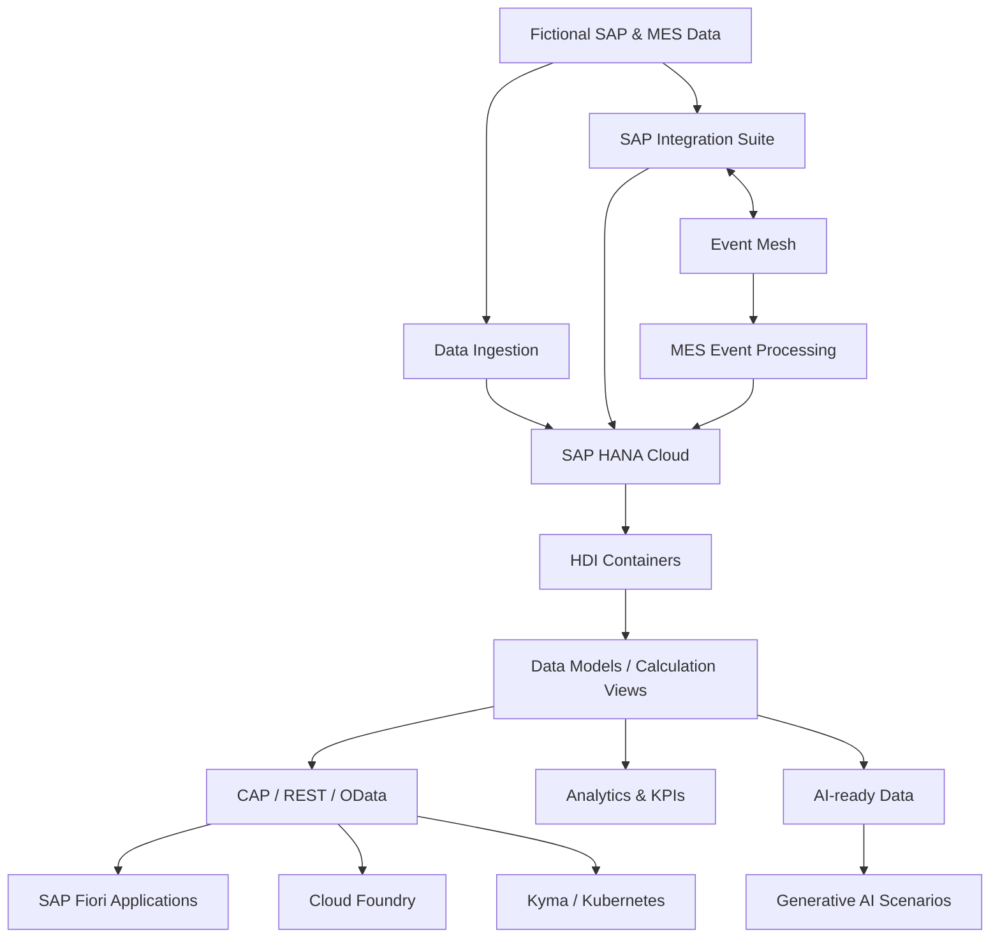

# 🧠 SAP HANA Cloud Data Engineering Learning

**🌐 Idioma / Language:** 🇧🇷 **Português** | [🇺🇸 English](./README.en.md)

> **Status:** 🟢 Em desenvolvimento  
> **Fase atual:** Phase 0 concluída; Bloco A — A1 a A12 concluídos e validados (A4–A12 consolidados em [DOC 04](./Docs/A%20—%20Data%20%26%20SAP-MES%20Master%20Data%20Foundation/BR/04-a4-a12-fundacao-transacional-completa.md))  
> **Abordagem:** Hands-on, incremental, documentada e orientada a cenários SAP/MES simulados

Repositório prático para aprendizado de **SAP HANA Cloud, Data Engineering, Data Modeling, SQL, HDI, CAP/OData, SAP Fiori, Analytics, integração, arquiteturas event-driven, cloud-native e AI-ready data**, utilizando cenários industriais simulados inspirados em processos de **SAP MM, PP, QM, EWM e MES**.

O objetivo não é apenas aprender ferramentas isoladamente. A proposta é acompanhar a jornada completa do dado, desde sua origem funcional e industrial até persistência, transformação, modelagem, exposição, análise e utilização segura por aplicações e inteligência artificial.

> [!IMPORTANT]
> **Todos os datasets, identificadores, registros mestres, transações, eventos, payloads e cenários operacionais publicados neste repositório são fictícios e criados exclusivamente para fins educacionais e de experimentação técnica.** Embora os modelos sejam inspirados em conceitos encontrados em processos SAP e MES, nenhuma informação empresarial real, dado produtivo, credencial ou configuração confidencial é utilizada ou representada.

---

## 📑 Índice

- [🎯 Objetivo do projeto](#-objetivo-do-projeto)
- [💡 Por que Data Engineering?](#-por-que-data-engineering)
- [🏭 Domínios funcionais e industriais](#-domínios-funcionais-e-industriais)
- [🧭 Jornada técnica](#-jornada-técnica)
- [🏗️ Arquitetura evolutiva](#️-arquitetura-evolutiva)
- [☁️ Ambiente atual](#️-ambiente-atual)
- [🧰 Tecnologias planejadas](#-tecnologias-planejadas)
- [📁 Estrutura do repositório](#-estrutura-do-repositório)
- [🗺️ Roadmap técnico](#️-roadmap-técnico)
- [🧪 Metodologia dos laboratórios](#-metodologia-dos-laboratórios)
- [📸 Evidências](#-evidências)
- [🔐 Segurança e governança](#-segurança-e-governança)
- [📚 Referências oficiais SAP](#-referências-oficiais-sap)
- [🏅 Credenciais SAP](#-credenciais-sap)
- [👤 Autor](#-autor)

---

## 🎯 Objetivo do projeto

Este projeto tem como objetivo desenvolver conhecimento prático em engenharia de dados dentro do ecossistema SAP, conectando fundamentos técnicos a processos industriais e logísticos.

A evolução do laboratório deverá permitir:

- compreender modelagem relacional e estruturas de dados;
- dominar SQL e fundamentos de SQLScript;
- utilizar SAP HANA Cloud como plataforma de dados;
- trabalhar com SAP HANA Deployment Infrastructure (HDI);
- desenvolver modelos analíticos e Calculation Views;
- praticar ingestão, transformação, qualidade, replicação e virtualização de dados;
- expor dados por APIs REST/OData com SAP Cloud Application Programming Model (CAP);
- criar aplicações SAP Fiori consumindo serviços construídos no projeto;
- desenvolver KPIs e cenários analíticos;
- integrar SAP HANA Cloud com SAP Integration Suite e eventos;
- explorar containers, Kubernetes e SAP BTP Kyma Runtime;
- preparar dados confiáveis e semanticamente contextualizados para soluções de IA generativa.

O roadmap é **evolutivo**. Cada cenário será revalidado tecnicamente antes de sua execução, considerando disponibilidade do SAP BTP Trial, evolução dos produtos SAP e aprendizados obtidos nos laboratórios anteriores.

---

## 💡 Por que Data Engineering?

Aplicações analíticas e soluções de inteligência artificial dependem da qualidade dos dados que recebem. Dados sem estrutura, sem semântica, duplicados ou sem governança limitam qualquer solução construída sobre eles.

A proposta deste laboratório é estudar a cadeia completa:



O diferencial do projeto é combinar **conhecimento funcional SAP e manufatura** com engenharia de dados, integração, aplicações e IA.

---

## 🏭 Domínios funcionais e industriais

Os datasets serão fictícios, porém os cenários serão inspirados em conceitos presentes em ambientes industriais.

| Domínio | Contextos previstos |
|---|---|
| **SAP MM** | Material Master, Supplier, Purchasing Info Record, Purchase Orders, Goods Receipt, Material Movements, Inventory |
| **SAP PP** | BOM, Routing, Work Center, Production Version, Production Orders, Confirmations |
| **SAP QM** | Quality Info Record, Inspection Lots, Results, Quality Status |
| **SAP EWM** | Warehouse Number, Storage Type, Storage Bin, Handling Unit (SSCC), Warehouse Task |
| **MES** | Resources, Machines, Operations, Work Orders, Production Events, Confirmations, Scrap and Downtime |

> Os modelos educacionais podem utilizar nomes de campos inspirados na terminologia SAP, como `MATNR`, `WERKS`, `LGORT`, `MTART`, `MATKL`, `MEINS`, `LIFNR`, `EKORG` e `BWART`. Isso não significa reprodução completa das estruturas físicas internas do SAP ERP/S/4HANA.

---

## 🧭 Jornada técnica



---

## 🏗️ Arquitetura evolutiva



A arquitetura será construída progressivamente. A presença de um componente no diagrama não significa que o laboratório correspondente já foi executado.

---

## ☁️ Ambiente atual

### Phase 0 — Environment Foundation

| Componente | Estado |
|---|---|
| SAP BTP Trial | ✅ Disponível |
| Cloud Foundry Runtime | ✅ Criado |
| Space `dev` | ✅ Criado |
| SAP HANA Cloud Free Tier | ✅ Running |
| SAP HANA Cloud Administration Tools | ✅ Subscribed |
| SAP HANA Cloud Central | ✅ Validado |
| SAP HANA Database Explorer / SQL Console | ✅ Validado |
| SAP Business Application Studio | ✅ Subscribed |
| GitHub Repository | ✅ Criado |
| HDI Container | ⏳ Futuro laboratório |
| CAP / OData | ⏳ Roadmap |
| SAP Fiori | ⏳ Roadmap |
| Kyma / Kubernetes | ⏳ Roadmap |

Primeira validação SQL realizada:

```sql
SELECT CURRENT_USER, CURRENT_SCHEMA FROM DUMMY;
```

A consulta confirmou conexão funcional com a instância SAP HANA Cloud.

---

## 🧰 Tecnologias planejadas

- SAP Business Technology Platform (BTP)
- SAP HANA Cloud
- SAP HANA Cloud Central
- SAP HANA Database Explorer
- SAP Business Application Studio
- SQL / SQLScript
- SAP HANA Deployment Infrastructure (HDI)
- Calculation Views
- Core Data Services (CDS)
- SAP Cloud Application Programming Model (CAP)
- REST / OData
- SAP Fiori / Fiori Elements
- SAP Integration Suite
- Event Mesh / event-driven integration
- Cloud Foundry
- Containers
- Kubernetes
- SAP BTP Kyma Runtime
- Git / GitHub
- Analytics & Business KPIs
- AI-ready data, embeddings, vector concepts and Generative AI

---

## 📁 Estrutura do repositório

| Diretório | Finalidade |
|---|---|
| `AI-Artificial-Intelligence/` | Laboratórios de AI-ready data e IA generativa |
| `Analytics-KPIs/` | Modelos analíticos, métricas e KPIs |
| `CAP-Cloud-Application-Programming/` | Projetos CAP, APIs REST/OData e serviços |
| `Datasets/` | Datasets fictícios utilizados nos laboratórios |
| `Diagrams/` | Diagramas técnicos e de arquitetura |
| `Docs/` | Documentação detalhada dos laboratórios |
| `Evidences/` | Evidências técnicas de execução e validação |
| `Fiori-Applications/` | Aplicações SAP Fiori / Fiori Elements |
| `HANA-Data-Models/` | Artefatos e projetos de modelagem SAP HANA |
| `Integration-Suite/` | Cenários de ingestão e integração com SAP Integration Suite |
| `MES-Manufacturing-Execution/` | Cenários simulados de Manufacturing Execution Systems |
| `SQL-Scripts/` | Scripts SQL/SQLScript educacionais e utilitários |

Novas pastas serão adicionadas apenas quando houver necessidade real de implementação.

---

# 🗺️ Roadmap técnico

> **Roadmap v1:** representa a direção planejada de aprendizado. Cada laboratório será revisado antes da execução e poderá evoluir devido a disponibilidade da plataforma, mudanças nos produtos SAP ou conclusões obtidas nos laboratórios anteriores.

## 🟦 Phase 0 — Environment Foundation

| # | Cenário | Status |
|---|---|---|
| F0.1 | SAP BTP & Cloud Foundry Foundation | ✅ |
| F0.2 | SAP HANA Cloud Provisioning | ✅ |
| F0.3 | Administration Tools & Authorization | ✅ |
| F0.4 | First Database Connection & SQL | ✅ |
| F0.5 | GitHub Project Foundation | ✅ |

## 🅰️ Bloco A — Data & SAP/MES Master Data Foundation

<table>
<tr><th>#</th><th>Cenário</th><th>Objetivo</th><th>Status</th><th>Doc</th></tr>
<tr><td>A1</td><td>Relational Data Foundation</td><td>Database, schema, tables, keys, constraints, cardinalidade e normalização</td><td></td><td><a href="./Docs/A%20—%20Data%20%26%20SAP-MES%20Master%20Data%20Foundation/BR/01-a1-fundacao-de-dados-relacionais.md">📄</a></td></tr>
<tr><td>A2</td><td>SAP Enterprise Structure</td><td>Company, Company Code, Purchasing Organization e Purchasing Group</td><td></td><td><a href="./Docs/A%20—%20Data%20%26%20SAP-MES%20Master%20Data%20Foundation/BR/02-a2-estrutura-organizacional-sap.md">📄</a></td></tr>
<tr><td>A3</td><td>Material Master Data Foundation</td><td>Visões client, descrições, planta, avaliação e unidades alternativas</td><td></td><td><a href="./Docs/A%20—%20Data%20%26%20SAP-MES%20Master%20Data%20Foundation/BR/03-a3-dados-mestre-de-material.md">📄</a></td></tr>
<tr><td>A4</td><td>Supplier / Business Partner Foundation</td><td>Modelar fornecedor e contexto organizacional</td><td></td><td><a href="./Docs/A%20—%20Data%20%26%20SAP-MES%20Master%20Data%20Foundation/BR/04-a4-a12-fundacao-transacional-completa.md">📄</a></td></tr>
<tr><td>A5</td><td>Purchase Order Foundation</td><td>Purchasing Info Record + Pedido de Compra (Material, Supplier, Purchasing Org, Plant)</td><td></td><td><a href="./Docs/A%20—%20Data%20%26%20SAP-MES%20Master%20Data%20Foundation/BR/04-a4-a12-fundacao-transacional-completa.md">📄</a></td></tr>
<tr><td>A6</td><td>Goods Receipt & Inventory</td><td>Recebimento de mercadoria e saldo de estoque</td><td></td><td><a href="./Docs/A%20—%20Data%20%26%20SAP-MES%20Master%20Data%20Foundation/BR/04-a4-a12-fundacao-transacional-completa.md">📄</a></td></tr>
<tr><td>A7</td><td>Accounts Payable</td><td>Fatura do fornecedor (3-way match PO + GR + Invoice)</td><td></td><td><a href="./Docs/A%20—%20Data%20%26%20SAP-MES%20Master%20Data%20Foundation/BR/04-a4-a12-fundacao-transacional-completa.md">📄</a></td></tr>
<tr><td>A8</td><td>Sales Order Foundation</td><td>Cliente + Pedido de Venda sobre produtos acabados</td><td></td><td><a href="./Docs/A%20—%20Data%20%26%20SAP-MES%20Master%20Data%20Foundation/BR/04-a4-a12-fundacao-transacional-completa.md">📄</a></td></tr>
<tr><td>A9</td><td>Production Order / MRP</td><td>BOM, ordem de produção e consumo de componentes</td><td></td><td><a href="./Docs/A%20—%20Data%20%26%20SAP-MES%20Master%20Data%20Foundation/BR/04-a4-a12-fundacao-transacional-completa.md">📄</a></td></tr>
<tr><td>A10</td><td>Quality Management</td><td>Lote de inspeção e Decisão de Uso (UD)</td><td></td><td><a href="./Docs/A%20—%20Data%20%26%20SAP-MES%20Master%20Data%20Foundation/BR/04-a4-a12-fundacao-transacional-completa.md">📄</a></td></tr>
<tr><td>A11</td><td>MES — Shop Floor</td><td>Work Center, turnos e apontamento de operação</td><td></td><td><a href="./Docs/A%20—%20Data%20%26%20SAP-MES%20Master%20Data%20Foundation/BR/04-a4-a12-fundacao-transacional-completa.md">📄</a></td></tr>
<tr><td>A12</td><td>EWM — Warehouse</td><td>Storage Bin, Handling Unit (SSCC-17) e Warehouse Task</td><td></td><td><a href="./Docs/A%20—%20Data%20%26%20SAP-MES%20Master%20Data%20Foundation/BR/04-a4-a12-fundacao-transacional-completa.md">📄</a></td></tr>
</table>

## 🅱️ Bloco B — SQL for SAP Data

| # | Cenário | Objetivo | Status |
|---|---|---|---|
| B1 | DDL Fundamentals | Criar e gerenciar estruturas de banco de dados com Data Definition Language | ⏳ |
| B2 | DML Fundamentals | Inserir, atualizar e excluir dados utilizando Data Manipulation Language | ⏳ |
| B3 | Filtering & Sorting | Consultar dados utilizando filtros, ordenação e condições | ⏳ |
| B4 | Joins | Relacionar entidades SAP/MES utilizando diferentes estratégias de JOIN | ⏳ |
| B5 | Aggregations | Consolidar dados utilizando funções de agregação e agrupamentos | ⏳ |
| B6 | Subqueries & CTEs | Construir consultas complexas utilizando subqueries e Common Table Expressions | ⏳ |
| B7 | Window Functions | Aplicar cálculos analíticos, rankings e agregações sobre janelas de dados | ⏳ |
| B8 | Views | Criar camadas reutilizáveis de consulta e abstração de dados | ⏳ |
| B9 | SQLScript | Introduzir lógica procedural e processamento avançado no SAP HANA | ⏳ |
| B10 | Performance Fundamentals | Compreender fundamentos de performance e otimização de consultas | ⏳ |

## 🅲 Bloco C — Professional SAP HANA Development

| # | Cenário | Objetivo | Status |
|---|---|---|---|
| C1 | Business Application Studio | Preparar o ambiente profissional de desenvolvimento SAP HANA | ⏳ |
| C2 | HANA Database Project | Criar e estruturar um projeto de banco SAP HANA | ⏳ |
| C3 | HDI Container | Compreender isolamento, deployment e gerenciamento com HDI | ⏳ |
| C4 | Design-Time Artifacts | Desenvolver artefatos versionáveis para geração de objetos runtime | ⏳ |
| C5 | CDS Database Artifacts | Modelar entidades e relacionamentos utilizando Core Data Services | ⏳ |
| C6 | Deployment | Implantar artefatos de banco de dados no SAP HANA Cloud | ⏳ |
| C7 | Runtime Objects | Analisar os objetos gerados pelo processo de deployment | ⏳ |
| C8 | Synonyms & Cross-Schema Access | Acessar objetos externos ao container de maneira controlada | ⏳ |
| C9 | Calculation Views | Construir modelos analíticos utilizando Calculation Views | ⏳ |
| C10 | Security & Privileges | Aplicar conceitos de usuários, roles, grants e menor privilégio | ⏳ |

## 🅳 Bloco D — Data Engineering

| # | Cenário | Objetivo | Status |
|---|---|---|---|
| D1 | Data Ingestion | Ingerir dados fictícios de diferentes origens no SAP HANA Cloud | ⏳ |
| D2 | Data Cleansing | Identificar e tratar inconsistências, NULLs e formatos inválidos | ⏳ |
| D3 | Transformation Pipelines | Transformar dados RAW em estruturas curated e business-ready | ⏳ |
| D4 | Data Quality | Definir e validar regras técnicas e funcionais de qualidade | ⏳ |
| D5 | Incremental Loading | Processar somente registros novos ou modificados | ⏳ |
| D6 | Delta Processing | Implementar estratégias para identificação e processamento de deltas | ⏳ |
| D7 | Deduplication | Detectar e tratar registros duplicados | ⏳ |
| D8 | Data Lineage | Documentar origem, processamento e destino das informações | ⏳ |
| D9 | Remote Sources | Explorar acesso a fontes de dados remotas | ⏳ |
| D10 | Virtual Tables | Consumir dados remotamente sem replicação obrigatória | ⏳ |
| D11 | Replication | Explorar estratégias de replicação e persistência | ⏳ |
| D12 | Performance & Optimization | Avaliar e otimizar pipelines e modelos de dados | ⏳ |

## 🅴 Bloco E — Transactional SAP Data

| # | Cenário | Objetivo | Status |
|---|---|---|---|
| E1 | Purchase Orders | Modelar dados transacionais fictícios de pedidos de compra | ✅ Entregue via A5 (DOC 04) |
| E2 | Goods Receipt | Relacionar recebimentos de mercadorias aos documentos de compras | ✅ Entregue via A6 (DOC 04) |
| E3 | Material Movements | Modelar movimentações e tipos de movimento de estoque | ✅ Entregue via A6/A12 (DOC 04) |
| E4 | Inventory Snapshot | Construir uma visão consolidada da posição de estoque | ✅ Entregue via A6 `STOCK_BALANCE` (DOC 04) |
| E5 | Production Orders | Modelar ordens de produção e seus relacionamentos principais | ✅ Entregue via A9 (DOC 04) |
| E6 | Production Confirmations | Registrar e analisar confirmações de produção | ✅ Entregue via A11 (DOC 04) |
| E7 | Inspection Lots | Modelar lotes de inspeção dentro do contexto QM | ✅ Entregue via A10 (DOC 04) |
| E8 | Quality Results | Estruturar resultados e indicadores de qualidade | ✅ Entregue via A10 `UD_CODE` (DOC 04) |
| E9 | Warehouse Movements | Modelar movimentações e estruturas relacionadas ao contexto EWM | ✅ Entregue via A12 `WAREHOUSE_TASK` (DOC 04) |

## 🅵 Bloco F — CAP & Data APIs

| # | Cenário | Objetivo | Status |
|---|---|---|---|
| F1 | CAP Foundation | Introduzir os fundamentos do SAP Cloud Application Programming Model | ⏳ |
| F2 | Domain Modeling | Modelar entidades e serviços utilizando CDS | ⏳ |
| F3 | HANA Persistence | Persistir entidades CAP no SAP HANA Cloud | ⏳ |
| F4 | OData Service | Expor dados do projeto através de serviços OData | ⏳ |
| F5 | REST APIs | Criar serviços REST para consumo de dados | ⏳ |
| F6 | Filtering & Paging | Implementar filtros, seleção, ordenação e paginação | ⏳ |
| F7 | Business Logic | Adicionar validações e lógica de negócio aos serviços | ⏳ |
| F8 | Authentication | Proteger aplicações e serviços por autenticação | ⏳ |
| F9 | Authorization | Controlar acesso aos dados e operações por autorização | ⏳ |

## 🅶 Bloco G — SAP Fiori Data Applications

| # | Cenário | Objetivo | Status |
|---|---|---|---|
| G1 | Material Master Explorer | Criar uma aplicação Fiori para consulta do modelo de materiais | ⏳ |
| G2 | Procurement Explorer | Explorar fornecedores, materiais, Info Records e dados de compras | ⏳ |
| G3 | Quality Cockpit | Visualizar informações e indicadores do contexto QM | ⏳ |
| G4 | Inventory Cockpit | Visualizar estoque por material, centro e localização | ⏳ |
| G5 | Manufacturing Cockpit | Acompanhar ordens, operações, centros de trabalho e produção | ⏳ |
| G6 | MES Production Cockpit | Consumir dados MES e apresentar produção, scrap, recursos e downtime | ⏳ |

## 🅷 Bloco H — Analytics & Business KPIs

| # | Cenário | Objetivo | Status |
|---|---|---|---|
| H1 | Procurement Analytics | Analisar spend, preços, fornecedores e lead time | ⏳ |
| H2 | Supplier Performance | Construir indicadores de desempenho de fornecedores | ⏳ |
| H3 | Inventory Analytics | Analisar estoque, cobertura e materiais críticos | ⏳ |
| H4 | Production Analytics | Acompanhar produção, quantidades e desempenho operacional | ⏳ |
| H5 | Quality Analytics | Construir indicadores de inspeção e qualidade | ⏳ |
| H6 | MES Operations Analytics | Analisar throughput, scrap, downtime e utilização de recursos | ⏳ |

## 🅸 Bloco I — Integration & Event-Driven Data

| # | Cenário | Objetivo | Status |
|---|---|---|---|
| I1 | REST Data Ingestion | Ingerir dados externos através de APIs REST | ⏳ |
| I2 | Integration Suite → HANA | Integrar SAP Integration Suite ao SAP HANA Cloud | ⏳ |
| I3 | MES → Integration Suite | Simular ingestão de informações provenientes de um MES | ⏳ |
| I4 | Event Mesh | Introduzir comunicação orientada a eventos no pipeline de dados | ⏳ |
| I5 | Manufacturing Events | Processar eventos fictícios de manufatura | ⏳ |
| I6 | Failure / Retry / DLQ | Explorar resiliência, retry e tratamento de mensagens com falha | ⏳ |
| I7 | Idempotent Data Ingestion | Evitar efeitos duplicados durante ingestão e reprocessamento | ⏳ |

## 🅹 Bloco J — Cloud-Native Data Applications

| # | Cenário | Objetivo | Status |
|---|---|---|---|
| J1 | Containers Foundation | Compreender imagens, containers e fundamentos de execução isolada | ⏳ |
| J2 | Docker | Criar e executar aplicações containerizadas | ⏳ |
| J3 | Kubernetes Foundation | Aprender pods, deployments, services, namespaces e configuração | ⏳ |
| J4 | SAP BTP Kyma Runtime | Utilizar Kubernetes gerenciado dentro do ecossistema SAP BTP | ⏳ |
| J5 | Containerized CAP Service | Executar um serviço CAP em arquitetura containerizada | ⏳ |
| J6 | HANA Service Binding | Conectar aplicações cloud-native ao SAP HANA Cloud | ⏳ |
| J7 | MES Event Microservice | Construir um microserviço para processamento de eventos MES | ⏳ |
| J8 | Cloud Foundry vs. Kyma | Implementar e comparar arquiteturas equivalentes nos dois runtimes | ⏳ |

## 🅺 Bloco K — AI-Ready Data

| # | Cenário | Objetivo | Status |
|---|---|---|---|
| K1 | AI-ready Datasets | Preparar datasets confiáveis para consumo por soluções de IA | ⏳ |
| K2 | Business Semantics | Adicionar contexto funcional e semântico aos dados | ⏳ |
| K3 | Vector Concepts | Compreender representação vetorial e similaridade | ⏳ |
| K4 | Embeddings | Gerar e utilizar representações vetoriais de informações | ⏳ |
| K5 | SAP HANA Vector Capabilities | Explorar capacidades vetoriais disponíveis no SAP HANA Cloud | ⏳ |
| K6 | Semantic Search | Implementar busca baseada em significado e similaridade | ⏳ |
| K7 | RAG Foundation | Construir fundamentos de Retrieval-Augmented Generation sobre dados governados | ⏳ |

## 🅻 Bloco L — AI-Powered Manufacturing

| # | Cenário | Objetivo | Status |
|---|---|---|---|
| L1 | Procurement Assistant | Consultar e interpretar informações fictícias de compras com IA | ⏳ |
| L2 | Inventory Assistant | Analisar estoque e situações críticas utilizando linguagem natural | ⏳ |
| L3 | Quality Assistant | Investigar indicadores e ocorrências de qualidade com IA | ⏳ |
| L4 | Production Assistant | Interpretar ordens, produção e desvios operacionais | ⏳ |
| L5 | MES Manufacturing Assistant | Explorar recursos, eventos, scrap e downtime por meio de IA | ⏳ |

---

## 🧪 Metodologia dos laboratórios

Cada laboratório seguirá, quando aplicável, o ciclo:

```text
Estudar
   ↓
Propor cenário
   ↓
Revalidar objetivo e arquitetura
   ↓
Construir
   ↓
Testar
   ↓
Provocar falhas
   ↓
Diagnosticar
   ↓
Corrigir
   ↓
Coletar evidências
   ↓
Documentar
   ↓
Versionar
   ↓
Compartilhar
```

Antes de iniciar cada laboratório serão confirmados:

1. objetivo de aprendizagem;
2. contexto funcional SAP/MES;
3. arquitetura proposta;
4. serviços disponíveis no ambiente;
5. riscos e dependências;
6. critérios de sucesso;
7. evidências necessárias.

---

## 📸 Evidências

As evidências serão armazenadas em `Evidences/`, organizadas por laboratório.

Convenção planejada:

```text
NN-descricao-tecnica-em-kebab-case
```

Regras:

- numeração reinicia em `01` a cada laboratório;
- nomes devem explicar tecnicamente o que a evidência representa;
- capturas não devem expor credenciais, tokens ou dados sensíveis;
- cada evidência utilizada em um DOC deverá possuir contexto anterior e explicação posterior;
- nomes e links Markdown deverão ser validados contra os arquivos físicos antes da publicação.

---

## 🔐 Segurança e governança

Este repositório é público. Portanto:

- nenhum segredo ou password será versionado;
- tokens, service keys, certificates private keys e credentials serão excluídos;
- arquivos `.env` e outros materiais sensíveis são ignorados pelo Git;
- datasets serão fictícios;
- informações internas de empresas não serão utilizadas;
- screenshots serão revisadas antes da publicação;
- acessos serão configurados seguindo o princípio de menor privilégio sempre que possível;
- `DBADMIN` será usado apenas quando tecnicamente necessário durante a fundação/administração e não será tratado como identidade de aplicação.

---

## 📚 Referências oficiais SAP

- [SAP HANA and SAP HANA Cloud — SAP Learning](https://learning.sap.com/products/hana)
- [Becoming a Certified Data Engineer — SAP HANA Cloud](https://learning.sap.com/learning-journeys/becoming-a-certified-data-engineer-sap-hana-cloud)
- [Developing Data Models with SAP HANA Cloud](https://learning.sap.com/courses/developing-data-models-with-sap-hana-cloud)
- [SAP HANA Cloud — SAP Help Portal](https://help.sap.com/docs/hana-cloud)
- [SAP Cloud Application Programming Model](https://cap.cloud.sap/)
- [SAP BTP, Cloud Foundry and Kyma Runtimes with CAP](https://help.sap.com/docs/btp/btp-developers-guide/sap-btp-cloud-foundry-and-sap-btp-kyma-runtimes-with-cap)

> As referências oficiais SAP orientam o aprendizado técnico, mas o roadmap deste repositório também inclui cenários complementares de manufatura, MES, integração, aplicações e IA.

---

## 🏅 Credenciais SAP

Este projeto é desenvolvido após a obtenção das seguintes credenciais SAP pelo autor:

- ✅ **SAP Certified - Integration Developer (C_CPI)**
- ✅ **SAP Certified - SAP Generative AI Developer (C_AIG)**

O objetivo atual é **aprendizado prático em Data Engineering**, sem compromisso imediato com uma nova certificação.

---

## 👤 Autor

### Orlando dos Santos Caetano

**SAP MM · PP · QM · EWM | MES | SAP Integration | Data Engineering | Generative AI**

[](https://www.linkedin.com/in/orlando-caetano/)
[](https://github.com/OrlandoCaetano2026)

### Áreas funcionais


### Tecnologias e aprendizado


---

> **Learning principle:** understand the business process, structure the data, engineer the pipeline, expose trusted information, and only then apply analytics and AI.
