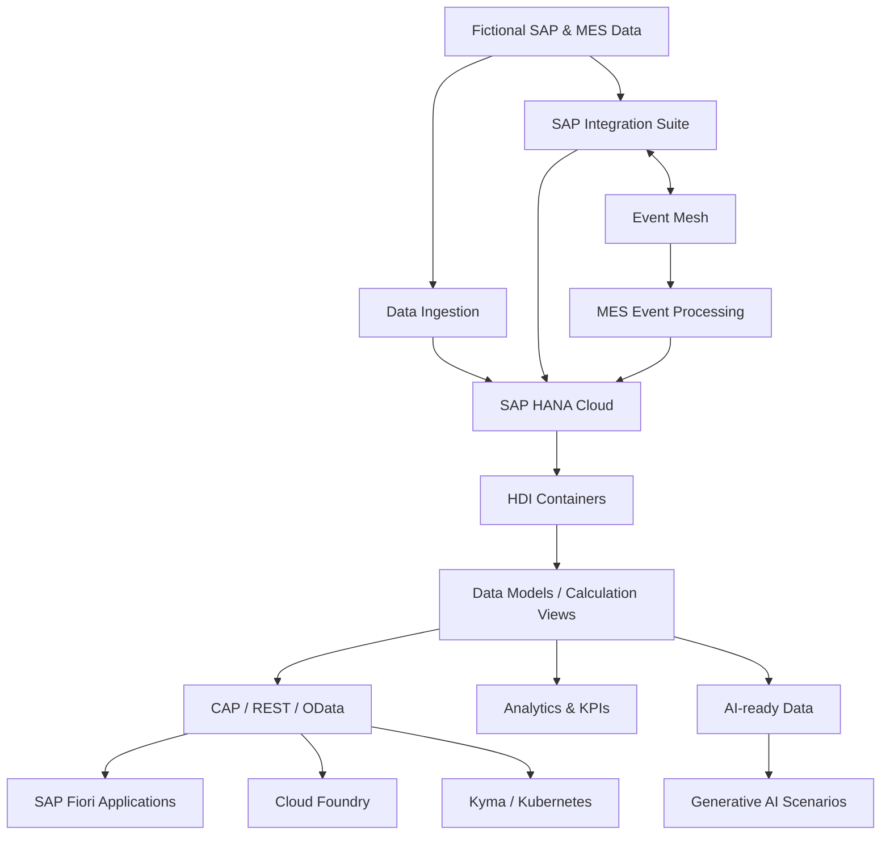

# 🧠 SAP HANA Cloud Data Engineering Learning

**🌐 Idioma / Language:** 🇧🇷 **Português** | [🇺🇸 English](./README.en.md)

> **Status:** 🟢 Em desenvolvimento  
> **Fase atual:** Phase 0 — Environment Foundation concluída; Bloco A em validação  
> **Abordagem:** Hands-on, incremental, documentada e orientada a cenários SAP/MES simulados

Repositório prático para aprendizado de **SAP HANA Cloud, Data Engineering, Data Modeling, SQL, HDI, CAP/OData, SAP Fiori, Analytics, integração, arquiteturas event-driven, cloud-native e AI-ready data**, utilizando cenários industriais simulados inspirados em processos de **SAP MM, PP, QM, WM e MES**.

O objetivo não é apenas aprender ferramentas isoladamente. A proposta é acompanhar a jornada completa do dado, desde sua origem funcional e industrial até persistência, transformação, modelagem, exposição, análise e utilização segura por aplicações e inteligência artificial.

> [!IMPORTANT]
> **Todos os datasets, identificadores, registros mestres, transações, eventos, payloads e cenários operacionais publicados neste repositório são fictícios e criados exclusivamente para fins educacionais e de experimentação técnica.** Embora os modelos sejam inspirados em conceitos encontrados em processos SAP e MES, nenhuma informação empresarial real, dado produtivo, credencial ou configuração confidencial é utilizada ou representada.

---

## 📑 Índice

- [🎯 Objetivo do projeto](#-objetivo-do-projeto)
- [💡 Por que Data Engineering?](#-por-que-data-engineering)
- [🏭 Domínios funcionais e industriais](#-domínios-funcionais-e-industriais)
- [🧭 Jornada técnica](#-jornada-técnica)
- [🏗️ Arquitetura evolutiva](#️-arquitetura-evolutiva)
- [☁️ Ambiente atual](#️-ambiente-atual)
- [🧰 Tecnologias planejadas](#-tecnologias-planejadas)
- [📁 Estrutura do repositório](#-estrutura-do-repositório)
- [🗺️ Roadmap técnico](#️-roadmap-técnico)
- [🧪 Metodologia dos laboratórios](#-metodologia-dos-laboratórios)
- [📸 Evidências](#-evidências)
- [🔐 Segurança e governança](#-segurança-e-governança)
- [📚 Referências oficiais SAP](#-referências-oficiais-sap)
- [🏅 Credenciais SAP](#-credenciais-sap)
- [👤 Autor](#-autor)

---

## 🎯 Objetivo do projeto

Este projeto tem como objetivo desenvolver conhecimento prático em engenharia de dados dentro do ecossistema SAP, conectando fundamentos técnicos a processos industriais e logísticos.

A evolução do laboratório deverá permitir:

- compreender modelagem relacional e estruturas de dados;
- dominar SQL e fundamentos de SQLScript;
- utilizar SAP HANA Cloud como plataforma de dados;
- trabalhar com SAP HANA Deployment Infrastructure (HDI);
- desenvolver modelos analíticos e Calculation Views;
- praticar ingestão, transformação, qualidade, replicação e virtualização de dados;
- expor dados por APIs REST/OData com SAP Cloud Application Programming Model (CAP);
- criar aplicações SAP Fiori consumindo serviços construídos no projeto;
- desenvolver KPIs e cenários analíticos;
- integrar SAP HANA Cloud com SAP Integration Suite e eventos;
- explorar containers, Kubernetes e SAP BTP Kyma Runtime;
- preparar dados confiáveis e semanticamente contextualizados para soluções de IA generativa.

O roadmap é **evolutivo**. Cada cenário será revalidado tecnicamente antes de sua execução, considerando disponibilidade do SAP BTP Trial, evolução dos produtos SAP e aprendizados obtidos nos laboratórios anteriores.

---

## 💡 Por que Data Engineering?

Aplicações analíticas e soluções de inteligência artificial dependem da qualidade dos dados que recebem. Dados sem estrutura, sem semântica, duplicados ou sem governança limitam qualquer solução construída sobre eles.

A proposta deste laboratório é estudar a cadeia completa:

```text
Processo de negócio
        ↓
Dado mestre / transacional
        ↓
Ingestão
        ↓
Qualidade e transformação
        ↓
Persistência
        ↓
Modelagem
        ↓
Semântica
        ↓
APIs / Aplicações / Analytics
        ↓
AI-ready Data
        ↓
Generative AI
```

O diferencial do projeto é combinar **conhecimento funcional SAP e manufatura** com engenharia de dados, integração, aplicações e IA.

---

## 🏭 Domínios funcionais e industriais

Os datasets serão fictícios, porém os cenários serão inspirados em conceitos presentes em ambientes industriais.

| Domínio | Contextos previstos |
|---|---|
| **SAP MM** | Material Master, Supplier, Purchasing Info Record, Purchase Orders, Goods Receipt, Material Movements, Inventory |
| **SAP PP** | BOM, Routing, Work Center, Production Version, Production Orders, Confirmations |
| **SAP QM** | Quality Info Record, Inspection Lots, Results, Quality Status |
| **SAP WM** | Warehouse, Storage Type, Storage Bin, Stock and Warehouse Movements |
| **MES** | Resources, Machines, Operations, Work Orders, Production Events, Confirmations, Scrap and Downtime |

> Os modelos educacionais podem utilizar nomes de campos inspirados na terminologia SAP, como `MATNR`, `WERKS`, `LGORT`, `MTART`, `MATKL`, `MEINS`, `LIFNR`, `EKORG` e `BWART`. Isso não significa reprodução completa das estruturas físicas internas do SAP ERP/S/4HANA.

---

## 🧭 Jornada técnica

```text
SAP MM / PP / QM / WM / MES
              │
              ▼
      Data Foundation
              │
              ▼
       SQL & Modeling
              │
              ▼
       SAP HANA Cloud
              │
              ▼
      HDI / Data Models
              │
              ▼
       Data Engineering
              │
      ┌───────┴────────┐
      ▼                ▼
 CAP / OData      Integration / Events
      │                │
      ▼                ▼
    Fiori           Event Mesh
      │                │
      └───────┬────────┘
              ▼
       Analytics / KPIs
              │
              ▼
 Cloud Foundry / Kyma
              │
              ▼
       AI-ready Data
              │
              ▼
      Generative AI
```

---

## 🏗️ Arquitetura evolutiva



A arquitetura será construída progressivamente. A presença de um componente no diagrama não significa que o laboratório correspondente já foi executado.

---

## ☁️ Ambiente atual

### Phase 0 — Environment Foundation

| Componente | Estado |
|---|---|
| SAP BTP Trial | ✅ Disponível |
| Cloud Foundry Runtime | ✅ Criado |
| Space `dev` | ✅ Criado |
| SAP HANA Cloud Free Tier | ✅ Running |
| SAP HANA Cloud Administration Tools | ✅ Subscribed |
| SAP HANA Cloud Central | ✅ Validado |
| SAP HANA Database Explorer / SQL Console | ✅ Validado |
| SAP Business Application Studio | ✅ Subscribed |
| GitHub Repository | ✅ Criado |
| HDI Container | ⏳ Futuro laboratório |
| CAP / OData | ⏳ Roadmap |
| SAP Fiori | ⏳ Roadmap |
| Kyma / Kubernetes | ⏳ Roadmap |

Primeira validação SQL realizada:

```sql
SELECT CURRENT_USER, CURRENT_SCHEMA FROM DUMMY;
```

A consulta confirmou conexão funcional com a instância SAP HANA Cloud.

---

## 🧰 Tecnologias planejadas

- SAP Business Technology Platform (BTP)
- SAP HANA Cloud
- SAP HANA Cloud Central
- SAP HANA Database Explorer
- SAP Business Application Studio
- SQL / SQLScript
- SAP HANA Deployment Infrastructure (HDI)
- Calculation Views
- Core Data Services (CDS)
- SAP Cloud Application Programming Model (CAP)
- REST / OData
- SAP Fiori / Fiori Elements
- SAP Integration Suite
- Event Mesh / event-driven integration
- Cloud Foundry
- Containers
- Kubernetes
- SAP BTP Kyma Runtime
- Git / GitHub
- Analytics & Business KPIs
- AI-ready data, embeddings, vector concepts and Generative AI

---

## 📁 Estrutura do repositório

| Diretório | Finalidade |
|---|---|
| `AI-Artificial-Intelligence/` | Laboratórios de AI-ready data e IA generativa |
| `Analytics-KPIs/` | Modelos analíticos, métricas e KPIs |
| `CAP-Cloud-Application-Programming/` | Projetos CAP, APIs REST/OData e serviços |
| `Datasets/` | Datasets fictícios utilizados nos laboratórios |
| `Diagrams/` | Diagramas técnicos e de arquitetura |
| `Docs/` | Documentação detalhada dos laboratórios |
| `Evidences/` | Evidências técnicas de execução e validação |
| `Fiori-Applications/` | Aplicações SAP Fiori / Fiori Elements |
| `HANA-Data-Models/` | Artefatos e projetos de modelagem SAP HANA |
| `Integration-Suite/` | Cenários de ingestão e integração com SAP Integration Suite |
| `MES-Manufacturing-Execution/` | Cenários simulados de Manufacturing Execution Systems |
| `SQL-Scripts/` | Scripts SQL/SQLScript educacionais e utilitários |

Novas pastas serão adicionadas apenas quando houver necessidade real de implementação.

---

# 🗺️ Roadmap técnico

> **Roadmap v1:** representa a direção planejada de aprendizado. Cada laboratório será revisado antes da execução e poderá evoluir devido a disponibilidade da plataforma, mudanças nos produtos SAP ou conclusões obtidas nos laboratórios anteriores.

## 🟦 Phase 0 — Environment Foundation

| # | Cenário | Status |
|---|---|---|
| F0.1 | SAP BTP & Cloud Foundry Foundation | ✅ |
| F0.2 | SAP HANA Cloud Provisioning | ✅ |
| F0.3 | Administration Tools & Authorization | ✅ |
| F0.4 | First Database Connection & SQL | ✅ |
| F0.5 | GitHub Project Foundation | ✅ |

## 🅰️ Bloco A — Data & SAP/MES Master Data Foundation

| # | Cenário | Objetivo | Status |
|---|---|---|---|
| A1 | Relational Data Foundation | Database, schema, tables, keys, constraints, cardinalidade e normalização | 🔄 Próximo |
| A2 | SAP Enterprise Structure | Company Code, Plant, Storage Location, Purchasing Organization e Purchasing Group | ⏳ |
| A3 | Material Master Data Foundation | Modelar material, níveis organizacionais e principais visões | ⏳ |
| A4 | Supplier / Business Partner Foundation | Modelar fornecedor e contexto organizacional | ⏳ |
| A5 | Purchasing Info Record | Relacionar Material, Supplier, Purchasing Organization e Plant | ⏳ |
| A6 | Quality Info Record | Conectar fundamentos de MM e QM | ⏳ |
| A7 | Manufacturing Master Data | BOM, Routing, Work Center e Production Version | ⏳ |
| A8 | Warehouse Master Data | Warehouse, Storage Type, Storage Bin e estoque | ⏳ |
| A9 | MES Master Data Foundation | Resources, Machines, Operations e mapeamentos SAP ↔ MES | ⏳ |

## 🅱️ Bloco B — SQL for SAP Data

B1 DDL · B2 DML · B3 Filtering & Sorting · B4 Joins · B5 Aggregations · B6 Subqueries & CTEs · B7 Window Functions · B8 Views · B9 SQLScript · B10 Performance Fundamentals.

## 🅲 Bloco C — Professional SAP HANA Development

C1 Business Application Studio · C2 HANA Database Project · C3 HDI Container · C4 Design-Time Artifacts · C5 CDS Database Artifacts · C6 Deployment · C7 Runtime Objects · C8 Synonyms & Cross-Schema Access · C9 Calculation Views · C10 Security & Privileges.

## 🅳 Bloco D — Data Engineering

D1 Data Ingestion · D2 Data Cleansing · D3 Transformation Pipelines · D4 Data Quality · D5 Incremental Loading · D6 Delta Processing · D7 Deduplication · D8 Data Lineage · D9 Remote Sources · D10 Virtual Tables · D11 Replication · D12 Performance & Optimization.

## 🅴 Bloco E — Transactional SAP Data

E1 Purchase Orders · E2 Goods Receipt · E3 Material Movements · E4 Inventory Snapshot · E5 Production Orders · E6 Production Confirmations · E7 Inspection Lots · E8 Quality Results · E9 Warehouse Movements.

## 🅵 Bloco F — CAP & Data APIs

F1 CAP Foundation · F2 Domain Modeling · F3 HANA Persistence · F4 OData Service · F5 REST · F6 Filtering & Paging · F7 Business Logic · F8 Authentication · F9 Authorization.

## 🅶 Bloco G — SAP Fiori Data Applications

G1 Material Master Explorer · G2 Procurement Explorer · G3 Quality Cockpit · G4 Inventory Cockpit · G5 Manufacturing Cockpit · G6 MES Production Cockpit.

## 🅷 Bloco H — Analytics & Business KPIs

KPIs de Procurement, Inventory, Production, Quality e MES, desenvolvidos sobre modelos previamente validados no projeto.

## 🅸 Bloco I — Integration & Event-Driven Data

I1 REST Data Ingestion · I2 Integration Suite → HANA · I3 MES → Integration Suite · I4 Event Mesh · I5 Manufacturing Events · I6 Failure / Retry / DLQ · I7 Idempotent Data Ingestion.

## 🅹 Bloco J — Cloud-Native Data Applications

J1 Containers Foundation · J2 Docker · J3 Kubernetes Foundation · J4 SAP BTP Kyma Runtime · J5 Containerized CAP Service · J6 HANA Service Binding · J7 MES Event Microservice · J8 Cloud Foundry vs. Kyma.

## 🅺 Bloco K — AI-Ready Data

K1 AI-ready Datasets · K2 Business Semantics · K3 Vector Concepts · K4 Embeddings · K5 SAP HANA Vector Capabilities · K6 Semantic Search · K7 RAG Foundation.

## 🅻 Bloco L — AI-Powered Manufacturing

L1 Procurement Assistant · L2 Inventory Assistant · L3 Quality Assistant · L4 Production Assistant · L5 MES Manufacturing Assistant.

---

## 🧪 Metodologia dos laboratórios

Cada laboratório seguirá, quando aplicável, o ciclo:

```text
Estudar
   ↓
Propor cenário
   ↓
Revalidar objetivo e arquitetura
   ↓
Construir
   ↓
Testar
   ↓
Provocar falhas
   ↓
Diagnosticar
   ↓
Corrigir
   ↓
Coletar evidências
   ↓
Documentar
   ↓
Versionar
   ↓
Compartilhar
```

Antes de iniciar cada laboratório serão confirmados:

1. objetivo de aprendizagem;
2. contexto funcional SAP/MES;
3. arquitetura proposta;
4. serviços disponíveis no ambiente;
5. riscos e dependências;
6. critérios de sucesso;
7. evidências necessárias.

---

## 📸 Evidências

As evidências serão armazenadas em `Evidences/`, organizadas por laboratório.

Convenção planejada:

```text
NN-descricao-tecnica-em-kebab-case
```

Regras:

- numeração reinicia em `01` a cada laboratório;
- nomes devem explicar tecnicamente o que a evidência representa;
- capturas não devem expor credenciais, tokens ou dados sensíveis;
- cada evidência utilizada em um DOC deverá possuir contexto anterior e explicação posterior;
- nomes e links Markdown deverão ser validados contra os arquivos físicos antes da publicação.

---

## 🔐 Segurança e governança

Este repositório é público. Portanto:

- nenhum segredo ou password será versionado;
- tokens, service keys, certificates private keys e credentials serão excluídos;
- arquivos `.env` e outros materiais sensíveis são ignorados pelo Git;
- datasets serão fictícios;
- informações internas de empresas não serão utilizadas;
- screenshots serão revisadas antes da publicação;
- acessos serão configurados seguindo o princípio de menor privilégio sempre que possível;
- `DBADMIN` será usado apenas quando tecnicamente necessário durante a fundação/administração e não será tratado como identidade de aplicação.

---

## 📚 Referências oficiais SAP

- [SAP HANA and SAP HANA Cloud — SAP Learning](https://learning.sap.com/products/hana)
- [Becoming a Certified Data Engineer — SAP HANA Cloud](https://learning.sap.com/learning-journeys/becoming-a-certified-data-engineer-sap-hana-cloud)
- [Developing Data Models with SAP HANA Cloud](https://learning.sap.com/courses/developing-data-models-with-sap-hana-cloud)
- [SAP HANA Cloud — SAP Help Portal](https://help.sap.com/docs/hana-cloud)
- [SAP Cloud Application Programming Model](https://cap.cloud.sap/)
- [SAP BTP, Cloud Foundry and Kyma Runtimes with CAP](https://help.sap.com/docs/btp/btp-developers-guide/sap-btp-cloud-foundry-and-sap-btp-kyma-runtimes-with-cap)

> As referências oficiais SAP orientam o aprendizado técnico, mas o roadmap deste repositório também inclui cenários complementares de manufatura, MES, integração, aplicações e IA.

---

## 🏅 Credenciais SAP

Este projeto é desenvolvido após a obtenção das seguintes credenciais SAP pelo autor:

- ✅ **SAP Certified - Integration Developer (C_CPI)**
- ✅ **SAP Certified - SAP Generative AI Developer (C_AIG)**

O objetivo atual é **aprendizado prático em Data Engineering**, sem compromisso imediato com uma nova certificação.

---

## 👤 Autor

### Orlando dos Santos Caetano

**SAP MM · PP · QM · WM | MES | SAP Integration | Data Engineering | Generative AI**

[](https://www.linkedin.com/in/orlando-caetano/)
[](https://github.com/OrlandoCaetano2026)

### Áreas funcionais


### Tecnologias e aprendizado


---

> **Learning principle:** understand the business process, structure the data, engineer the pipeline, expose trusted information, and only then apply analytics and AI.
